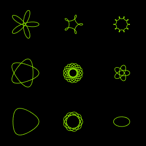

..
    ---------------------------------------------------------------------------
    Copyright (C) 2012 Digia Plc and/or its subsidiary(-ies).
    All rights reserved.
    This work, unless otherwise expressly stated, is licensed under a
    Creative Commons Attribution-ShareAlike 2.5.
    The full license document is available from
    http://creativecommons.org/licenses/by-sa/2.5/legalcode .
    ---------------------------------------------------------------------------

Porting HTML5 Canvas Code to Qt Quick
=====================================

In this page, we want to show how easy it is to port existing HTML5 Canvas code to Qt Quick using the Canvas element.

.. note::
    A general list of the necessary changes can be found in `the Qt documentation pages of the Qt Quick Canvas <http://doc.qt.nokia.com/qt5-snapshot/qml-qtquick2-canvas.html>`_.

The HTML5 Canvas Code
---------------------

`This link <https://developer.mozilla.org/en/Canvas_tutorial/Transformations>`_ leads to an HTML5 Canvas tutorial, in which one of the examples shows a `spirograph <http://en.wikipedia.org/wiki/Spirograph>`_.

The HTML5 code looks like this:

.. literalinclude:: src/spirograph-html.js
    :language: js

The Qt Quick Canvas Code
------------------------

To use this code in a Qt Quick Canvas, we can almost simply copy the HTML5 code's drawing function into the Canvas element's ``onPaint`` handler. We only need to change the line in which we acquire the drawing context: instead of using a DOM API call (``document.getElementById('canvas')``), we access the canvas element directly. The used JavaScript function can be inserted as a member function of the element.

.. literalinclude:: src/spirograph.qml
    :language: js

This is what the application looks like:

As you can see, it is surprisingly easy to use existing HTML5 Canvas code in your Qt Quick application.

.. rubric:: What's Next?

The next chapter concludes this tutorial.
