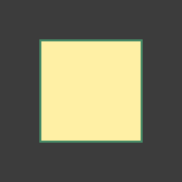

..
    ---------------------------------------------------------------------------
    Copyright (C) 2012 Digia Plc and/or its subsidiary(-ies).
    All rights reserved.
    This work, unless otherwise expressly stated, is licensed under a
    Creative Commons Attribution-ShareAlike 2.5.
    The full license document is available from
    http://creativecommons.org/licenses/by-sa/2.5/legalcode .
    ---------------------------------------------------------------------------

Introduction
============

If you want to draw custom graphics from within your Qt Quick application, the `Qt Quick Canvas <http://doc.qt.nokia.com/qt5-snapshot/qml-qtquick2-canvas.html>`_ item is your item of choice.

The Canvas element was introduced in Qt Quick 2.0 and provides an area on which you can draw using JavaScript code. It uses a high level command-set based on `the HTML5 Canvas specification <http://www.w3.org/TR/html5/the-canvas-element.html>`_, which allows you to draw basic and complex shapes, add coloring, gradients, shadows, images, text etc, but also grants access to low level pixel data. The employment of JavaScript facilitates the presentation of dynamic content.

After a brief introduction to the Canvas element, we'll develop an interactive pie chart visualization. Later in this guide, we'll see how to port existing HTML5 Canvas code to a Qt Quick 2 application.

This tutorial introduces you to the Qt Quick Canvas using self contained example programs and is not meant to show each and every aspect of this element. A detailed description of the Canvas and its supported rendering commands can be found in the Qt documentation pages (see: `Canvas <http://doc.qt.nokia.com/qt5-snapshot/qml-qtquick2-canvas.html>`_, `Context2D <http://doc.qt.nokia.com/qt5-snapshot/qml-qtquick2-context2d.html>`_). Also note, that a huge number of very good HTML5 Canvas API tutorials is available on the internet. Since the Qt Quick Canvas element implements this command-set, these tutorials can serve as an excellent starting point to learn drawing. We provide a few links at `the end of this tutorial <conclusion.html>`_. We also assume that you are already familiar with Qt Quick in general, as this tutorial will use non Canvas related features without further notice.

A Basic Example
---------------

The Qt Quick Canvas element is the element that you place in your application to draw upon. The actual drawing as well as the resource handling is done by its associated `Context2D <http://doc.qt.nokia.com/qt5-snapshot/qml-qtquick2-context2d.html>`_. This element provides the drawing API and manages the transformation stack and style state. It also lets you customize some of its internals such as multithreading, tiling and the usage of hardware acceleration.

Let's start with a simple example: a small piece of code that displays a colored rectangle:

This is the source code:

.. literalinclude:: src/canvas.qml
    :language: js

The usual way is to declare a ``Canvas`` element and place the drawing commands inside its ``onPaint`` handler. After acquiring the drawing context, we prepare a rectangular path using ``rect(real x, real y, real w, real h)``. Then we setup the fill color state to a yellow color using ``fillStyle`` and fill the rectangle by calling ``fill()``. The green border of the rectangle is drawn by setting ``strokeStyle`` and calling ``stroke()`` respectively. ``lineWidth`` sets the width of the stroke.

.. note::
    The order of ``stroke()`` and ``fill()`` matters: The stroke pattern is drawn centered along the path (in this example with a 2 px width pattern to the left side and a 2 px width pattern to the right side). If we used ``stroke()`` before calling ``fill()``, the fill would over paint the inner part of the border resulting in a 2 px wide border.

Essential Context2D Properties / Methods
----------------------------------------

Here is an overview of the most frequently used drawing commands:

================== ================================== =========================
Group              Operation                          Note
================== ================================== =========================
Path               beginPath()                        Begin new path
Path               moveTo(x, y)                       Move to position
Path               lineTo(x, y)                       Add line path
Path               rect(x, y, width, height)          Add rect path
Path               ellipse(x, y, width, height)       Add ellipse path
Path               arc(x, y, radius, startAngle,      Add arc path
                       endAngle, anticlockwise)
Path               arcTo(x1, y1, x2, y2, radius)      Add arc path
Path               text(text, x, y)                   Add text path
Transformation     translate(x, y)                    Move coordinate system
Transformation     rotate(angle)                      Rotate coordinate system
Transformation     scale(x, y)                        Scale coordinate system
Transformation     shear(sh, sv)                      Shear coordinate system
Style              strokeStyle                        Setup line style
Style              lineWidth                          Setup line width
Style              fillStyle                          Setup fill style
Drawing            stroke()                           Draw path using style
Drawing            fill()                             Fill path using style
================== ================================== =========================

.. rubric:: What's Next?

In the next chapter we will go through some more advanced usage of the API by drawing a Pie Chart.
