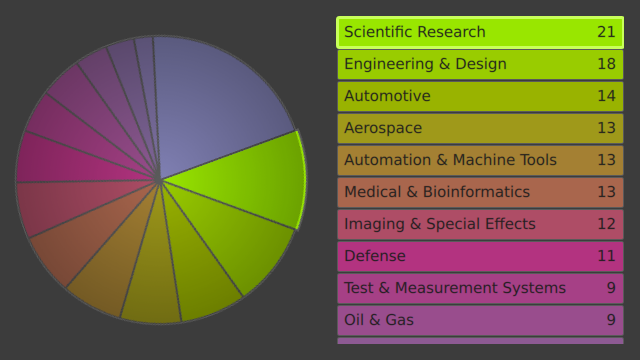
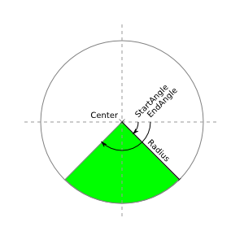
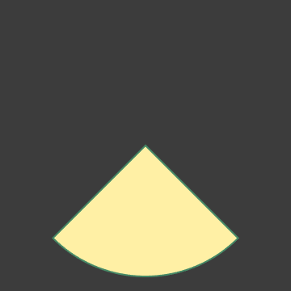
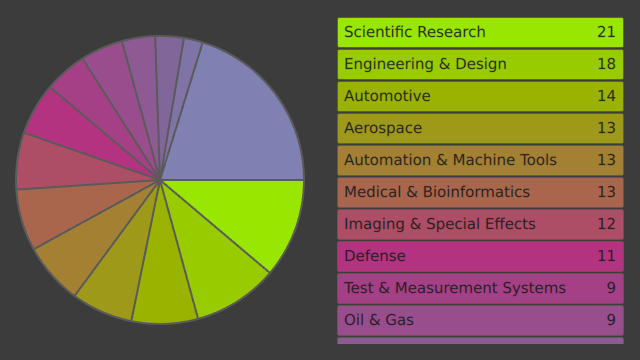

..
    ---------------------------------------------------------------------------
    Copyright (C) 2012 Digia Plc and/or its subsidiary(-ies).
    All rights reserved.
    This work, unless otherwise expressly stated, is licensed under a
    Creative Commons Attribution-ShareAlike 2.5.
    The full license document is available from
    http://creativecommons.org/licenses/by-sa/2.5/legalcode .
    ---------------------------------------------------------------------------

A Pie Chart
===========

In this chapter, we'll present a more elaborate example: we'll create a pie chart item that visualizes the data of a Qt Quick ListModel similar to `this Qt Widget example <http://qt-project.org/doc/qt-4.8/itemviews-chart.html>`_. The ListModel's values will also be shown in a ListView next to the chart. If one of its entries is selected, the according sector of the pie chart shall be highlighted.

The final application will look like this:

The Layout & the Conceptual Context of the Pie Chart
----------------------------------------------------

Let's start with the layout of the application and the context in which the pie chart lives. This means setting up the ListModel, placing the Canvas element and creating the ListView.

.. image:: img/piechart-1.png
    :scale: 50%

The data model holds roles for the item's labels, values and color values. We populate this model with an example dataset:

.. literalinclude:: src/piechart-1.qml
    :language: js
    :start-after: // [0]
    :end-before: // [0]
    :append: ...

The canvas that shows the pie chart is placed in the left half of the application. We'll be implementing the drawing later in the following sections:

.. literalinclude:: src/piechart-1.qml
    :language: js
    :prepend: ...
    :start-after: // [1]
    :end-before: // [1]
    :append: ...

On the right side, we display the model's data in a list view which shows the item's labels and values in colored rows. It represents the legend of the chart so to say:

.. literalinclude:: src/piechart-1.qml
    :language: js
    :prepend: ...
    :start-after: // [2]
    :end-before: // [2]

How to Draw a Sector
--------------------

A pie chart is a circular chart consisting of several sectors - one for each data set. The area of each sector is proportional to the value it represents. So let's first take a look at how to draw one of the pie chart's sectors.

The size of a sector is defined by the length of its arc or the arc's subtending angle. If you think of the whole pie having an angle of ``2      PI`` then each sector should cover an angle of ``value * (2 * PI) / SUM_OF_VALUES``.

To draw the arc, we use the ``arc(real x, real y, real radius, real startAngle, real endAngle, bool anticlockwise)`` function, which creates a circular path on the circumference of a circle which is centered around ``(x, y)`` and has the given radius. To complete the pie segment, we also need to draw the lines which go from the circle's center to the arc's edges. Therefore we move the cursor's position to the center point, draw the arc, and then draw a line back to the center. The ``arc()`` function will automatically generate a line from the cursor's initial position at the center to the starting point of the arc in addition to the arc itself.

.. literalinclude:: src/piechart-sector.js
    :language: js

This is how the output of an application using the code snippet above might look:

Drawing the Chart
-----------------

Next we will draw the complete pie chart. After this step the application will look like this:

In the ``onPaint`` handler, we iterate over the model's elements and draw one pie sector for each entry (with its specific start and end angle, and filled with the previously assigned color). To make this set of pieces sum up to form a full circle, we also need to know the model's sum of values. We calculate this value in a JavaScript function.

.. literalinclude:: src/piechart-2.qml
    :language: js
    :prepend: ...
    :start-after: // [0]
    :end-before: // [0]
    :append: ...

Finalizing the Chart
--------------------

In this chapter we'll visually enhance the pie chart's appearance and also provide interactivity. This is a screenshot of the application after this stage:

In order to make the application more alive, we change the chart's appearance according to the list view's currently selected item. We add a mouse area to the list view and mark the current item with a highlight. To make the canvas respond to changes in the selection, we request a repaint whenever the current item changes.

.. literalinclude:: src/piechart-3.qml
    :language: js
    :prepend: ...
    :start-after: // [0]
    :end-before: // [0]
    :append: ...

The selected entry shall also be indicated in the pie chart. Therefore we increase the associated sector's radius by 2%. We also want this chart sector to always be located on the right side of the chart. For this, we to rotate the canvas element based on the list view's ``currentItem`` property. To smooth this change, we apply a behavior to the rotation using a spring animation. Additionally, we overlay a radial gradient from transparent white to a darker gray to further brush up the pie chart's appearance.

.. literalinclude:: src/piechart-3.qml
    :language: js
    :prepend: ...
    :start-after: // [1]
    :end-before: // [1]
    :append: ...

Now we're done! We've successfully created a nice looking pie chart.

.. rubric:: What's Next?

The next chapter will demonstrate how to port HTML5 Canvas code into the Canvas Item of Qt Quick.

