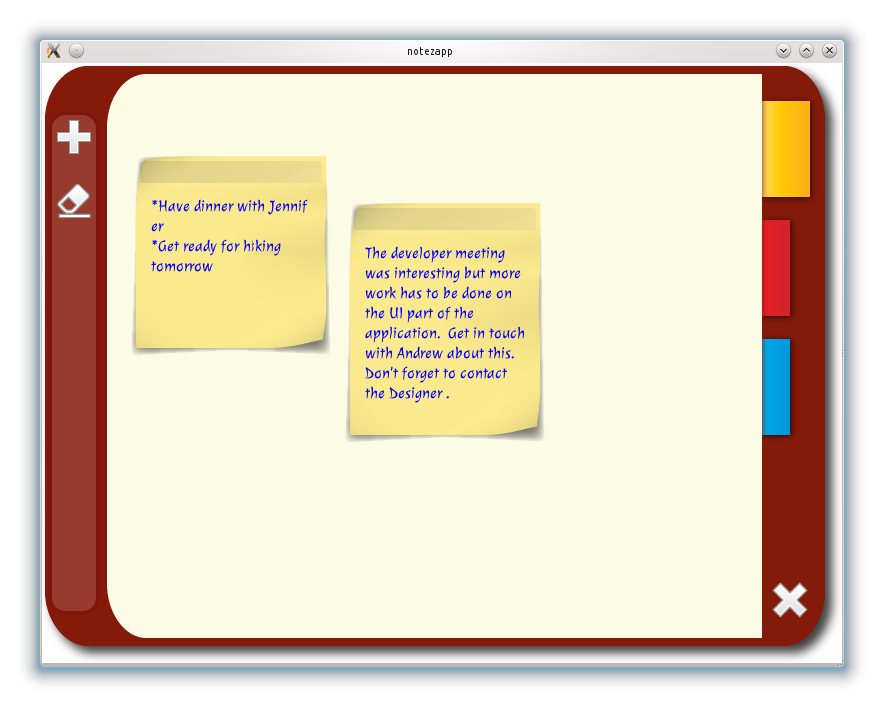

..
    ---------------------------------------------------------------------------
    Copyright (C) 2012 Digia Plc and/or its subsidiary(-ies).
    All rights reserved.
    This work, unless otherwise expressly stated, is licensed under a
    Creative Commons Attribution-ShareAlike 2.5.
    The full license document is available from
    http://creativecommons.org/licenses/by-sa/2.5/legalcode .
    ---------------------------------------------------------------------------

About this Guide
================

Why Would You Want to Read this Guide?
--------------------------------------

This guide provides an overview of QML and Qt Quick technology in regards to developing feature-rich applications that you can deploy onto various desktop platforms.

The focus is on Qt Quick and how to use it efficiently for writing entire applications without any C++. It will guide you step by step from the initial setting up of the development environment to project creation to a ready-to-deploy application. We have implemented a simple application that helps users manage daily notes. This application will hereon be referred to as     NoteApp*.

There are several chapters consisting of multiple steps. Each step describes specific features of the application, the development approach and the detailed QML code used.
The application covers various aspects such as advanced UI concepts including animations, database storage and Javascript usage for application logic.

The application will not look and feel like a typical or classical desktop application, meaning that common well-known UI Elements used in desktop apps such as toolbars, menus, dialogs etc will not be present. This application is inspired by the modern fluid UIs, but the deployable target is a desktop environment.

In order to make it easy to work with the code, there is a version of     NoteApp* for each chapter with all the features implemented up to that chapter. It is recommended to always refer to that code while reading the contents of this guide.

At the end of this guide, you should be able to have a solid understanding of how to develop an application using QML and Qt Quick as a technology and learn practical use of the QML language.

A screenshot of the     NoteApp* application that will be developed in this guide.

.. _get-desktop-source-code:

Get the Source Code and the Guide in Different Formats
------------------------------------------------------

A .zip file that contains the source code of each chapter is provided:

     `Source code <http://get.qt.nokia.com/developerguides/qtquickdesktop/notezapp_src.zip>`_

The guide is available in the following formats:

     `PDF <http://get.qt.nokia.com/developerguides/qtquickdesktop/QtQuickApplicationGuide4Desktop.pdf>`_
     `ePub <http://get.qt.nokia.com/developerguides/qtquickdesktop/QtQuickApplicationGuide4Desktop.epub>`_ for ebook readers. Further details can be found `here <http://en.wikipedia.org/wiki/EPUB#Software_reading_systems>`_.
     `Qt Help <http://get.qt.nokia.com/developerguides/qtquickdesktop/QtQuickApplicationGuide4Desktop.qch>`_ for Qt Assistant and Qt Creator. In Qt Assistant under the :qt:`Preferences Dialog <assistant-details.html#preferences-dialog>`, in the `Documentation` tab (in a collapsible menu for Mac users), you click on the Add button in order to add this guide in the .qch format. We do the same in Qt Creator, under the `Options` dialog, in the `Help` section you, can add this guide in the `Documentation` tab.

Help Us Help You
----------------

We would greatly appreciate any feedback or comments from you that can help us improve the content of this guide.

Please use the form at the link below to give us your feedback:

     http://qt.nokia.com/forms/feedback/qtquickdesktop-guide

License
-------

Copyright (C) 2012 Digia Plc and/or its subsidiary(-ies).
All rights reserved.

This work, unless otherwise expressly stated, is licensed under a Creative Commons Attribution-ShareAlike 2.5.

The full license document is available from http://creativecommons.org/licenses/by-sa/2.5/legalcode .

Qt and the Qt logo is a registered trade mark of Digia plc and/or its subsidiaries and is used pursuant to a license from Digia plc and/or its subsidiaries. All other trademarks are property of their respective owners.

.. rubric:: What's Next?

Next you will start to prototype the     NoteApp* application and find out the power that QML offers for prototyping.
