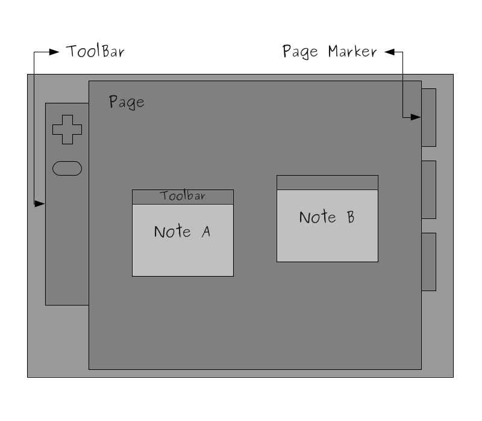

..
    ---------------------------------------------------------------------------
    Copyright (C) 2012 Digia Plc and/or its subsidiary(-ies).
    All rights reserved.
    This work, unless otherwise expressly stated, is licensed under a
    Creative Commons Attribution-ShareAlike 2.5.
    The full license document is available from
    http://creativecommons.org/licenses/by-sa/2.5/legalcode .
    ---------------------------------------------------------------------------

Overview of the NoteApp Application
====================================

The     NoteApp* application is a `Post-it note <http://en.wikipedia.org/wiki/Post-it_note>`_ application that will help users create notes and be able store them locally. It would be easier to manage notes if they belonged to a category so for simplicity, let's consider having three different categories that the notes can belong to. From a visual perspective, however, a category can be represented by an area where notes of the same category
can be placed. Let's introduce the concept of the     Page* element. A *Page* is an area where notes will be created and placed.

The user should be able to delete notes one by one as well as all of them at once. Notes can be moved freely by the user within a     Page* area. For simplicity reasons, let's suppose that there are just three predefined pages and each page is indicated by a *Marker*. Additionally, each marker can have a different color.

An interesting feature would be to store notes locally and perhaps have this done automatically for the user then so no user prompt would be needed.

To summarize the list of features:

     Create / Delete Note items
     Edit Notes and position them anywhere in the page
     Store notes locally
     Three different pages indicated by a page marker

UI Elements
-----------

Based on the     NoteApp* concepts discussed above and feature requirements, let's start with the wire-frame design shown in the picture below. Since there could be many possible designs for the *NoteApp*, let's consider the following one as given.

The picture above gives us a good idea of what the user expects to see from the UI perspective, but it also can help you identify possible UI elements and interactions that could be implemented later on.

UI Flows
--------

As mentioned previously, there are three     Pages* that contain *Note* items. We can also see the *Marker* items on the right side. There is a toolbar on the left in *NoteApp*. It contains two tools: the `New Note` tool for creating new notes and the `Clear All` for clearing the entire page. The page markers that enable the user to switch between pages are on the right. *Note* items have a toolbar that can be used to drag notes within the page by moving the mouse while holding the left-click button down. Additionally, there is a *delete* tool in the note toolbar that enables the user to delete the note.

.. rubric:: What's Next?

Next we will work on identifying the QML Components needed to implement our features and learn how to create them.
