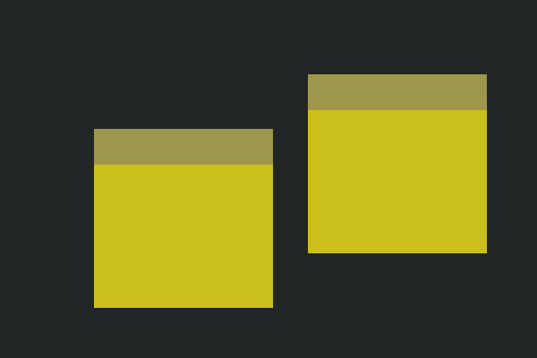

..
    ---------------------------------------------------------------------------
    Copyright (C) 2012 Digia Plc and/or its subsidiary(-ies).
    All rights reserved.
    This work, unless otherwise expressly stated, is licensed under a
    Creative Commons Attribution-ShareAlike 2.5.
    The full license document is available from
    http://creativecommons.org/licenses/by-sa/2.5/legalcode .
    ---------------------------------------------------------------------------

Anchoring QML Items and Implementing the QML Components
=======================================================

The :qt:`Rectangle QML Element <qml-rectangle.html>` is the natural choice to use for building UI blocks and the initial QML Component in the prototype phase. They are visual items that have properties that you can tweak to make it easier to prototype and test your UI concepts, which makes testing so much easier.

.. note::

    It is a good practice to always give default geometry values to your defined components as it helps in testing.

Let's have a close look at the code of our QML Components. At first, we start by implementing the `Note` component.

Note and NoteToolbar Component
------------------------------
First, as seen in the previous step, we have created the new QML files with Qt Creator that we can work with for implementing the required components.

To match the given wire-frame design, the code for `NoteToolbar` could look as follows:

.. code-block:: js

    // NoteToolbar.qml

    import QtQuick 1.1

    // A Rectangle element with defined geometries and color.
    Rectangle {
        id: root
        width: 100
        height: 62
        color: "#9e964a"
    }

The `Note` component will have a toolbar UI element and the `NoteToolbar` component will be used for that. Additionally, there is a text input element for getting the input text from the user. We will use :qt:`TextEdit QML Element <qml-textedit.html>` for this. In order to layout these items within the `Note` component, the `anchor` property will be used. This property is inherited from :qt:`Item Element <qml-item.html>`, which is the base class that every other QML Component inherits by default.

Please refer to the :qt:`Anchor-based Layout in QML <qml-anchor-layout.html>` documentation for more details about anchoring and laying out QML items.

.. note:: Anchor-based layouts can not be mixed with absolute positioning

.. code-block:: js

    // Note.qml

    import QtQuick 1.1

    Rectangle {
        id: root
        width: 200
        height: 200
        color: "#cabf1b"

        // creating a NoteToolbar item that will
        // be anchored to its parent on the top, left and right
        NoteToolbar {
            id: toolbar
            // height is required to be specified
            // since there is no bottom anchoring.
            height: 40

            // anchoring it to the parent
            // using just three anchors
            anchors {
                top: root.top
                left: root.left
                right: root.right
            }
        }

        // creating a TextEdit item used for the text input from user.
        TextEdit {
            anchors {
                top: toolbar.bottom
                bottom: root.bottom
                right: root.right
                left: root.left
            }
            wrapMode: TextEdit.WrapAnywhere
        }
    }

.. warning::

    For performance reasons, you should only anchor an item to its siblings and direct parent

Page
----

Once we have the `Note` component ready, let's work on getting the `Page` component with a couple of note items inside.

.. literalinclude:: src/notezapp/Page.qml
    :language: js
    :lines: 35-

In Qt Creator, you can simply run the file above, which in fact will simply use     *qmlviewer** to load the `Page.qml`. The output result should look like this:

Marker
------

Same as with the rest of the components, the `Marker` component will also be just a rectangle element with predefined geometries. Later on, as described in the next chapter, we will
show how the `Marker` component is used.

.. literalinclude:: src/notezapp/Marker.qml
    :language: js
    :lines: 35-

.. rubric:: What's Next?

In the next chapter, we will see how to use a Repeater QML Element and a Column to manage a static list of markers.
