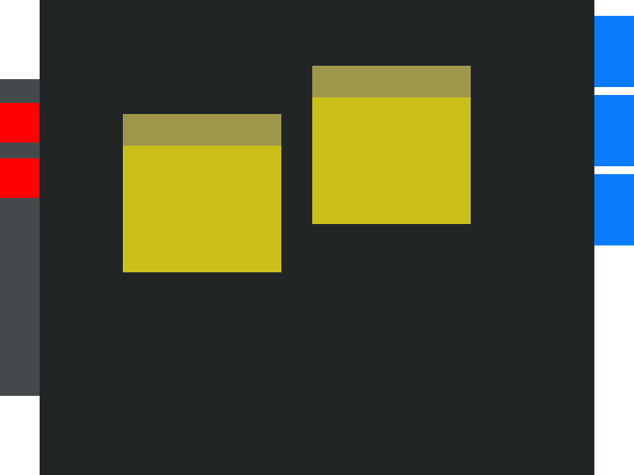

..
    ---------------------------------------------------------------------------
    Copyright (C) 2012 Digia Plc and/or its subsidiary(-ies).
    All rights reserved.
    This work, unless otherwise expressly stated, is licensed under a
    Creative Commons Attribution-ShareAlike 2.5.
    The full license document is available from
    http://creativecommons.org/licenses/by-sa/2.5/legalcode .
    ---------------------------------------------------------------------------

Finalize the Prototype
======================

We now have our QML components in place and they're ready to be used to actually build our prototype. Here is a list of the implemented components:

     `Note`
     `NoteToolbar`
     `Marker`
     `MarkerPanel`
     `Page`

It is very likely that more QML components might come up as we go along in later phases.

As previously mentioned, Qt Creator generates a `main.qml` file which is considered the main file to load in order to run     NoteApp*. Therefore, we will start laying out our components inside the `main.qml` file in order to compose the prototype.

Composing the Prototype
-----------------------

Going back to the UI concepts and looking at the design provided, we start laying out the QML items, so we have the panel of `Maker` items, the `MarkerPanel` component that is, laid out on the right and the `Page` component in the center. We haven't yet covered the toolbar UI element so let's do that now.

The toolbar contains two tools: one for creating new note items and one for clearing up the page. For simplicity, we will not create a component for this, but rather declare the items inside the `main.qml` file.

The code could look something like this:

.. code-block:: js

    // using a Rectangle element to represent our toolbar
    // it helps to align the column better with the rest of the items
    Rectangle {
        id: toolbar

        // setting a width because there is no right anchoring
        width: 50

        color: "#444a4b"
        anchors {
            left: window.left
            top: window.top; bottom: window.bottom
            topMargin: 100; bottomMargin: 100
        }

        // using a Column element to layout the tools of the toolbar
        Column {
            anchors { anchors.fill: parent; topMargin: 30  }
            spacing: 20

            // For the purpose of this prototype we simply use
            //a Repeater to generate two Rectangle items.
            Repeater {
                model: 2
                // using a Rectangle item to represent
                // our tools, just for prototype only.
                Rectangle { width: 50; height: 50;  color: "red" }
            }
        }
    }

Now, we are ready to actually finalize our prototype. Here is how the `main.qml` file would look:

.. literalinclude:: src/notezapp/main.qml
   :language: js
   :lines: 35-

The following screen shows how the prototype looks when either running it using Qt Creator or     *qmlviewer**:

Making Note Items Draggable Using the MouseArea QML Element
-----------------------------------------------------------

So far we have managed to get a very basic prototype running that will be our basis for the NoteApp UI. An interesting UI functionality we can quickly add during the prototype phase is to enable the user to drag note items within the page. To achieve this, the :qt:`MouseArea QML Element <qml-mousearea.html>` has a grouped property called :qt:`drag <qml-mousearea.html#drag.target-prop>`. We will use the     *drag.target** property by setting it to the **id** of our note item.

Considering that the user should use the `NoteToolbar` item for dragging the note item, the     MouseArea* Element should be inside the `NoteToolbar` component. The `NoteToolbar` component will handle the dragging operation from the user so we should set the :qt:`drag.target <qml-mousearea.html#drag.target-prop>` to the `Note` item.

To achieve this, we need to allow the `NoteToolbar` item used inside the `Note` component to bind the :qt:`drag.target <qml-mousearea.html#drag.target-prop>` property of `MouseArea` with the  the `Note` component's     *id**. QML provides :qt:`Property Aliases <propertybinding.html#property-aliases>` to enable this.

Let's take the `NoteToolbar` component we have created so far and create a property alias for the     *drag** grouped property of `MouseArea`:

.. literalinclude:: src/notezapp/NoteToolbar.qml
   :language: js
   :lines: 35-

In the code shown above, we see the     *drag** property alias for `NoteToolbar`, which is bound to the **drag** property of *MouseArea* and now we will see how to use that in our `Note` component.

.. literalinclude:: src/notezapp/Note.qml
   :language: js
   :lines: 35-

Detailed information on property bindings in QML can be found on the :qt:`Property Binding <propertybinding.html>` documentation page.

.. rubric:: What's Next?

Next we will start implementing the UI and basic functionality based on the prototype.
