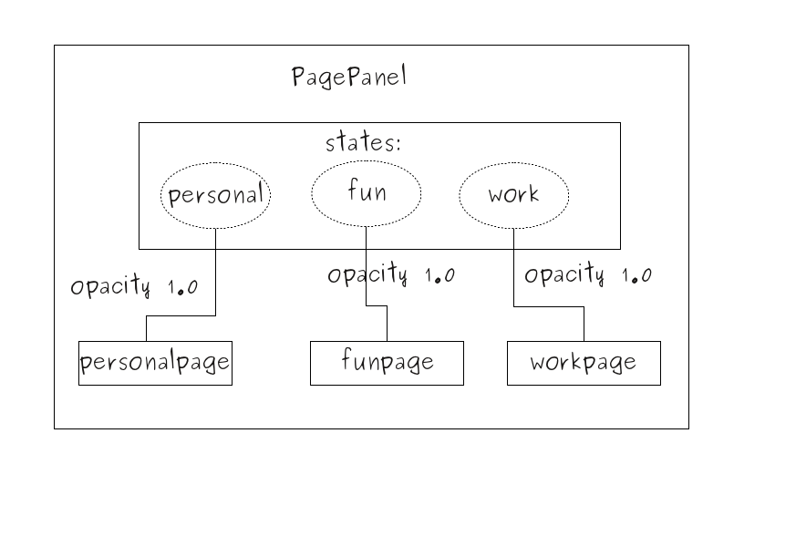

..
    ---------------------------------------------------------------------------
    Copyright (C) 2012 Digia Plc and/or its subsidiary(-ies).
    All rights reserved.
    This work, unless otherwise expressly stated, is licensed under a
    Creative Commons Attribution-ShareAlike 2.5.
    The full license document is available from
    http://creativecommons.org/licenses/by-sa/2.5/legalcode .
    ---------------------------------------------------------------------------

Creating PagePanel Component
============================

To keep things simple, we have only created one page* item using the `Page` component. We've also anchored it to its parent together with the rest of the items. However, the *NoteApp* concepts and requirements demand three different pages and the user should be able to navigate to them using *markers* as well. We have seen how the `MarkerPanel` component helped us create and layout for three *Marker* items, so let's use the same approach for our *Page* items, thus implementing the `PagePanel` component.

Using an Item Type
------------------

Before we go any further with our new component, it is important to understand why using the :qt5:`Rectangle type <qtquick/qml-qtquick2-rectangle.html>` as a top level type in a component should be avoided from now on. The main reason we've been using the `Rectangle` element is because it helped us get visual results quickly and this is what the prototype phase requires.

Once prototyping is done, however, it would make more sense to replace the `Rectangle` type with the `Item` type wherever possible, especially when considering to use graphics as backgrounds or as UI elements, which we will see in the coming chapters.

The `Page` component would look like this:

.. code-block:: js

    import QtQuick 2.0

    // Page.qml

    Item {
        id: root
        ...
    }

.. warning::

    From now on, it is considered that the top level element for our components is an Item QML type. Refer to the source code of each chapter.

Using States
------------

To continue with the implementation of the `PagePanel` component, we see that the main difference between `PagePanel` and `MarkerPanel` is that three `Marker` items should always be visible, but there should only be one `Page` item visible at a time for the `PagePanel`. This will depend on which `Marker` item the user clicks on.

There could be several ways to achieve this behavior. One would be to have an inline Javascript function that toggles the visibility of the `Page` item according to the current `Marker` clicked by the user.

In NoteApp*, we have used the :qt5:`State type <qml-qtquick2-state.html>` to implement the intended behavior. The `PagePanel` component will have three states and each of them is bound to make one `Page`
visible. So navigating through pages will be a matter of setting the respective state for the `PagePanel`.

First, in the `Page` component, we need to set the `opacity` property to `0.0` as the default value. This is to make the pages invisible initially and make them visible based on the respective state change. The following sections describes how this is done:

.. code-block:: js

    // Page.qml

    Item {
        id: root
        opacity: 0.0
        ...
    }

Once we have created the `PagePanel.qml` file, let's start to create the states and `Page` items. We need three states:

     `personal`
     `fun`
     `work`

They will change the `opacity` property respectively for each of the following pages:

     `personalpage`
     `funpage`
     `workpage`

The following image illustrates that the states are "connected" to the respective pages.

Here is the implementation in the `PagePanel` component:

.. code-block:: js

    import QtQuick 2.0

    // PagePane.qml

    Item {
        id: root

        // creating the list of states
        states: [

            // creating a state item with its corresponding name
            State {
                name: "personal"

                //the properties that are about to change for a defined target
                PropertyChanges {
                    target: personalpage
                    opacity:1.0
                    restoreEntryValues: true
                }
            },
            State {
                name: "fun"
                PropertyChanges {
                    target: funpage
                    opacity:1.0
                    restoreEntryValues: true
                }
            },
            State {
                name: "work"
                PropertyChanges {
                    target: workpage
                    opacity:1.0
                    restoreEntryValues: true
                }
            }
        ]

        // creating three page items that are anchored to fill the parent
        Page { id: personalpage; anchors.fill: parent }
        Page { id: funpage; anchors.fill: parent }
        Page { id: workpage; anchors.fill: parent }
    }

.. note:: Setting the *restoreEntryValues** property to true makes the changed property of the target to reset its default value, meaning that the `opacity` property of the page will be reset to `false` when the state changes.

Looking at the code shown above, we see the three `Page` items created and the states that change the `opacity` property of these items. In this step, we managed to create a new component named `PagePanel` that will help us switch between pages using the three available states.

.. rubric:: What's Next?

In the next step, it will be shown how to change the state of the `PagePanel` item using a `Marker` item.
