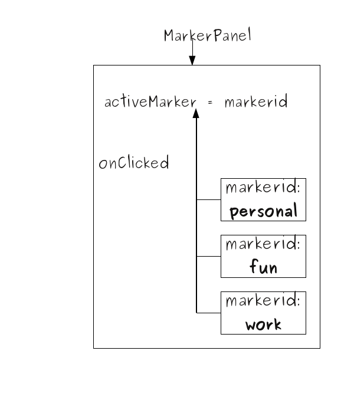

..
    ---------------------------------------------------------------------------
    Copyright (C) 2012 Digia Plc and/or its subsidiary(-ies).
    All rights reserved.
    This work, unless otherwise expressly stated, is licensed under a
    Creative Commons Attribution-ShareAlike 2.5.
    The full license document is available from
    http://creativecommons.org/licenses/by-sa/2.5/legalcode .
    ---------------------------------------------------------------------------

Binding Marker Item with the Page Item
======================================

Earlier we saw the implementation of the `PagePanel` component, which uses three states to toggle the :qt5:`opacity <qtquick/qml-qtquick2-item.html#opacity-prop>` property of the `Page` component. In this step, we will see how to use the `Marker` and the `MarkerPanel` components to enable page navigation.

During the prototype phase, we saw that the `MarkerPanel` component is quite basic and doesn't have any functionality. It uses a :qt5:`Repeater type <qtquick/qml-qtquick2-repeater.html>` that generates three QML Items and the `Marker` component is used as the delegate.

`MarkerPanel` should store the current active marker, which is the marker clicked by the user. Based on the active marker of `MarkerPanel`, `PagePanel` will update its state property. We need to bind the  PagePanel* **state** property with the a new property of `MarkerPanel` that holds the current active marker.

Let's define a `string` property in `MarkerPanel` and call it *activeMarker**.

.. code-block:: js

    // MarkerPanel.qml

    import QtQuick 2.0

    Item {
        id: root
        width: 150; height: 450

        // a property of type string to hold
        // the value of the current active marker
        property string activeMarker: "personal"
        ...

We could have a     *markerid** value stored, which we can use to uniquely identify the marker items. In this way, `activeMarker` will take the value of the **markerid** of the marker item that is clicked by the user.

We have a `Repeater` element that generates three marker* items based on a model, so we can use a model to store our `markerid` values and use it in the `Repeater`.

.. code-block:: js

    // MarkerPanel.qml

    import QtQuick 2.0

    Item {
        id: root
        width: 150; height: 450

        // a property of type string to hold the value of
        // the current active marker
        property string activeMarker: "personal"

        // a list for holding respective data for a Marker item.
        property variant markerData: [
            { markerid: "personal" },
            { markerid: "fun" },
            { markerid: "work" }
        ]

        Column {
            id: layout
            anchors.fill: parent
            spacing: 5

            Repeater {
                // using the defined list as our model
                model: markerData
                delegate:
                    Marker {
                    id: marker
                    // handling the clicked signal of the Marker item,
                    // setting the currentMarker property
                    // of MarkerPanel based on the clicked Marker
                    onClicked: root.activeMarker = modelData.markerid
                }
            }
        }
    }

In the code shown above, we set the `activeMarker` property in the `onClicked` signal handler. This means that we have defined a `clicked()` signal in the `Marker` component to get notified when the user performs a mouse click on the marker item.

Here is how the `Marker` component looks:

.. code-block:: js

    // Marker.qml

    Item {
        id: root
        width: 50; height: 90
        signal clicked()

        MouseArea {
            id: mouseArea
            anchors.fill: parent
            // emitting the clicked() signal Marker item
            onClicked: root.clicked()
        }
    }

Currently, we have achieved having a `PagePanel` component that manages the pages using the `state` property so the `MarkerPanel` component that helps identify the active marker, and therefore, toggles the visibility of the respective page by changing the `opacity` property of that page.

Let's see how to use the `activeMarker` property to update the state of `PagePanel` correspondingly.

In the `main.qml` file, where we already have a `Page` item and a `MarkerPanel` anchored, we will create and use a `PagePanel` item instead anchor that respectively.

.. code-block:: js

    // creating a MarkerPanel item

    MarkerPanel {
        id: markerPanel
        width: 50
        anchors.topMargin: 20
        anchors {
            right: window.right
            top: window.top
            bottom: window.bottom
        }
    }
    ...

    // creating a PagePanel item
    PagePanel {
        id: pagePanel
        // binding the state of PagePanel to the
        // activeMarker property of MarkerPanel
        state: markerPanel.activeMarker
        anchors {
            right: markerPanel.left
            left: toolbar.right
            top: parent.top
            bottom: parent.bottom
            leftMargin: 1
            rightMargin: -50
            topMargin: 3
            bottomMargin: 15
        }
    }

In the code shown above, we see how the :qt5:`property binding <qtqml/qtqml-syntax-propertybinding.html>` feature of QML helps in binding the *state** property with the **activeMarker** property. This means that whatever value **activeMarker** will have during user's selection, the same value is also assigned to the **state** property of the *PagePanel*, thus toggling the visibility of the respective page.

.. rubric:: What's Next?

The next step will give us details on how to use graphics for our components and items to enhance our application's UI.
