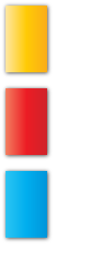
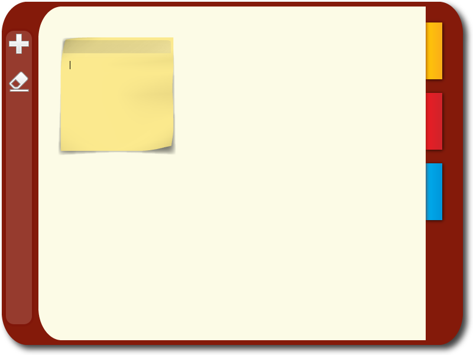

..
    ---------------------------------------------------------------------------
    Copyright (C) 2012 Digia Plc and/or its subsidiary(-ies).
    All rights reserved.
    This work, unless otherwise expressly stated, is licensed under a
    Creative Commons Attribution-ShareAlike 2.5.
    The full license document is available from
    http://creativecommons.org/licenses/by-sa/2.5/legalcode .
    ---------------------------------------------------------------------------

Adding Graphics, Image vs BorderImage Element
=============================================

Due to the nature of QML, developers and designers are entitled to work closely throughout the development process. Nowadays, using graphics does make a big difference to the UX and how the application is perceived by users.

QML encourages the use of graphics as much as possible when implementing the UI. The collaboration of developers with graphic designers becomes more efficient with QML because designers are be able to test their graphics right away on basic UI elements, but they can also understand from a technical perspective what a developer requires when developing new components. This helps the process of making the UI of the application more appealing and certainly easier to maintain.

Let's start adding graphics to our components.

Setting Background Images to Components
---------------------------------------

The :qt:`BorderImage <qml-borderimage.html>` element is recommended to be used in cases in which you would like to have the image scaled depending on user interaction and UI flow, but keep its borders unscaled. A good example of using the :qt:`BorderImage <qml-borderimage.html>` element is for having background images that have a shadowing effect for your QML item while it might be expected that this item will scale at some point and you would like to keep corners untouched.

Let's see how to set a `BorderImage` element as a background for our components.

Inside the `PagePanel.qml` we add the `BorderImage` element:

.. code-block:: js

    // PagePanel.qml

    ...
    BorderImage {
        id: background

        // filling the entire PagePanel
        anchors.fill: parent
        source: "images/page.png"

        // specifying the border margins for each corner,
        // this info should be given by the designer
        border.left: 68; border.top: 69
        border.right: 40; border.bottom: 80
    }
    ...

We do the same for the `Note` component in the `Note.qml` file:

.. code-block:: js

    // Note.qml

    ...
    BorderImage {
        id: noteImage
        anchors { fill: parent}
        source: "images/personal_note.png"
        border.left: 20; border.top: 20
        border.right: 20; border.bottom: 20
    }

    // creating a NoteToolbar item that will be anchored to its parent
    NoteToolbar {
        id: toolbar
    ...

.. warning:: Make sure that the `BorderImage` element is used in the correct order within your component implementation because the arrangement of elements within a component does affect their appearance order. Items with the same `z` value will appear in the order they are declared. Further details regarding the stack ordering of items can be found in :qt:`z property <qml-item.html#z-prop>` documentation.

You may be wondering by now what would be the best approach to set a background for the `Marker` items when these items are created inside the `MarkerPanel` component. The approach is already present in the `MarkerPanel` component.

There is already a `markerData` list that we are using as a model for `Repeater` in order to create `Marker` items and set `markerid` as the `activeMarker` when a marker item is clicked. We can extend the `markerData` to have a url path to an image and use the :qt:`Image <qml-image.html>` element as the top level element of the `Marker` component.

.. literalinclude:: src/notezapp/Marker.qml
   :language: js
   :lines: 35-

So now let's see how to enhance the `MarkerPanel` component:

.. code-block:: js

     // MarkerPanel.qml

     ...
    // for the markerData, we add the img value pointing to the image url
    property variant markerData: [
        { img: "images/personalmarker.png", markerid: "personal" },
        { img: "images/funmarker.png", markerid: "fun" },
        { img: "images/workmarker.png", markerid: "work" }
    ]

    Column {
        id: layout
        anchors.fill: parent
        spacing: 5

        Repeater {
            // using the defined list as our model
            model: markerData
            delegate:
                Marker {
                id: marker

                // binding the source property of Marker to that
                // of the modelData's img value.
                // note that the Marker is an Image element
                source: modelData.img

                // handling the clicked signal of the Marker item,
                // setting the currentMarker property
                // of MarkerPanel based on the clicked Marker
                onClicked: root.activeMarker = modelData.markerid
            }
        }
    }

In the code shown above, we see how the `Marker` item's `source` property is bound to our `markerData` model's `img` value.

We use the `BorderImage` element for setting a background for the `NoteToolbar` component and also for setting a background for our most top level element in the `main.qml` file.

.. note:: Always consult with the graphics designer regarding an image's border margins and how these images should be anchored and aligned

By running the `MarkerPanel` component in Qt Creator or by simply loading it in `qmlviewer`, you should be able to get the following:

Now let's see how to use graphics to enhance the toolbar as proposed during the prototype phase.

Creating the Tool Component
---------------------------

When taking into consideration code re-usability then defining a new component to be used in the toolbar for the     New Note* and *Clear All* tools would make sense. This is why we have implemented a `Tool` component that will use an :qt:`Image Element <qml-image.html>` as a top level element and simply handle the mouse click from the user.

The :qt:`Image Element <qml-image.html>` is often used as an UI element on its own regardless of whether it's a static or animated image, but in any case it
is laid out in a pixel perfect way and well defined by design requirements.

.. literalinclude:: src/notezapp/Tool.qml
   :language: js
   :lines: 35-

Now that we have the `Tool` component lets use it to create the toolbar. We modify the code from the prototype phase in order to use `tool` items instead of the `Rectangle` element.

.. code-block:: js

    // main.qml

    ...
    // toolbar background
    Rectangle {
        anchors.fill: toolbar
        color: "white"
        opacity: 0.15
        radius: 16
        border { color: "#600"; width: 4 }
    }

    // using a Column element to layout
    // the Tool items vertically
    Column { // sidebar toolbar
        id: toolbar
        spacing: 16
        anchors {
            top: window.top
            left: window.left
            bottom: window.bottom
            topMargin: 50
            bottomMargin: 50
            leftMargin: 8
        }

        // new note tool
        Tool {
            id: newNoteTool
            source: "images/add.png"
        }

        // clear page tool
        Tool {
            id: clearAllTool
            source: "images/clear.png"
        }
    }
    ...

Now that we have all the graphics set for our components, the application should have a more appealing look and a more defined UI.

.. rubric:: What's Next?

In the next chapter, there will be a detailed step on how to create and manage `Note` items dynamically and how to store them locally in a database.
