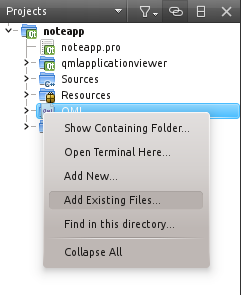
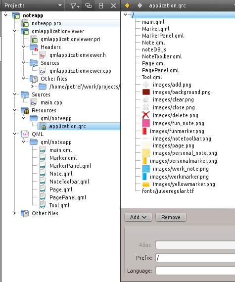

..
    ---------------------------------------------------------------------------
    Copyright (C) 2012 Digia Plc and/or its subsidiary(-ies).
    All rights reserved.
    This work, unless otherwise expressly stated, is licensed under a
    Creative Commons Attribution-ShareAlike 2.5.
    The full license document is available from
    http://creativecommons.org/licenses/by-sa/2.5/legalcode .
    ---------------------------------------------------------------------------

Creating the NoteApp Qt Application
===================================

The goal is to create a single executable NoteApp* binary file that the user will run to get *NoteApp* loaded.

Let's see how we can use Qt Creator for this.

Creating a Qt Quick Application
-------------------------------

First we need to create a :creator:`Qt Quick Application <quick-projects.html#creating-qt-quick-applications>` using Qt Creator and make sure that we have selected *Built-in elements only (for all platforms)** in the Qt Quick Application wizard. Let's name the application *noteapp*.

So now we have a newly created project from the wizard and we notice that a *qtquick2applicationviewer* project is generated for us. The generated *qtquick2applicationviewer* project is a basic 'template' application that loads QML files.  This application, as being a very generic one for deploying Qt Quick applications across devices and targets, includes several platform-specific code for each of those deployment targets. We will not go through these specific parts of the code because it doesn't fit the purpose of this guide.

Nevertheless, there are certain peculiarities of the qtquick2applicationviewer* that somewhat limit us to achieve what we want. The application expects the developer to ship the QML files along with with the executable binary. Using the Qt Resource System becomes impossible, but you will see how to overcome this problem as we proceed.

For the noteapp* project, there is one source file, `main.cpp`. In the `main.cpp` file, you will see how the `viewer` object, the `QtQuick2ApplicationViewer` class, is used to load the `main.qml` file by calling the `QtQuick2ApplicationViewer::setMainQmlFile()` function.

.. code-block:: cpp

  // main.cpp
  ...
  int main(int argc, char *argv[])
  {
    QGuiApplication app(argc, argv);

    QtQuick2ApplicationViewer viewer;
    viewer.setMainQmlFile(QStringLiteral("qml/noteapp/main.qml"));
    viewer.showExpanded();

    return app.exec();
  }

Note, there is a basic `main.qml` file generated by the Qt Quick Application wizard which will be replaced by the `main.qml` file we have created for NoteApp*.

The folder structure of the generated noteapp* project is very straightforward to understand.

     noteapp - root folder of the *noteapp* project

      * qml - this folder contains all the QML files
      * qtquick2applicationviewer - the generated application used for loading QML files
       noteapp.pro - the project file
      * main.cpp - the C++ file where a Qt Application is created

We need to copy our QML files including the `fonts` and `images` directories in the `qml` directory of the newly created noteapp* project. Qt Creator identifies changes to the project folder and adds the new files to the project view. If it doesn't, right-click on the project and choose *Add Existing Files* to add the new files.

.. note:: Make sure to add all existing files including images called from the `nodeDDB.js` file

At this point, let's start to build and run the project and see if everything has gone well with the project creation. Before building the noteapp* project, let's make sure we have the right settings in place for our project. Refer to the :creator:`Configure Projects <creator-configuring-projects.html>` section in Qt Creator documentation.

Once the application is successfully built, an executable binary file called `noteapp` should be produced in the root folder of the project. If you have Qt configured properly for your system, you'll be able run the file by clicking on it.

Using Qt Resource System to Store QML Files and Images
------------------------------------------------------

We have created an executable that loads the QML file for the application to run. As you can see in the `main.cpp` file, the `viewer` object loads the `main.qml` file by passing the relative path of that file. Additionally, we open the `noteapp.pro` file to understand deployment and build settings so we notice the first lines:

.. code-block:: bash

  # Add more folders to ship with the application, here
  folder_01.source = qml/noteapp
  folder_01.target = qml
  DEPLOYMENTFOLDERS = folder_01

  ....

Seems that it is expected to actually ship the QML files along with the executable file, but this is not what we would like to achieve.

Qt provides a quite intuitive :qt5:`Resource System <qtcore/resources.html>` that works seamlessly with QML. We need to create a resource file, `noteapp.qrc` for the noteapp* root project so that we can add our QML and image files to it. Refer to the :creator:`Creating a Resource File <creator-writing-program.html#creating-a-resource-file>` in Qt Creator documentation for detailed steps.

We need to apply minor changes to the `noteapp.pro` and the `main.cpp` in order to be able to use the newly created resource file, `noteapp.qrc`.

First we comment out the first lines in the `noteapp.pro`:

.. code-block:: bash

  # Add more folders to ship with the application, here
  #folder_01.source = qml/noteapp
  #folder_01.target = qml
  #DEPLOYMENTFOLDERS = folder_01

  ....

In the `main.cpp` file, we see the `QtQuick2ApplicationViewer::setMainQmlFile()` function being called with the relative path to the `main.qml` file.

.. code-block:: cpp

  // qtquick2applicationviewer.cpp
  ...
  void QtQuick2ApplicationViewer::setMainQmlFile(const QString &file)
  {
      d->mainQmlFile = QtQuick2ApplicationViewerPrivate::adjustPath(file);
      setSource(QUrl::fromLocalFile(d->mainQmlFile));
  }
  ...

The `QtQuick2ApplicationViewer` class inherits :qt5:`QQuickView <qtquick/qquickview.html>`, which is a convenient class for loading and displaying QML files. The `QtQuick2ApplicationViewer::setMainQmlFile()` function is not optimized for using resources because it adjusts the path of the QML file before calling the :qt5:`setSource() <qtquick/qquickview.html#source-prop>` function.

The simplest approach to overcome this would be to directly call :qt5:`setSource() <qtquick/qquickview.html#source-prop>` on the  `viewer` object in the `main.cpp` file, but this time we pass the `main.qml` as part of the resource file.

.. code-block:: cpp

  // main.cpp
  ...
  int main(int argc, char *argv[])
  {
    QGuiApplication app(argc, argv);

    QtQuick2ApplicationViewer viewer;
    viewer.setMainQmlFile(QStringLiteral("qml/noteapp/main.qml"));
    viewer.showExpanded();

    return app.exec();
  }

There is no other change to be done in the QML files where we use the image files and the font file since the path of the files is a relative one, which will point to the resource internal filesystem. So now we can build the project in Qt Creator that will produce us a binary executable file that bundles all the QML files, images and the font.

Let's try to make a build and see how that works!

Setting an Application Icon and Title
-------------------------------------

A graphical enhancement that is highly recommended is to set an icon for the application, which will uniquely identify your application when deployed in a desktop platform.

Inside the     noteapp* folder, you may have noticed a few *PNG* files and one *SVG* file by now. These image files will be used to set the icon for the application depending on the icon size since we can have 64x64 or 80x80 icons or a vectorized one.

For more details concerning how these icon files are deployed on various platforms, you need to take a close look at the `qtquick2applicationviewer.pri` file. You can find find detailed information on application icons in the :qt:`How to Set the Application Icon <appicon.html>` Qt reference documentation.

We need to call the :qt:`setWindowIcon() <qwidget.html#windowIcon-prop>` function on the `viewer` in order to set the icon for the application window.

.. code-block:: cpp

  // main.cpp
  ...
  QScopedPointer<QApplication> app(createApplication(argc, argv));
  QScopedPointer<QtQuick2ApplicationViewer> viewer(
              QtQuick2ApplicationViewer::create());

  viewer->setWindowIcon(QIcon("noteapp80.png"));
  ...

We need a default window-title for our application and we will use the :qt:`setWindowTitle() <qwidget.html#windowTitle-prop>` function for this.

.. code-block:: cpp

  // main.cpp
  ...

  QScopedPointer<QApplication> app(createApplication(argc, argv));
  QScopedPointer<QtQuick2ApplicationViewer> viewer(
              QtQuick2ApplicationViewer::create());

  viewer->setWindowIcon(QIcon("noteapp80.png"));
  viewer->setWindowTitle(QString("Keep Your Notes with NoteApp!"));
  ...

The NoteApp* is now ready to be shipped and deployed onto various desktop platforms.

Deploying NoteApp
-----------------

    NoteApp* is a typical Qt application so you need to decide whether you would like to statically or dynamically link against Qt. Additionally, every desktop platform has specific linking configurations to be considered.

You can find detailed information on :qt:`Deploying Qt Applications <deployment.html>` reference documentation for each deployment desktop target.

.. rubric:: What's Next?

A summary of what we have learned in this developer guide.
