..
    ---------------------------------------------------------------------------
    Copyright (C) 2012 Digia Plc and/or its subsidiary(-ies).
    All rights reserved.
    This work, unless otherwise expressly stated, is licensed under a
    Creative Commons Attribution-ShareAlike 2.5.
    The full license document is available from
    http://creativecommons.org/licenses/by-sa/2.5/legalcode .
    ---------------------------------------------------------------------------

Images
======

Pictures
--------

Pictures are images with without a title. Pictures are used in different places across a document and even inside a text.

Add an picture like this::

    .. image:: ./images/Qt-logo.png
    :width: 100px
    :align: center
    :height: 100px
    :alt: alternate text

to put an image

.. image:: ./images/Qt-logo.png
    :width: 100px
    :align: center
    :height: 100px
    :alt: alternate text

.. Note:: Width and height are optional. Center alignment and alternate text are not

.. Note:: All pictures have to placed into the ``./image/`` subfolder located in the same folder with a document where it has been used first time

.. Note:: Make sure you give a picture a sounding name and not call it e.g.`` pic-12.png``. No underscores or capital letters!

     When adding images that include text, make sure that the text is visible

TBD

.. ToDo:: Define the resolution and the file formats of the images used

.. ToDo:: Info about the final decision on image tooling

Images Created in LibraDraw
---------------------------

    *UI concept images in LibraDraw**

Use :download:`ui-concept-images.odg <./files/ui-concept-images.odg>` as a template for UI concept images.

This is how it should look:

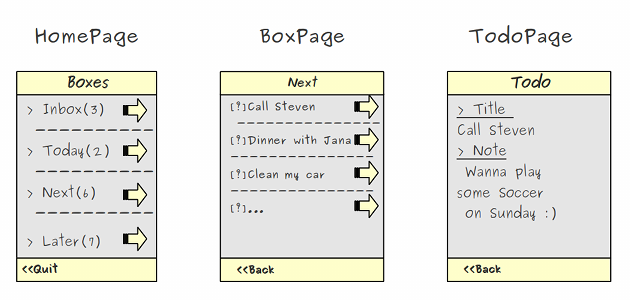

This one is done wrong. It has no color.

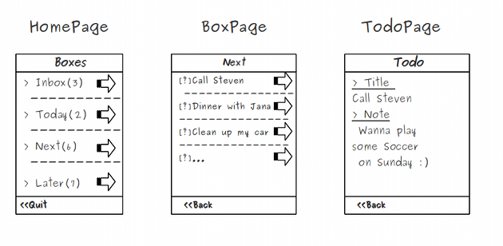

.. ToDo:: What size font? What kind of font? What size images? What size boxes? What size arrows? What color?

    *UI figure images in LibraDraw**

Use :download:`ui-figure-images.odg <./files/ui-figure-images.odg>` as a template for UI figure images.

This is how it should look:

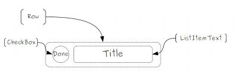

This one is done wrong. UI figure images should be black and white. This one has colors:

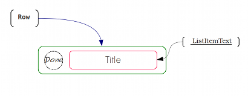

.. ToDo:: What size font? What kind of font? What size images? What size boxes? What size arrows? What color?

Screenshots
-----------

    *UI simulation image**

This is how it should look:

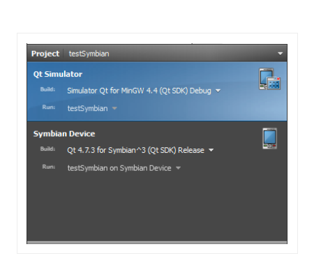

This one is done wrong. The text is too blurry to make out:

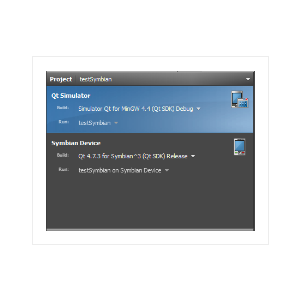

.. ToDo:: What size?

    *Screenshots of the Qt Creator Menu**

This is how it should look. It was taken in Windows 7 and  shows the Qt Creator icons on the left:

.. image:: ./images/project-structure.png
    :align: center
    :alt: Qt Creator menu screenshot 1

This one is done wrong. It's a screenshot from a Mac machine and there's an underscore in the name of the file. We also don't see that it comes from Qt Creator:

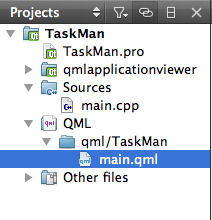

.. ToDo:: What size?

    *Screenshots from the Simulator**

This is how it should look:

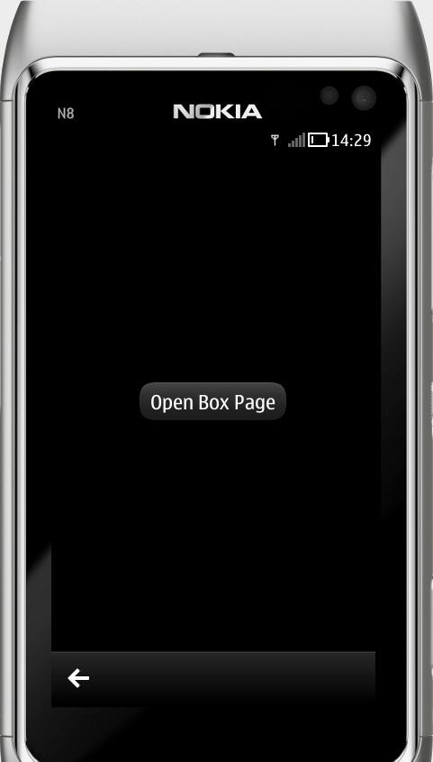

This one is done wrong. A part of the phone is missing at the bottom.

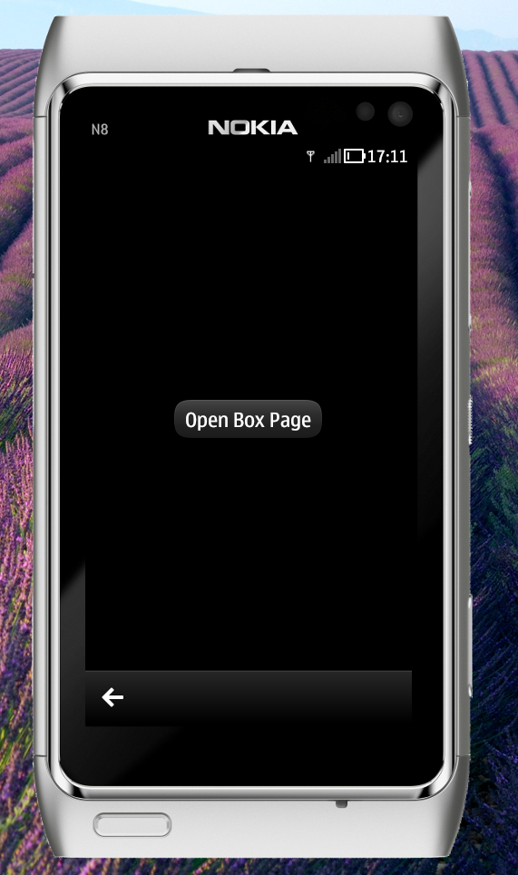

This one is done wrong. There shouldn't be a visible background.

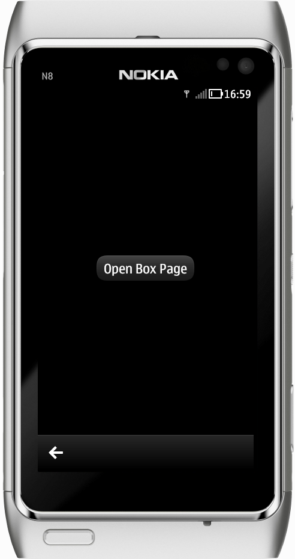

.. ToDo:: What size?

Photos
------

    *Photos of devices**

This is how it should look:

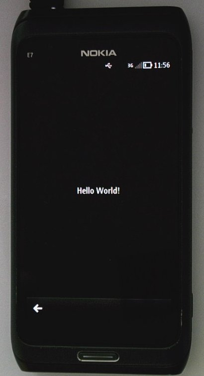

This one is done wrong. It's too big, the text is too blurry to make out and it's a photo of a phone, 2 cables and the edge of a laptop instead of just a photo of a phone:

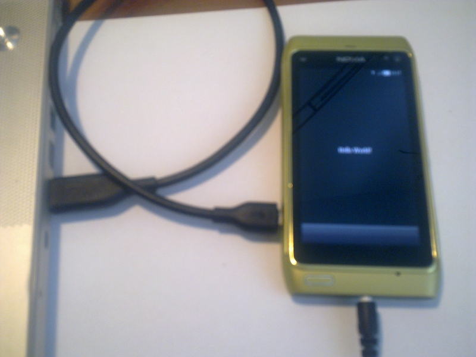

.. ToDo:: What size?

Figures
-------

Compared to pictures figures have to have a caption and optionally a legend and an anchor. Figures are illustration very substantial for the understanding of the content. There can be references to figures from other places in the same document or from other documents.

Decide whether to use text to communicate and `pictures` to describe what's going on in the image, or to use `figures` to communicate using images.

::

    .. figure:: ./images/Qt-logo.png
        :width: 100px
        :align: center
        :height: 100px
        :alt: alternate text
        :figclass: align-center

        Qt-logo.png

    This is a description of `Qt-logo.png`

results in:

.. figure:: ./images/Qt-logo.png
      :width: 100px
      :align: center
      :height: 100px
      :alt: alternate text
      :figclass: align-center

      Qt-logo.png

      This is a description of `Qt-logo.png`

.. Note:: If figures are done in drawing tool, place the project files into the appropriate image directory and push into Git. All figures have to placed into the ``./image/`` subfolder located in the same folder with a document where it has been used first time

.. Note:: Make sure you give a figures a sounding name and not call it e.g.`` pic_12.png``

Important Notes
---------------

     Interface images should share a common style, color scheme, font, spacing and should be made using the same tooling

     Simulator pictures need to be of full phones so if you're taking a screenshot of the simulator, make sure to take a screenshot of the entire phone. Also make sure that there is some space around the entire phone. If this is unclear, just try to make the picture too big to ensure that it won't be too small

     Make sure that the text in screenshots taken from Qt Creator is readable and not blurry

     When using a camera to take pictures, make sure to use the same background
