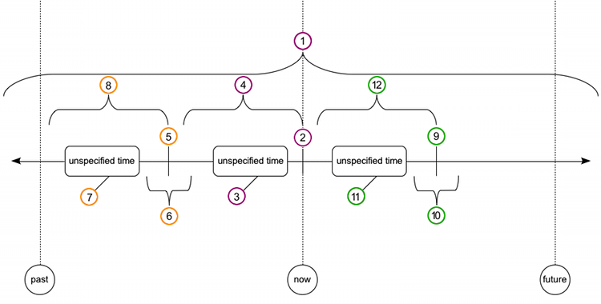

..
    ---------------------------------------------------------------------------
    Copyright (C) 2012 Digia Plc and/or its subsidiary(-ies).
    All rights reserved.
    This work, unless otherwise expressly stated, is licensed under a
    Creative Commons Attribution-ShareAlike 2.5.
    The full license document is available from
    http://creativecommons.org/licenses/by-sa/2.5/legalcode .
    ---------------------------------------------------------------------------

Language
========

Be careful when choosing your wording. Here are some tips:

     Avoid words like *try*. We're not attempting anything. We're actually doing it and showing others how we accomplish things

     Avoid using words like *please*

     Keep it simple, keep it straight, and above all, keep it serious. Avoid using humor

     Avoid using wording that can be regarded as a matter of opinion. (e.g. *a good way to do something* ...explain the task, explain the options, and explain when, how and why to or not to use each particular option)

     Words/phrases to avoid: *shall*, *must not*

     Use *we are* and *let's* if you are walking someone through some steps. If we are developing an application with the reader, write about *our application* and not *your application* or *my application*

     Avoid referring to anything in documentation as *my* or *mine* because we are developing something with the reader and not for them

     Do not use words that express something that could be interpreted as a matter of opinion. If there you want to state that something (e.g. a way of doing something) is *good* or *convenient*, explain to the read, why it is good or convenient. If you can't explain this, do not use such wording at all

     Use the word *they* to refer to a third party. Avoid using *he* or *she*

     Refer to the readers of this documentation as *readers*

     Refer to the users of the applications as the *users*

     Use the passive voice to indicate that something has already been done for them or is already provided so they do not need to do it

     Use *you* and to indicate that the reader should do something on his own and explain to him why he needs to do this. (try not to use imperative)

     Use contractions (I'm, we're, don't, can't) unless you want to put emphasis on something  (e.g. *We should not* often indicates that *we*, *should*or *not* is emphasized. This is why we should try to use *shouln't* for the most part), but don't exaggerate :)

American Versus British English
-------------------------------

.. list-table:: We use American English spelling. Please take a look at these examples:
   :widths: 70 100 75 80
   :header-rows: 1

        - Spelling
     -     ise* / *ize* & *isa* / *iza*
     -     er* & *re*
     -     or* & *our*
        - American English
     - organize, realize, recognize
     - meter, liter, center
     - color, favor, behavior
        - British English
     - organize, realize, recognize
     - metre, litre, center
     - color, favor, behavior

Basic English
-------------

Wikiepedia has some guidelines:

     http://simple.wikipedia.org/wiki/Main_Page (under *When writing articles here:*)

     http://simple.wikipedia.org/wiki/Basic_English

     http://simple.wikipedia.org/wiki/Wikipedia:Basic_English_alphabetical_wordlist (we can't entirely use this list because of the technical words and phrases needed in our documentation, but nontheless this is a good resource to get an idea of basic english words to use besides jargon)

Articles
--------

Sometimes we want to state that something is located or has to be done in a file. These are the following options::

    in `main.cpp`
    in the `main.cpp` file

Do NOT use the following::

    in the `main.cpp`
    in `main.cpp` file

When writing about features, use the following wording::

    `Qt Simulator`
    the/a `Qt Simulator` feature

Do NOT use the following wording::

    the/a `Qt Simulator`
    `Qt Simulator` feature

Tenses
------

There are 12 tenses in the english language, 8 of which are used quite extensively by native speakers of English. It goes with out saying that this makes it relatively difficult to learn how to use these tenses correctly. Below you will find a tense timeline that simplifies all 12 tenses.

    *Active**

1. Present Simple: We do something (all of the time, every time)
2. Present Continuous: We are doing something (that we have started, but have not yet finished and we are doing it now)
3. Present Perfect: We have done something (once or twice or more than twice, but NEVER answer the question     when* with this tense)
4. Present Perfect Continuous: We have been doing something (since, for x minutes/hours/days/months/years)
5. Past Simple: We did something (at a specific time in the past. You don't necessarily have to state when)
6. Past Continuous: We were doing something (around the time that something happened)
7. Past Perfect: We had done something (once or twice or more than twice - before something happened)
8. Past Perfect Continuous: We had been doing something (since, for x minutes/hours/days/months/years - before something happened)
9. Future Simple: We will do something (at a specific time in the future)
10. Future Continuous: We will be doing something (around the time that something will happen)

rarely used:

11. Future Perfect: We will have done something (once or twice or more than twice - before something will be done)
12. Future Perfect Continuous: We will have been doing something (since, for x minutes/hours/days/months/years - before something will be done)

    *Passive**

1. Present Simple: Something is done (all of the time, every time)
2. Present Continuous: Something is being done (that has been started, but hasn't yet been finished and we are doing it now)
3. Present Perfect: Something has been done (once or twice or more than twice, but NEVER answer the question     when* with this tense)
4. Present Perfect Continuous: Something has been being done (since, for x minutes/hours/days/months/years)
5. Past Simple: Something was done (at a specific time in the past)
6. Past Continuous: Something was being done (around the time that something happened)
7. Past Perfect: Something had been done (once or twice or more than twice - before something happened)
8. Past Perfect Continuous: Something had been being done (since, for x minutes/hours/days/months/years - before something happened)
9. Future Simple: Something will be done (at a specific time in the future)
10. Future Continuous: Something will be being done (around the time that something will happen)

rarely used:

11. Future Perfect: Something will have been done (once or twice or more than twice - before something will be done)
12. Future Perfect Continuous: Something will have been being done (since, for x minutes/hours/days/months/years - before something will be done)

    *Other Future Forms**

     going to + infinitive: a. indicates an intention to do something, but isn't necessarily planned/arranged; b. indicates inevitability (e.g. My work won't be finished on time. I'm going to have to work harder.)

     present continuous (am/are/is doing) for future: indicates that something is planned/arranged (to meet somebody, to go somewhere)

     present simple for the future (scheduled events that occur regularly): stating that *the train that we are taking leaves at 9am tomorrow morning*, tells us that the train will be leaving at 9am tomorrow morning, but we use the present simple because train departures are typically scheduled events that occur regularly

    *Other Past Forms**

     was going to do: indicates the intention to do something as well as the inability to do it (e.g. I was going to finish the chapter last night, but I got stuck on something and wasn't able to finish it)

     used to do: If we want to talk about things that happened repeatedly in the past, but don't happen anymore, we can use would or used to + infinitive. (note: do not confuse with *to be used to something*)

Irregular Verbs
---------------

     English irregular verbs: http://owl.english.purdue.edu/owl/resource/605/01/

     German irregular verbs (for those of us in the team learning German, this will come in handy): http://german.about.com/library/blstrverbs.htm

.. ToDo:: An admission with small dark lyme green letters that match the style

Helpful Resources
-----------------

     *Oxford Guide to English Grammar* by John Eastwood: http://www.uop.edu.jo/download/research/members/Oxford_Guide_to_English_Grammar.pdf (Chapter 9 Verb tenses and aspects, PAGE 82)

     English Grammar in Use, Cambridge Presså

     Advanced English Grammar in Use by Martin Hewings, Cambridge Press

Writing Numbers
---------------

For consistency, we should write numbers as digits unless the number is hyphenated with a word (e.g. 2 features; two-part tutorial)
