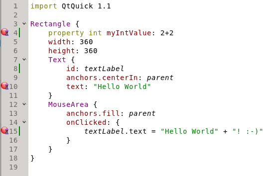

..
    ---------------------------------------------------------------------------
    Copyright (C) 2012 Digia Plc and/or its subsidiary(-ies).
    All rights reserved.
    This work, unless otherwise expressly stated, is licensed under a
    Creative Commons Attribution-ShareAlike 2.5.
    The full license document is available from
    http://creativecommons.org/licenses/by-sa/2.5/legalcode .
    ---------------------------------------------------------------------------

How to set breakpoints
======================

This might be clear for those who have been using QtCreator for a while with C++. If you use QtCreator with Qt Quick and set a breakpoint on line 10:

QtCreator will not stop on that line, but only on 4 and 15. This is because 4 and 15 contain JavaScript code which can be stopped in the debugger, where the line 10 is pure Qt Quick code which is loaded as a declartion. There is no     execution* which can be stopped in
any debuger.

QtCreator stopped and you still can inspect loaded elements. If you need to stop on a particular place, just add some JavaScript code to this place or just before and set a breakpoint there.
