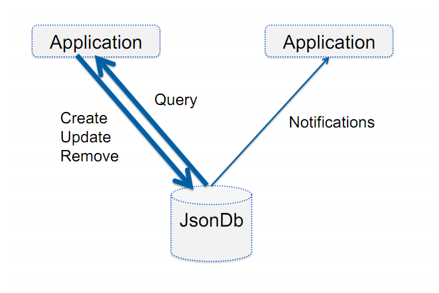
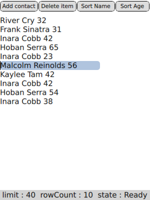

..
    ---------------------------------------------------------------------------
    Copyright (C) 2012 Digia Plc and/or its subsidiary(-ies).
    This work, unless otherwise expressly stated, is licensed under a
    Creative Commons Attribution-ShareAlike 2.5.
    The full license document is available from
    http://creativecommons.org/licenses/by-sa/2.5/legalcode .
    ---------------------------------------------------------------------------

Using the JSON Storage API in Qt Quick
======================================

Qt 5 introduces the QtJsonDb module, which is a `NoSQL <http://en.wikipedia.org/wiki/NoSQL>`_ database implementation that offers a C++ and QML/JS API for creating and storing JSON objects. It is a client-server based architecture, so it has a database daemon that uses `JSON <http://www.json.org/>`_ as data format and a backend (B+ tree implementation) for storing `JSON <http://www.json.org/>`_ objects.

The core functionality can be summarized as the following:

     Simple `JSON <http://www.json.org/>`_ object storage and retrieval
     A rich query language called JsonQuery
     A Notification Interface in for QML and Qt/C++

.. Note:: When using Qt 5, in order to be able to use the QtJsonDb API, the QtJsonDb daemon/server that will act as the database server for storing objects has to be started. Once you have configured and installed `Qt 5 <http://qt-project.org/wiki/Building_Qt_5_from_Git>`_ properly, then you need to run the ``jsondb`` daemon that will act as a database server.

.. Note:: QtJsonDb module is not part of the Qt 5 Alpha release and so you would need to compile Qt 5 and the QtJsonDb module yourself by cloning it from the Git repository. Check this `Building Qt 5 from Git <http://qt-project.org/wiki/Building_Qt_5_from_Git>`_ wiki page for detailed information.

This tutorial will guide through a basic example and should help you get a better understanding how the current QtJsonDb APIs work and how to use them.
The example is a simple and straightforward one that focuses on the following operations:

     Create and store new JSON object.
     Delete a JSON object
     Sort a list of JSON objects.
     Basic use of notification capabilities of QtJsonDb

Here is a screenshot of the final outcome of our example. A simple list view and a set of buttons to perform the create/delete actions and the sorting functionality.

QML Objects and JSON Schema
---------------------------

Prior to going through the example here is a brief overview of the JSON objects representation in QML.
The QML Runtime is built upon a JavaScript engine by following its standards and specifications and therefore it makes sense to say that QML objects can be considered as JavaScript objects.

Hence, considering the `JSON <http://www.json.org/>`_ notation as the representation format of data in QML seems reasonable.
Any data that you can represent in `JSON <http://www.json.org/>`_ can be stored in the QtJsonDb database.

Here is an example of a typical Object data representation in `JSON <http://www.json.org/>`_.

.. code-block:: js

    {
    "_type": "Contact",
    "firstName": "Hoban",
    "lastName": "Washburne",
    "age": "22",
    "phoneNumbers": { "home": "+16175551212",
                      "work": "+163464345645",
                      "mobile": "+1754643523"
                    }
    }

So the object is represented as key pair values and as we can notice from the above `JSON <http://www.json.org/>`_ object, the value string can be represented as a single string value, as an object (see the value for the ``phoneNumbers`` property) or even as an array of values.

The ``_type`` property is a required field since it help us distinguish various type of stored objects. In addition to the ``_type`` property, there are other property names starting with _ that are special properties and reserved for database use only. Here is a list of these properties:

       _uuid

         Object
         Unique identifier assigned when object is created. When a record is created the database assigns a value to the field _uuid. This is the unique key identifying the
      object

       _type

         Reverse DNS
         The name of the object. Can be a reverse DNS name or a single word. A single word cannot contain a dot.

       _id

         URL
         UUID seed
       _version

         Positive integer
         Monotonically increasing object version number.

       _owner

         Application ID
         The application that created or updated the object. It follows the reverse DNS standard, eg. com.nokia.contacts.

       _schemaVersion

         Positive integer
         identifier showing the revision of the object. the schema file mentioned must contain a _schemaVersion property at top level.

Lets see how we implement our example.

Creating a JsonDb Partition and a JsonDbListModel
-------------------------------------------------

For the example we have three qml files, ``SimpleListModel.qml`` and ``Button.qml``.
In the ``SimpleListModel.qml`` file we implement most of the functionality and we make use of the QtJsonDb API as we will see below.
The     Button.qml* file has the *Button* QML Component that we use to create a button like UI element, see the above screenshot.

Let's go in detailed steps and discover the QML API of QtJsonDb.

.. code-block:: js

    //SimpleListModel.qml file

    //importing QtQuick module version 2.0
    import QtQuick 2.0

    //importing QtJsonDb module version 1.0 and use JsonDb
    //as an alias name
    import QtJsonDb 1.0 as JsonDb

    //creating a root item element
    Item {
        id: root
        width: 300
        height: 400

        //creating the partition object that will be
        //used to create work with json objects
        JsonDb.Partition {
            id: myPartition
        }

        //a list-model that operates on a JsonDb partition
        //for retrieving json objects
        JsonDb.JsonDbListModel {
            id: contacts
            query: '[?_type="Contact"]'
            roleNames: ["fullName", "age", "_uuid"]
            partition: myPartition
            limit: 40
        }
        ...
    }

In the above code snippet of the ``SimpleListModel.qml`` file we create an :qt:`Item <qml-item.html>` as our root element and inside the root element we create the ``JsonDb.Partition `` and ``JsonDb.JsonDbListModel`` elements. We will use the functionality of these two elements to create and operate on our Json objects from the JsonDB.

The ``JsonDb.Partition`` element helps us perform the following operations with its API:

     Create Json objects using the ``int Partition::create(objectnewObject, objectoptions, functioncallback)`` function.
     Remove Json object using the ``int Partition::remove(objectobjectToRemove, objectoptions, functioncallback)`` function.

There is a ``name`` property of the ``JsonDb.Partition`` that holds a human readable name of this partition. In our example code we do not need to use it. Should it be the case that you would like to create your own partition, ``com.nokia.mypartitionname``, then simply make sure to create it upon completion of your component using the ``create(object newObject, object options, function callback)`` method.

Now that we have created a ``JsonDb.Partition`` partition that will serve as our database storage we need to create objects, retrieve them and display them on a list view.
``JsonDb.JsonDbListModel`` QML element gives us a nifty intuitive API for having our Json objects into a list-type model that we can perform various operations such as querying objects as we do in our example and use it directly in a :qt:`ListView Element <qml-listview.html>`.

The ``contacts`` ``JsonDb.JsonDbListModel`` model will be used for the following functionalities in our example:

     Retrieving the stored Json objects from the ``myPartition`` QtJsonDb partition and use the model in the list view as seen below.
     Querying Json objects and sort them as seen below.

We set the ``query`` property of the ``contacts`` model ( ``JsonDb.JsonDbListModel`` ) so that it will fetch all the objects with ``_type`` ``Contact`` from the ``myPartition`` partition.  While the ``limit`` property helps us in optimizing the model's performance as it limits the number of objects to be fetched at a time, certainly useful for a large set of objects stored.

The objects fetched by the model may have a big set of properties that might be unnecessary to expose to the list-view. To have control over this, the ``JsonDb.JsonDbListModel`` provides us the ``roleNames`` property, which causes the model to fetch those properties of the objects and expose them as roles to the delegate for each item viewed. In our example we need just the ``fullName``, ``age`` and ``_uuid`` properties.  The ``_uuid`` property is explained below.

Let's see how the above functions are used in the example and understand them a bit better.

Creating and querying Json objects
----------------------------------

From the above screenshot, we see the four buttons, which in the ``SimpleListModel.qml`` file are created using the ``Button`` QML Component.

.. code-block:: js

    //Button.qml file

    import QtQuick 2.0

    Rectangle {
        id: bt
        anchors.margins : 2
        width: 50
        height: 20
        color: ma.pressed?'#cccccc':'#dddddd'
        border.color: "black"
        border.width: 5
        radius: 10
        property alias text:lb.text
        signal clicked()
        Text {
            id: lb
            anchors.centerIn: parent
            horizontalAlignment: Text.AlignHCenter
            verticalAlignment: Text.AlignVCenter
            text: "Button"
            font.pointSize: 10
        }
        MouseArea {
            id: ma
            anchors.fill: parent
            onClicked: {
                bt.clicked();
            }
        }
    }

Let's see how the     Add Contact* button is created and how the ``JsonDb.Partition`` API is used to create Json objects.

.. code-block:: js

    //SimpleListModel.qml file

    ...
    Button {
        id: buttonAdd
        anchors.top: parent.top
        width: parent.width/4
        text: "Add contact"

        //adding random string values as part of the json object
        onClicked: {
            //an array of random names
            var fullnames = ["Malcolm Reinolds", "Zoe Washburn", "Hoban Serra",
                             "Inara Cobb", "Jayne Frye", "Kaylee Tam",
                             "Simon Perres", "River Cry", "Shepard Frank",
                             "Frank Sinatra"
                            ]

            var ages = ["45", "32", "38","65","19", "54",
                        "78", "61", "27", "56", "38", "42",
                        "31", "23"
                       ]

            function rand(n) { return Math.floor(Math.random()      n); }

            //randomly picking up values from the arrays
            var fullname = fullnames[rand(fullnames.length)]
            var age = ages[rand(ages.length)]

            //create a contact
            myPartition.create({"_type":"Contact",
                                "fullName":fullname,
                                "age":age }, createCallback)
        }
    }

    ...

Inside the ``onClicked`` signal of the ``Button`` Component, at first we create two arrays with some random string values representing full name and age respectively.
We create two Javascript variables that will store these two string values respectively and pass them to the ``int Partition::create(objectnewObject, objectoptions, functioncallback)`` function.
The ``objectoptions`` and the ``functioncallback`` parameters are optional and in our example we do not use the ``objectoptions``. However, it is highly recommended to use a callback function in order to check upon failure and success of the object creation.

.. Note:: The callback functions used in the example are declared right in the end of the ``SimpleListModel.qml`` file, as you will see more details below.

.. Note:: Every Json object created and stored the QtJsonDb has a ``_uuid`` property that uniquely identifies the objects.

Once we have successfully created an object, then internally the QtJsonDb creates adds a value to the ``_uuid`` property of that object, hence we do not need to set that property each time upon creation.

The following code snippet shows how the object deletion is implemented when the ``Delete contact`` button is pressed.

.. code-block:: js

    //SimpleListModel.qml file

    ...

    Button {
        id: buttonDelete
        anchors.top: parent.top
        anchors.left: buttonAdd.right
        width: parent.width/4
        text: "Delete item"

        onClicked: {
            myPartition.remove({"_uuid": contacts.get(listView.currentIndex, "_uuid")},
                                removeCallback)
            console.log("Removed Item : " + contacts.get(listView.currentIndex,
                        "_uuid"))
        }
    }

    ...

Same approach as we saw above for creating Json objects, inside the ``onClicked`` signal of the ``Button`` element we call the ``int Partition::remove(objectobjectToRemove, objectoptions, functioncallback)`` function. The function needs to know which object or list of objects to remove from the partition and so for this the ``_uuid`` property will help us identify the object to be removed.

The ``JsonDb.JsonDbListModel`` has a convenient function for this, the ``object JsonDbListModel::get(int index, string property)`` method. The method returns the value of     property* for the Json object in that specific ``index`` of the list-model. In our example we simply need the value of the ``_uuid`` property.

In our example we use a :qt:`ListView Element <qml-listview.html>` for displaying the data from the ``JsonDb.JsonDbListModel``.
For simplicity reasons, we can use the :qt:`currentIndex <qml-listview.html#currentIndex-prop>` property of the :qt:`ListView Element <qml-listview.html>` element as the ``index`` value to be passed in the ``object JsonDbListModel::get(int index, string property)`` method. Meaning that you need first to select the contact which you want to delete and press the     Delete contact* button afterwards.

The following code shows how we create a :qt:`ListView Element <qml-listview.html>` element to display our model data and additionally shows how we update the :qt:`currentIndex <qml-listview.html#currentIndex-prop>` property of the list-view to the ``index`` that is selected by the user using a mouse press event.

.. code-block:: js

    //SimpleListModel.qml file

    ...

    //listview that displays the JsonDbListModel
    ListView {
        id: listView
        anchors.top: buttonAdd.bottom
        anchors.bottom: statusText.top
        anchors.topMargin: 10
        anchors.bottomMargin: 10
        width: parent.width
        model: contacts
        highlight: Rectangle { color: "lightsteelblue";
                               radius: 5 ;width: 200;
                             }
        focus: true
        delegate: Row {
            spacing: 10
            TextEdit {
                id: textedit
                text: model.fullName
                onFocusChanged: {
                    var contact = {}
                    contact['_uuid'] = contacts.get(index, "_uuid")
                    contact['_type'] = "Contact"
                    contact['fullName'] = textedit.text
                    myPartition.update(contact,  updateCallback)
                }

                MouseArea {
                    anchors.fill: parent;
                    //set the currentIndex property with index
                    //of the pressed item
                    onPressed: {
                        listView.currentIndex = index;
                        textedit.focus = true
                    }
                }
            }

            Text {
                id: agelbl
                text: model.age
            }
        }
    }

    ...

Looking at the above code snippet, as a delegate for the list-view we use a :qt:`Row Element <qml-textedit.html>` that has two child elements; a :qt:`TextEdit Element <qml-textedit.html>` for displaying the values of the ``fullName`` property and a :qt:`Text Element <qml-textedit.html>` used to display the ``age`` property of the retrieved Json object.

We use a :qt:`TextEdit Element <qml-textedit.html>` Element as a simple text editor, bind its text to the value of the entry and update it in the storage with the ``int Partition::update(objectTobeUpdated, objectoptions, functioncallback)`` method. The user will be able to edit the ``fullName`` property of the object.

The approach we follow to update the ``fullName`` property of the object is quite simple. The user can edit the given text and by simply clicking to the next item in the list then the update occurs. This is done inside the ``focusChanged`` signal, where we create an empty object and assign the ``_uuid`` and ``_type`` properties accordingly
and set the value of the ``fullName`` property to the one of the ``text`` property of the ``textedit`` item. See below the use code snippet.

.. code-block:: js

   ...
    onFocusChanged: {
        var contact = {}
        contact['_uuid'] = contacts.get(index, "_uuid")
        contact['_type'] = "Contact"
        contact['fullName'] = textedit.text
        myPartition.update(contact,  updateCallback)
    }
    ...

In our example, we use callback javascript functions passed as parameters in all the methods used from the``myPartition`` object. The callback javascript function have one simple goal in our case, detect an error if any.

.. code-block:: js

    //SimpleListModel.qml file

    {
        ...

        Rectangle {
        id: statusText
        anchors.bottom: parent.bottom
        width: parent.width
        height: 20
        color:  "lightgray"
            Text {
                anchors.centerIn: parent
                text: "limit : " + contacts.limit + "  rowCount : "
                + contacts.rowCount + "  state : " + contacts.state
            }
        }

        function createCallback(error, response) {
            if (error) {
                // communication error or failed to create one or more objects.
                // 'error' object is only defined in case of an error
                // otherwise undefined.
                console.log("Create Error :"+JSON.stringify(error));
            }
        }

        function removeCallback(error, response) {
            if (error) {
                // communication error or failed to create one or more objects.
                // 'error' object is only defined in case of an error
                // otherwise undefined.
                console.log("Remove Error :"+JSON.stringify(error));
            }
        }

        function updateCallback(error, response) {
            if (error) {
                // communication error or failed to create one or more objects.
                // 'error' object is only defined in case of an error
                // otherwise undefined.
                console.log("Update Error :"+JSON.stringify(error));
            }
        }
    }

Up to this point we have seen in a step by step guide some basic and core QtJsonDb QML API, creating and removing Json objects. In the following we will see how to make simple queries that will sort the data in the JsonDB model we currently have.
QtJsonDb offers a rich query language called JSON Query, which is in itself derived from `XPath <http://en.wikipedia.org/wiki/XPath>`_.

QtJsonDb has a valid set of query expressions and you may try some of the examples ``Expression Examples`` in the documentation. Here is a short list:

        [*] - Matches all objects
        [?_type="CONTACT"] - Matches all objects with property "_type" equal to "CONTACT"
        [?_type="CONTACT"][?name="Denis"] - Matches all objects with property "_type" equal to "CONTACT" that have "name" property set to "Denis"
        [?_type="CONTACT"][?name="Denis" | name="Carlos"] - Matches all objects with property "_type" equal to "CONTACT" that have "name" property set to "Denis" or "Carlos"
        [/DateTimeSent] - Sorts objects by the value of their DateTimeSent? property in ascending order
        [\DateTimeSent] - Sorts objects by the value of their DateTimeSent? property in descending order
        [= prop1, prop2 ] - Instead of returning the objects, return a list of property values from the matching objects
        [= [ prop1, prop2 ] ] - Instead of returning the objects, return a list of property values from the matching objects
        [= {foo: prop1, bar: prop2}] - Instead of returning the original objects, return new objects constructed from the properties of the matching objects

The ``JsonDb.JsonDbListModel`` has the ``query`` string property, which we can set to any supported query format that fits our purpose. Lets see how we can use it for basic sorting functionality.

.. code-block:: js

    //SimpleListModel.qml file

    ...

    Button {
        id: sortButtonName
        anchors.top: parent.top
        anchors.left: buttonDelete.right
        width: parent.width/4
        text: "Sort Name"

        onClicked: {
            contacts.query = ("[?_type=\"Contact\"][/fullName]")
        }
    }

    Button {
        id: sortButtonAge
        anchors.top: parent.top
        anchors.left: sortButtonName.right
        anchors.right: parent.right
        text: "Sort Age"

        onClicked: {
            contacts.query = ("[?_type=\"Contact\"][/age]")
        }
    }
    ...

Performing a query on the ``contacts`` ``JsonDb.JsonDbListModel`` model by various properties and by using the correct syntax we get a sorted list of objects by that property. So we use ``contacts.query = ("[?_type=\"Contact\"][/fullName]")`` by getting the list of contacts sorted by the ``fullName`` property and ``contacts.query = ("[?_type=\"Contact\"][/age]")`` for retrieving a sorted list of contacts by ``age`` property.
This works fine for our example as we have a small list of objects and performance is not a problem. However though, for large list of objects QtJsonDb API offers ~`JsonDb.JsonDbSortingListModel`` as a more convenient approach to using sorted list models for your views.

The ``JsonDb.JsonDbSortingListModel`` item provides a more flexible API and it is quite performant when sorting large list of objects and this is because the sorting is done after the whole result set is retrieved from the database.

Getting Notification
--------------------

There are cases and scenarios where the application needs to get notified when objects in the database are modified. In order to avoid querying the database over and over to check whether there are any changes, QtJsonDb provides an intuitive API for this. The ``JsonDB.Notification`` item provides API to register for the following operations on the objects:

     ``Notification.Create``
     ``Notification.Update``
     ``Notification.Remove``

.. code-block:: js

    //SimpleListModel.qml file

    ...

    JsonDb.Notification {
        partition: myPartition
        query: '[?_type="Contact"]'
        onNotification: {
            switch (action) {
            case JsonDb.Notification.Create :
                console.log("{_uuid :" + result._uuid + "} created");
                break;
            case JsonDb.Notification.Update :
                console.log("{_uuid :" + result._uuid + "} was updated");
                break;
            case JsonDb.Notification.Remove :
                console.log("{_uuid :" + result._uuid + "} was removed");
                break;
            }
        }
    }

    ...

In the ``SimpleListModel.qml`` file we create a ``JsonDB.Notification`` item just after we create the ``contacts`` ``JsonDb.JsonDbListModel`` model and we set the ``partition`` property to ``myPartition`` object, which we created earlier.

