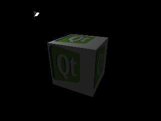

..
    ---------------------------------------------------------------------------
    Copyright (C) 2012 Digia Plc and/or its subsidiary(-ies).
    All rights reserved.
    This work, unless otherwise expressly stated, is licensed under a
    Creative Commons Attribution-ShareAlike 2.5.
    The full license document is available from
    http://creativecommons.org/licenses/by-sa/2.5/legalcode .
    ---------------------------------------------------------------------------

About this Tutorial
===================

Why Would You Want to Read this Guide?
--------------------------------------

This tutorial provides a basic introduction to OpenGL and 3D computer graphics. It shows how to make use of Qt and its OpenGL related classes to create 3D graphics by using OpenGL's programmable pipeline. The tutorial provides many examples that demonstrate the basic features of OpenGL programming such as rendering, texture mapping, lighting, and so on. By the end of the tutorial, you will have a good understanding about how OpenGL works and you will also be able to write custom shader programs.

Get the Source Code and the Tutorial in Different Formats
---------------------------------------------------------

A .zip file that contains the full code source of the tutorial's examples is provided:

     :download:`Source code <qtopengltutorial/opengl_src.zip>`

The guide is available in the following formats:

     :download:`PDF <qtopengltutorial/OpenGLTutorial.pdf>`

     :download:`ePub <qtopengltutorial/OpenGLTutorial.epub>` for ebook readers. Further details can be found `here <http://en.wikipedia.org/wiki/EPUB#Software_reading_systems>`_.

     :download:`Qt Help <qtopengltutorial/OpenGLTutorial.qch>` for Qt Assistant and Qt Creator. In Qt Assistant, in the :qt:`Preferences Dialog <assistant-details.html#preferences-dialog>` under the `Documentation` tab (in a collapsible menu for Mac users), click the `Add` button to add this guide in .qch format. We do the same in Qt Creator under the `Options` dialog in the `Help` section. Here you can add this guide in the `Documentation` tab.

License
-------

Copyright (C) 2012 Digia Plc and/or its subsidiary(-ies).
All rights reserved.

This work, unless otherwise expressly stated, is licensed under a Creative Commons Attribution-ShareAlike 2.5.

The full license document is available from http://creativecommons.org/licenses/by-sa/2.5/legalcode .

Qt and the Qt logo is a registered trade mark of Digia plc and/or its subsidiaries and is used pursuant
to a license from Digia plc and/or its subsidiaries. All other trademarks are property of their respective owners.

.. rubric:: What's Next?

Next will be an introduction to `OpenGL` and the basics of drawing in 3D.
