..
    ---------------------------------------------------------------------------
    Copyright (C) 2012 Digia Plc and/or its subsidiary(-ies).
    All rights reserved.
    This work, unless otherwise expressly stated, is licensed under a
    Creative Commons Attribution-ShareAlike 2.5.
    The full license document is available from
    http://creativecommons.org/licenses/by-sa/2.5/legalcode .
    ---------------------------------------------------------------------------

Introduction
============

This tutorial provides a basic introduction to OpenGL and 3D computer graphics. It shows how to make use of Qt and its OpenGL-related classes to create 3D graphics.

We will use the core features of OpenGL 3.0/ 2.0 ES and all following versions, which means that we will be utilizing OpenGL's programmable rendering pipeline to write our own shaders with the OpenGL Shading Language (GLSL) / OpenGL ES Shading Language (GLSL / ES).

Chapter one gives an introduction to 3D computer graphics and the OpenGL API including the OpenGL Shading Language (GLSL) / OpenGL ES Shading Language (GLSL / ES). If you are already familiar with this topic and only want to see how to use OpenGL in your Qt programs, you can skip this introductory chapter and move on to chapter two.

In chapter two, we present examples which utilize the information covered in chapter one and show how to use OpenGL together with Qt's OpenGL-related functionality.

At the end of this tutorial you find some references and links that may come in handy, especially when working through the examples. Note that this tutorial is meant to get you started with this topic and can not go into the same depth as a decent OpenGL dedicated book would. Also note that the Qt's OpenGL-related classes makes your life easier by hiding some of the details, which you would encounter if you wrote your programs using only the OpenGL API.

In the example part, we will use Qt's high-level functionality whenever possible and only briefly name the differences. So if you intend to get a complete understanding of how to use native, you should additionally consult a tutorial or book dedicated to this topic.

What's OpenGL
--------------

OpenGL is the industry's most widely used 2D and 3D graphics API. It is managed by the
nonprofit technology consortium, the Khronos Group, Inc. It is a highly portable,
scalable, cross-language and cross-platform specification that defines a uniform interface for
the computer's graphics accelerator. It guarantees a set of basic capabilities and allows
vendors to implement their own extensions.

OpenGL is a low-level API which requires the programmer to tell it the exact steps needed to
render a scene. You cannot just describe a scene and have it displayed on your monitor. It is
up to you to specify geometry primitives in a 3D space, apply coloring and lighting effects,
and render the objects onto the screen. While this requires some knowledge of computer
graphics, it also gives you a lot of freedom to invent your own algorithms and create a
variety of new graphical effects.

The sole purpose of OpenGL is to render computer graphics. It does not provide any
functionality for window management or for handling events such as user input. This is what
we use Qt for.

Drawing in 3D Space
-------------------

The geometry of three dimensional objects is described by an arrangement of very basic
building blocks (primitives) such as single points, lines or triangles.
Triangles are the most common ones as they are used to approximate the surface of objects.
Each surface can be split up into small planar triangles. While this works well on edged
objects, but smooth objects like spheres will look jagged. Of course you could use more
triangles to improve the approximation, but this comes at the cost of performance as more
triangles will have to be processed by your graphics card. Instead of simply increasing the
polygon count, you should always consider additional techniques such as improving the
lighting algorithm or adapting the level of detail.

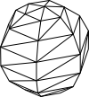

To define the spatial properties of your objects, you set up a list of points, lines, and/or
triangles. Each primitive in turn is specified by the position of its corners (a vertex /
vertices). Thus it is necessary to have a basic understanding of how to define points in space
and to manipulate them efficiently. But we will brush up our linear algebra knowledge in a
moment.

To see the objects, you must apply coloring to your primitives. Color values are often
defined for each primitive (for each vertex to be precise) and used to paint or fill in with
color. For more realistic applications, images (called textures) are placed on top of the objects.
The appearance can be further adapted according to material properties or lighting.
So how do we actually get our scene displayed on the screen.

As the computer screen is a two dimensional device, we need to project our objects onto a
plane. This plane is then mapped to a region on our screen called the viewport*. To
understand this process illustratively, imagine that you are standing in front of the window
and sketching the outlines of the objects you see outside onto the glass without moving your
head. The drawing on the glass then represents a two dimensional projection of your
environment. Though the technique is different, this kind of projection also occurs in a
camera when taking a picture.

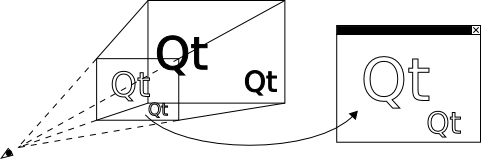

The clipped pyramid is called the `viewing volume`. Everything that is located inside this
volume is projected onto the near side towards the imaginary viewer. Everything else is not
drawn.

There are two major types of projections: perspective projections and orthographic
projections.

What we just introduced is called `perspective projection`. It has a viewing volume in the form
of a frustum and adds the illusion that distant objects appear smaller than closer objects of
the same size. This greatly contributes to realism, and therefore, is used for simulations,
games and VR (virtual reality) applications.

The other type is called `orthographic projection`. Orthographic projections are specified by a
rectangular viewing volume. Every two objects that have the same size also have the same
size in the projection  regardless of its distance from the viewer. This is often used in CAD
(computer aided design) tools or when dealing with 2D graphics.

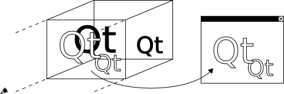

A Short Recapitulation of Linear Algebra
----------------------------------------

As it is essential to have a basic understanding of linear algebra when writing OpenGL programs, this chapter will briefly state the most important concepts involved. Although we will mostly let Qt do the math, it is still good to know what is going on in the background.

The location of a 3D point in relation to an arbitrary coordinate system is identified by its x-, y- and z-coordinates. This set of values is also called a `vector`. When used to describe primitives, it is called a `vertex`.

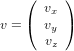

An object is then represented by a list of vertices.

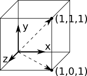

One thing you will often want to do is change the position, size or orientation of your object.

Translating an object is as easy as adding a constant vector (here named `d``) that specifies the displacement to all your objects' vertices (here named `v`).

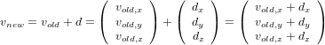

Scaling means multiplying the vertices by the desired ratio (here named `s`).

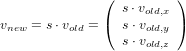

Rotating, stretching, shearing, or reflecting is more complicated and is achieved by multiplying the vertices by a transformation matrix (here named `T``).
A matrix is basically a table of coefficients that are multiplied by a vector to get a new vector, where each element is a linear combination of the multiplied
vector's elements.

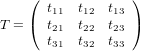

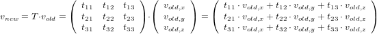

As an example, these are matrices rotating the vector around the coordinate system's x, y, and z axes. Arbitrary rotations can be composed by a combination of these.

.. image:: images/opengl-formula-rotation-matrix-x.png
    :align: center

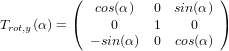

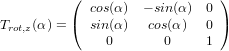

There is also one matrix that does not change a vector at all. It is called the `identity matrix` and consists of ones on the main diagonal and zeros elsewhere.

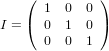

If you use a matrix to transform a vector, it is important that the matrix is written on the left side of the multiplication sign and the vector is on the right side. Also, the number of the matrice's columns needs to match the number of the vector's components. Otherwise the multiplication is mathematicaly invalid and math libraries may return unexpected results.

Keep in mind that transformations are not commutative, i.e. the result of a concatenation of transformations depends on their order. For example, it makes a difference whether you first rotate an object and then translate it or if you do it the other way around.

As it is more convenient (and even faster for OpenGL) to express all these operations as a single matrix vector multiplication, we extend our formalism to so called `homogeneous coordinates`. This also enables us to easily apply all kinds of `affine transformations` such as the projections, which we discussed in chapter 1.2. We basically add a fourth dimension, called a `scaling factor`, to our vertices. This might seem to complicate things, but you actually do not really have to pay attention to that factor as it is set to 1 by default and you will rarely change it yourself. All you need to do is declare your vertices with an additional element set to 1 (which is even often implied by default). (In this chapter we denote homogeneous coordinates by a hat on the variable names.)

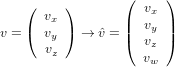

A transformation can then be written as follows:

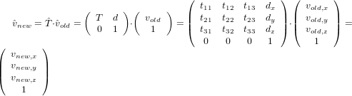

A series of transformations can be written as a series of matrix multiplications, and the resulting transformation can be stored in a single matrix.

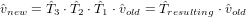

Coordinate Systems & Frame Concept
----------------------------------

How can we use this knowledge of linear algebra to put a three dimensional scene on screen? In this tutorial, we will use the most widely used concept called the `frame concept`. This pattern allows us to easily manage objects and viewers (including their positions and orientations) as well as the projection that we want to apply.

Imagine two coordinate systems: `A` and `B`. Coordinate system `B` originates from coordinate system `A` via a translation and a rotation that can be described by the following matrix:

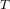

Then for each point defined as

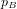

in coordinate system `B`, the corresponding coordinates of point

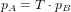

can be calculated,

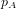

and

represent the same point in space but are only noted down differently.

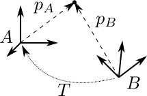

As for the frame concept, every instance of an object is bound to its own coordinate system (also referred to as its `frame`). The position and orientation of each object is then defined by placing the objects' frames inside the world's frame. The same applies to the viewer (or `camera`) with one difference: for simplicity, we actually do not place the viewer's frame inside the world's frame, but instead do it the other way around (i.e. placing the world's frame inside the viewer's frame).

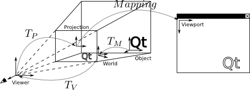

This means we define the position and rotation of every instance of an object in relation to the world's coordinate system. The matrix defined by these parameters, which allows us to calculate an object's vertices inside the world's coordinate system, is commonly called the `model matrix`. Subsequently, we move from world coordinates to viewer coordinates (commonly called `eye coordinates`) using a matrix called the `view matrix` in just the same way. After that, we apply the projection which transforms the object's vertices from viewer coordinates to the projection plane. This is done by a matrix called the `projection matrix`, which yields normalized device coordinates with x, y and z values ranging from -1 to +1 (The -1 and +1 values correspond to positions on the viewing volume's borders). OpenGL then maps all the object's points on this projection plane to the viewport that is shown on the screen.

Another matrix that is often used is the `model-view-projection matrix`. It is the concatenation of the aforementioned three matrices. The `model-view-projection matrix` is generally passed to the `vertex shader`, which multiplies this matrix by the object's vertices in order to calculate the projected form. You will learn about shaders in a later chapter.

The definition of these matrices has various advantages:

     * In the design phase, every object's model (i.e. its set of vertices) can be specified in relation to an arbitrary coordinate system (for example its center point).

     * The transformation process is divided into small steps, which are quite illustrative.

     * All the used transformation matrices can be calculated, stored, and combined efficiently.

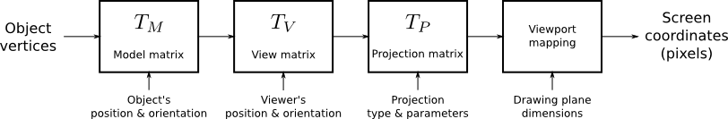

The figure above illustrates the steps that are required to yield proper screen coordinates from object vertices. Different kinds of transformations are applied in a certain order. You throw in some object vertices and, after some number crunching, you get the appropriate screen coordinates. In this figure, you can also easily see why this part of 3D programming is called the `transformation pipeline`.

The OpenGL Rendering Pipeline
-----------------------------

The OpenGL rendering pipeline is a high-level model, which describes the basic steps that OpenGL takes to render a picture on the screen. As the word `pipeline` suggests, all operations are applied in a particular order. That is, the rendering pipeline has a state that takes some inputs and returns an image to the screen.

The state of the rendering pipeline affects the behavior of its functions. As it is not practical to set options every time we want to draw something, we can set parameters beforehand. These parameters are then used in all subsequent function calls. For example, once you've defined a background color, that color is used to clear the screen until you change it to something else. You can also turn distinct capabilities such as depth testing or multisampling on and off. Therefore, to draw an overlay image on top of your screen, you would first draw the scene with depth testing enabled, then disable depth testing and draw the overlay elements, which will then always be rendered on top of the screen regardless of their distance from the viewer.

The inputs to the pipeline can be provided as single values or arrays. Most of the time these values will represent vertex positions, surface normals, textures, texture coordinates or color values.

The output of the rendering pipeline is the image that is displayed on the screen or written into memory. Such a memory segment is then called a framebuffer.

The figure below shows a simplified version of the pipeline. The elements that are not relevant to this tutorial were omitted (such as tesselation, geometry shading, and transform feedback).

The main program that resides inside the computer's memory, is executed by the CPU and displayed in the left column. The steps executed on the graphics card are listed in the column on the right.

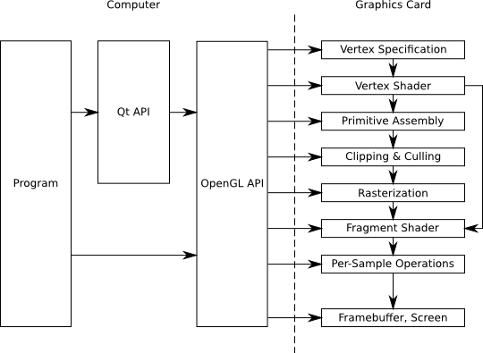

The graphics card has its own memory and a GPU just like a small powerful computer that is highly specialized in processing 3D data. Programs that run on the GPU are called shaders. Both the host computer and the graphics card can work independently, and you should keep both of them busy at the same time to take full advantage of hardware acceleration.

During `vertex specification`, the ordered list of vertices that gets streamed to the next step is set up. This data can either be sent by the program that is executed on the CPU one vertex after the other or read from GPU memory directly using buffer objects. However, repeatedly getting data via the system bus should be avoided whenever as it is faster for the graphics card to access its own memory.

The `vertex shader` processes data on a per vertex basis. It receives this stream of vertices along with additional attributes like associated texture coordinates or color values, and data such as the model-view-projection matrix. Its typical task is to transform vertices and to apply the projection matrix. Besides its interface to the immediately following stage, the vertex shader can also pass data to the fragment shader directly.

During the `primitive assembly` stage, the projected vertices are composed into primitives. These primitives can be triangles, lines, point sprites, or more complex entities like quadrics. The user decides which kind of primitive should be used when calling the draw function. For example, if the user wants to draw triangles, OpenGL takes groups of three vertices and converts them all into triangles.

During the `clipping and culling` stage, primitives that lie beyond the viewing volume, and therefore are not visible anyway, are removed. Also, if face culling is enabled, every primitive that does not show its front side (but its reverse side instead) is removed. This step effectively contributes to performance.

The `rasterisation` stage yields so called `fragments`. These fragments correspond to pixels on the screen. Depending on the user's choice, for each primitive, a set of fragments may be created. You may either fill the whole primitive with (usually colored) fragments, or only generate its outlines (for example, to render a wireframe model).

Each fragment is then processed by the `fragment shader`. The most important output of the fragment shader is the fragment's color value. Texture mapping and lighting are usually applied during this step. Both the program running on the CPU and the vertex shader can pass data to it. Obviously it also has access to the texture buffer. Because there are usually a lot of fragments in between a few vertices, values sent by the vertex shader are generally interpolated. Whenever possible, computational intensive calculations should be implemented in the vertex instead of in the fragment shader as there are usually many more fragments to compute than vertices.

The final stage, `per-sample operations`, applies several tests to decide which fragments should actually be written to the framebuffer (depth test, masking, and so on). After this, blending occurs and the final image is stored in the framebuffer.

OpenGL API
----------

This chapter will explain the conventions used in OpenGL. Although we will try to use Qt's abstraction to the OpenGL API wherever possible, we will still need to call some of the OpenGL functions directly. The examples will introduce you to the required functions.

The OpenGL API uses its own data types to improve portability and readability. These types are guaranteed to hava a minimum range and precision on every platform.

    .. list-table::
        :widths: 20 80
        :header-rows: 1
        :stub-columns: 0

        * - Type
          - Description
        * - *GLenum*
          - Indicates that one of OpenGL's preprocessor definitions is expected.
        * - *GLboolean*
          - Used for boolean values.
        * - *GLbitfield*
          - Used for bitfields.
        * - *GLvoid*
          - sed to pass pointers.
        * - *GLbyte*
          - 1-byte signed integer.
        * - *GLshort*
          - GLshort 2-byte signed integer.
        * - *GLint*
          - 4-byte signed integer.
        * - *GLubyte*
          - 1-byte unsigned integer.
        * - *GLushort*
          - 2-byte unsigned integer.
        * - *GLuint*
          - 4-byte unsigned integer.
        * - *GLsizei*
          - Used for sizes.
        * - *GLfloat*
          - Single precision floating point number.
        * - *GLclampf*
          - Single precision floating point number ranging from 0 to 1.
        * - *GLdouble*
          - Double precision floating point number.
        * - *GLclampd*
          - Double precision floating point number ranging from 0 to 1.

OpenGL's various preprocessor definitions are prefixed with GL_*. Its functions begin with *gl*. For example, a
function that triggers the rendering process is declared as void glDrawArrays(GLenum mode, GLint first, GLsizei count)*.

The OpenGL Shading language
---------------------------

As we have already learned, programming shaders is one of the core requirements when using OpenGL. Shader programs are written in a high-level language called `The OpenGL Shading Language (GLSL)`, which is a language very similar to C. To install a shader program, the shader source code has to be sent to the graphics card as a string, where the program then needs to be compiled and linked.

The language specifies various types suited to its needs.

.. list-table::
    :widths: 30 70
    :header-rows: 1
    :stub-columns: 0

    * - Type
      - Description
    * - *void*
      - No `function return` value or `empty parameter` list.
    * - *float*
      - Floating point value.
    * - *int*
      - Signed integer.
    * - *bool*
      - Boolean value.
    * - *vec2, vec3, vec4*
      - Floating point vector.
    * - *ivec2, ivec3, ivec4*
      - Signed integer vector.
    * - *bvec2, bvec3, bvec4*
      - Boolean vector.
    * - *mat2, mat3, mat4*
      - 2x2, 3x3, 4x4 floating point matrix.
    * - *sampler2D*
      - Access a 2D texture.
    * - *samplerCube*
      - Access cube mapped texture.

All these types may be combined using a C like structure or array.

To access the elements of a vector or a matrix, square brackets "[]" can be used (for example, vector[index] = value* and *matrix[column][row] = value;*). In addition to this, the vector's named components are accessible by using the field selector operator, "." (for example, *vector.x = xValue* and *vector.xy = vec2(xValue, yValue)*). The names *(x, y, z, w)* are used for positions. *(r, g, b, a)* and *(s, t, p, q)* are used to address color values and texture coordinates respectively.

To define the linkage between different shaders as well as between shaders and the application, GLSL provides variables with extra functionality by using storage qualifiers. These storage qualifiers need to be written before the type name during declaration.

    .. list-table::
        :widths: 40 60
        :header-rows: 1
        :stub-columns: 0

        * - Storage Qualifier
          - Description
        * - *none*
          - (default) Normal variable
        * - *const*
          - Compile-time constant
        * - *attribute*
          - Linkage between a vertex shader and OpenGL for per-vertex data. As the vertex shader is executed once for every vertex, this read-only value holds a new value every time it runs. It is used to pass vertices to the vertex shader for example.
        * - *uniform*
          - Linkage between a shader and OpenGL for per-rendering data. This read-only value does not change across the the whole rendering process. It is used to pass the model-view-projection matrix, for example as this parameter does not change for one object.
        * - *varying*
          - Linkage between the vertex shader and the fragment shader for interpolated data. This variable is used to pass values calculated in the vertex shader to the fragment shader. For this to work, the variables need to share the same name in both shaders. As there are usually a lot of fragments in between a few vertices, the data calculated by the vertex shader is (by default) interpolated. Such variables are often used as texture coordinates or lighting calculations.

To send data from the vertex shader to the fragment shader, the `out` variable of the vertex shader and the `in` variable of the fragment shader need to share the same name. As there are usually a lot of fragments in between a few vertices, the data calculated by the vertex shader is by default interpolated in a perspective correct manner. To enforce this behavior, the additional qualifier smooth* can be written before *in*. To use linear interpolation, the *noperspective* qualifier can be set. Interpolation can be completely disabled by using *flat*, which results in using the value output by the first vertex of the primitive for all the fragments in between a primitive.

This kind of variables are commonly called `varyings`, due to this interpolation and because in earlier versions of OpenGL this shader-to-shader linkage was achieved using a variable qualifier called     varying* instead of *in* and *out*.

Several built-in variables are used for communication with the pipeline. We will use the following:

    .. list-table::
        :widths: 40 60
        :header-rows: 1
        :stub-columns: 0

        * - Variable Name
          - Description
        * - *vec4 gl_Position*
          - The rasterization step needs to know the position of the transformed vertex. Therefore, the vertex shader needs to set this variable to the calculated value.
        * - *vec4 gl_FragColor*
          - This variable defines the fragment's RGBA color that will eventually be written to the frame buffer. This value can be set by the fragment shader.

When using multiple variable qualifiers, the order is <storage qualifier> <precision qualifier> <type> <name>*.

Just like in C, every GLSL program's entry point is the main()* function, but you are also allowed to declare your own functions. Functions in GLSL work quite differently than those in C. They do not have a return value. Instead, values are returned using a calling convention called `value-return`. For this purpose, GLSL uses parameter qualifiers, which must be written before the variable type during function declaration. These qualifiers specify if and when values are exchanged between a function and its caller.

    .. list-table::
        :widths: 40 60
        :header-rows: 1
        :stub-columns: 0

        * - Parameter qualifier
          - Description
        * - in
          - (default) On entry, the variable is initialized to the value passed by the caller.
        * - out
          - On return, the value of this variable is written into the variable passed by the caller. The variable is not initialized.
        * - inout
          - A combination of in and out. The variable is both initialized and returned.

There are actually many more qualifiers, but listing all of them is beyond the scope of this tutorial.

    The language also offers control structures such as if*, *switch*, *for*, *while*, and *do while*, including *break* and *return*. Additionally, in the fragment shader, you can call *discard* to exit the fragment shader and have that fragment ignored by the rest of the pipeline.

    GLSL also uses several preprocessor directives. The most notable one that you should use in all of your programs is, #version* followed by the three digits of the language version you want to use (e.g. *#version 330* for version 3.3). By default, OpenGL assumes version 1.1, which might not always be what you want.

    Although GLSL is very similar to C, there are still some restrictions you should be aware of:

       Functions may not be recursive.

       For-loops must have an iteration count that is known at compile time.

       There are no pointers.

       Array indexing is only possible with constant indices.

       Type casting is only possible using constructors (for example, *myFloat = float(myInt);*).

.. note:: The scene you want to render may be so complex that it has thousands of vertices and millions of fragments. This is why modern graphics cards are equipped with several stream processing units, each of which executes one vertex shader or fragment shader at a time. Because all vertices and fragments are processed in parallel, there is no way for the shader to query the properties of another vertex or fragment.
