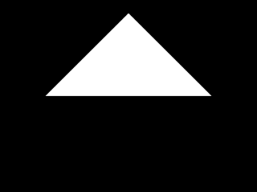
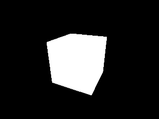
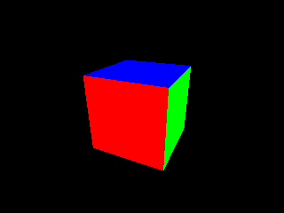
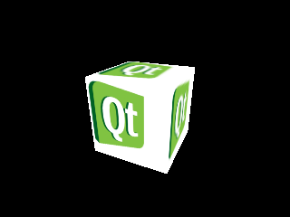
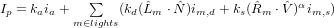

..
    ---------------------------------------------------------------------------
    Copyright (C) 2012 Digia Plc and/or its subsidiary(-ies).
    All rights reserved.
    This work, unless otherwise expressly stated, is licensed under a
    Creative Commons Attribution-ShareAlike 2.5.
    The full license document is available from
    http://creativecommons.org/licenses/by-sa/2.5/legalcode .
    ---------------------------------------------------------------------------

Using OpenGL in your Qt Application
===================================

Qt provides a widget called `QGLWidget` for rendering OpenGL Graphics, which enables you to easily integrate OpenGL into your Qt application. It is subclassed and used like any other QWidget and is cross platform. You usually reimplement the following three virtual methods:

     `QGLWidget::initializeGL()` - sets up the OpenGL rendering context. It is called once before the first time `QGLWidget::resizeGL()` or `QGLWidget::paintGL()` are called.
     `QGLWidget::resizeGL()` - gets called whenever the `QGLWidget` is resized, and after initialization. This method is generally used for setting up the viewport and the projection.
     `QGLWidget::paintGL()` - renders the OpenGL scene. It is comparable to `QWidget::paint()`.

Qt also offers a cross platform abstraction for shader programs called `QGLShaderProgram`. This class facilitates the process of compiling and linking the shader programs as well as switching between different shaders.

.. note:: You might need to adapt the versions set in the example source codes to those supported by your system.

Hello OpenGL
------------

We are beginning with a small `Hello World` example that will have our graphics card render a simple triangle. For this purpose we subclass `QGLWidget` in order to obtain an OpenGL rendering context and write a simple vertex and fragment shader.

This example will confirm if we have set up our development environment properly and if OpenGL is running on our target system.

.. Note:: The source code related to this section is located in `examples/hello-opengl/` directory.

First of all, we need to tell qmake to use the `QtOpenGL` module. So we add:

.. code-block:: js

    QT += opengl

The `main()` function only serves the purpose of instantiating and showing our `QGLWidget` subclass.

.. literalinclude:: src/examples/hello-opengl/main.cpp
    :language: cpp
    :start-after: //! [0]
    :end-before: //! [0]

Our OpenGL widget class is defined as follows:

We want the widget to be a subclass of `QGLWidget`. Because we might later be using signals and slots, we invoke the `Q_OBJECT` macro. Additionally we reimplement `QWidget::minimumSizeHint()` and `QWidget::sizeHint()` to set reasonable default sizes.

To call the usual OpenGL rendering commands, we reimplement the three virtual functions `GLWidget::initializeGL()`, `QGLWidget::resizeGL()`, and `QGLWidget::paintGL()`.

We also need some member variables. `pMatrix` is a `QMatrix4x4` that keeps the projection part of the transformation pipeline. To manage the shaders, we will use a `QGLShaderProgram` we named `shaderProgram`. `vertices` is a `QVector` made of `QVector3Ds` that stores the triangle's vertices. Although the vertex shader will expect us to send homogeneous coordinates, we can use 3D vectors, because the OpenGL pipeline will automatically set the fourth coordinate to the default value of 1.

.. literalinclude:: src/examples/hello-opengl/glwidget.h
    :language: cpp
    :start-after: //! [0]
    :end-before: //! [0]

Now that we have defined our widget, we can finally talk about the implementation.

The constructor's initializer list calls `QGLWidget's` constructor passing a `QGLFormat` object.
This can be used to set the capabilities of the OpenGL rendering context such as double buffering or multisampling. We are fine with the default values so we could as well have omitted the `QLFormat`. Qt will try to acquire a rendering context as close as possible to what we want.

Then we reimplement `QWidget::sizeHint()` to set a reasonable default size for the widget.

.. literalinclude:: src/examples/hello-opengl/glwidget.cpp
    :language: cpp
    :start-after: //! [0]
    :end-before: //! [0]

The `QGLWidget::initializeGL()` method gets called once when the OpenGL context is created. We use this function to set the behavior of the rendering context and to build the
shader programs.

If we want to render 3D images, we need to enable depth testing. This is one of the tests that can be performed during the per-sample-operations stage. It will cause OpenGL to only display the fragments nearest to the camera when primitives overlap. Although we do not need this capability since we only want to show a plane triangle, we will need this setting in our other examples. If you've omitted this statement, you might see objects in the back popping through objects in the front depending on the order the primitives are rendered.
Deactivating this capability is useful if you want to draw an overlay image on top of the screen.

As an easy way to significantly improve the performance of a 3D application, we also enable face culling. This tells OpenGL to only render primitives that show their front side. The front side is defined by the order of the triangle's vertices. You can tell what side of the triangle you are seeing by looking at its corners. If the triangle's corners are specified in a counterclockwise order, this means that the front of the triangle is the side facing you. For all triangles that are not facing the camera, the fragment processing stage can be omited.

Then we set the background color using `QGLWidget::qglClearColor()`. It is a function that
calls OpenGL's `glClearColor(GLclampf red, GLclampf green, GLclampf blue, GLclampf apha)` but has the advantage of allowing any color Qt understands to be passed.
The specified color will then be used in all subsequent calls to `glClear(GLbitfield mask)`.

In the following section we are setting up the shaders. We pass the source codes of the shaders to the QGLShaderProgram, compile and link them, and bind the program to the current OpenGL rendering context.

Shader programs need to be supplied as source codes. We can use `QGLShaderProgram::addShaderFromSourceFile()` to have Qt handle the compilation. This function compiles the source code as the specified shader type and adds it to the shader program. If an error occurs, the function returns `false`, and we can access the compilation errors and warnings using `QGLShaderProgram::log()`. Errors will be automatically printed to the standard error output if we run the program in debug mode.

After the compilation, we still need to link the programs using `QGLShaderProgram::link()`. We can again check for errors and access the errors and warnings using `QGLShaderProgram::log()`.

The shaders are then ready to be bound to the rendering context using `QGLShaderProgram::bind()`. Binding the program to the context means enabling it in the graphics pipeline. After this is done, every vertex that is passed to the graphics pipeline will be processed by these shaders until we call `QGLShaderProgram::release()` to disable them or a different shader program is bound.

Binding and releasing a program can be done several times during the rendering process,
which means several vertex and fragment shaders can be used for different objects in the
scene. We will therefore use these functions in the `QGLWidget::paintGL()` function.

Last but not least, we set up the triangles' vertices. Note that we've defined the triangle with the front side pointing to the positive z direction. Having face culling enabled, we can then see this object if we look at it from viewer positions with a z value greater than this object's z value.

.. literalinclude:: src/examples/hello-opengl/glwidget.cpp
    :language: cpp
    :start-after: //! [1]
    :end-before: //! [1]

Now let's take a look at the shaders we will use in this example.

The vertex shader only calculates the final projection of each vertex by multiplying the
vertex with the model-view-projection matrix.

It needs to read two input variables. The first input is the model-view-projection matrix. It is a 4x4 matrix, that only changes once per object and is therefore declared as a `uniform mat4`. We've named it `mvpMatrix`. The second variable is the actual vertex that the shader is processing. As the shader reads a new value every time it is executed, the vertex variable needs to be declared as an `attribute vec4`. We've named this variable `vertex`.

In the `main()` function, we simply calculate the resulting position that is sent to the
rasterization stage using built in matrix vector multiplication.

.. literalinclude:: src/examples/hello-opengl/vertexShader.vsh
    :language: cpp
    :start-after: //! [0]
    :end-before: //! [0]

The fragment shader simply displays a colored pixel for each fragment it is executed on.

The output of the fragment shader is the value written to the frame buffer. We called this variable `fragColor`. It is an instance of `vec4` with one element for the red, green, and blue color value, and one element for the alpha value.

We want to use the same plain color for each pixel. Therefore we declare an input variable called `color`, which is a `uniform vec4`.

The `main()` function then sets the built in `hl_FragColor` output variable to this value.

.. literalinclude:: src/examples/hello-opengl/fragmentShader.fsh
    :language: cpp
    :start-after: //! [0]
    :end-before: //! [0]

The reimplemented `QGLWidget::resizeGL()` method is called whenever the widget is resized. This is why we use this function to set up the projection matrix and the viewport.

After we had checked the widget's height to prevent a division by zero, we set it to a matrix that does the perspective projection. Luckily we do not have to calculate it ourselves. We can use one of the many useful methods of `QMatrix4x4`, namely `QMatrix4x4::perspective()`, which does exactly what we need. This method multiplies its `QMatrix4x4` instance with a projection matrix that is specified by the angle of the field of view, its aspect ratio and the clipping regions of the near and far planes. The matrix we get using this function resembles the projection of a camera that is sitting in the origin of the world coordinate system looking towards the world's negative z direction with the world's x axis pointing to the right side and the y axis pointing upwards. The fact that this function alters its instance explains the need to first initialize it to an identity matrix (a matrix that, if it is applied as a transformation, does not change a vector at all).

Next we set up the OpenGL viewport. The viewport defines the region of the widget that the result of the projection is mapped to. This mapping transforms the normalized coordinates on the aforementioned camera's film to pixel coordinates within the `QGLWidget`. To avoid distortion, the aspect ratio of the viewport should match the aspect ratio of the projection.

.. literalinclude:: src/examples/hello-opengl/glwidget.cpp
    :language: cpp
    :start-after: //! [2]
    :end-before: //! [2]

Finally, we have OpenGL draw the triangle in the `QGLWidget::paintGL()` method.

The first thing we do is clear the screen using `glClear(GLbitfield mask)`. If this OpenGL function is called with the `GL_COLOR_BUFFER_BIT` set, it fills the color buffer with the color set by `glClearColor(GLclampf red, GLclampf green, GLclampf blue, GLclampf aplha)`. Setting the `GL_DEPTH_BUFFER_BIT` tells OpenGL to clear the depth buffer, which is used for the depth test and stores the distance of rendered pixels. We usually need to clear both buffers, and therefore, we set both bits.

As we already know, the model-view-projection matrix that is used by the vertex shader is a concatenation of the model matrix, the view matrix and the projection matrix. Just like for
the projection matrix, we also use the `QMatrix4x4` class to handle the other two
transformations. Although we do not want to use them in this basic example, we already introduce them here to clarify their use. We use them to calculate the model-view-projection matrix, but leave them initialized to the identity matrix. This means we do not move or rotate the triangle's frame and also leave the camera unchanged, located in the origin of the world coordinate system.

The rendering can now be triggered by calling the OpenGL function `glDrawArrays(GLenum mode, GLint first, GLsizei count)`. But before we can do that, we need to bind the shaders and hand over all the uniforms and attributes they need.

In native OpenGL the programmer would first have to query the id (called `location`) of each input variable using the verbatim variable name as it is typed in the shader source code
and then set its value using this id and a type OpenGL understands. `QGLShaderProgram`
instead offers a huge set of overloaded functions for this purpose which allow you to
address an input variable using either its `location` or its name. These functions can also
automatically convert the variable type from Qt types to OpenGL types.

We set the uniform values for both shaders using `QGLShaderProgram::setUniformValue()`
by passing its name. The vertex shader's uniform  `Matrix` is calculated by multiplying its
three components. The color of the triangle is set using a `QColor` instance that will
automatically be converted to a `vec4` for us.

To tell OpenGL where to find the stream of vertices, we call
QGLShaderProgram::setAttributeArray() and pass the QVector::constData() pointer. Setting
attribute arrays works in the same way as setting uniform values, but there's one difference:
we additionally need to explicitly enable the attribute array using
QGLShaderProgram::enableAttributeArray(). If we did not do this, OpenGL would assume
that we've assigned a single value instead of an array.

Finally we call `glDrawArrays(GLenum mode, GLint first, GLsizei count)` to do the
rendering. It is used to start rendering a sequence of geometry primitives using the current
configuration. We pass `GL_TRIANGLES` as the first parameter to tell OpenGL that each of the three vertices form a triangle. The second parameter specifies the starting index within the attribute arrays and the third parameter is the number of indices to be rendered.

Note that if you later want to draw more than one object, you only need to repeat all of the
steps (except for clearing the screen, of course) you took in this method for each new object.

.. literalinclude:: src/examples/hello-opengl/glwidget.cpp
    :language: cpp
    :start-after: //! [3]
    :end-before: //! [3]

You should now see a white triangle on black background after compiling and running this program.

Rendering in 3D
---------------

A white triangle on black background is not very interesting and also not 3D, but now that we have a running basis, we can extend it to create a real 3D application.
In this example, we will render a more complex object and implement the functionality for
interactively exploring our scene.

.. Note:: The source code related to this section is located in `examples/rendering-in-3d/` directory.

Just as with any `QWidget` subclass, we can use Qt's event system to handle user input. We
want to be able to view the scene in the same way we would explore a globe. By dragging
the mouse across the widget, we want to change the angle that we look from. The distance to
the scene shall change if we turn the mouse's scroll wheel.

For this functionality, we reimplement `QWidget::mousePressEvent(),
QWidget::mouseMoveEvent()`, and `QWidget::wheelEvent()`. The new member variables `alpha, beta` and `distance` hold the parameters of the view point, and `lastMousePosition` helps us track mouse movement.

.. code-block:: cpp

    class GlWidget : public QGLWidget
    {
        ...

    protected:
        ...

        void mousePressEvent(QMouseEvent *event);
        void mouseMoveEvent(QMouseEvent *event);
        void wheelEvent(QWheelEvent *event);

    private:
        ...

        double alpha;
        double beta;
        double distance;
        QPoint lastMousePosition;
    };

The most important new thing in this example is the employment of the view matrix. Again,
we do not calculate this matrix ourselves but use the `QMatrix4x4::lookAt()` function to
obtain this matrix. This function takes the position of the viewer, the point the viewer is
looking at and a vector that defines the up direction. We want the viewer to look at the
world's origin and start with a position that is located at a certain distance (`distance`) along the z axis with the up direction being the y axis. We then rotate these two vertices using a transformation matrix. First we rotate them (and their coordinate system) by the `alpha` angle around their new rotated x axis, which tilts the camera. Note that you can also illustrate the transformation the other way around: first we rotate the vertices by the `beta` angle around the world's x axis and then we rotate them by the `alpha` angle around the world's y axis.

.. code-block:: cpp

    void GlWidget::paintGL()
    {
        ...
        QMatrix4x4 cameraTransformation;
        cameraTransformation.rotate(alpha, 0, 1, 0);
        cameraTransformation.rotate(beta, 1, 0, 0);

        QVector3D cameraPosition = cameraTransformation * QVector3D(0, 0, distance);
        QVector3D cameraUpDirection = cameraTransformation * QVector3D(0, 1, 0);

        vMatrix.lookAt(cameraPosition, QVector3D(0, 0, 0), cameraUpDirection);
        ...
    }

These three parameters need to be initialized in the constructor and, to account for the user's input, we then change them in the corresponding event handlers.

.. literalinclude:: src/examples/rendering-in-3d/glwidget.cpp
    :language: cpp
    :start-after: //! [0]
    :end-before: //! [0]

In the `QWidget::mousePressEvent()`, we store the mouse pointer's initial position to be able
to track the movement. In the `QGLWidget::mouseMoveEvent()`, we calculate the pointers
change and adapt the angles `alpha` and `beta`. Since the view point's parameters have
changed, we then call `QGLWidget::updateGL()` to trigger an update of the rendering context.

.. literalinclude:: src/examples/rendering-in-3d/glwidget.cpp
    :language: cpp
    :start-after: //! [6]
    :end-before: //! [6]

In the `QGLWidget::wheelEvent()`, we either increase or decrease the viewers distance by
10% and update the rendering again.

.. literalinclude:: src/examples/rendering-in-3d/glwidget.cpp
    :language: cpp
    :start-after: //! [7]
    :end-before: //! [7]

In order to finish this example, we only need to change our list of vertices to form a cube.

.. code-block:: cpp

    void GlWidget::initializeGL()
    {
        ...
        vertices << QVector3D(-0.5, -0.5,  0.5) << QVector3D( 0.5, -0.5,  0.5) << QVector3D( 0.5,  0.5,  0.5) // Front
                 << QVector3D( 0.5,  0.5,  0.5) << QVector3D(-0.5,  0.5,  0.5) << QVector3D(-0.5, -0.5,  0.5)
                 << QVector3D( 0.5, -0.5, -0.5) << QVector3D(-0.5, -0.5, -0.5) << QVector3D(-0.5,  0.5, -0.5) // Back
                 << QVector3D(-0.5,  0.5, -0.5) << QVector3D( 0.5,  0.5, -0.5) << QVector3D( 0.5, -0.5, -0.5)
                 << QVector3D(-0.5, -0.5, -0.5) << QVector3D(-0.5, -0.5,  0.5) << QVector3D(-0.5,  0.5,  0.5) // Left
                 << QVector3D(-0.5,  0.5,  0.5) << QVector3D(-0.5,  0.5, -0.5) << QVector3D(-0.5, -0.5, -0.5)
                 << QVector3D( 0.5, -0.5,  0.5) << QVector3D( 0.5, -0.5, -0.5) << QVector3D( 0.5,  0.5, -0.5) // Right
                 << QVector3D( 0.5,  0.5, -0.5) << QVector3D( 0.5,  0.5,  0.5) << QVector3D( 0.5, -0.5,  0.5)
                 << QVector3D(-0.5,  0.5,  0.5) << QVector3D( 0.5,  0.5,  0.5) << QVector3D( 0.5,  0.5, -0.5) // Top
                 << QVector3D( 0.5,  0.5, -0.5) << QVector3D(-0.5,  0.5, -0.5) << QVector3D(-0.5,  0.5,  0.5)
                 << QVector3D(-0.5, -0.5, -0.5) << QVector3D( 0.5, -0.5, -0.5) << QVector3D( 0.5, -0.5,  0.5) // Bottom
                 << QVector3D( 0.5, -0.5,  0.5) << QVector3D(-0.5, -0.5,  0.5) << QVector3D(-0.5, -0.5, -0.5);
    }

If you now compile and run this program, you will see a white cube that can be rotated
using the mouse. Since each of its six sides is painted in the same plane color, depth is not very visible. We will work on this in the next example.

Coloring
--------

In this example, we want to color each side of the cube in different colors to enhance the
illusion of three dimensionality. To archive this, we will extend our shaders in a way that
will allow us to specify a single color for each vertex and use the interpolation of varyings to generate the fragment's colors.
This example will show you how to communicate data from the vertex shader over to the
fragment shader.

.. Note:: The source code related to this section is located in `examples/coloring/` directory

To tell the shaders about the colors, we specify a color value for each vertex as an attribute array for the vertex shader. So on each run of the shader, it will read a new value for both the vertex attribute and the color attribute.

As the fragment's color eventually has to be set in the fragment shader and not in the vertex shader, we pass the color value over to it. To do this, we need to declare an equally named varying in both shaders. We called this varying `varyingColor`.
If the fragment shader is now run for each fragment between the three vertices of a triangle, the value read by the shader is calculated by an interpolation of the three corners' values. This means that if we specify the same color for the three vertices of a triangle, OpenGL will paint a plane colored triangle. If we specify different colors, OpenGL will smoothly blend between those values.

In the vertex shader's main function, we only need to set the varying to the color value.

.. literalinclude:: src/examples/coloring/vertexShader.vsh
    :language: cpp
    :start-after: //! [0]
    :end-before: //! [0]

In the fragment shader's main function, we set the `gl_FragColor` variable to the color received.

.. literalinclude:: src/examples/coloring/fragmentShader.fsh
    :language: cpp
    :start-after: //! [0]
    :end-before: //! [0]

Of course we still need to imploy a new structure to store the color values and send them to
the shaders in the `QGLWidget::paintGL()` method. But this should be very straightforward
as we have already done all of this for the `vertices` attribute array in just the same manner.

.. code-block:: cpp

    // glwidget.h

    class GlWidget : public QGLWidget
    {
        ...

        private:
            ...

            QVector<QVector3D> colors;
    };

    // glwidget.cpp

    void GlWidget::paintGL()
    {
        ...

        shaderProgram.bind();

        shaderProgram.setUniformValue("mvpMatrix", pMatrix * vMatrix * mMatrix);

        shaderProgram.setAttributeArray("vertex", vertices.constData());
        shaderProgram.enableAttributeArray("vertex");

        shaderProgram.setAttributeArray("color", colors.constData());
        shaderProgram.enableAttributeArray("color");

        glDrawArrays(GL_TRIANGLES, 0, vertices.size());

        shaderProgram.disableAttributeArray("vertex");

        shaderProgram.disableAttributeArray("color");

        shaderProgram.release();
    }

There is only one little inconvenience when switching from a color uniform to a color
attribute array. Unfortunately `QGLShaderProgram::setAttributeArray()` does not support the
`QColor` type, so we need to store the colors as a `QVector3D` (or a `QVector4D`, if you want
to set the alpha value to change the opacity). Valid color values range from 0 to 1. As we want to color each of the cube's faces in a plain color, we set the color value of each face's vertices to the same value.

.. code-block:: cpp

    void GlWidget::initializeGL()
    {
        ...

        colors << QVector3D(1, 0, 0) << QVector3D(1, 0, 0) << QVector3D(1, 0, 0) // Front
               << QVector3D(1, 0, 0) << QVector3D(1, 0, 0) << QVector3D(1, 0, 0)
               << QVector3D(1, 0, 0) << QVector3D(1, 0, 0) << QVector3D(1, 0, 0) // Back
               << QVector3D(1, 0, 0) << QVector3D(1, 0, 0) << QVector3D(1, 0, 0)
               << QVector3D(0, 1, 0) << QVector3D(0, 1, 0) << QVector3D(0, 1, 0) // Left
               << QVector3D(0, 1, 0) << QVector3D(0, 1, 0) << QVector3D(0, 1, 0)
               << QVector3D(0, 1, 0) << QVector3D(0, 1, 0) << QVector3D(0, 1, 0) // Right
               << QVector3D(0, 1, 0) << QVector3D(0, 1, 0) << QVector3D(0, 1, 0)
               << QVector3D(0, 0, 1) << QVector3D(0, 0, 1) << QVector3D(0, 0, 1) // Top
               << QVector3D(0, 0, 1) << QVector3D(0, 0, 1) << QVector3D(0, 0, 1)
               << QVector3D(0, 0, 1) << QVector3D(0, 0, 1) << QVector3D(0, 0, 1) // Bottom
               << QVector3D(0, 0, 1) << QVector3D(0, 0, 1) << QVector3D(0, 0, 1);
    }

Our cube now has its six sides colored differently.

Texture Mapping
---------------

Texture mapping is a very important concept in 3D computer graphics. It is the application
of images on top of a model's surfaces and is essential for creating a nice 3D scene.

You can do more with textures than just mapping them to a surface. Essentially a texture is a
two dimensional array containing color values so not only can you pass colors to your
shaders, but an array of any data you want. However, in this example we will use a classic
2D texture to map an image on top of the cube we created in the previous examples.

.. Note:: The source code related to this section is located in `examples/texture-mapping/` directory

In order to map a texture to a primitive, we have to specify so-called     texture coordinates* that tell OpenGL which image coordinate is to be pinned to which vertex. Texture coordinates are instances of  `vec2` that are normalized to a range between 0 and 1. The origin of the texture coordinate system is in the lower left of an image, having the first axis pointing to the right side and the second axis pointing upwards (i.e. the lower left corner of an image is at `(0, 0)` and the upper right corner is at `(1, 1)`. Coordinate values higher than 1 are also allowed, causing the texture to wrap around by default.

The textures themselves are OpenGL objects stored in the graphics card's memory. They are
created using `glGenTextures(GLsizei n, GLuint     texture)` and deleted again with a call to `glDelereTextures(GLsizei n, const GLuint *texture)`. To identify textures, each
texture is assigned a texture ID during its creation. As with shader programs, they need to be bound to `glBindTexture(GLenum target, GLuint texture)` before they can be configured
and filled with data. We can use Qt's `QGLWidget::bindTexture()` to create the texture object.
Normally we would have to make sure that the image data is in a particular format,
according to the configuration of the texture object, but luckily `QGLWidget::bindTexture()`
also takes care of that.

OpenGL allows us to have several textures accessible to the shaders at the same time. For
this purpose, OpenGL uses so-called     texture units*. So before we can use a texture, we need
to bind it to one of the texture units identified by the enum `GL_TEXTUREi` (with i ranging from 0 to `GL_MAX_COMBINED_TEXTURE_UNITS -1`). To do this, we call `glActiveTexture(GLenum texture)` and bind the texture using `glBindTexture(GLenum target, GLuint texture)`.
Because we also need to call `glBindTexture(GLenum target, GLuint texture)` if we want
to add new textures or modify them, and binding a texture overwrites the the current active
texture unit, you should set the active texture unit to an invalid unit after setting it by calling  `glActiveTexture(0)`. This way several texture units can be configured at the same time. Note that texture units need to be used in an ascending order beginning with `GL_TEXTURE0`.

To access a texture in a shader to actually render it, we use the `texture2D(sampler2D sampler, vec2 coord)` function to query the color value at a certain texture coordinate. This function reads two parameters. The first parameter is of the type `sampler2D` and it refers to a texture unit. The second parameter is the texture coordinate that we want to access. To read from the texture unit `i` denoted by the enum `GL_TEXTUREi`, we have to pass the `GLuint` `i` as the uniform value.

With all of this theory we are now able to make our cube textured.

We replace the `vec4` color attribute and the corresponding varying with a `vec2` variable for the texture coordinates and forward this value to the fragment shader.

.. literalinclude:: src/examples/texture-mapping/vertexShader.vsh
    :language: cpp
    :start-after: //! [0]
    :end-before: //! [0]

In the fragment shader, we use `texture2D(sampler2D sampler, vec2 coord)` to look up
the right color value. The uniform `texture` of the type `sampler2D` chooses the texture unit and we use the interpolated values coming from the vertex shader for the texture coordinates.

.. literalinclude:: src/examples/texture-mapping/fragmentShader.fsh
    :language: cpp
    :start-after: //! [0]
    :end-before: //! [0]

In the `GlWidget` class declaration, we replace the previously used `colors` member with a
`QVector` made of `QVector2Ds` for the texture coordinates and add a member variable to
hold the texture object ID.

.. code-block:: cpp

    class GlWidget : public QGLWidget
    {
        ...

        private:
            ...

            QVector<QVector2D> textureCoordinates;
            GLuint texture;
            ...

    };

In the `QGLWidget::initializeGL()` reimplementation, we set up the texture coordinates and
also create the texture object. Each side will be covered with the whole square image that is contained in our resource file.

.. code-block:: cpp

    void GlWidget::initializeGL()
    {
        ...
        textureCoordinates << QVector2D(0, 0) << QVector2D(1, 0) << QVector2D(1, 1) // Front
                           << QVector2D(1, 1) << QVector2D(0, 1) << QVector2D(0, 0)
                           << QVector2D(0, 0) << QVector2D(1, 0) << QVector2D(1, 1) // Back
                           << QVector2D(1, 1) << QVector2D(0, 1) << QVector2D(0, 0)
                           << QVector2D(0, 0) << QVector2D(1, 0) << QVector2D(1, 1) // Left
                           << QVector2D(1, 1) << QVector2D(0, 1) << QVector2D(0, 0)
                           << QVector2D(0, 0) << QVector2D(1, 0) << QVector2D(1, 1) // Right
                           << QVector2D(1, 1) << QVector2D(0, 1) << QVector2D(0, 0)
                           << QVector2D(0, 0) << QVector2D(1, 0) << QVector2D(1, 1) // Top
                           << QVector2D(1, 1) << QVector2D(0, 1) << QVector2D(0, 0)
                           << QVector2D(0, 0) << QVector2D(1, 0) << QVector2D(1, 1) // Bottom
                           << QVector2D(1, 1) << QVector2D(0, 1) << QVector2D(0, 0);

        texture = bindTexture(QPixmap(":/texture.png"));
    }

In the `QGLWidget::paintGL()` method, we set the fragment shader's sampler2D uniform to
the first texture unit. Then we activate that unit, bind our texture object to it and after that deactivate it again to prevent us from accidentally overwriting this setting. And instead of passing the color attribute array, we pass the array containing the texture coordinates.

.. code-block:: cpp

    void GlWidget::paintGL()
    {
        ...

        shaderProgram.bind();

        shaderProgram.setUniformValue("mvpMatrix", pMatrix * vMatrix * mMatrix);

        shaderProgram.setUniformValue("texture", 0);

        //glActiveTexture(GL_TEXTURE0);
        glBindTexture(GL_TEXTURE_2D, texture);
        //glActiveTexture(0);

        shaderProgram.setAttributeArray("vertex", vertices.constData());
        shaderProgram.enableAttributeArray("vertex");

        shaderProgram.setAttributeArray("textureCoordinate", textureCoordinates.constData());
        shaderProgram.enableAttributeArray("textureCoordinate");

        glDrawArrays(GL_TRIANGLES, 0, vertices.size());

        shaderProgram.disableAttributeArray("vertex");

        shaderProgram.disableAttributeArray("textureCoordinate");

        shaderProgram.release();
    }

Our cube is now textured.

.. note:: The Windows OpenGL header file only includes functionality up to OpenGL version 1.1 and assumes that the programmer will obtain additional functionality on his own. This includes OpenGL API function calls as well as enums. The reason is that, because different OpenGL libraries exist, the programmer should request the library's function entry points at runtime.

Qt only defines the functionality required by its own OpenGL-related classes. `glActiveTexture(GLenum texture)` as well as the `GL_TEXTUREi` enums do not belong to this subset.

Several utility libraries exist to ease the definition of these functions (e.g. GLEW, GLEE, etc). We will define `glActiveTexture(GLenum texture)` and `GL_TEXTUREi` manually.

First we include the `glext.h` header file to set the missing enums and a few typedefs which will help us keep the code readable (since the version shipped with your compiler might be outdated, you may need to get the latest version from  `the OpenGL homepage <http://www.opengl.org>`_. Next we declare the function pointer, which we will use to call `glActiveTexture(GLenum texture)` using the included typedefs. To avoid confusing the linker, we use a different name than `glActiveTexture` and define a pre-processor macro which replaces calls to `glActiveTexture(GLenum texture)` with our own function:

.. literalinclude:: src/examples/texture-mapping/glwidget.cpp
    :language: cpp
    :start-after: //! [0]
    :end-before: //! [0]

In the `GlWidget::initializeGL()` function, we request this pointer using `PROC WINAPI wglGetProcAddress(LPCSTR lpszProc)`. This function reads the OpenGL API function's name and returns a pointer which we need to cast to the right type:

.. code-block:: cpp

    void GlWidget::initializeGL()
    {
        ...

        #ifdef WIN32
            glActiveTexture = (PFNGLACTIVETEXTUREPROC) wglGetProcAddress((LPCSTR) "glActiveTexture");
        #endif
        ...
    }

`glActiveTexture()` and `GL_TEXTUREi` can then be used on Windows.

Lighting
--------

The ability to write your own shader programs gives you the power to set up the kind of
lighting effect that best suits your needs. This may range from very basic and time saving
approaches to high quality ray tracing algorithms.

In this chapter, we will implement a technique called     Phong shading*, which is a popular
baseline shading method for many rendering applications. For each pixel on the surface of
an object, we will calculate the color intensity based on the position and color of the light source as well as the object's texture and its material properties.

To show the results, we will display the cube with a light source circling above it. The light source will be marked by a pyramid which we will render using the per-vertex color shader of one of the previous examples. So in this example, you will also see how to render a scene with multiple objects and different shader programs.

.. image:: images/opengl-example-lighting.png

.. Note:: The source code related to this section is located in `examples/lighting/` directory

Because we use two different objects and two different shader programs, we added prefixes
to the names. The cube is rendered using the `lightingShaderProgram`, for which we need an
additional storage that keeps the surface normal of each vertex (i.e. the vector, that is
perpendicular to the surface and has the size 1). The spotlight, on the other hand, is rendered using the `coloringShaderProgram`, which consists of a shader we developed earlier in this tutorial.

To track the position of the light source, we introduced a new member variable that holds its rotation. This value is periodically increased in the `timeout()` slot.

.. code-block:: cpp

    class GlWidget : public QGLWidget
    {
        ...

        private:
            QGLShaderProgram lightingShaderProgram;
            QVector<QVector3D> cubeVertices;
            QVector<QVector3D> cubeNormals;
            QVector<QVector2D> cubeTextureCoordinates;
            GLuint cubeTexture;
            QGLShaderProgram coloringShaderProgram;
            QVector<QVector3D> spotlightVertices;
            QVector<QVector3D> spotlightColors;
            double lightAngle;
        ...

        private Q_SLOTS:
            void timeout();
    };

The Phong reflection model assumes that the light reflected off an object (i.e. what you
actually see) consists of three components: diffuse reflection of rough surfaces, specular
highlights of glossy surfaces and an ambient term that sums up the small amounts of light
that get scattered about the entire scene.

For each light source in the scene, we define :math:`i_d` and :math:`i_s` as the intensities (RGB values) of the diffuse and the specular components. :math:`i_a` is defined as the ambient lighting component.

For each kind of surface (whether glossy, flat etc), we define the following parameters: :math:`k_d` and :math:`k_s` set the ratio of reflection of the diffuse and specular component, :math:`k_a` sets the ratio of the reflection of the ambient term respectively and :math:`\alpha` is a shininess constant that controls the size of the specular highlights.

The equation for computing the illumination of each surface point (fragment) is:

:math:`\hat{L}_m` is the normalized direction vector pointing from the fragment to the light source, :math:`\hat{N}` is the surface normal of this fragment, :math:`\hat{R}_m` is the direction of the light reflected at this point and :math:`\hat{V}` points from the fragment towards the viewer of the scene.

To obtain the vectors mentioned above, we calculate them for each vertex in the vertex shader and tell OpenGL to pass them as interpolated values to the fragment shader. In the fragment shader, we finally set the illumination of each point and combine it with the color value of the texture.

So in addition to passing vertex positions and the model-view-projection matrix to get the fragment's position, we also need to pass the surface normal of each vertex. To calculate the transformed cube's :math:`\hat{L}_m` and :math:`\hat{V}`, we need to know the model-view part of the transformation. To calculate the transformed :math:`\hat{N}`, we need to apply a matrix that transforms the surface normals. This extra matrix is needed because we only want the normals to be rotated according to the model-view matrix, but not to be translated.

This is the vertex shader's source code:

.. literalinclude:: src/examples/lighting/lightingVertexShader.vsh
    :language: cpp
    :start-after: //! [0]
    :end-before: //! [0]

The fragment shader is supplied with the light source's and the material's properties and the geometry data calculated by the vertex shader. It then sets the fragment's color value according to the above formula.

This is the fragment shaders source code:

.. literalinclude:: src/examples/lighting/lightingFragmentShader.fsh
    :language: cpp
    :start-after: //! [0]
    :end-before: //! [0]

In the `GLWidget::initiliazeGL()` method, we set up both shaders and prepare the attribute arrays of the cube and the spotlight. The only thing new here is the `QVector` made of
`QVector3Ds` that stores the surface normal of each of the cube's vertices.

.. code-block:: cpp

    void GlWidget::initializeGL()
    {
        ...

        lightingShaderProgram.addShaderFromSourceFile(QGLShader::Vertex, ":/lightingVertexShader.vsh");
        lightingShaderProgram.addShaderFromSourceFile(QGLShader::Fragment, ":/lightingFragmentShader.fsh");
        lightingShaderProgram.link();

        cubeVertices << QVector3D(-0.5, -0.5,  0.5) << QVector3D( 0.5, -0.5,  0.5) << QVector3D( 0.5,  0.5,  0.5) // Front
                     << QVector3D( 0.5,  0.5,  0.5) << QVector3D(-0.5,  0.5,  0.5) << QVector3D(-0.5, -0.5,  0.5)
                     << QVector3D( 0.5, -0.5, -0.5) << QVector3D(-0.5, -0.5, -0.5) << QVector3D(-0.5,  0.5, -0.5) // Back
                     << QVector3D(-0.5,  0.5, -0.5) << QVector3D( 0.5,  0.5, -0.5) << QVector3D( 0.5, -0.5, -0.5)
                     << QVector3D(-0.5, -0.5, -0.5) << QVector3D(-0.5, -0.5,  0.5) << QVector3D(-0.5,  0.5,  0.5) // Left
                     << QVector3D(-0.5,  0.5,  0.5) << QVector3D(-0.5,  0.5, -0.5) << QVector3D(-0.5, -0.5, -0.5)
                     << QVector3D( 0.5, -0.5,  0.5) << QVector3D( 0.5, -0.5, -0.5) << QVector3D( 0.5,  0.5, -0.5) // Right
                     << QVector3D( 0.5,  0.5, -0.5) << QVector3D( 0.5,  0.5,  0.5) << QVector3D( 0.5, -0.5,  0.5)
                     << QVector3D(-0.5,  0.5,  0.5) << QVector3D( 0.5,  0.5,  0.5) << QVector3D( 0.5,  0.5, -0.5) // Top
                     << QVector3D( 0.5,  0.5, -0.5) << QVector3D(-0.5,  0.5, -0.5) << QVector3D(-0.5,  0.5,  0.5)
                     << QVector3D(-0.5, -0.5, -0.5) << QVector3D( 0.5, -0.5, -0.5) << QVector3D( 0.5, -0.5,  0.5) // Bottom
                     << QVector3D( 0.5, -0.5,  0.5) << QVector3D(-0.5, -0.5,  0.5) << QVector3D(-0.5, -0.5, -0.5);
        cubeNormals << QVector3D( 0,  0,  1) << QVector3D( 0,  0,  1) << QVector3D( 0,  0,  1) // Front
                    << QVector3D( 0,  0,  1) << QVector3D( 0,  0,  1) << QVector3D( 0,  0,  1)
                    << QVector3D( 0,  0, -1) << QVector3D( 0,  0, -1) << QVector3D( 0,  0, -1) // Back
                    << QVector3D( 0,  0, -1) << QVector3D( 0,  0, -1) << QVector3D( 0,  0, -1)
                    << QVector3D(-1,  0,  0) << QVector3D(-1,  0,  0) << QVector3D(-1,  0,  0) // Left
                    << QVector3D(-1,  0,  0) << QVector3D(-1,  0,  0) << QVector3D(-1,  0,  0)
                    << QVector3D( 1,  0,  0) << QVector3D( 1,  0,  0) << QVector3D( 1,  0,  0) // Right
                    << QVector3D( 1,  0,  0) << QVector3D( 1,  0,  0) << QVector3D( 1,  0,  0)
                    << QVector3D( 0,  1,  0) << QVector3D( 0,  1,  0) << QVector3D( 0,  1,  0) // Top
                    << QVector3D( 0,  1,  0) << QVector3D( 0,  1,  0) << QVector3D( 0,  1,  0)
                    << QVector3D( 0, -1,  0) << QVector3D( 0, -1,  0) << QVector3D( 0, -1,  0) // Bottom
                    << QVector3D( 0, -1,  0) << QVector3D( 0, -1,  0) << QVector3D( 0, -1,  0);
        cubeTextureCoordinates << QVector2D(0, 0) << QVector2D(1, 0) << QVector2D(1, 1) // Front
                               << QVector2D(1, 1) << QVector2D(0, 1) << QVector2D(0, 0)
                               << QVector2D(0, 0) << QVector2D(1, 0) << QVector2D(1, 1) // Back
                               << QVector2D(1, 1) << QVector2D(0, 1) << QVector2D(0, 0)
                               << QVector2D(0, 0) << QVector2D(1, 0) << QVector2D(1, 1) // Left
                               << QVector2D(1, 1) << QVector2D(0, 1) << QVector2D(0, 0)
                               << QVector2D(0, 0) << QVector2D(1, 0) << QVector2D(1, 1) // Right
                               << QVector2D(1, 1) << QVector2D(0, 1) << QVector2D(0, 0)
                               << QVector2D(0, 0) << QVector2D(1, 0) << QVector2D(1, 1) // Top
                               << QVector2D(1, 1) << QVector2D(0, 1) << QVector2D(0, 0)
                               << QVector2D(0, 0) << QVector2D(1, 0) << QVector2D(1, 1) // Bottom
                               << QVector2D(1, 1) << QVector2D(0, 1) << QVector2D(0, 0);

        cubeTexture = bindTexture(QPixmap(":/cubeTexture.png"));

        coloringShaderProgram.addShaderFromSourceFile(QGLShader::Vertex, ":/coloringVertexShader.vsh");
        coloringShaderProgram.addShaderFromSourceFile(QGLShader::Fragment, ":/coloringFragmentShader.fsh");
        coloringShaderProgram.link();

        spotlightVertices << QVector3D(   0,    1,    0) << QVector3D(-0.5,    0,  0.5) << QVector3D( 0.5,    0,  0.5) // Front
                          << QVector3D(   0,    1,    0) << QVector3D( 0.5,    0, -0.5) << QVector3D(-0.5,    0, -0.5) // Back
                          << QVector3D(   0,    1,    0) << QVector3D(-0.5,    0, -0.5) << QVector3D(-0.5,    0,  0.5) // Left
                          << QVector3D(   0,    1,    0) << QVector3D( 0.5,    0,  0.5) << QVector3D( 0.5,    0, -0.5) // Right
                          << QVector3D(-0.5,    0, -0.5) << QVector3D( 0.5,    0, -0.5) << QVector3D( 0.5,    0,  0.5) // Bottom
                          << QVector3D( 0.5,    0,  0.5) << QVector3D(-0.5,    0,  0.5) << QVector3D(-0.5,    0, -0.5);
        spotlightColors << QVector3D(0.2, 0.2, 0.2) << QVector3D(0.2, 0.2, 0.2) << QVector3D(0.2, 0.2, 0.2) // Front
                        << QVector3D(0.2, 0.2, 0.2) << QVector3D(0.2, 0.2, 0.2) << QVector3D(0.2, 0.2, 0.2) // Back
                        << QVector3D(0.2, 0.2, 0.2) << QVector3D(0.2, 0.2, 0.2) << QVector3D(0.2, 0.2, 0.2) // Left
                        << QVector3D(0.2, 0.2, 0.2) << QVector3D(0.2, 0.2, 0.2) << QVector3D(0.2, 0.2, 0.2) // Right
                        << QVector3D(  1,   1,   1) << QVector3D(  1,   1,   1) << QVector3D(  1,   1,   1) // Bottom
                        << QVector3D(  1,   1,   1) << QVector3D(  1,   1,   1) << QVector3D(  1,   1,   1);
    }

After clearing the screen and calculating the view matrix (which is the same for both
objects) in the `GlWidget::painGL()` method, we first render the cube using the lighting shaders and then we render the spotlight using the coloring shader.

Because we want to keep the cube's origin aligned with the world's origin, we leave the
model matrix `mMatrix` set to an identity matrix. Then we calculate the model-view matrix,
which we also need to send to the lighting vertex shader, and extract the normal matrix with
Qt's `QMatrix4x4::normal()` method. As we have already stated, this matrix will transform the
surface normals of our cube from model coordinates into viewer coordinates. After that, we
calculate the position of the light source in world coordinates according to the angle.

We can now render the cube. We bind the lighting shader program, set the uniforms and
texture units, set and enable the attribute arrays, trigger the rendering, and afterwards disable the attribute arrays and release the program. For the light source's and the material's properties, we set values that give us a glossy looking surface.

Next we render the spotlight.

Because we want to move the spotlight to the same place as the light source, we need to
modify its model matrix. First we restore the identity matrix (actually we did not modify the model matrix before so it still is set to the identity matrix anyway). Then we move the
spotlight to the light sources position. Now we still want to rotate it since it looks nicer if it faces our cube. We therefore apply two rotation matrices on top. Because the pyramid that represents our lightspot is still to big to fit into our scene nicely, we scale it down to a tenth of its original size.

Now we follow the usual rendering procedure again, this time using the `coloringShaderProgram` and the spotlight data. Thanks to depth testing, the new object will
be integrated seamlessly into our existing scene.

.. code-block:: cpp

    void GlWidget::paintGL()
    {
        ...

        mMatrix.setToIdentity();

        QMatrix4x4 mvMatrix;
        mvMatrix = vMatrix * mMatrix;

        QMatrix3x3 normalMatrix;
        normalMatrix = mvMatrix.normalMatrix();

        QMatrix4x4 lightTransformation;
        lightTransformation.rotate(lightAngle, 0, 1, 0);

        QVector3D lightPosition = lightTransformation * QVector3D(0, 1, 1);

        lightingShaderProgram.bind();

        lightingShaderProgram.setUniformValue("mvpMatrix", pMatrix * mvMatrix);
        lightingShaderProgram.setUniformValue("mvMatrix", mvMatrix);
        lightingShaderProgram.setUniformValue("normalMatrix", normalMatrix);
        lightingShaderProgram.setUniformValue("lightPosition", vMatrix * lightPosition);

        lightingShaderProgram.setUniformValue("ambientColor", QColor(32, 32, 32));
        lightingShaderProgram.setUniformValue("diffuseColor", QColor(128, 128, 128));
        lightingShaderProgram.setUniformValue("specularColor", QColor(255, 255, 255));
        lightingShaderProgram.setUniformValue("ambientReflection", (GLfloat) 1.0);
        lightingShaderProgram.setUniformValue("diffuseReflection", (GLfloat) 1.0);
        lightingShaderProgram.setUniformValue("specularReflection", (GLfloat) 1.0);
        lightingShaderProgram.setUniformValue("shininess", (GLfloat) 100.0);
        lightingShaderProgram.setUniformValue("texture", 0);

        glActiveTexture(GL_TEXTURE0);
        glBindTexture(GL_TEXTURE_2D, cubeTexture);
        glActiveTexture(0);

        lightingShaderProgram.setAttributeArray("vertex", cubeVertices.constData());
        lightingShaderProgram.enableAttributeArray("vertex");
        lightingShaderProgram.setAttributeArray("normal", cubeNormals.constData());
        lightingShaderProgram.enableAttributeArray("normal");
        lightingShaderProgram.setAttributeArray("textureCoordinate", cubeTextureCoordinates.constData());
        lightingShaderProgram.enableAttributeArray("textureCoordinate");

        glDrawArrays(GL_TRIANGLES, 0, cubeVertices.size());

        lightingShaderProgram.disableAttributeArray("vertex");
        lightingShaderProgram.disableAttributeArray("normal");
        lightingShaderProgram.disableAttributeArray("textureCoordinate");

        lightingShaderProgram.release();

        mMatrix.setToIdentity();
        mMatrix.translate(lightPosition);
        mMatrix.rotate(lightAngle, 0, 1, 0);
        mMatrix.rotate(45, 1, 0, 0);
        mMatrix.scale(0.1);

        coloringShaderProgram.bind();

        coloringShaderProgram.setUniformValue("mvpMatrix", pMatrix * vMatrix * mMatrix);

        coloringShaderProgram.setAttributeArray("vertex", spotlightVertices.constData());
        coloringShaderProgram.enableAttributeArray("vertex");

        coloringShaderProgram.setAttributeArray("color", spotlightColors.constData());
        coloringShaderProgram.enableAttributeArray("color");

        glDrawArrays(GL_TRIANGLES, 0, spotlightVertices.size());

        coloringShaderProgram.disableAttributeArray("vertex");

        coloringShaderProgram.disableAttributeArray("color");

        coloringShaderProgram.release();
    }

The last thing left to do is to initialize the light source's position and set up the timer. We tell the timer to periodically invoke the `timout()` slot.

.. code-block:: cpp

    GlWidget::GlWidget(QWidget *parent)
        : QGLWidget(QGLFormat(/* Additional format options */), parent)
    {
        ...

        lightAngle = 0;

        QTimer *timer = new QTimer(this);
        connect(timer, SIGNAL(timeout()), this, SLOT(timeout()));
        timer->start(20);
    }

In this slot we update the angle of the light source's circulation and update the screen. We also remove the calls to `QGLWidget::updateGL()` in the event handlers.

.. literalinclude:: src/examples/lighting/glwidget.cpp
    :language: cpp
    :start-after: //! [6]
    :end-before: //! [6]

Now we are finished with the implementation. If you build and run the program, you will
see a lit, textured cube.

Buffer Object
-------------

Up till now, we have transferred all the objects' per-vertex data from the computer's RAM via the memory bus and the AGP bus to the graphics card whenever we wanted to re-render the scene. Obviously this is not very efficient and imposes a significant performance penalty - especially when handling large datasets. In this example, we will solve this problem by adding `vertex buffer objects` to the lighting example.

.. Note:: The source code related to this section is located in `examples/buffer-objects/` directory

Buffer objects are general purpose arrays of data residing in the graphics card's memory. After we have allocated its space and filled it with data, we can repeatedly use it in different stages of the rendering pipeline. This means reading from and writing to it. We can also move this data around. All of these operations won't require anything from the CPU.

There are different types of buffer objects for different purposes. The most commonly used buffer object is the vertex buffer object, which serves as a source of vertex arrays.

In this example, we intend to use one vertex buffer per object (i.e. one vertex buffer for the cube and one vertex buffer for the spotlight), in which the attributes are densely packed next to each other in memory. We are not limited to using one single vertex buffer for all the attributes. Alternatively we could also use one vertex buffer for each vertex or a combination of both. Note that we can also mix the usage of vertex arrays and vertex buffers in one rendering.

Instead of using OpenGL API calls, we use the `QGLBuffer` class to manage the vertex buffers of the cube and the spotlight. The type of the buffer object can be set in the constructor. It defaults to being a vertex buffer.

We add a `QGLBuffer` member for each object, remove the vertex arrays we used in the previous version of the lighting example and add variables to hold the number of vertices, which will be necessary to tell OpenGL the number of vertices to render in the `GlWidget::updateGL()` method.

.. code-block:: cpp

    class GlWidget : public QGLWidget
    {

        private:
        ...

        QGLBuffer cubeBuffer;
        ...

        int numSpotlightVertices;
        QGLBuffer spotlightBuffer;
        ...
    };

Buffer objects are OpenGL objects just like the shader programs and textures which we have already used in the preceding examples. So the syntax for handling them is quite similar.

In the `GlWidget::initializeGL()` method, we first need to create the buffer object. This is done by calling `QGLBuffer::create()`. It will request a free buffer object id (similar to a variable name) from the graphics card.

Then, as with textures, we need to bind it to the rendering context to make it active using `QGLBuffer::bind()`.

After this we call `QGLBuffer::allocate()` to allocate the amount of memory we will need to store our vertices, normals, and texture coordinates. This function expects the number of bytes to reserve as a parameter. Using this method, we could also directly specify a pointer to the data which we want to be copied, but since we want to arrange several datasets one after the other, we do the copying in the next few lines. Allocating memory also makes us responsible for freeing this space when it's not needed anymore by using `QGLBuffer::destroy()`. Qt will do this for us if the `QGLBuffer` object is destroyed.

Uploading data to the graphics card is done by using `QGLBuffer::write()`. It reads an offset (in bytes) from the beginning of the buffer object, a pointer to the data in the system memory, which is to be read from, and the number of bytes to copy. First we copy the cubes vertices. Then we append its surface normals and the texture coordinates. Note that because OpenGL uses `GLfloats` for its computations, we need to consider the size of the \c {GLfloat} type when specifying memory offsets and sizes. Then we unbind the buffer object using `QGLBuffer::release()`.

We do the same for the spotlight object.

.. code-block:: cpp

    void GlWidget::initializeGL()
    {
        ...

        numCubeVertices = 36;

        cubeBuffer.create();
        cubeBuffer.bind();
        cubeBuffer.allocate(numCubeVertices * (3 + 3 + 2) * sizeof(GLfloat));

        int offset = 0;
        cubeBuffer.write(offset, cubeVertices.constData(), numCubeVertices * 3 * sizeof(GLfloat));
        offset += numCubeVertices * 3 * sizeof(GLfloat);
        cubeBuffer.write(offset, cubeNormals.constData(), numCubeVertices * 3 * sizeof(GLfloat));
        offset += numCubeVertices * 3 * sizeof(GLfloat);
        cubeBuffer.write(offset, cubeTextureCoordinates.constData(), numCubeVertices * 2 * sizeof(GLfloat));

        cubeBuffer.release();
        ...

        numSpotlightVertices = 18;

        spotlightBuffer.create();
        spotlightBuffer.bind();
        spotlightBuffer.allocate(numSpotlightVertices * (3 + 3) * sizeof(GLfloat));

        offset = 0;
        cubeBuffer.write(offset, spotlightVertices.constData(), numSpotlightVertices * 3 * sizeof(GLfloat));
        offset += numSpotlightVertices * 3 * sizeof(GLfloat);
        cubeBuffer.write(offset, spotlightColors.constData(), numSpotlightVertices * 3 * sizeof(GLfloat));

        spotlightBuffer.release();
    }

Just in case you're interested, this is how the creation of buffer objects would work if we did not use Qt's `QGLBuffer` class for this purpose: We would call `void glGenBuffers(GLsizei n, GLuint     buffers)` to request `n` numbers of buffer objects with their ids stored in `buffers`. Next we would bind the buffer using `void glBindBuffer(enum target, uint bufferName)`, where we would also specify the buffer's type. Then we would use `void glBufferData(enum target, sizeiptr size, const void *data, enum usage)` to upload the data. The enum called `usage` specifies the way the buffer is used by the main program running on the CPU (e.g. write-only, read-only, copy-only) as well as the frequency of the buffer's usage, in order to support optimizations. `void glDeleteBuffers(GLsizei n, const GLuint *buffers)` is the OpenGL API function to delete buffers and free their memory.

To have OpenGL use our vertex buffer objects as the source of its vertex attributes, we need to set them differently in the `GlWidget::updateGL()` method.

Instead of calling `QGLShaderProgram::setAttributeArray()`, we need to call `QGLShaderProgram::setAttributeBuffer()` with the `QGLBuffer` instance bound to the rendering context. The parameters of `QGLShaderProgram::setAttributeBuffer()` are the same as those of `QGLShaderProgram::setAttributeArray()`. We only need to adapt the offset parameter to uniquely identify the location of the data because we now use one big chunk of memory for every attribute instead of one array for each of them.

.. code-block:: cpp

    void GlWidget::paintGL()
    {

        ...

        cubeBuffer.bind();
        int offset = 0;
        lightingShaderProgram.setAttributeBuffer("vertex", GL_FLOAT, offset, 3, 0);
        lightingShaderProgram.enableAttributeArray("vertex");
        offset += numCubeVertices * 3 * sizeof(GLfloat);
        lightingShaderProgram.setAttributeBuffer("normal", GL_FLOAT, offset, 3, 0);
        lightingShaderProgram.enableAttributeArray("normal");
        offset += numCubeVertices * 3 * sizeof(GLfloat);
        lightingShaderProgram.setAttributeBuffer("textureCoordinate", GL_FLOAT, offset, 2, 0);
        lightingShaderProgram.enableAttributeArray("textureCoordinate");
        cubeBuffer.release();
        ...

        glDrawArrays(GL_TRIANGLES, 0, numCubeVertices);

        spotlightBuffer.bind();
        offset = 0;
        coloringShaderProgram.setAttributeBuffer("vertex", GL_FLOAT, offset, 3, 0);
        coloringShaderProgram.enableAttributeArray("vertex");
        offset += numSpotlightVertices * 3 * sizeof(GLfloat);
        coloringShaderProgram.setAttributeBuffer("color", GL_FLOAT, offset, 3, 0);
        coloringShaderProgram.enableAttributeArray("color");
        spotlightBuffer.release();

        glDrawArrays(GL_TRIANGLES, 0, numSpotlightVertices);
        ...

    }

Rendering the scene now involves less CPU usage and the attribute data is not repeatedly transferred from system memory to the graphics card anymore. Although this might not be visible in this small example, it certainly boosts up the speed of programs where more geometry data is involved.

