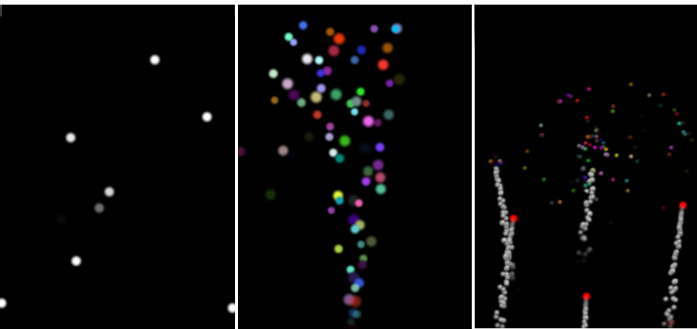

..
    ---------------------------------------------------------------------------
    Copyright (C) 2012 Digia Plc and/or its subsidiary(-ies).
    All rights reserved.
    This work, unless otherwise expressly stated, is licensed under a
    Creative Commons Attribution-ShareAlike 2.5.
    The full license document is available from
    http://creativecommons.org/licenses/by-sa/2.5/legalcode .
    ---------------------------------------------------------------------------

About this Tutorial
===================

Why Would You Want to Read this Guide?
--------------------------------------

The goal of this tutorial is to introduce you to some of the features of Qt Quick 2 for implementing animations and graphic effects. Mainly, this tutorial provides an overview of how to use the `Particles` module in Qt Quick 2 as well as `ShaderEffects` for advanced graphic effects.

The tutorial is split into three main chapters. In the first chapter, you will be introduced to the `Particles` module. We will provide some basic setup code illustrating the use of the main types. The second chapter provides a quick overview of how to use `Shader` programs within QML through a simple example. The last chapter will focus on implementing a demo application step-by-step using `Animations`, `Particles`, and `Shaders`.

Get the Source Code and the Tutorial in Different Formats
---------------------------------------------------------

A .zip file that contains the full code source of the tutorial's examples is provided:

     :download:`Source code <qteffects/particles_src.zip>`

The guide is available in the following formats:

     :download:`PDF <qteffects/ParticlesTutorial.pdf>`

     :download:`ePub <qteffects/ParticlesTutorial.epub>` for ebook readers. Further details can be found `here <http://en.wikipedia.org/wiki/EPUB#Software_reading_systems>`_.

     :download:`Qt Help <qteffects/ParticlesTutorial.qch>` for Qt Assistant and Qt Creator. In Qt Assistant, in the :qt:`Preferences Dialog <assistant-details.html#preferences-dialog>` under the `Documentation` tab (in a collapsible menu for Mac users), you click on the `Add` button in order to add this guide in .qch format. We do the same in Qt Creator under the `Options` dialog in the `Help` section. Here you can add this guide in the `Documentation` tab.

License
-------

Copyright (C) 2012 Digia Plc and/or its subsidiary(-ies).
All rights reserved.

This work, unless otherwise expressly stated, is licensed under a Creative Commons Attribution-ShareAlike 2.5.

The full license document is available from http://creativecommons.org/licenses/by-sa/2.5/legalcode .

Qt and the Qt logo is a registered trade mark of Digia plc and/or its subsidiaries and is used pursuant to a license from Digia plc and/or its subsidiaries. All other trademarks are property of their respective owners.

.. rubric:: What's Next?

Next chapter provides an overview of the `Particles` module in Qt Quick 2 with simple examples that will cover the most basic types.
