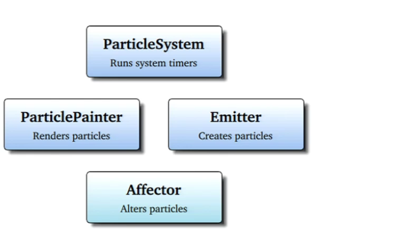
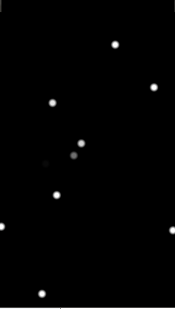
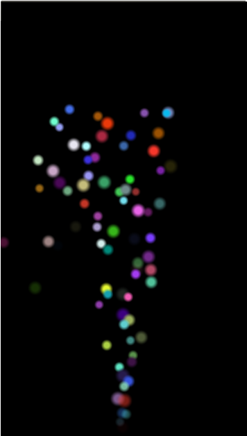
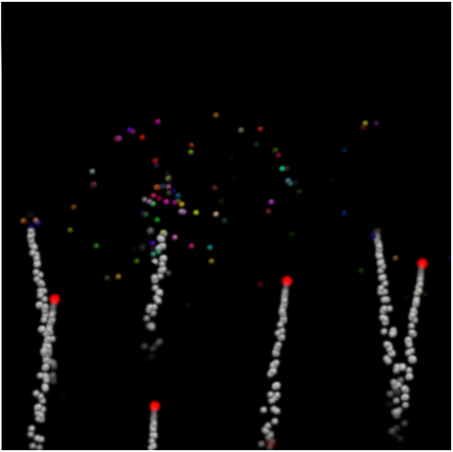

..
    ---------------------------------------------------------------------------
    Copyright (C) 2012 Digia Plc and/or its subsidiary(-ies).
    All rights reserved.
    This work, unless otherwise expressly stated, is licensed under a
    Creative Commons Attribution-ShareAlike 2.5.
    The full license document is available from
    http://creativecommons.org/licenses/by-sa/2.5/legalcode .
    ---------------------------------------------------------------------------

Particles
=========

Overview
--------

Qt Quick 2 comes with the `Particles` module for making nice visual particle effects which can be used by many applications that require a lot of tiny moving particles such as fire simualtion, smoke, stars, music visualization etc.

The :qt5-snapshot:`Particles <qtquick-particles2-qml-particlesystem.html>` module is based on four major components:

     The ``ParticleSystem`` ties all the elements together and runs the system timers. ``Painters``, ``Emitters`` and `Affectors` should all have the same `ParticleSystem` to interact with each other.

     The :qt5-snapshot:`PariclePainter <qml-qtquick-particles2-particlepainter.html>` enables the rendering of particles that can be image items or custom shaders.

     The :qt5-snapshot:`Emitter <qml-qtquick-particles2-emitter.html>` emits the particle objects into the system from the location of the emitter itself and controls some particle properties (`lifeSpan`, `size` etc).

     The :qt5-snapshot:`Affector <qml-qtquick-particles2-affector.html>` is an optional element that alters the attributes of particles after being created in order to manipulate the simulation (e.g. modifying the trajectroty, applying gravity effects etc).

Basic Setup
-----------

Let's start with a simple example that illustrates how we can use those elements together to make particle effects.

The following example implements a simple rectangle with a ``ParticleSystem`` element that contains an :qt5-snapshot:`ImageParticle <qml-qtquick-particles2-imageparticle.html>` which renders particles based on an image, as well as an ``Emitter`` that creates and emits particles.

.. code-block:: js

    // particles_example_02.qml

    import QtQuick 2.0
    import QtQuick.Particles 2.0

    Rectangle {

        width: 360
        height: 600
        color: "black"

        ParticleSystem {
            anchors.fill: parent

            // renders a tiny image
            ImageParticle {
                source: "resources/particle.png"
            }

            // emit particle object with a size of 20 pixels
            Emitter {
                anchors.fill: parent
                size: 20
            }
        }
    }

If you run the code shown above, you will see a couple of tiny particles (based on the image source) blinking on a black background.

The particles are emitted all over the entire area of the parent because we set the emitter's anchors to fill the entire area of the root element (i.e. the rectangle).

To make the animation more intersting, we may want to make all particles emit from the bottom of the window and spread out with an increased :qt5-snapshot:`lifeSpan <qml-qtquick-particles2-emitter.html#lifeSpan-prop>`.

First we set the emitter's anchors and specify where we want the particles to be emitted from.

.. code-block:: js

    Emitter {
        height: 10; width: 10
        anchors.bottom: parent.bottom
        anchors.horizontalCenter: parent.horizontalCenter
    }

Then we set the trajectory and speed of the particles using :qt5-snapshot:`AngleDirection <qml-qtquick-particles2-angledirection.html>` QML element.

.. code-block:: js

    Emitter {
        ...
        speed:  AngleDirection {
            // Make particles spread out vertically from the bottom
            angle: 270
            // make the movement of the particles slighly different from
            // one another
            angleVariation: 10
            // set speed to 150
            magnitude: 100
            }
        ...
    }

Since the default ``lifeSpan`` property value of the particle is set to one second, we will increase its value so that we can visualize the particles path:

.. code-block:: js

    Emitter {
        ...
        // 8 seconds may be enough
        lifeSpan: 8000
    }

We can also set the particles to emit in various sizes by using the :qt5-snapshot:`sizeVariation <qml-qtquick-particles2-emitter.html#sizeVariation-prop>` property in the ``Emitter`` component:

.. code-block:: js

    Emitter {
        ...
        // set the variation up to 5 pixels bigger or smaller
        sizeVariation: 5
    }

The `colorVariation <http://doc-snapshot.qt-project.org/5.0/qml-qtquick-particles2-imageparticle.html#colorVariation-prop>`_ property in the ``ImageParticle`` element enables us to apply color variation to the particles:

.. code-block:: js

    ImageParticle {
        ...
        //Color is measured, per channel, from 0.0 to 1.0.
        colorVariation: 1.0
    }

Then we can use the :qt5-snapshot:`Gravity <qml-qtquick-particles2-gravity.html>` affector to make our particles fall back down.

.. code-block:: js

    ParticleSystem {
        ...
        Gravity {
            anchors.fill: parent
            // apply an angle of acceleration when the particles hit
            // the affector
            angle: 90
            // accelerate with 15  pisxels/second
            acceleration: 15
        }
        ...
    }

If you now run the code, you will see an animation displaying particles of different sizes and colors spreading out from the bottom to the top of the window and then falling back down.

.. note:: The full code is available in the `particles_example_02.qml` file.

ParticleGroups and Transitions
------------------------------

The `Particles` module also provides a :qt5-snapshot:`ParticleGroup <qml-qtquick-particles2-particlegroup.html>` element that enables us to set timed transitions on particle groups. This could be very helpful if we want to implement animations with special behavior that require many transitions.

To illusrate how we can use ``ParticleGroup``, let's implement a simple fireworks animation. The particles should be emitted from the bottom of the window. We'll also add some :qt5-snapshot:`TrailEmitters <qml-qtquick-particles2-trailemitter.html>` that will simulate smoke produced by flames as well as explosions in mid-air.

In our fireworks animation we proceed as follows:

     Within the main ``Rectangle``, we add a ``ParticleSystem`` that will be used by all components to run the animation.

     Add the main ``Emitter`` that emits firework particles from the buttom to the top of the window and specify a logical group identifier so that we can later assign an ``ImageParticle`` to render the flame particles.

     Add a ``TrailEmitter`` that will simulate the smoke produced by the flame. We also specify a logical group so that we can later assign the corresponding ``ParticlePainter`` to the emitter.

     Add a ``ParticleGroup`` to simulate the explosion using an ``TrailEmitter`` element.

     Add a ``GroupGoal`` in the main ``Emitter`` to tell where or when to apply the transition we define in the ``ParticleGroup``.

 .. note:: A logical group enables us to paint particles emitted by different ``Emitters`` using different ``ImagePartilces`` within the same ``ParticleSystem`` as we will see later in the `four seasons` demo application.

So first, we declare one main ``Emitter`` that emits firework particles from the bottom to the top:

.. code-block:: js

    import QtQuick 2.0
    import QtQuick.Particles 2.0

    Rectangle {

        width: 360
        height: 600
        color: "black"

        // main particle system
        ParticleSystem {id: particlesSystem}

        // firework emitter
        Emitter {
            id: fireWorkEmitter
            system: particlesSystem
            enabled: true
            lifeSpan: 1600
            maximumEmitted: 6
            // Specify the logical group that
            // the emitter belongs to
            group: "A"
            // we want to emit particles
            // from the bottom of the window
            anchors{
                left: parent.left
                right: parent.right
                bottom: parent.bottom
            }

            speed:  AngleDirection {
                        angle: 270
                        angleVariation: 10
                        magnitude: 200
                    }
        }
    }

Then we add a ``TrailEmitter`` element to simulate the smoke produced by the firework before exploding in the air.

.. code-block:: js

    TrailEmitter {
        system: particlesSystem
        group: "B"
        // follow particle emitted by fireWorkEmitter
        follow: "A"
        size: 12
        emitRatePerParticle: 50
        speed: PointDirection {yVariation: 10; xVariation: 10}
        acceleration: PointDirection {y:  10}
    }

Then we add a ``ParticleGroup`` element to set a transition and simulate the explosion of particles in the air. We will be using a ``TrailEmitter`` with an ``AngleDirection`` to display the exploding effect.

.. code-block:: js

    ParticleGroup {
        name: "exploding"
        duration: 500
        system: particlesSystem

        TrailEmitter {
            group: "C"
            enabled: true
            anchors.fill: parent
            lifeSpan: 1000
            emitRatePerParticle: 80
            size: 10
            speed: AngleDirection {angleVariation: 360; magnitude: 100}
            acceleration: PointDirection {y:  20}
        }
    }

In order to know exactly where to apply the transition, we add a :qt5-snapshot:`GroupGoal <qml-qtquick-particles2-groupgoal.html>` element inside the `fireWorkEmitter` that tells the emitter what the aimed state is and when/where the particles should switch to it.

.. code-block:: js

    Emitter {
        id: foreWorkEmitter
        ...
        GroupGoal {
            // on which group to apply
            groups: ["A"]
            // the goalState
            goalState: "exploding"
            system: particlesSystem
            // switch once the particles reach the window center
            y: - root.height / 2
            width: parent.width
            height: 10
            // make the particles immediately move to the goal state
            jump: true
        }
    }

Next, we just add the ``ImageParticle`` elements to visualize particles for each group defined above.

.. code-block:: js

    // ParticlePainter for the main emitter
    ImageParticle {
        source: "resources/particle.png"
        system: particlesSystem
        color: "red"
        groups: ["A"]
    }

    //  ParticlePainter for the trailEmitter smoke
    ImageParticle {
        source: "resources/smoke_particle.png"
        system: particlesSystem
        groups: ["B"]
        color: "white"
    }

    // ParticlePainter for the trailEmitter in the ParticleGroup
    ImageParticle {
        source: "resources/smoke_particle.png"
        system: particlesSystem
        groups: ["C"]
        color: "red"
        colorVariation: 1.2
    }

And now if you run the code, you should have a simple animation that displays particles emitted from the window bottom and exploding once they reach the window center:

what's next?
------------

In the next article, we introduce the ``ShaderEffect`` element used for more advanced graphic effects. Then you will implement a demo application that combines the use of `Particles` and `Shaders`.
