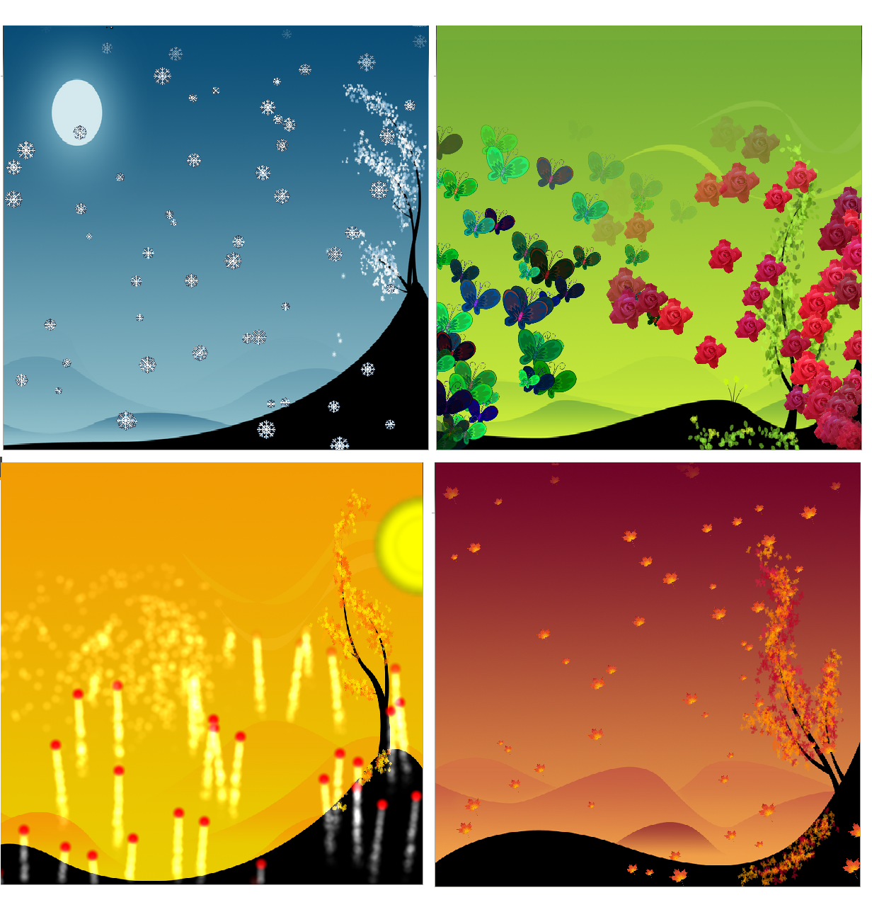
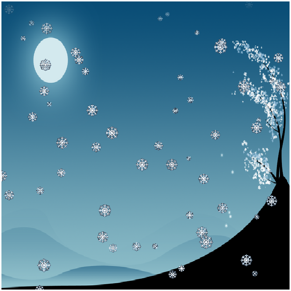
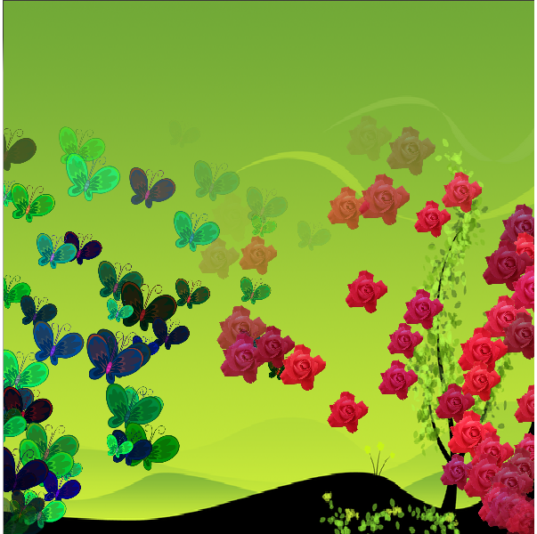
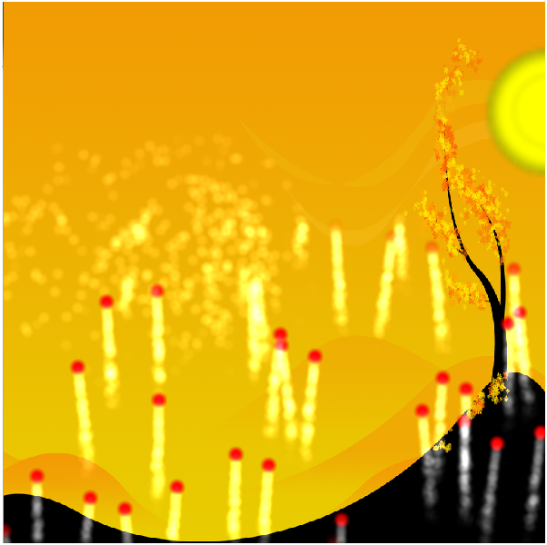
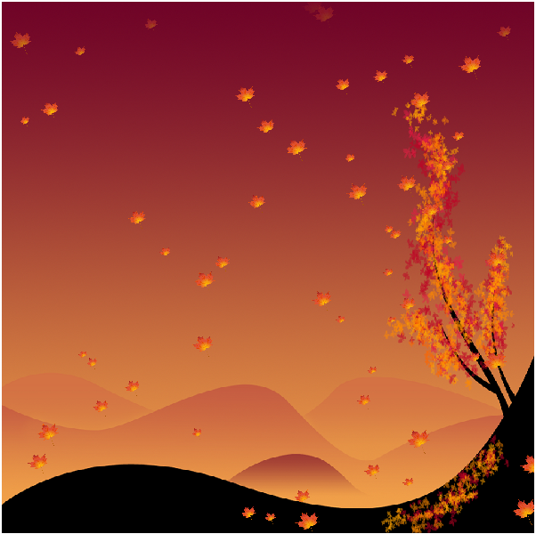
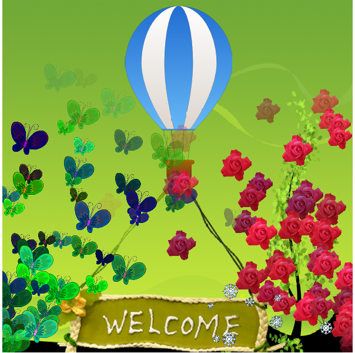

..
    ---------------------------------------------------------------------------
    Copyright (C) 2012 Digia Plc and/or its subsidiary(-ies).
    All rights reserved.
    This work, unless otherwise expressly stated, is licensed under a
    Creative Commons Attribution-ShareAlike 2.5.
    The full license document is available from
    http://creativecommons.org/licenses/by-sa/2.5/legalcode .
    ---------------------------------------------------------------------------

Demo Application
================

In order to have a better understanding of how to use ``Particles``  and ``ShaderEffect``, we will implement an example that illustrates their use to create some animations and graphical effects.

In this chapter, we will implement a simple demo that consists of four background images corresponding to one of the four seasons with special animations for each season. The idea is to show you different ways and techniques of making nice animations and graphic effects using particles and shaders.

Almost all animations are implemented using particle effects. However, we add some animations using shader effects. We will create four special animations, each having its own ``Emitter`` and ``ParticlesImage`` types with different settings that correspond to the four seasons of the year. The following figure presents a screenshot of the final implementation:

In order to easily follow the steps of our implementation, this tutorial is split into several sections. Each section covers the ``Emitter`` and ``ParticlesImage`` types (as well as other elements) associated with each season.

The Main Element
----------------

The application consists of a ``Rectangle`` type with an ``Image`` that displays different backgrounds. Each background image corresponds to a season. For each season, we  associate special animations based on `Particles`. We additionally add an animation when switching from one season to another.

Background
----------

The main rectangle displays an image for each season. Let's start by implemeting a simple animation once the user switches from one season to another.

.. code-block:: js

    Rectangle {
        id: root

        property int  numberVal: 4

        width: 600
        height: 600
        // enable keyboard events
        focus: true

        Image {
            id: background
            anchors.fill: parent
            source: "resources/winter.png"

            Behavior on source {
                SequentialAnimation {
                    ParallelAnimation {
                        NumberAnimation { targets: background;
                                          properties: "opacity";
                                          to: 0 }
                        NumberAnimation { target: background;
                                          property: "scale";
                                          to : 2 }

                    }

                    PropertyAction {target: background;
                                    property: "source"}

                    ParallelAnimation {
                        NumberAnimation { targets: background;
                                          properties: "opacity";
                                          to: 1 }
                        NumberAnimation { target: background;
                                          property: "scale";
                                          to : 1}

                    }
                }
            }
        }
    }

The default season is winter in the code shown above. To manage different seasons, we define a ``State`` for each season as follows:

.. code-block:: js

    states :[
        State {
            name: "summer"
            PropertyChanges { target: background;
                              source: "resources/summer.png" }
        },

        State {
            name:"spring"
            PropertyChanges{ target: background;
                             source: "resources/spring.png" }
        },

        State {
            name:"autumn"
            PropertyChanges{ target: background;
                             source: "resources/autumn.png" }
        }
    ]

In every ``State``, we just apply the corresponding background image to the active season.

Then we define a function to switch between seasons. Each function should set the corresponding state and should later apply the related animation.

.. code-block:: js

    function toSpring()
    {
        state = "spring"
        // Apply spring animation later ...

    }

    function toSummer() {
        state = "summer"
        // Apply summer animation later ...

    }

    function toAutumn() {
        state = "autumn"
        // Apply autumn animation later ...

    }

    function  toWinter (){
        // default state
        state = ""
        // Apply winter animation later ...

    }

Once the background image has been changed, we add a ``NumberAnimation`` that modifies the image's scale and opacity. For more details concerning animations in QML, refer to the :qt5:`NumberAnimation Documentation <qtquick/qml-qtquick2-numberanimation.html>`.

To switch between the season's background, the user can simply press the ``space`` key on the keyboard:

.. code-block:: js

    Keys.onPressed: {
        if (event.key == Qt.Key_Space){
            switch(state) {
                case  "":
                    toSpring();
                    break;
                case "spring":
                    toSummer();
                    break;
                case "summer":
                    toAutumn() ;
                    break;
                case "autumn":
                    toWinter();
                    break;
            }

        }
    }

Winter Animation
----------------

In the `winter` state, we want to display some snow particles falling down from the top of the window. So first we declare a ``ParticleSystem`` that paints the particles and runs the emitters:

.. code-block:: js

    ParticleSystem { id: sysSeason  }

Then we add a ``ParticleImage`` type that visualizes logical particles using an image. In our case, the image should correspond to a snow particle. We also specify the system whose particles should be visualized and a group property to specify which logical particle group will be painted. This is helpful if we want to use different emitters within the same ``ParticleSystem``:

.. code-block:: js

    ImageParticle {
        id: snow
        system: sysSeason
        source: "resources/snow.png"
        groups: ["A"]
    }

To emit particles, we add an ``Emitter`` type that emits our snow particles from the top window down to the bottom using an ``AngleDirection`` with a 90° angle:

.. code-block:: js

    Emitter {
        id: snowEmitter
        // Enable the emitter as winter is the default state
        enabled: true
        system: sysSeason
        group: "A"
        lifeSpan: 8000
        anchors{
            left: parent.left
            right: parent.right
            top: parent.top
        }
        velocity: AngleDirection { angle: 90;
                                angleVariation : 20;
                                magnitude: 100 }
        size: 20
        sizeVariation: 10
    }

We also specify the logical particle group that corresponds to the `snowImage`, with a ``lifeSpan`` of 8 second.

The following screenshot shows what the particles will look like:

Spring Aniamtion
----------------

In the Spring season, we want to display some flower and butterfly particles from the bottom corners of the window. So first we define the ``ImageParticles`` to vizualize flower and butterfly particles.

.. code-block:: js

    // ImageParticle for butterfly
    ImageParticle {
        id: butterfly
        system: sysSeason
        source: "resources/butterfly.png"
        colorVariation: 1.0
        groups: ["C"]
    }

    // ImageParticle for flowers
    ImageParticle {
        id: flower
        system: sysSeason
        source: "resources/flower.png"
        colorVariation: 0.4
        groups: ["B"]
    }

As the particles should be emitted from different places, we will be using two emitters. In each ``Emitter``, we specify the logical particles group.

In the butterFly ``Emitter``, we specify a group and emit the particles from the bottom right corner:

.. code-block:: js

    Emitter {
        id: butterFlyEmitter
        enabled: false
        system: sysSeason
        lifeSpan: 5000
        group: "C"
        anchors.bottom: parent.bottom
        velocity : AngleDirection { angle : 300;
                                 angleVariation: 30;
                                 magnitude: 100 }
        size: 50
        sizeVariation: 20
    }

In ``flowerEmitter``, we use the same code as in ``butterFlyEmitter``, but with a different group and from the opposite corner:

.. code-block:: js

    Emitter {
        id: flowerEmitter
        enabled: false
        system: sysSeason
        lifeSpan: 5000
        group: "B"
        anchors.bottom: parent.bottom
        anchors.right: parent.right
        velocity : AngleDirection { angle : 250;
                                 angleVariation: 40;
                                 magnitude: 100 }
        size: 50
        sizeVariation: 10
    }

In the ``toSpring`` function, once we switch to the `spring` season, we disable the ``snowEmitter`` and enable the `butterFly` and `flower` emitters.

.. code-block:: js

    function toSpring()
    {
        state = "spring"

        snowEmitter.enabled = false
        butterFlyEmitter.enabled = true
        flowerEmitter.enabled = true
    }

If you now run the code, you should be able to visualize flower and butterfly particles as shown on the following screen:

Summer Animation
----------------

In the summer state, we will be adding two major animations: one to simulate the sun movement and the other to launch some fireworks.

For the sun animation, we define an ``Emitter`` that emits particles using ``AngleDirection``. We also want the emitter to move from left to right, so we add a ``SequentialAnimation`` on the ``x`` and ``y`` properties:

.. code-block:: js

    Emitter {
        id: summerEmitter
        enabled: false
        system: sysSeason
        lifeSpan: 200
        group: "G"
        y: parent.height / 4
        emitRate: 1600
        velocity : AngleDirection { angleVariation : 360 ;
                                        magnitude: 80}
        size: 100
        sizeVariation: 50

        SequentialAnimation {
            id: sunAnimation

            ParallelAnimation
            {
                NumberAnimation { target: summerEmitter;
                                  property: "x" ;
                                  from: 0;
                                  to: root.width/2;
                                  duration: 10000;
                                  running: false }

                NumberAnimation { target: summerEmitter;
                                  property: "y" ;
                                  from: root.height/4;
                                  to: 0;
                                  duration: 10000;
                                  running: false }
            }

            ParallelAnimation
            {
                NumberAnimation { target: summerEmitter;
                                  property: "x" ;
                                  from: root.width/2;
                                  to: root.width;
                                  duration: 10000;
                                  running: false }

                NumberAnimation { target: summerEmitter;
                                  property: "y" ;
                                  from: 0;
                                  to: root.height/4;
                                  duration: 10000;
                                  running: false }
            }
        }
    }

We add the `ImageParticle` to paint the particle using an image.

.. code-block:: js

    ImageParticle {
        id: particle
        system: sysSeason
        source: "resources/particle.png"
        color:" yellow"
        groups: ["G"]
    }

Then we add the firework animation effect using the ``Emitter``, ``TrailEmitter``, ``GroupGoal``, ``ParticlesGroup`` and ``ImageParticles`` types as we have seen before in the ``Particles`` article.

.. code-block:: js

    // ImageParticle to render the firework particles
    ImageParticle {
        system: sysSeason
        id: fireWorkParticle
        source: "resources/particle.png"
        color: "red"
        groups: ["D"]
    }

    //Emitter to creates and emits the firework particles
    Emitter {
        id: fireworksEmitter
        enabled: false
        group: "D"
        system: sysSeason
        lifeSpan: 3000
        anchors.bottom: parent.bottom
        width: parent.width
        velocity : PointDirection {y: -120 ; xVariation: 16}
        size: 20
        GroupGoal {
            groups: ["D"]
            goalState: "lighting"
            jump: true
            system: sysSeason
            y: - root.height / 2
            width: root.width
            height: 10
        }

    // TrailEmitter to simulate the smoke
    TrailEmitter {
        id: trailEmitter
        system: sysSeason
        group: "E"
        follow: "D"
        enabled: false
        anchors.fill: parent
        emitRatePerParticle: 80
        velocity: PointDirection {yVariation: 16; xVariation: 5}
        acceleration: PointDirection {y: -16}
    }

    // ParticlesGroup to simulate the explosion
    ParticleGroup {
        name: "lighting"
        duration: 300
        system: sysSeason

        TrailEmitter {
            enabled: true
            anchors.fill: parent
            group: "F"
            emitRatePerParticle: 80
            lifeSpan: 2000
            velocity: AngleDirection {magnitude: 64; angleVariation: 360}
        }

    }

In the `toSummer` function, we disable previous emitters and enable the `sunEmitter`, `fireworksEmitter` and `trailEmitter`, and run `runAnimation` to move the emitter.

.. code-block:: js

    function toSummer() {
        state = "summer"

        butterFlyEmitter.enabled = false
        flowerEmitter.enabled = false

        sunEmitter.enabled = true
        fireWorksEmitter.enabled = true
        trailEmitter.enabled = true
        sunAnimation.running = true
    }

The result should look like this:

Autumn Animation
----------------

In Autumn, we want to display some leaves falling down from the top of the window with a wind effect. To achieve this, we first add an `autumnEmitter` that emits the particles from the top of the window. This is quite similair to the `snowEmitter` we saw above:

.. code-block:: js

    Emitter {
        id: autumnEmitter
        enabled: false
        system: sysSeason
        group: "H"
        lifeSpan: 8000
        anchors{
            left: parent.left
            right: parent.right
            top: parent.top
        }
        velocity : AngleDirection { angle: 90;
                                 angleVariation : 20;
                                 magnitude: 100 }
        size: 40
        sizeVariation: 20
    }

Then we add an `ImageParticle` to render the leaf particles using an image. The `ImageParticle` should belong to the same logical group as our `autumnEmitter`:

.. code-block:: js

    ImageParticle {
        id: leaf
        system: sysSeason
        source: "resources/autumn_leaf.png"
        groups: ["H"]
    }

To add some effects, we will use an `Affector` that will generate a wind effect. For this, we will be using the :qt5:`Wander <qtquick/qml-qtquick-particles2-wander.html>` affector that allows particles to randomly vary their trajectory:

.. code-block:: js

 Wander {
        id: wanderer
        enabled: false
        system: sysSeason
        anchors.fill: parent
        xVariance: 360;
        pace: 300;
    }

And That's it! Now we just need to disable the previous emitter and enable the `autumnEmitter` and the `wanderer` affector in our `toAutumn()` function:

.. code-block:: js

        function toAutumn() {

        state = "autumn"

        summerEmitter.enabled = false
        fireworksEmitter.enabled = false

        autumnEmitter.enabled = true
        wanderer.enabled = true
    }

.. Note:: We created a similar animation for Winter, but with a different background, different particles displayed and some wand effects

Our Autumn animation will look like this:

In order to keep the same animation in the Winter, once we switch seasons, we need to disable the emitter and affecter above and enable the `snowEmitter` as follows:

.. code-block:: js

    function  toWinter (){
        state = ""

        autumnEmitter.enabled = false
        wanderer.enabled = false

    snowEmitter.enabled = true
    }

Shader Effect
-------------

Now we want to display a hot air balloon moving up from the bottom of the window and have a flag attached to it. For this we need two images:

One to simulate the hot air balloon with a ``NumberAnimation`` to make it move from the bottom to the top of the window:

.. code-block:: js

    Image {
        id: ballon
        x: root.width / 2 - width/2
        y: root.height
        source: "resources/ballonAir.png"

        NumberAnimation on y {  id: ballonAnimation;
                                running: false;
                                from: root.height;
                                to: - height * 2;
                                duration: 15000 }
    }

     A second for the flag to be attached to the balloon:

.. code-block:: js

    Image {
        id: welcome_flag
        anchors.top: ballon.bottom
        anchors.horizontalCenter: ballon.horizontalCenter
        source: "resources/welcome.png";
    }

To simulate the wind effect on the flag, we add a fragment shader program via the ``ShaderEffect`` type:

.. code-block:: js

    ShaderEffect {
        id: shaderEffect
        anchors.fill: welcome_flag
        property variant source: welcome_flag
        property real amplitude: 0.01
        property real frequency: 20
        property real time: 0

        NumberAnimation on time { loops: Animation.Infinite;
                                  from: 0;
                                  to: Math.PI * 2;
                                  duration: 600 }

        fragmentShader:

            "uniform lowp float qt_Opacity;
             uniform highp float amplitude;
             uniform highp float frequency;
             uniform highp float time;
             uniform sampler2D source;
             varying highp vec2 qt_TexCoord0;
             void main() {
                highp vec2 p = sin(time + frequency * qt_TexCoord0);
                gl_FragColor = texture2D(source, qt_TexCoord0  +
                            amplitude * vec2(p.y, -p.x)) * qt_Opacity;
             }";
    }

We want to display the balloon with the flag in the Spring season so in the related function, we run the animation related to the balloon image.

.. code-block:: js

    function toSpring()
    {
        //...
        balloonAnimation.running = true
    }

Now if you run the code, you should be able to visualize the air balloon animation.

.. Note:: The full source code of this chapter is provided in the `particles_seasons.qml` file.

Summary
-------

In this tutorial, we went through the `Particles` module in Qt Quick and the use of `Shaders` to apply advanced animation effects. We also provided an example combining those technics. For more details concerning `Particles` and `Shaders` effects, refer to these links:

* http://qt-project.org/doc/qt-5.0/qtquick/qtquick-particles2-qml-particlesystem.html

* http://qt-project.org/doc/qt-5.0/qtmultimedia/multimedia-video-qmlvideofx.html

* http://www.lighthouse3d.com/opengl/glsl/
