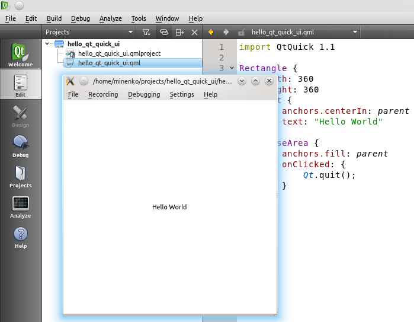
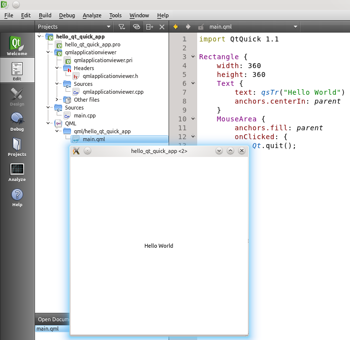

..
    ---------------------------------------------------------------------------
    Copyright (C) 2012 Digia Plc and/or its subsidiary(-ies).
    All rights reserved.
    This work, unless otherwise expressly stated, is licensed under a
    Creative Commons Attribution-ShareAlike 2.5.
    The full license document is available from
    http://creativecommons.org/licenses/by-sa/2.5/legalcode .
    ---------------------------------------------------------------------------

Setting up your work environment
================================

If this is your first Qt Quick project, it makes sense to take a look at the tools you need, how a new project can be started and what are the most important needs of the daily development workflow.

Installing the tools
--------------------

We recommend using Qt SDK for working with this tutorial, since it contains all the required parts for your development environment in one package. The Qt SDK is available `on the download page on the Qt web site <http://qt.nokia.com/products/qt-sdk/>`_. Keep defaults while installing if you are not sure what those options mean.

If you already have a working Qt development environment, please make sure that you use Qt version Qt 4.7.4 or 4.8.x, which include QtQuick 1.1. Most of this guide applies to Qt5, which includes Qt Quick 2.0. Please refer to the section :ref:`porting-primer-to-qt5` for details of changes introduced by Qt5 in the scope of this guide.

Creating Qt Quick applications
------------------------------

In this tutorial we will be using `QtCreator <http://qt-project.org/wiki/Category:Tools::QtCreator>`_ as an IDE. QtCreator is provided as a part of the Qt SDK installation and as a separate package.

The wizard under the menu :menuselection:`File --> New File or Project` creates not only project files, but also some initial application code. The wizard provides two choices relevant to Qt Quick:

     *Qt Quick Application*
     *Qt Quick UI*

The major difference between these two options is how the application code will be executed. This difference reveals quite some interesting facts of how Qt Quick works under the hood. Let's create a project of each type and take a look on the files generated by the wizard.

    Qt Quick UI* project type
--------------------------

If you select     Qt Quick UI*, let's name it ``hello_qt_quick_ui``, you will get just one ``qml`` file and two project files in the project directory:

     ``hello_qt_quick_ui.qml`` - application code you start with
     ``hello_qt_quick_ui.qmlproject`` - the project file. You do not need to touch it for now
     ``hello_qt_quick_ui.qmlproject.user`` - your project settings. Automatically generated and changed by QtCreator. You should not edit this file, nor check it in into your version control system

``hello_qt_quick_ui.qml`` looks like this:

.. code-block:: js

    import QtQuick 1.1

    Rectangle {
        width: 360
        height: 360
        Text {
            anchors.centerIn: parent
            text: "Hello World"
        }
        MouseArea {
            anchors.fill: parent
            onClicked: {
                Qt.quit();
            }
        }
    }

You can execute it by pressing ``CTRL-R`` or by selecting :menuselection:`Build --> Run` in QtCreator. This will show the following on the screen:

But wait! There is no compilation step! How does the application run?

Qt Quick is script-based, just like Python or Perl. A script needs to be interpreted and executed by an engine. This engine in Qt Quick is called :qt:`Qt Declarative UI Runtime<qmlruntime.html>`. Qt Quick applications can use this engine in two different ways:

1. passing a ``qml`` file as command line option of the engine application called :qt:`qmlviewer<qmlviewer.html>`
2. integrating :qt:`Qt Declarative UI Runtime<qmlruntime.html>` in C++ code and loading qml files

Our ``hello_qt_quick_ui`` uses the first way. The :qt:`qmlviewer<qmlviewer.html>` is located in the ``bin`` folder of the Qt installation. It contains code which uses :qt:`Qt Declarative UI Runtime<qmlruntime.html>` to load the ``qml`` file specified in the command line. In the     Qt Quick UI* projects, QtCreator automatically runs :qt:`qmlviewer<qmlviewer.html>` to load the main ``qml`` file when you press ``CTRL-R`` or select :menuselection:`Build --> Run`. No compilation step is required.

The :qt:`qmlviewer<qmlviewer.html>` application also provides debugging interfaces and many other cool goodies. Check its documentation page or call ``qmlviewer --help`` to see what is available.

This project type and the way it is integrated in Qt Creator is very simple and handy for discovering the functionality of Qt Quick. We will use it most of the time. Nevertheless, in the next section we will learn about the     Qt Quick Application* project type to understand how you can use Qt Quick in a standard Qt application developed in C++.

Before we start with it, a short remark about the name     Qt Quick UI* given to a project type with ``qml`` files only. This underlines the major purpose of Qt Quick to serve a script-based programming environment for application UI. Complex application logic and heavy processing should stay on the C++ side and expose its APIs to Qt Quick.

    Qt Quick Application* project type
-----------------------------------

Another project type called     Qt Quick Application* allows you to unleash the reaming power of Qt Quick. If you create a ``hello_qt_quick_app`` project in the wizard with this type, you will get a Qt application in C++:

     ``hello_qt_quick_app*.png`` and ``.svg`` - desktop icons for different platforms
     ``hello_qt_quick_app*.desktop`` - desktop description files for different platforms
     ``hello_qt_quick_app.pro`` - Qt project file. You do not need to touch it for now
     ``hello_qt_quick_app.pro.user`` - your local project settings. Automatically generated and changed by QtCreator. You should not edit this file, nor check it in into your version control system
     ``main.cpp`` - the main file of your application starting your own ``qmlviewer`` implemented in the ``QmlApplicationViewer`` C++ class
     ``qml``- a folder where the *Hello World* ``qml`` file resides. Add other ``qml`` files here
     ``qmlapplicationviewer`` - a folder with implementation of the ``QmlApplicationViewer`` C++ class which initializes and starts :qt:`Qt Declarative UI Runtime<qmlruntime.html>` with the main ``qml`` file

Your application now has its own qmlviewer-like module along with the same     Hello World* ``qml`` file. This is a Qt C++ application which provides the basic functionality of ``qmlviewer`` plus some additional code for integration on non-desktop platforms . If you run this project, Qt SDK will first compile and build you application line any other C++ application and then start it. ``QmlApplicationViewer`` will load and execute Qt Quick code the same way as ``qmlviewer``:

Your new ``QmlApplicationViewer`` is another possible instance of :qt:`Qt Declarative UI Runtime<qmlruntime.html>`. This way of handling Qt Quick applications opens many interesting possibilities for integrating Qt Quick code into classical C++ applications and even making C++ code available as new items in Qt Quick. This is a more advanced technique beyond the scope of this tutorial. You can read more about this in :qt:`Qt Declarative UI Runtime<qmlruntime.html>` documentation, as well as in the :qt:`"Extending QML Functionality using C++"<qml-extending.html>` article in the Qt documentation.

Tracing what is going on
------------------------

In the course of this tutorial you will need to trace what your application codes does and/or might get interested to stop the application to inspect it in runtime. Let's take a look at how debugging and tracing works in Qt Quick. Debugging is feature rich and is well documented in the :creator:`Debugging Qt Quick Projects<creator-debugging-qml.html>` article. When using it for the first time, you should make sure to setup the :creator:`Debugging Helpers<creator-debugging-helpers.html>`.

In your first steps with Qt Quick, you will mostly use tracing since it is a simple and easy way to follow what happens in an application. You can add tracing statements by using the ``console.log()``, ``console.debug()`` or just ``print()`` methods provided by JavaScript.

For example, if we choose to trace the place where our     Hello World* application quits upon a mouse click, the code would look like this:

(``helloqml/helloqml.qml`` in ``qt_quick_app_dev_intro_src.zip``, see :ref:`get-primer-source-code` section)

.. literalinclude:: ../src/helloqml/helloqml.qml
  :language: js

This code produces the following in the ``QML Viewer`` tab in Qt Creator::

    I was "QDeclarativeRectangle(0x23705d0)"!
    Bye for now!

.. rubric:: What's Next?

By now you should have a working development environment and a simple project with a "Hello World" application which you can manipulate, run and inspect how it works. In the next chapter, we will discuss core concepts of Qt Quick and take a look at what is available to do more than a simple     Hello World* example.
