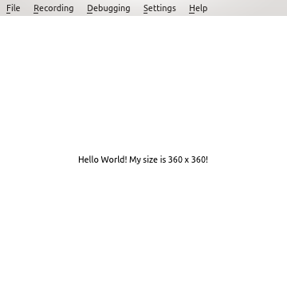
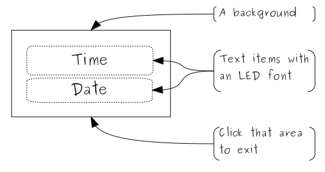
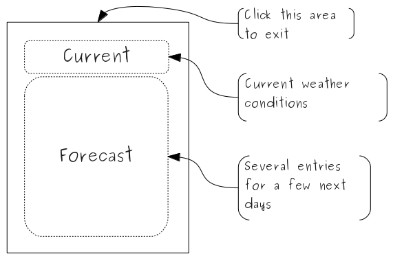
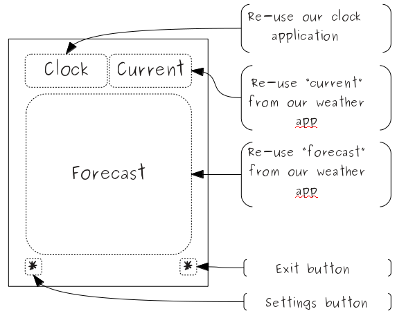
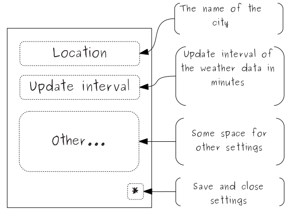

..
    ---------------------------------------------------------------------------
    Copyright (C) 2012 Digia Plc and/or its subsidiary(-ies).
    All rights reserved.
    This work, unless otherwise expressly stated, is licensed under a
    Creative Commons Attribution-ShareAlike 2.5.
    The full license document is available from
    http://creativecommons.org/licenses/by-sa/2.5/legalcode .
    ---------------------------------------------------------------------------

Qt Quick core principles for application development
=====================================================

Qt Quick compared to classical Qt
---------------------------------

Being a part of Qt, Qt Quick (or     Qt User Interface Creation Kit*) provides a totally new way of creating UIs and even programming in general. Most use cases for Qt Quick are in areas where users expect non-widget based UIs with rich animations, effects and graphical resources. It allows turning virtually any graphical element into an interactive UI component with minimal effort.

Using Qt Quick, you can move fast from sketching ideas on to a working prototype. You can continue using the prototyped code in later development phases with almost no rewriting. You can involve graphic, interaction and animation designers during the entire development process and skip the painful steps of exchanging ideas and requirements on paper or slides.

Developing with Qt Quick does not require any C++ knowledge. It is a script language inspired by CSS and JavaScript. Moreover, it also uses JavaScript a lot in its syntax and functionality. It uses a JavaScript engine to execute your code. Those of you who are familiar with QtScript will feel at home. Though no C++ is needed to develop in Qt Quick, you can extend Qt Quick with own modules written in C++. This can also be used to exchange data with existing Qt applications. This allows starting with Qt Quick without breaking your code if you are interested. And you will :-)

.. Topic:: Qt Quick does not replace classical Qt with C++...

    Though you can implement complete applications with Qt Quick only, the role of classical Qt and C++ changes, but does not get less important. In complex real world applications, Qt Quick is used for UI and user interaction, application's business logic and system interfaces are still written in C++.

Declarative vs imperative programming
-------------------------------------

Qt Quick can be seen as one of several implementations of `declarative programming <http://en.wikipedia.org/wiki/Declarative_programming>`_. Qt Quick programs describe which items an application UI consists of, how they look and how they change upon various user actions. This is very different from the traditional `imperative programming <http://en.wikipedia.org/wiki/Imperative_programming>`_ with Qt C++, which puts algorithms and statements in the foreground. This difference is actually the major reason why Qt Quick can directly be used for designing application UIs. UI design deals with the content on a screen and interactions with users, assuming that application logic is somewhere in the back. If needed, Qt Quick still allows the use of imperative elements and you can even write fairly complex algorithms in JavaScript in the same QML file.

Four cornerstones
------------------

There are four fundamental aspects used in Qt Quick:

1. UI is composed of nested elements ordered in a hierarchical tree structure
2. Elements are described by properties
3. A property can be bound to another one and so keep the same value
4. A notification is generated and can be processed by a handler on each property change or a signal sent

You write a Qt Quick application by adding elements one after the other or by nesting them. You customize the appearance and the behavior of the elements by changing their properties. If a property of one element should follow the value of a property of another element on each change, you bind those properties. If you need to react on a property change, you add some handler code which is automatically executed on each change.

Let's find the four cornerstones listed above in a slightly modified version of our first Qt Quick application:

.. code-block:: js

    import QtQuick 1.1

    Rectangle {
        width: 360
        height: 360
        Text {
            anchors.centerIn: parent
            text: "Hello World! My size is " +
                  parent.width + " x " + parent.height + "!"
        }
        onHeightChanged: print ("new size: ", width, "x", height)
        MouseArea {
            anchors.fill: parent
            onClicked: {
                Qt.quit();
            }
        }
    }

    *Concerning point 1:** Our application consists of three elements ordered in a tree-like structure. ``Rectangle`` is a root element of that tree. It contains a ``Text`` element and a ``MouseArea`` element. They are siblings and have ``Rectangle`` as a parent.

    *Concerning point 2:** We assign new values to the properties ``width`` and ``height`` of ``Rectangle`` to set its initial size.

    *Concerning point 3:** We bind the text content of the ``Text`` element to the dimensions of its parent element (``Rectangle``). The application does not show anything spectacular after its start:

but if you resize its window with the mouse the text will change and the console output will keep posting the current dimensions of ``Rectangle``:

.. image:: images/hello_world_size2.png
    :align: center

If it had been just a traditional assignment the text would have not changed and would have kept its first value. This is a very powerful technique which is used very intensively in any Qt Quick application.

    *Concerning point 4:** An ``on`` notification is generated each time a property change including changes of ``width`` and ``height``. We add a handler for notification ``onHeightChanged``. Each time its height changes, the size of the ``Rectangle`` is printed on the console. It is also possible to send a signal when you need to notify other elements about something. Our simple code segment does not use any signals, but we will talk about them later. Generally, the fourth cornerstone is very similar to properties and signals-and-slots in classical Qt.

Let's take a look at the application concept phase and let's analyze how we proceed implementing it with Qt Quick. We will take a closer look at these four cornerstones and learn about other important details.

Moving from a concept to a real application
--------------------------------------------

There is a reason why the concept phase of the application development is important in Qt Quick. Your application UI will be based on Qt Quick elements, and most of them will be a rectangle or something similar to it. You will use property binding and notification handlers to make a functional system with those elements. There will be an easy way to replicate and modularize its functionality. The first version of your application will run very soon, even though there might be not much application logic implemented. You will add more application logic and then realize that something should be enhanced in the UI design. This turnarounds are known on any platform with any application development framework. Qt Quick makes going through these turnarounds less time-consuming and less error-prone. You just need to pay a bit more attention to the decomposition of the initial application concept.

We are going to develop a digital clock with an integrated weather forecast. The use case for the application is more of a decorative kind. Imagine waking up in the middle of the night wanting to quickly check what time it is and then continue sleeping. If it is already time to start your day, you might want to find out what's the weather forecast so you can decide what to wear. Our application will show the current time of the day and the weather forecast for the next days fetched from the Internet. Additionally, we will need another top level window to store a few basic settings (e.g. the city where the user and his device are currently located). This gives three main components: a clock, weather forecast, and possibly settings. The clock and weather forecast will be shown on the same screen, whereas settings will pop-up and dismiss.

The clock element will look something like this:

This just shows the current time and date, which can be seen as elements on their own as well.

A weather forecast usually displays information about the weather for the current day and the actual forecast section covering a few days in the future. This information is repeated for all days, showing just weather conditions and temperatures. We plan to get the weather data from the Internet. This will make weather elements tightly linked to the weather data. We should keep this in mind when selecting Qt Quick elements to use.

A root element containing all weather related elements can look something like this:

The clock and weather parts are quite independent and it makes sense to develop them separately and use them as components in the final application:

Settings will pop-up as a separate window:

This element can be developed separately as well. We just need to take care that there is a way to transfer the settings data from and into the application core.

Additionally, we will probably need some basic UI features such as text input fields, check boxes and simple buttons.

Visual appearance is important! We will spend some extra time exploring possibilities in Qt Quick to enhance our application.

.. rubric:: What's Next?

In the next chapter we will explore how to use Qt Quick elements to compose an UI.

