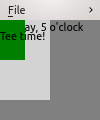
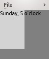
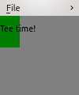
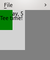
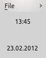
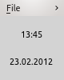
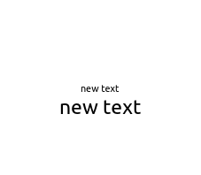

..
    ---------------------------------------------------------------------------
    Copyright (C) 2012 Digia Plc and/or its subsidiary(-ies).
    All rights reserved.
    This work, unless otherwise expressly stated, is licensed under a
    Creative Commons Attribution-ShareAlike 2.5.
    The full license document is available from
    http://creativecommons.org/licenses/by-sa/2.5/legalcode .
    ---------------------------------------------------------------------------

Elements as building blocks
============================

We start with our simple *Hello World* application and use it as a basis to expand and learn what happens.

As we already know, Qt Quick applications can been seen as a hierarchical tree of elements. This tree is composed into a dynamic scene on a screen. All elements can be seen as objects with parent-child relationships which can also be seen as a kind of inheritance.

Some elements are not visible on the screen, but rather used under the hood to control or transform other elements. Due to this, a generic name for all Qt Quick building blocks is items*. There is also *the item* - :qt:`Item <qml-item.html>` which is the parent of most (21 in Qt Quick 1.1) other items. Being a parent of so many other items, :qt:`Item <qml-item.html>` has very important properties inherited by many other items. Take some time to check its documentation. We will use the term *item* most of the time, but we will use *element* when we want to underline that an item is visible on the screen.

Visual elements can be manipulated by changing their properties such as position, size, visibility, opacity, and so on. This can be done with or without animations. There are special elements for capturing user input or visualizing data from different sources. Qt documentation provides a list of all items :qt:`sorted in groups <qml-groups.html>`. Take some time to get an overview of all available items.

When you write a Qt Quick application, you should think about its UI in terms of elements. Changes in the UI become transitions, where elements move to another place, hide or even change their form. This is quite different compared to traditional programming, where you used to think in terms of algorithms and spent a lot of time making changes in the UI. Developing UIs with Qt Quick is more like creating a cartoon...

Composing a basic UI with nested elements
-----------------------------------------

Like in any other tree structure, there is always exactly one root item which contains all others in any *qml* file. Let's take the rectangle from our *Hello World* example, and put some other elements in it:

(``many_elements/many_elements.qml`` in ``qt_quick_app_dev_intro_src.zip``, see :ref:`get-primer-source-code` section)

.. literalinclude:: ../src/many_elements/many_elements.qml
  :language: js
  :start-after:      ***/

This is how it looks on the screen:

Although the application is not any closer to being useful in real life, it's interesting to further analyze what happens on the screen.

One :qt:`Rectangle<qml-rectangle.html>` is the root item. Two others contain a :qt:`Text<qml-text.html>` with different text. All items are rendered as a stack according their order in the tree:

     the root rectangle first

     then the grey rectangle with its text

     the green rectangle comes on top and covers a part of the previous text

     the :qt:`Text<qml-text.html>` element contained in the green rectangle comes as the last one on top of all others.

We could add more elements, all of them are added to this stack and drawn on the upper left corner which is the *(0,0)* position. This is the default rendering position, if you do not specify ``x`` and ``y`` properties.

This default behavior would make in this example appear too overlapped on the screen. We add ``anchors.verticalCenter: parent.verticalCenter`` to move the last text a bit below the text in the gray rectangle. Anchoring allows positioning of elements relatively to each other. We will talk about this a bit later.

Ordering elements on the screen
--------------------------------

It is possible to control the position and order of the elements on the screen in absolute ``(x,y)`` coordinates or relatively to other elements.

The start of the coordinate system is the upper left corner of the application window. Coordinate units are actual pixels on the screen. In addition to the ``(x,y)`` coordinates, positioning of the items has a kind of 3rd dimension defining the stacking order of sibling items. This is defined by the :qt:`z property<qml-item.html#z-prop>`. By default, its value is ``0``. If you set it to ``1`` it rises the item to the next level. Lets try this out on our small application:

(``ordered_elements/ordered_elements.qml`` in ``qt_quick_app_dev_intro_src.zip``, see :ref:`get-primer-source-code` section)

.. literalinclude:: ../src/ordered_elements/ordered_elements.qml
  :language: js
  :start-after:      ***/

This looks like this:

Setting ``z`` to ``-1`` will put an item into the background of its parent:

If you noticed, the text elements are not clipped by the boundaries of their parents - rectangles. This is the default behavior for performance reasons. If needed, this can be changed by setting the ``clip`` property to true: ``clip: true``. ``clip`` is a property of :qt:`Item<qml-item.html>` and available in all visual elements inheriting from it.

If we set ``clip`` to true in our application it will look like this:

Arranging application elements on the screen
--------------------------------------------

On the next step we will need to arrange the elements so that the build up an application UI. Arranging items brings up another key aspect: identification of items.

Though the use of the IDs is optional in Qt Quick. We have to use IDs if items have to be arranged in relation to each other. Generally, you should strongly consider using IDs all the time. This greatly improves readability of the code and prevents weird side effects. Be advised to use consistent IDs for all root items in your project, for example, just ``root``. This helps you keep track of items used and avoid side effects.

We already saw some use of anchoring in previous examples. Lets take a closer look on this and use it to place elements so that they start getting closer to a clock.

We just take two :qt:`Text<qml-text.html>` elements and place them inside our ``root`` element. Anchoring uses so called anchoring lines which are provided as properties. When you anchor items, you just bind an anchoring line of one item to an anchoring line of another one. You basically stitch items to each other. Additionally, you can also set anchor margins. Margins are zero by default and define a distance between anchored items. We place ``timeText`` and ``dateText`` centered inside of ``root`` and add margins of 10 pixels:

(``static_clock/static_clock.qml`` in ``qt_quick_app_dev_intro_src.zip``, see :ref:`get-primer-source-code` section)

.. literalinclude:: ../src/static_clock/static_clock.qml
  :language: js
  :start-after:      ***/

The top edge of ``timeText`` stitches to the top edge of the ``root`` with a margin of 10 pixels. ``dateText`` does the same at the bottom. If you run this application and resize the application window with the mouse, you will see that both text items keep their anchored positions at the edges. Just the space between them changes.

The item :qt:`MouseArea<qml-mousearea.html>` fills the entire surface of ``root`` and even reacts to mouse click events for both text items. We will talk about handling mouse events later.

Anchoring is fairly simple, but you need to pay a bit more attention if you have many elements on the screen. Otherwise you might lose orientation of where your elements are located. A useful approach is to anchor to the dominant elements and keep anchoring in a hierarchical order. A detailed description of anchoring is available in :qt:`this article<qml-anchor-layout.html>` in Qt documentation.

Another approach to handle positioning of many elements which should be placed in a regular order is using :qt:`Positioners<qml-positioners.html>`. :qt:`Positioners<qml-positioners.html>` do all the ordering for you and have some additional features.

Lets try migrate our application to use positioners. It makes the code shorter even with our two items. We now place both :qt:`Text<qml-text.html>` elements inside a :qt:`Column<qml-column.html>` positioner. In order to keep them apart from each other we define 20 pixels spacing and anchor the :qt:`Column<qml-column.html>` in the center of root:

(``static_clock1/static_clock1.qml`` in ``qt_quick_app_dev_intro_src.zip``, see :ref:`get-primer-source-code` section)

.. literalinclude:: ../src/static_clock1/static_clock1.qml
  :language: js
  :start-after:      ***/

The result looks pretty much the same:

If you now resize the application window, you will notice that its content stays centered, as we anchored the positioner to the center of ``root``.

Qt Quick provides other :qt:`Positioner<qml-positioners.html>` elements, such as  :qt:`Row <qml-row.html>`, :qt:`Grid<qml-grid.html>` or :qt:`Flow<qml-flow.html>`. We will use some of them during the course of this guide.

.. _property-anchor:

Properties
----------

In previous sections, we used item properties by assigning or binding various values in order to change an item. Properties play an essential role and have a much broader use. In this section we talk about other use cases and use the knowledge gained in our application. Lets take a look at this simple code segment:

.. code-block:: js

  Rectangle {
    id: myButton
    color: "white"
  }

The element ``myButton`` automatically contains all default properties of :qt:`Rectangle<qml-rectangle.html>`, including all default values. Implementing a button, you might need to add some other properties on top of default ones, for example, a border color or even a generic pen color which is used to paint both the label text and the border color. Implementing other items, you might need to keep some values from the application logic. How to add new properties?

You can define a new property using the following syntax:

.. code-block:: js

  [default] property <type> <name>[: defaultValue]

A new property for the border color in our Button would then look like this:

.. code-block:: js

  property string borderColor: "white"

We used the type "string" here. It is one of a range of types available, see :qt:`this article <qdeclarativebasictypes.html>` about property types in Qt documentation.

In some cases, it makes more sense to define an alias for an existing property instead of defining a new one. This can be done using the following syntax:

.. code-block:: js

  [default] property alias <name>: <alias reference>

In fact, in the case of our button inheriting from :qt:`Rectangle<qml-rectangle.html>`, we should define the new property as an alias since the :qt:`Rectangle<qml-rectangle.html>` element already has a property defining the the color of the border:

.. code-block:: js

  Rectangle {
    id: myButton
    property alias borderColor: myButton.border.color
    ...
  }

The optional ``default`` keyword in the syntax outlined above are used to create `default properties`. They hold the child elements of an item. This is a more advanced use which is out of the scope of this guide. Refer to :qt:`this<qml-extending.html#default-property>` and :qt:`this article<propertybinding.html#default-properties>` in Qt documentation.

As mentioned before, a property change generates notification signals that can have an handler to respond to the property change. Handlers are assigned to ``on<property_name>Changed`` properties which are automatically created for all items properties, including custom properties you have added.  Lets do a small experiment with a rectangle to see this in action:

.. code-block:: js

  import QtQuick 1.1

  Rectangle {
    width: 100; height: 100

    onWidthChanged: console.log("Rectangle width: ", width)
    onHeightChanged: console.log("Rectangle height: ", height)
  }

The code above creates a window with an empty white rectangle. If you drag a corner to resize its desktop window, you will see something like this in the console::

  Rectangle width:  640
  Rectangle height:  460
  Rectangle width:  100
  Rectangle height:  100
  Rectangle height:  101
  Rectangle height:  102
  Rectangle width:  104
  Rectangle height:  109
  Rectangle width:  105
  Rectangle height:  110
  Rectangle height:  111
  ...

The code of handler reacting to changes can be much more sophisticated and can use JavaScript. We will talk about using JavaScript in Qt Quick in the section :ref:`primer-javascript-section`

Property binding is another fundamental aspect. It makes a property to follow changes of another property. This works across items, and is actually used across items most of the time. Binding occurs each time you use ``:``, and have a value that can change on the right-hand side:

.. code-block:: js

  id1.text: id2.text  // text in the id1 follows changes of the text in id2
  width: 16    height/9  // this keeps an item being the 16:9 aspect ratio :-)

The latter is interesting as you can also do some calculations or even bind to a function returning a value.

The following example combines what we just learned about properties in one small application:

(``property_binding/property_binding.qml`` in ``qt_quick_app_dev_intro_src.zip``, see :ref:`get-primer-source-code` section)

.. literalinclude:: ../src/property_binding/property_binding.qml
  :language: js
  :start-after:      ***/

The application starts like this:

As the ``text2.text`` is bound to ``text1.text``, the property change in ``text1`` on a mouse click is automatically passed to ``text2``:

The following appears in the console::

  text 2 is changed: initial text
  text 1 is changed: new text
  text 2 is changed: new text
  text 1 is now: new text
  text 2 is now: new text

The mouse click was received by the :qt:`MouseArea<qml-mousearea.qml>` element and processed by the JavaScript code in the ``onClicked`` handler. We will take a closer look at this in one of the following chapters.

If you resize the window the pixel font size of the text in ``text2`` is dynamically scaled to be 1/10 of the width of the ``root``:

Later on, we use properties to define custom parameters that define the appearance of our application as well as keep a few settings.

Other Visual Composition Elements
----------------------------------

Qt Quick 1.x provides a broad selection of items which can be used for UI creation. Qt documentation :qt:`covers them<qdeclarativeelements.html>` in full details and we are not going to discuss all of them here. In general, there are four sets of elements which can be used for composing application UIs:

    * Drawn elements such as text and rectangles
    * Loaded content such as images and web pages as well as fonts
    * Visualization elements which arrange the above in various ways and can use models with data if needed
    * Effects such as animations and transitions while displaying the above

Qt5 adds two more:

* Vector-oriented graphics canvas
* 3D rendering with Open GL effects and shaders

These topics are covered by other guides available :guides-homepage:`from here<>`

Even though you do not see high-level UI components on the list, Qt Quick gives you more than enough power to compose very rich UIs. These UIs can be like cartoons, where images receive user input and gets transformed smoothly into other images or elements, rectangles rounded to become circles, ellipses, and so on. You can also create classical UI components if required without significant effort. When you start working on a UI, try to first decompose it in basic elements, text and images and views. Think how elements interact with each other, what happens upon user input or changes in the application logic.

.. rubric:: What's Next?

In the next chapter we will learn how to load external content and create the required UI appearance.
