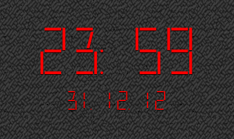

..
    ---------------------------------------------------------------------------
    Copyright (C) 2012 Digia Plc and/or its subsidiary(-ies).
    All rights reserved.
    This work, unless otherwise expressly stated, is licensed under a
    Creative Commons Attribution-ShareAlike 2.5.
    The full license document is available from
    http://creativecommons.org/licenses/by-sa/2.5/legalcode .
    ---------------------------------------------------------------------------

Loading and Displaying Content
------------------------------

As the next step in the development of our clock application, we are going to add a background image instead of a solid color and display time and date in a different font than the standard one. This type of content is usually provided in external files. We have to learn how to load and display this kind of content. We should also learn how to customize the standard appearance of elements to make an application look more attractive.

Accessing and loading content
=============================

Qt Quick 1.x allows the loading of images and fonts located on the network or in the local file system. The path to related files is defined relatively to the location of the QML file where the content is loaded. The same relative paths can be used when content is loaded over the network. This makes moving the content from the file system to the network very easy and does not require large changes in the code. See :qt:`this article<qdeclarativenetwork.html>` for more details.

Loading external content can always end up with problems. Files get misplaced. The network connection can be too slow or the server is off-line. You don't want that. :qt:`Image<qml-image.html>` and :qt:`FontLoader<qml-fontloader.html>` provide ``status`` and ``progress`` properties for handling such situations. ``progress`` changes its value from ``0.0`` to ``1.0`` in accordance to the actual progress of loading. If content is loaded from the file system, ``progress`` is set to ``1.0`` almost instantly if we do not use it in our application. The code segment for loading a font and tracing the status of loading looks like this:

.. code-block:: js

    FontLoader {
        id: ledFont
        source: "./content/resources/font/LED_REAL.TTF"
        onStatusChanged: if (ledFont.status == FontLoader.Error)
                            console.log ("Font \"" +
                                        source +
                                        "\" cannot be loaded")
    }

Our new font, ``LED_REAL.TTF``, is stored in the ``content`` folder, which is located in the same folder as our application. If for any reason it does not load, an error message is posted on the console and the application  continues using a default font.

Basic Image Parameters
======================

Loading images works almost the same way:

.. code-block:: js

    Image {
        id: background
        source: "./content/resources/light_background.png"
        fillMode: "Tile"
        anchors.fill: parent
        onStatusChanged: if (background.status == Image.Error)
                            console.log ("Background image \"" +
                                        source +
                                        "\" cannot be loaded")
    }

We need to change a few image properties. The image should cover the entire surface of the top-level element (its parent). In many cases, filling a background is done with small images which just design a pattern. Scaling them to the size of background would change the pattern, and the background would not be the same as planned. In these cases, you set ``fillMode`` to ``Tile`` as shown in the code above.

.. Topic:: Dealing with Image Sizes

    Most of the visual properties of an image can be changed using its parent (:qt:`Item<qml-item.html>`) properties. Other :qt:`Image's<qml-image.html>` properties help handle critical image aspect - its size. If you deal with large images, you should set the ``sourceSize`` property to a size which you really need, otherwise the image loads in its full size. It is worth to notice the difference between ``paintedHeight`` and ``height``, and between ``paintedWidht`` and ``width``. The *painted* property pairs describe the size of the area taken by the image when it is painted on the screen, whereas the another pair describes the loaded size of the image. Both can be different if the image is scaled. If you change the ``scale`` property inherited from :qt:`Item<qml-item.html>`, be aware of the impact of the ``fillMode`` property on the actual scaling result. The ``smooth`` property smoothens the edges of scaled images, but also incurs a performance cost. See the :qt:`Image<qml-image.html>` documentation for more details.

Basic Text Parameters
=====================

In the first section, we loaded a custom LED-like font. We now need to assign it to the appropriate text elements. :qt:`Text<qml-text.html>` has a grouped ``font`` property. It has to be used to customize various font-related text properties. One of them, ``font.family``, holds the name of a font to be used.

.. Topic:: Finding the Fonts Installed

    Sometimes it might be tricky to find out which fonts are installed on your target system and how to spell their names right. A small example provided in Qt Quick :qt:`lists names of all available<declarative-text-fonts-fonts-qml-fonts-qml-availablefonts-qml.html>` rendered in their fonts.

Other :qt:`Text<qml-text.html>` properties allow a broad variation of the visual appearance of a text. In our application, we use the ``color``, ``style``, and size-related properties.

The customized text element for displaying time looks like this:

.. code-block:: js

    Text {
        id: timeText
        text: root.currentTime
        font.pixelSize: root.height    root.timeTextProportion
        font.family: ledFont.name
        font.bold: true
        color: root.textColor
        style: Text.Raised
        styleColor: "black"
    }

Our plan is to implement as much flexibility as possible in the size and layout of all elements as we want to run our application on different screen sizes. This is why the code above binds the ``pixelSize`` of ``timeText`` to the height of the ``root`` element. This will scale the text whenever the height of ``root`` changes. There are ways to make it better, but the current version of Qt Quick unfortunately does not provide font metrics data in the font properties. If it were available, we could make the text size adapt to the width changes as well.

In order to make the ``timeText`` element appear more attractive, we use some tricks for the visual appearance by setting ``style`` to ``Text.Raised`` and ``styleColor`` to ``"black"``. This detaches the text from the background so it seems like it's hovering over it.

The :qt:`Text<qml-text.html>` element also provides basic layout controls (for example, you can set how the text should be wrapped using ``wrapMode``). We're going to use this property later. The most important thing to note about text formatting is that :qt:`Text<qml-text.html>` supports :qt:`rich text<Qt's richtext-html-subset.html>` markup. This makes it possible to display one block of text in various formatting, colors, sizes etc.

The appearance of our application is now less boring:

The full source code is listed in the last section of this chapter.

Get ready for translation
=========================

When starting to develop an application, it makes a lot of sense to have some basic thoughts about international versions even if you do not plan for it now. Qt provides a set of tools which are used as the base by Qt Quick. If you know and use the essential part of the tools in the beginning of your development, it can save a lot of time later when your application becomes a complex system with a lot of code.

Qt Quick provides almost the same APIs for translation as in Qt Script. See the section, :qt:`Produce Translations<scripting.html#produce-translations>` for more details. The major API is the ``qsTr()`` function, which should be used to wrap all visual strings in an application. The *Hello World* greeting in our first application should then look like this:

.. code-block:: js

    import QtQuick 1.1

    Rectangle {
        width: 360
        height: 360
        Text {
            anchors.centerIn: parent
            text: qsTr("Hello World")
        }
        MouseArea {
            anchors.fill: parent
            onClicked: {
                Qt.quit();
            }
        }
    }

The application continues to run the same way as before using ``qsTr()``. You need to use the Qt translation tool chain to see translation in action. See the :qt:`QML Internationalization<qdeclarativei18n.html>` article for more details about how to generate and integrate translation files. When translation files are available, there are three ways to load them:

* by using the ``qmlviewer`` command-line option ``-translate``
* by placing them in the ``i18n`` sub-folder (see :qt:`this example<declarative-i18n.html>`)
* by modifying the default behavior of the ``qmlviewer`` and loading QML and translation files in your own way (this is beyond of scope for this guide)

If your plan is to make a version of an application for right-to-left languages, for example, Arabic, take a look at the :qt:`QML Right-to-left User Interfaces<qml-righttoleft.html>` article.

.. Topic:: Switching Languages at Runtime

    Currently, there are no standard APIs to load a new language after a Qt Quick application has already started. It is still possible with some additional code. See this article on the Qt developer Wiki about possible workarounds: `"How to do dynamic translation in QML" <http://qt-project.org/wiki/How_to_do_dynamic_translation_in_QML/>`_

If you are interested in more details, check these further readings about internationalization in Qt:

* Qt documentation: :qt:`Writing Source Code for Translation<i18n-source-translation.html>`
* Qt documentation: :qt:`Internationalization with Qt<internationalization.html>`
* Qt developer Wiki: `"Qt Internationalization" article <http://qt-project.org/wiki/QtInternationalization>`_

Static Clock Application Code
=============================

This is the code of our application including all enhancements as discussed in this chapter:

(``static_clock2/static_clock2.qml`` in ``qt_quick_app_dev_intro_src.zip``, see :ref:`get-primer-source-code` section)

.. literalinclude:: ../src/static_clock2/static_clock2.qml
  :language: js
  :start-after:      ***/

.. rubric:: What's Next?

In the next chapter we will take a look at scripting in Qt Quick. A small script code can make our clock tick.
