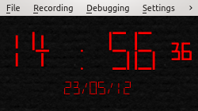

..
    ---------------------------------------------------------------------------
    Copyright (C) 2012 Digia Plc and/or its subsidiary(-ies).
    All rights reserved.
    This work, unless otherwise expressly stated, is licensed under a
    Creative Commons Attribution-ShareAlike 2.5.
    The full license document is available from
    http://creativecommons.org/licenses/by-sa/2.5/legalcode .
    ---------------------------------------------------------------------------

.. _primer-javascript-section:

Using JavaScript
=================

We've already used JavaScript a lot in our code, but we have only scratched the surface. JavaScript can be used in many more sophisticated and powerful ways in a Qt Quick application. In fact, Qt Quick is implemented as a JavaScript extension. JavaScript can be used almost anywhere as long as the code returns the value of the expected type. Moreover, using JavaScript is the standard way of writing parts of the application code which deal with application logic and calculations.

There are two important topics we need to talk about before we continue developing our application.

JavaScript is not JavaScript
-----------------------------

JavaScript has its origins in the web development. In the course of time, JavaScript has rapidly grown in its popularity and inspired a development of many extensions and add-ons. In order to support a broad use, JavaScript was formalized as a programming language in     ECMAScript-262* standard. It is important to underline that *ECMAScript-262 standard* only covers the language aspects and leaves out any API providing additional functionality such as objects and libraries to the access to web page content etc. Despite the standardization efforts, many JavaScript details in web development are still browser-specific - even though the situation has improved in the last years. See `the Wikipedia article about JavaScript <http://en.wikipedia.org/wiki/Javascript>`_ for more details.

JavaScript is also used outside of the web where its functionality is tailored to gives a use case. Still, the use of JavaScript for client-side programming in web development is dominating. Due to this, all books and most web resources about JavaScript are actually dedicated to web development. Qt Quick belongs to one of the platforms which use JavaScript outside of the web. If you read books or other materials about JavaScript to understand and use it better in development with Qt Quick, be aware of this difference.

Qt development teams are doing their best to provide as many details as possible about the use of JavaScript in Qt Quick as soon as possible. This guide is one part of this effort.

Getting to know more about JavaScript
--------------------------------------

This guide contains an annex about :ref:`basics of JavaScript<primer-javascript-annex>` tailored for Qt Quick. We strongly recommend reading it if you are not familiar with JavaScript, but have some general background in programming.

In addition to the references in the annex, consider reading the following articles on the Mozilla Developer Network:

     `"About JavaScript" <http://developer.mozilla.org/en/JavaScript/About_JavaScript>`_
     `"A re-introduction to JavaScript" <http://developer.mozilla.org/en/A_re-introduction_to_JavaScript>`_
     `"JavaScript Guide" <http://developer.mozilla.org/en/JavaScript/Guide>`_

The following three articles in Qt Documentation explain essential details of JavaScript in Qt Quick:

     :qt:`Integrating JavaScript<qdeclarativejavascript.html>` - key aspects to be aware of when using JavaScript in Qt Quick
     :qt:`ECMAScript Reference<ecmascript.html>` - a list of built-in objects, functions and properties supported by QtScript and so in Qt Quick
     :qt:`QML Scope<qdeclarativescope.html>` - explains the visibility of JavaScript objects and Qt Quick items

Please note that significant changes and large updates in Qt Documentation will come in the future Qt releases to provide a full coverage of the use of JavaScript in Qt Quick. Stay tuned and check Qt Documentation again and again.

Adding logic to make the clock tick
------------------------------------

We've already used a bit of JavaScript in previous sections. Most of it was for catching error conditions while loading a custom font and an image. In this section, we will use JavaScript to show the actual time and date.

We are going to use the ``Date`` from the global object to get the current time and date. The returned data has to be formated so that we only keep the parts of the date and time information which we need. We use :qt:`Qt.formatDateTime<qml-qt.html#formatDateTime-method>` for this:

.. code-block:: js

    function getFormattedDateTime(format) {
        var date = new Date
        return Qt.formatDateTime(date, format)
    }

The ::qt:`Qt.formatDateTime<qml-qt.html#formatDateTime-method>` function is a part of :qt:`QML Global Object<qdeclarativeglobalobject.html>` which provides many other useful utilities in addition to the standard set defined by the :qt:`ECMAScript Reference<ecmascript.html>`. It is worth it to take a closer look at its documentation.

The ``getFormattedDateTime()`` function is used in another function which creates actual values for the :qt:`Text<qml-text.html>` elements in our clock:

.. code-block:: js

    function updateTime() {
        root.currentTime = "<big>" +
                getFormattedDateTime(Style.timeFormat) +
                "</big>" +
                (showSeconds ? "<small> " + getFormattedDateTime("ss") +
                    "</small>" : "");
        root.currentDate = getFormattedDateTime(Style.dateFormat);
    }

.. Note:: We use rich text formatting in the text value of the time as discussed in the previous section

We also use the conditional operator (also called the "ternary operator") on the value of ``showSeconds``. ``showSeconds`` is a custom property which defines if seconds should be shown on the clock. Using the conditional operator in Qt Quick is a very convenient way to bind a property (or any other variable) to a value depending on a condition just in one line.

The ``updateTime()`` function needs a trigger so that the ``currentTime`` and ``currentDate`` properties will be constantly updated. We use the :qt:`Timer<qml-timer.html>` item for this:

.. code-block:: js

    Timer {
        id: updateTimer
        running: Qt.application.active && visible == true
        repeat: true
        triggeredOnStart: true
        onTriggered: {
            updateTime()
            // refresh the interval to update the time each second or minute.
            // consider the delta in order to update on a full minute
            interval = 1000    (showSeconds? 1 : (60 - getFormattedDateTime("ss")))
        }
    }

Our timer implements some interesting aspects.

In order to optimize battery consumption, we bind the timer's ``running`` property to two other properties, which stops the timer, thereby reducing CPU activity. It stops if our clock element becomes invisible (when used as a component in another application) or if our application becomes inactive (running in the background or iconified).

We also assign a value to the ``interval`` property while not loading, but when the timer is triggered. This is needed to catch the delta time to the full minute when seconds are not used. This ensures that we update the clock exactly on the minute.

The full code of our application including all enhancements as discussed above looks like this:

(``NightClock/NightClock.qml`` in ``qt_quick_app_dev_intro_src.zip``, see :ref:`get-primer-source-code` section)

.. literalinclude:: ../src/NightClock/NightClock.qml
  :language: js
  :start-after:      ***/

The appearance of the application has remained the same:

Importing JavaScript files
--------------------------

If your application has a lot of JavaScript code, consider moving it to a separate file. You can import those files just like we imported the more Qt Quick module. Due to a special role that JavaScript plays in Qt Quick, you need to define the namespace for the content of the that file, e.g.     Logic* in this example. Your source code would then use ``Logic.foo()`` instead of just ``foo()`` and import declaration will look like this:

.. code-block:: js

    import QtQuick 1.1
    import "logic.js" as Logic

.. Note:: If the application logic is complex, consider implementing it in C++ and importing it into Qt Quick. See the :qt:`"Extending QML Functionalities using C++"<qml-extending.html>` in the Qt documentation for more details.

When you import a JavaScript file, it is used like a library and has the scope of the QML file importing it. In some cases you might need a stateless library or a set of global variables shared by multiple QML files. You can use the ``.pragma library`` declaration for this. See :qt:`"Integrating JavaScript"<qdeclarativejavascript.html>` article in Qt Documentation for more details about this.

We move the JavaScript functions of our clock into the ``logic.js`` file imported as ``Logic``. We also move all style properties into the ``style.js`` file imported as ``Style``. This considerably simplifies the code and allows sharing the style with other components which we will develop later.

The full code of our application importing JavaScript files as discussed above looks like this:

(``components/NightClock.qml`` in ``qt_quick_app_dev_intro_src.zip``, see :ref:`get-primer-source-code` section)

.. literalinclude:: ../src/components/NightClock.qml
  :language: js
  :start-after:      ***/

.. Topic:: More advanced use of JavaScript

    If you are interested in a more advanced used of JavaScript in the development with Qt Quick consider reading "Programming with Qt Quick for Symbian and MeeGo Harmattan Devices" and "Qt Quick Application Developer Guide for Desktop" available :guides-homepage:`under this link<>`.

.. rubric:: What's Next?

In the next chapter, we will start developing the weather forecast application and learn how to retrieve and represent data in Qt Quick
