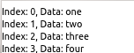
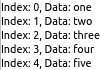
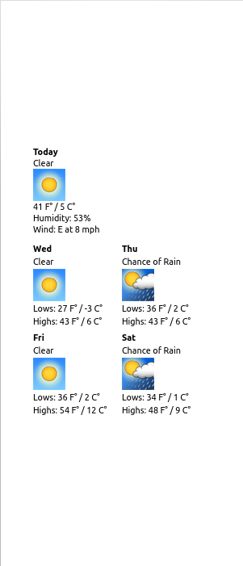
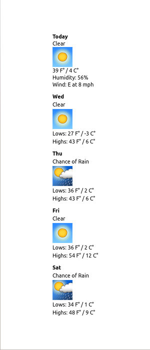

..
    ---------------------------------------------------------------------------
    Copyright (C) 2012 Digia Plc and/or its subsidiary(-ies).
    All rights reserved.
    This work, unless otherwise expressly stated, is licensed under a
    Creative Commons Attribution-ShareAlike 2.5.
    The full license document is available from
    http://creativecommons.org/licenses/by-sa/2.5/legalcode .
    ---------------------------------------------------------------------------

Acquire and Visualize Data
==========================

In this section, we leave our clock application for a while and start another one: a weather forecast application. This section focuses on handling data. Our previous code kept data in properties and in JavaScript variables. This is only sufficient for small and simple applications. Sooner or later you will need to deal with larger sets of data.

Qt Quick implements the known model-view architecture and provides a handy set of APIs for this. There is a selection of *models* which keep and, if needed, acquire data. *View* elements read model items and render each of them with the help of a *delegate* in a specific way. For example, as a grid or as a list.

Models
------

Qt Quick models are very simple since they are based on the concept of lists. The three kinds of models that are used the most are:

* an ``int`` value (useful to display something multiple times)
* a JavaScript array of objects
* list models, for example,  :qt:`ListModel<qml-listmodel.html>` and :qt:`XmlListModel<qml-xmllistmodel.html>` elements

See the *Models and Data Handling* section in the :qt:`"QML Elements"<qdeclarativeelements.html>` article for a full list of model related items. There are also some advanced approaches which are discussed in the :qt:`"QML Data Models"<qdeclarativemodels.html>` article in Qt Documentation.

We are going to use :qt:`XmlListModel<qml-xmllistmodel.html>` and take a look at a few examples where an ``int`` and an ``array`` are used as models.

Our weather forecast application uses Google weather APIs to get the data.

.. Note:: Google weather APIs are not announced as a regular internet service yet.

With these APIs, you can make a query on the web and receive weather data in XML as a response. As this is a very common way of data provisioning, Qt Quick provides a dedicated model for it: :qt:`XmlListModel<qml-xmllistmodel.html>`.

:qt:`XmlListModel<qml-xmllistmodel.html>` uses XPath and XQuery (`see this article in Wikipedia <http://en.wikipedia.org/wiki/XPath>`_) to read the data delivered as XML. :qt:`XmlListModel<qml-xmllistmodel.html>` uses :qt:`XmlRole<qml-xmlrole.html>` to create model items for selected XML tree nodes. Let's see how this works.

The query URL is formatted like this::

    http://www.google.com/ig/api?weather=[LOCATION]&hl=[LANGUAGE]

It returns the current weather conditions and a forecast for the next four days. If ``LOCATION`` is set as ``Munich`` and ``LANGUAGE`` is set as English, it looks like this::

    http://www.google.com/ig/api?weather=Munich&hl=en

It returns the following XML output::

    <?xml version="1.0" ?>
    <xml_api_reply version="1">
      <weather module_id="0" tab_id="0" mobile_row="0" mobile_zipped="1" row="0" section="0">
        <forecast_information>
          <city data="Munich, Bavaria" />
          <postal_code data="Munich" />
          <latitude_e6 data="" />
          <longitude_e6 data="" />
          <forecast_date data="2012-02-22" />
          <current_date_time data="1970-01-01 00:00:00 +0000" />
          <unit_system data="US" />
          </forecast_information>
        <current_conditions>
          <condition data="Clear" />
          <temp_f data="39" />
          <temp_c data="4" />
          <humidity data="Humidity: 56%" />
          <icon data="/ig/images/weather/sunny.gif" />
          <wind_condition data="Wind: E at 8 mph" />
          </current_conditions>
        <forecast_conditions>
          <day_of_week data="Wed" />
          <low data="27" />
          <high data="43" />
          <icon data="/ig/images/weather/sunny.gif" />
          <condition data="Clear" />
          </forecast_conditions>
        <forecast_conditions>
          <day_of_week data="Thu" />
          <low data="36" />
          <high data="43" />
          <icon data="/ig/images/weather/chance_of_rain.gif" />
          <condition data="Chance of Rain" />
          </forecast_conditions>
        <forecast_conditions>
          <day_of_week data="Fri" />
          <low data="36" />
          <high data="54" />
          <icon data="/ig/images/weather/sunny.gif" />
          <condition data="Clear" />
          </forecast_conditions>
        <forecast_conditions>
          <day_of_week data="Sat" />
          <low data="34" />
          <high data="48" />
          <icon data="/ig/images/weather/chance_of_rain.gif" />
          <condition data="Chance of Rain" />
          </forecast_conditions>
      </weather>
    </xml_api_reply>

A model which queries and processes this data looks like this:

.. code-block:: js

    import QtQuick 1.1

    Item {
        id: root
        property string location: "Munich"
        property string baseURL: "http://www.google.com"
        property string dataURL: "/ig/api?weather="
        // some other values: "de", "es", "fi", "fr", "it", "ru"
        property string language: "en"

        XmlListModel {
            id: weatherModelCurrent
            source: baseURL + dataURL + location + "&hl=" + language
            query: "/xml_api_reply/weather/current_conditions"

            XmlRole { name: "condition"; query: "condition/@data/string()" }
            XmlRole { name: "temp_f"; query: "temp_f/@data/string()" }
            XmlRole { name: "humidity"; query: "humidity/@data/string()" }
            XmlRole { name: "icon_url"; query: "icon/@data/string()" }
            XmlRole { name: "wind_condition"; query: "wind_condition/@data/string()" }
        }

        XmlListModel {
            id: weatherModelForecast
            source: baseURL + dataURL + location  + "&hl=" + language
            query: "/xml_api_reply/weather/forecast_conditions"

            XmlRole { name: "day_of_week"; query: "day_of_week/@data/string()" }
            XmlRole { name: "low"; query: "low/@data/string()" }
            XmlRole { name: "high"; query: "high/@data/string()" }
            XmlRole { name: "icon_url"; query: "icon/@data/string()" }
            XmlRole { name: "condition"; query: "condition/@data/string()" }
        }
    }

If you take a closer look at the code inside the :qt:`XmlRole<qml-xmlrole.html>` elements, you will notice that they basically create model items with property-value pairs by mapping them to the specified nodes in the XML tree starting at the node specified in ``query``. Like :qt:`Image<qml-image.html>` and :qt:`Font<qml-font.html>`, :qt:`XmlListModel<qml-xmllistmodel.html>` provides ``status`` and ``progress`` properties, which can be used to track the loading progress and catch the errors. Additionally, there is a ``reload()`` method which forces the model to query the URL again and load updated data. We will use this later to make sure that the weather forecast is always up-to-date.

Repeater and Views
------------------

Now we need to visualize the weather data collected in our models. There are various ways to do this in Qt Quick. Most visualization elements are inherited from :qt:`Flickable<qml-flickalbe.html>`:

    * :qt:`ListView<qml-listview.html>`
    * :qt:`GridView<qml-gridview.html>`
    * :qt:`PathView<qml-pathview.html>`

These elements act like view ports and use delegate elements to draw each model item. Views expect a fixed size to be set via ``height`` and ``width``. The content is shown inside that specified area and can be "flicked" (by default, up and down):

.. code-block:: js

    import QtQuick 1.1

    ListView {
        width: 150; height: 50
        model: ["one", "two", "three", "four", "five"] // or just a number, e.g 10
        delegate: Text { text: "Index: " + model.index + ", Data: " + model.modelData }
    }

This is how it looks on the screen:

The best use case for views is when a large number of model items has to be displayed. Views provide a built-in scrolling or flicking functionality to support ergonomic representation of large data sets. There are also some performance reasons for this as views only load items that become visible and not the entire set of them.

.. Topic:: Advanced Use of Views

    Views provide rich functionality and can be used to create pretty sophisticated UIs. If you are interested, consider reading the `The Qt Quick Carousel Tutorial <http://qt-project.org/wiki/Qt_Quick_Carousel>`_

If you have a small number of model items that has to be placed one after the other in a certain order, it makes more sense to use a :qt:`Repeater<qml-repeater.html>`. A :qt:`Repeater<qml-repeater.html>` creates specified elements for each item in the model. These elements must be placed on the screen by a positioner, for example, :qt:`Column<qml-column.html>`, :qt:`Grid<qml-grid.hrml>`, and so on. The above example can be modified to use a :qt:`Repeater<qml-repeater.html>`:

.. code-block:: js

    import QtQuick 1.1

    Column {
        Repeater {
            model: ["one", "two", "three", "four", "five"] // or just a number, e.g 10
            Text { text: "Index: " + model.index + ", Data: " + model.modelData }
        }
    }

This is how it looks on the screen:

Note that all items are now visible even though the size of the containing element ``Column`` is not specified. :qt:`Repeater<qml-repeater.html>` calculates the size of the elements and :qt:`Column<qml-column.html>` resizes accordingly. Check the :qt:`"Presenting Data with Views" article<qml-views.html>` article in Qt Documentation for more details.

We will finish our application by adding two visualization elements, each of which uses its own delegate. We need separate delegates as the current weather conditions data and the forecast data have different structures, which we would like to present in different ways.

But what should be used as visualization elements? It is possible with either a view a or with a :qt:`Repeater<qml-repeater.html>`. The ``weatherModelForecast`` items are displayed by a :qt:`GridView<qml-gridview.html>` and it looks like this:

The same items displayed by a :qt:`Repeater<qml-repeater.html>` looks like this:

The ``weatherModelCurrent`` contains just one item. Due to this, a :qt:`Repeater<qml-repeater.html>` is sufficient for displaying it and we keep this approach. The complete source code of the application:

(``Weather/weather.qml`` in ``qt_quick_app_dev_intro_src.zip``, see :ref:`get-primer-source-code` section)

.. literalinclude:: ../src/Weather/weather.qml
  :language: js
  :start-after:      ***/

.. Topic:: Accessing the File System

We do not need this feature in our application, but it is important to mention. In the current version, Qt Quick does not provide direct access to the local file system unless you hard-code a name of the file you would like to load.

A ``FolderListModel`` C++ plug-in is provided as a lab project in Qt 4.7.4 and higher to provide access to the file system. See :qt:`"FolderListModel - a C++ model plugin" article <src-imports-folderlistmodel.html>` in Qt Documentation for details. An earlier version of this plugin is used to develop a text editor in a :qt:`getting started tutorial<gettingstartedqml.html>`.

.. rubric:: What's Next?

In the next chapter, we start to combine the clock and the weather forecast features into one application. We make components based on the code we have developed so far and use these components to compose the final application.
