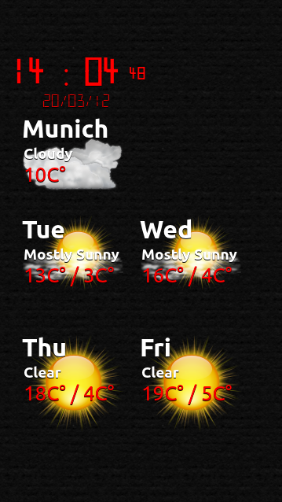

..
    ---------------------------------------------------------------------------
    Copyright (C) 2012 Digia Plc and/or its subsidiary(-ies).
    All rights reserved.
    This work, unless otherwise expressly stated, is licensed under a
    Creative Commons Attribution-ShareAlike 2.5.
    The full license document is available from
    http://creativecommons.org/licenses/by-sa/2.5/legalcode .
    ---------------------------------------------------------------------------

Components and Modules
======================

The next step in the development of our application is to get a version which combines the features of the weather forecast application and the clock application we have already developed. Fortunately, we will not need to implement those features again or copy the code. We can slightly modify the available applications and re-use them as components. This will be the focus of this chapter.

In the next chapter, we will take another step forward and further enhance the application by adding more components while learning more about how they can be used.

Creating components and collecting modules
------------------------------------------

The notion of components in Qt Quick is very simple: any item composed from other elements or components can become a component itself. Components are building blocks for any larger application. When using modules, it is possible to create component collections (libraries).

In order to create a component, you have to create a new file saved as ``<NameOfComponent>.qml`` with only one root element in it (the same as you would do with an ordinary Qt Quick application). It is important to underline that the name of the file has to start with a capital letter. From now on, the new component will be available under the name ``<NameOfComponent>`` to all other Qt Quick applications residing in the same directory. Generally, files with a ``qml`` extension are referred to as :qt:`QML Documents<qdeclarativedocuments.html>`.

When your work progresses, you will probably get many files in the application's folder. Later on, you might even have the need to host components in different versions. This is where Qt Quick     modules* come to the rescue. The first step is to move all components (basically, files) which belong to the same group of functionality in a new folder. Then you need to create a ``qmldir`` file containing meta-information about these components in that folder. Afterwards this folder will become a module which can be imported in your application the same way as we imported standard Qt Quick elements in all code applications before:

.. code-block:: js

    import QtQuick 1.1
    import "components" 1.0

Please read `Writing QML Components: Properties, Methods and Signals <http://doc.qt.nokia.com/4.7/qml-extending-types.html>`_ in Qt 4.7 documentation for more details about components (because of a known bug, this document is not available in 4.8.0).

If you move the directory with modules, you have to change the path in all QML documents using them. It is also possible to provision modules for global use by any application. See the :qt:`QML Modules<qdeclarativemodules.html>` article for more details about this.

.. Note:: Components can also be developed as plug-ins written in C++. This topic goes beyond the scope of this guide, but you can read :qt:`this article<qml-extending.html>` if you are interested.

In some cases, you will need to define in-line components, e.g. when you pass a reference to a component to another element in the same QML file. This is used more frequently for delegates in views. See the main item's code of the final application in the :ref:`section_with_final_main_anchor` section.

If you experience problems while importing modules or separate components, set the environment variable ``QML_IMPORT_TRACE`` to ``1`` (see :qt:`"Debugging QML"<qdeclarativedebugging.html>`).

Let's take a look at how this is used in our application.

We move ``NightClock.qml`` to a new folder called ``components``. This folder also contains two new components: ``Weather`` and ``WeatherModelItem``. As mentioned above, we also add a ``qmldir`` file to describe a new module:

(``components/qmldir`` in ``qt_quick_app_dev_intro_src.zip``, see :ref:`get-primer-source-code` section)

.. literalinclude:: ../src/components/qmldir

``Weather`` and ``WeatherModelItem`` include the code from the previous sections in a re-worked and extended form. We will take a closer look at the changes in the next section.

Defining interfaces and default behavior
----------------------------------------

Moving code into a separate file is just the first step in making a component. You should decide and define how a new component should be used, i.e. which interfaces are provided to change its appearance and behavior. It is no less important in Qt Quick than in any other programming language. If you have used Qt with C++, you should keep in mind that using components in Qt Quick is very much different from using classes and libraries in C++. Qt Quick follows JavaScript in this as well. If you use an external component in your item, it is loaded almost as if it had been defined in-line taking over all its properties, handlers, signals, etc. You can bind that existing property to another value, and use existing signals and handlers. You can also extend that component by declaring additional properties, new signals, handlers and JavaScript functions. Since all these steps are optional, a component has to have a default appearance and behavior if loaded as is, e.g.:

.. code-block:: js

    import QtQuick 1.1
    import "components" 1.0

    Item {
        id: root
        NightClock {
            id: clock
        }
    }

This is the same as executing ``NightClock`` like a stand-alone Qt Quick application.

Let's try this out and create a new application called     clock-n-weather* which will use three components based on the code we developed before:

     ``NightClock`` - the digital clock
     ``WeatherModelItem`` - a new weather model which combines the forecast and current weather
     ``Weather`` - the delegate for drawing the weather data for one day

Most of the code of these components should be known to you from previous sections. ``NightClock`` remained unchanged. We are just binding a few properties (e.g. ``showDate``, ``showSeconds``) to values from the ``root`` item and add new values to customize ``NightClock``:

.. code-block:: js

    ...
    NightClock {
        id: clock
        height: 80
        width: 160
        showDate: root.showDate
        showSeconds: root.showSeconds
        textColor: Style.onlineClockTextColor
    }
    ...

Properties ``showDate`` and ``showSeconds`` are actually configuration parameters which we keep as property values of the root element. In a later section we will add a ``Configure`` component which will manage these as well as a few other values.

Handling scope
--------------

As mentioned above, the ``WeatherModelItem`` component uses the code from the application in the previous section, but works very differently. The rationale for making this change is to unite the forecast model and the current condition model in one component so we can use them as a universal weather model:

(``components/WeatherModelItem.qml`` in ``qt_quick_app_dev_intro_src.zip``, see :ref:`get-primer-source-code` section)

.. literalinclude:: ../src/components/WeatherModelItem.qml
  :language: js
  :start-after:      ***/

As you see, it contains two models hosted in one item. We would need to access them separately later when using them in views. If the imported ``WeatherModelItem`` has the ``weatherModelItem`` id, you might suggest to access them as ``weatherModelItem.forecast`` and ``weatherModelItem.current``. Unfortunately, this will not work. The problem is that the child items of an imported component are by default not visible for the importing item. A way to solve this problem is to use alias properties to export their ``id``:

.. code-block:: js

    property alias forecastModel: forecast
    property alias currentModel: current

This provides a solution, since properties in the root item of an imported component are visible. Our models will be accessible as ``weatherModelItem.forecastModel`` and ``weatherModelItem.forecastModel``.

Scope and visibility of items, their properties and JavaScript objects are a very important aspect in Qt Quick. We strongly advise reading the :qt:`QML Scope<qdeclarativescope.html>` article in Qt Documentation.

The article referenced above also explains how Qt Quick scope mechanism resolves situations with name conflicts. It is important to keep those rules in mind. A good praxis in the daily work is to always qualify the properties you bind to. This will make your application's code easier for others to understand and avoid unexpected side effects. Doing this, you should write for example:

.. code-block:: js

    Item {
        id: myItem
        ...
        enable: otherItem.visible
    }

instead of just:

.. code-block:: js

    Item {
        id: myItem
        ...
        enable: visible
    }

.. _section_with_final_main_anchor:

A new application made of two
-----------------------------

There are other enhancements made to the code from the previous sections which are worth noting.

The most important one is that we've added a timer which triggers the reloading of both models:

.. code-block:: js

    Timer {
        // note that this interval is not accurate to a second on a full minute
        // since we omit adjustment on seconds like in the clock interval
        // to simplify the code
        interval: root.interval    60000
        running: Qt.application.active && !root.forceOffline
        repeat: true
        onTriggered: {
            current.reload()
            forecast.reload()
        }
    }

This timer is similar to the timer in the clock application and updates the weather data in the modes each ``root.interval`` seconds. ``root.interval`` is a configuration parameter defined as a property and bound to according value in the parent item.

We also have an updated delegate component for drawing weather conditions. The major change is to use local weather icons instead of loading them from the Internet. This has many advantages such as saving the bandwidth (if the application will be running on a mobile device) or just a different look-n-feel which better meets our expectations and is less dependent on external content. We use a very nice set of weather icons from the `KDE <http://www.kde.org>`_ project. We rename them to match weather condition descriptions and add just a few statements in JavaScript to load them from the local file system:

.. code-block:: js

    Image {
        id: icon
        anchors.fill: parent
        smooth: true
        fillMode: Image.PreserveAspectCrop
        source: "../content/resources/weather_icons/" +
            conditionText.toLowerCase().split(' ').join('_') + ".png"
        onStatusChanged: if (status == Image.Error) {
                             // we set the icon to an empty image
                             // if we failed to find one
                             source = ""
                             console.log("no icon found for the weather condition: \""
                                         + conditionText + "\"")
        }
    }

Notice that the ``Weather`` component can also be started as a stand alone Qt Quick application if needed. It will use the default property values in this case. This is useful for testing the component under various conditions. It looks like this:

The main item of the complete application using components looks like this:

(``clock-n-weather/ClockAndWeather.qml`` in ``qt_quick_app_dev_intro_src.zip``, see :ref:`get-primer-source-code` section)

.. literalinclude:: ../src/clock-n-weather/ClockAndWeather.qml
  :language: js
  :start-after:      ***/

We load ``WeatherModelItem`` as ``weatherModelItem`` and define two delegates based on the ``Weather`` component. Then we have a :qt:`Column<qml-column.html>` with our ``NightClock`` component, a :qt:`Repeater<qml-repeater.html>` with the current weather condition data and a :qt:`GridView<qml-gridview.html>` with the forecast. That's it! This is how it looks on the screen:

Further readings
----------------

Using components is a powerful way to extend Qt Quick functionality. Qt Quick components are used to create a full set of :component11:`UI elements on Symbian<index.html>`. There is a `dedicated page about this topic <http://qt-project.org/wiki/Qt_Quick_Components>`_ on the Qt Project wiki. The `Qt Components project <http://qt.gitorious.org/qt-components>`_ on Gitorious hosts several other implementations, including `Qt Components for desktop <http://qt.gitorious.org/qt-components/desktop>`_.

.. rubric:: What's Next?

In the next chapter, we will focus on the interaction with the user. We will learn how Qt Quick supports this and how we can create simple UI components which suit our needs.
