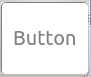
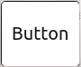
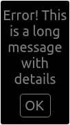
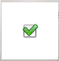
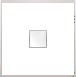
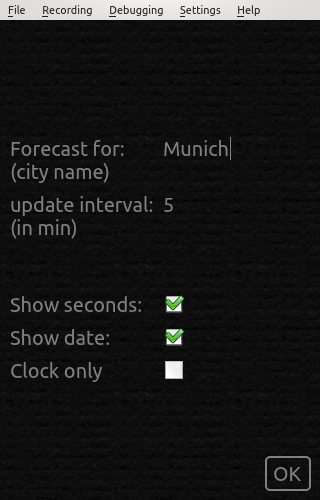

..
    ---------------------------------------------------------------------------
    Copyright (C) 2012 Digia Plc and/or its subsidiary(-ies).
    All rights reserved.
    This work, unless otherwise expressly stated, is licensed under a
    Creative Commons Attribution-ShareAlike 2.5.
    The full license document is available from
    http://creativecommons.org/licenses/by-sa/2.5/legalcode .
    ---------------------------------------------------------------------------

Interactive UI with Multiple Top-Level Windows
==============================================

Now that our application is becoming more complete, we need to add some functionality to make it usable on a daily basis. First of all, we need a real button to quit it and stop using the entire application window for this. Additionally, we need a new top-level window where we can manage configuration settings. When the user changes settings, the application should verify changes and let the user know when something was wrong. While implementing this, we will need some basic UI elements.

A button
--------

The first thing we will do is create a button component. It will be used to quit the application, open the configuration window, close it etc. Our button should have basic visual parameters and send a signal when it is clicked. The button should also give some visual response that it has received user input. Certainly, a button can have many more features. There may be dozens of approaches for implementing a button, but we'll just describe one which suits our needs.

Our button will simply be a click-sensitive rectangle with rounded corners. In previous sections, we saw that an element can receive mouse events if we include a :qt:`MouseArea<qml-mousearea.html>` element and let it fill the entire surface of that element. We are going to use this approach for the button. Additionally, our button has to emit a signal notifying relevant parts of the application that it has been clicked. We will to use Qt Quick signals to implement this. Let's take a look at how they work first.

We already got in touch with a related Qt Quick functionality when we saw that it is possible to implement a handler which reacts on property changes, e.g. the ``status`` property of :qt:`Image<qml-image.html>`:

.. code-block:: js

    Image {
        id: background
        source: "./content/resources/light_background.png"
        fillMode: "Tile"
        anchors.fill: parent
        onStatusChanged: if (background.status == Image.Error)
                             console.log (qsTr("Background image \"") +
                                          source +
                                          qsTr("\" cannot be loaded"))
    }

Signals are very similar to the property notification changes. Signal handlers work the same, whereas they process a signal explicitly emitted in an item instead of a property change. Signal handlers can also receive signal parameters, which is not the case in property change handlers. Emitting a signal is just like calling a function.

This is how it works in the the code of the new ``Button`` component:

(``src/utils/Button.qml`` in ``qt_quick_app_dev_intro_src.zip``, see :ref:`get-primer-source-code` section)

.. literalinclude:: ../src/utils/Button.qml
  :language: js
  :start-after:      ***/

``Button`` defines two signals: ``clicked`` and ``pressedAtXY``. We actually only use ``clicked`` in our application. ``pressedAtXY`` has been added for demonstration purposes. Both signals are emitted in different ways. ``pressedAtXY`` is called from a JavaScript function called as an ``onPressed`` handler. ``clicked`` is connected directly to the ``clicked`` signal of the ``mouseArea`` item. Both ways have their own use cases. A direct signal-to-signal connection allows simple signal forwarding. This is what is needed in our ``Button``, which should behave like a ``MouseArea`` when processing mouse events. In some other cases, you might have the need to add some additional processing before emitting a signal, like in the ``logPresses`` function.

A very important point to note here is the naming of signal parameters. If you take a look at the code of ``mouseArea`` above, you might wonder where the ``mouse`` parameter comes from. We did not declare it in our application. It actually belongs to the definition of ``clicked`` signal in the :qt:`MouseArea<qml-mousearea.html>` element located lnside the Qt Quick system code. The same happens with our ``pressedAtXY`` signal which defines a ``coordinates`` parameter. All items using ``Button`` and processing the ``pressedAtXY`` signal have to access its parameter under the exact same name, e.g.:

.. code-block:: js

    Button {
        id: toggleStatesButton
        ...
        onPressedAtXY: {
            console.log ("pressed at: " + coordinates)
        }
    }

Please also note that we define the ``clicked`` signal as:

.. code-block:: js

      signal clicked (variant mouse)

We do this even though ``mouse`` is of the :qt:`MouseEvent<qml-mouseevent.html>` type (according to the documentation of :qt:`MouseArea<qml-mousearea.html>`). In the current version of Qt Quick, signal parameters can only be of :qt:`basic types<qdeclarativebasictypes.html>`. This should not cause you any concern because they will be converted into appropriate types when they arrive.

For more details about using signals in Qt Quick, see the :qt:`QML Signal and Handler Event System <qmlevents.html>` article in Qt documentation. You should also check the documentation of :qt:`MouseArea<qml-mousearea.html>` as well as the :qt:`QML Mouse Events<mouseevents.html>` article to discover more possibilities such as getting other mouse events, tracing hovering and implementing drag-drop.

As any proper button, our ``Button`` should provide some visual feedback if it has been clicked. We do this by tweaking its colors a bit. We have a small JavaScript function which modifies a color value to a new,     pressed* value. It makes a color darker in our particular case:

.. code-block:: js

    function pressedColor (color) {
        return mouseArea.pressed ? Qt.darker(color, 5.0) : color
    }

We are going to toggle the color of the button border and of its label text. We bind the return value of this function to the border of the button:

.. code-block:: js

    border.color: pressedColor(Style.penColor)

Then we bind it to a color property of its label text:

.. code-block:: js

    color: pressedColor(Style.penColor)

That was it! This is how our ``Button`` looks when unpressed:

and pressed:

A simple dialog
---------------

The ``Dialog`` is another utility component that we need. We will use it to notify the user about critical situations. Our ``Dialog`` is very simple. It pops up on top of another element and just displays a text message which has to be confirmed by clicking the     OK* button. This is the code of the new ``Dialog`` component:

(``src/utils/Dialog.qml`` in ``qt_quick_app_dev_intro_src.zip``, see :ref:`get-primer-source-code` section)

.. literalinclude:: ../src/utils/Dialog.qml
  :language: js
  :start-after:      ***/

The ``Dialog`` is used by adding it as a child item to another element where it will pop-up from:

.. code-block:: js

    Item {
      id: root
      ...

      Dialog {
          id: errorDialog
          width: root.width
          anchors.centerIn: parent
          z: root.z+1
          visible: false
      }
      ...

      Button {
        id: exitButton
        ...
        onClicked: {
          ...
          errorDialog.show (qsTr("The location cannot be empty"));
          ...
        }
      }
      ...
    }

When loaded, the ``Dialog`` initially stays invisible. It goes on top of the its parent (``root`` in the code segment above). ``z: root.z+1`` does this trick. We bind its ``z`` property to a value which is always higher than the value of ``root.z``. Later, we call ``show`` with a message to be displayed. ``show`` makes the ``Dialog`` visible and stores the message text to be displayed. When the user clicks the     OK* button, the ``Dialog`` hides itself again.

.. Note:: The :qt:`TabWidget Example<declarative-ui-components-tabwidget.html>` in Qt documentation shows another approach toward dynamically showing and hiding elements on top of others.

Our ``Dialog`` has a few other features which are useful to know. In order to use the screen space efficiently, it copies the width from its parent. We also set the ``messageText`` property ``wrapMode`` to the ``WordWrap`` value. When the ``Dialog`` opens with a long message text, the message wraps it to the ``Dialog`` width. The ``messageText`` element changes the height the root of ``Dialog`` when its height has changed due to wrapping:

.. code-block:: js

  Rectangle {
    id: root
    ...
    Text {
      id: messageText
      ...
      onPaintedHeightChanged: {
        root.height = messageText.paintedHeight +
                      okButton.height +
                      3    Style.baseMargin
      }
    ...
  }

This is how it looks on the screen:

A checkbox
----------

We can use the :qt:`Text Input<qml-textinput.html>` element to get text or digit based user input, but we need something else for on-off type of settings. Usually, this is done with checkbox UI elements. There is no checkbox element in Qt Quick, and we are going to make it from scratch. It is not a problem at all, it is actually very simple. This is the whole code of our new ``CheckBox`` component:

(``src/utils/CheckBox.qml`` in ``qt_quick_app_dev_intro_src.zip``, see :ref:`get-primer-source-code` section)

.. literalinclude:: ../src/utils/CheckBox.qml
  :language: js
  :start-after:      ***/

Our ``CheckBox`` is based on :qt:`Item<qml-item.html>`. It extends it just by one boolean property called ``checked``. If the box is checked, ``checked`` is ``true``. Otherwise it is ``false``. The entire visual implementation of the ``CheckBox`` consists of two images which are flipped back and forth. This is done by binding the ``source`` property of the ``checkBox`` :qt:`Image<qml-image.html>` item to a checkbox image or to an image of a normal rectangle depending on the ``checked`` property.

This is how our ``CheckBox`` looks on the screen checked and unchecked:

Further on, there is a section of code which includes the handling of the keyboard navigation. This topic will be discussed in the next section.

Handling keyboard input and navigation
--------------------------------------

Another important aspect of interaction with the user is the handling of the keyboard input and navigation. We will explore this while walking through the implementation of the ``Configure`` component based on the new UI components we introduced above.

Meanwhile, we have several hard-coded property values which actually should be changeable by the user:

     Location name for the weather forecast
     Time interval in which the weather data should be updated
     Turning off the display the seconds and the date off to make the clock more compact

The name and the interval require a text input field, others can be implemented with the ``Checkbox``.

Text input is straightforward: Qt Quick provides the :qt:`Text Input<qml-textinput.html>` element for this. We use it to get a new value for the name of the forecast location and the new value for forecast update interval. The :qt:`Text Input<qml-textinput.html>` element binds the captured keyboard input to the ``text`` property. When we load this element in our code, we preset according to ``text`` properties with the ``locationTextInput`` and ``forecastUpdateInterval`` values to display the current settings to the user. Users can start editing and we do not need to take care of any details for text input handling:

.. code-block:: js

  ...
  TextInput {
      id: locationTextInput
      ...
      width: controlElements.width - locationTextInput.x - controlElements.spacing
      text: locationText
      focus: true
  }
  ...
  TextInput {
      id: updateTextInput
      ...
      text: forecastUpdateInterval
      maximumLength: 3
      // we use IntValidator just to filter the input. onAccepted is not used here
      validator: IntValidator{bottom: 1; top: 999;}
  }
  ...

The code above has a few things on top.

``updateTextInput`` uses a validator to limit the length of the text and ensure that we get digits in a proper range.

Location names do not need a validator, but they need something to handle text input which is longer than just a few digits in ``updateTextInput``. This can be achieved limiting the ``width`` to ensure that a long text does not leave the boundaries of the top-level item. If we do not do this and keep ``width`` undefined, :qt:`Text Input<qml-textinput.html>` will expand, follow the entered text and at some time leave the visual boundaries.

.. Note:: If you have a multi-line text which should be edited by the user, you can use the :qt:`Text Edit<qml-textedit.html>` element.

``locationTextInput`` receives the keyboard focus explicitly, because we set ``focus`` to ``true``. When ``Configure`` is loaded, the user can start changing the location name:

The elements :qt:`Text Input<qml-textinput.html>` and our new ``CheckBoxes`` react on mouse clicks. How can user go to form one input elements to another if we would like to support navigation with keyboard keys in addition to the mouse? What should we do if we need to enable keyboard input in ``CheckBoxes`` as well?
.

Qt Quick provides key navigation and raw key processing for these cases. Let's first take a look at key navigation.

These are changes in the code of our two :qt:`Text Input<qml-textinput.html>` elements to support key navigation:

.. code-block:: js

    TextInput {
        id: locationTextInput
        ...
        focus: true
        KeyNavigation.up: offlineCheckBox
        KeyNavigation.down: updateTextInput
    }
    ...
    TextInput {
        id: updateTextInput
        ...
        KeyNavigation.up: locationTextInput
        KeyNavigation.down: secondsCheckBox
    }

``locationTextInput`` explicitly pulls the focus by setting its ``focus property to ``true``. The :qt:`Key Navigation<qml-keynavigation.html>` items provide attached properties which monitor key presses and move of the input focus from one element to another. :qt:`Key Navigation<qml-keynavigation.html>` is a big help in our case where we have many elements and need to organize the movement of the input focus in a certain way.

In the code sample above, the input focus is moved from the ``locationTextInput`` item to the ``updateTextInput`` item if the     down* arrow key is pressed. The focus goes back from ``updateTextInput`` to ``locationTextInput`` if the user presses the *up* key and so on. We add such statements to all relevant elements in the ``Configure`` component.

While processing user input, you sometimes need to capture particular keys. This is the case with our ``Checkboxes``. Working with desktop applications, users have learned that it is possible to toggle a check box with the     space key*. We should implement this feature in our application.

This is where the :qt:`Keys<qml-keys.html>` items can be used. It is basically a kind of signal sender for almost every key on computer keyboards. Its signals have :qt:`KeyEvent<qml-keyevent.html>` as a parameter. It contains detailed information about the key pressed. We use :qt:`Keys<qml-keys.html>` in our checkboxes. The code segment in the previous section uses the attached ``Keys.onPressed`` property, which toggles the ``Checkbox`` state on     Return*, *Enter* and *Space* keys.

More details about keyboard input processing is available in the :qt:`Keyboard Focus in QML<qdeclarativefocus.html>` article in Qt Documentation.

By now we have got all input elements and can process user input. One step is still needed to finish our ``Configure`` component. This is a verification and storing of the new values.

When the user clicks the ``exitButton``, we need to check the new setting values and pass them to the application if they are ok. This is also a place where we use our ``Dialog`` to inform the user that new values are not OK if needed. In this case, the ``Configure`` does not close and stays open until the user provides correct values. See the ``onClicked`` handler of ``exitButton`` in the full code of  ``Configure``:

(``src/components/Configure.qml`` in ``qt_quick_app_dev_intro_src.zip``, see :ref:`get-primer-source-code` section)

.. literalinclude:: ../src/components/Configure.qml
  :language: js
  :start-after:      ***/

.. rubric:: What's Next?

You've probably noticed that the ``offlineCheckBox`` item with the     magical* ``forceOffline`` setting associated with it. This setting is new. It is used to toggle the states in the next version of our application which will be the topic for the next chapter. We also will take a look at animations in Qt Quick and use them to implement some nice effects in the final version of our application.
