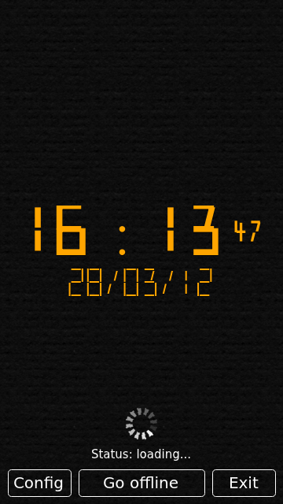
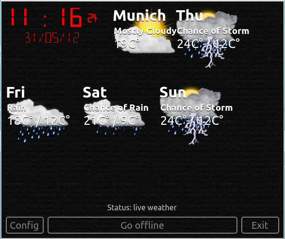

..
    ---------------------------------------------------------------------------
    Copyright (C) 2012 Digia Plc and/or its subsidiary(-ies).
    All rights reserved.
    This work, unless otherwise expressly stated, is licensed under a
    Creative Commons Attribution-ShareAlike 2.5.
    The full license document is available from
    http://creativecommons.org/licenses/by-sa/2.5/legalcode .
    ---------------------------------------------------------------------------

UI Dynamics and Dynamic UI
==========================

In the previous sections, we learned how to add items while developing an application and make them invisible when needed. What should we do if we'd like our applications to look totally different depending on how the data and user input changes? These changes might be aimed toward modifying more then just visibility. This might be quite complex with Qt Quick as we need to change all related elements. How do we make dynamic changes in the application UI visually appealing or even make them a part of the user experience? We have not covered this at all.

Using States
------------

Access to the network is essential for the weather related part of our application in the current version. It visualizes data received from the internet. If your computer is offline and you start the ``clock-n-weather`` application in ``qt_quick_app_dev_intro_src.zip`` (see :ref:`get-primer-source-code` section), you will see just the clock and a lot of empty space around it:

This is because ``WeatherModelItem`` failed to get the weather data. Due to this, there are no model items to display. If you use this application on a notebook or on a mobile device, this situation might occur very frequently. It would be great if our application would be able to handle situations when the network is down. We can accomplish this by using the :qt:`State<qml-state.html>` item provided by Qt Quick.

Each item in Qt Quick has a ``state`` property which holds the name of the current state. There is also a ``states`` property which is a list of :qt:`States<qml-state.html>`. This property contains all states known for that item. Each of the :qt:`States<qml-state.html>` in the list has a string name and defines a set of property values. If required, it can even contain some script code, which is executed when that state becomes the current one. An item can be set to a state just by assigning the name of a selected state to the ``state`` property. See the documentation for :qt:`State<qml-state.html>` and :qt:`QML States<qdeclarativestates.html>` for more details.

We will add three states to the main item of our application:

     * Offline* - It is an initial state in the startup phase. It is also applied if there is no network connection or the if application should stay offline
     * Loading* - A network connection is available, but ``WeatherModelItem`` is still loading weather data. This state is useful on slow network connections (on mobile devices for example).
     * Live Weather* - Updated weather data is available and displayed.

In the Offline* and *Loading* states, the application should show just the clock in a larger size in the middle of the screen. When *Live Weather* is active, the application should show the weather data as well.

As our new states are so closely related to the ``status`` of the ``WeatherModelItem``, we just bind them directly. The ``WeatherModelItem`` does not define any real states. We hijack its ``states`` property to store *Offline*, *Loading* and *Live Weather* values depending on the ``status`` of the ``current`` or ``forecast`` models:

(``src/components/WeatherModelItem.qml`` in ``qt_quick_app_dev_intro_src.zip``, see :ref:`get-primer-source-code` section)

.. literalinclude:: ../src/components/WeatherModelItem.qml
  :language: js
  :start-after:      ***/

The actual states are introduced in the main item, ``WeatherClock``. This item gets two new child items holding all elements to be displayed in states with different visualization:

* ``clockScreen`` item - shows a bigger clock when the main item is in *Offline* or *Loading* state
* ``weatherScreen`` item - shows clock and the weather forecast during the *Live Weather* state, which is basically the same as we had in the ``clock-n-weather`` application.

As a final step, we just bind the states of ``WeatherClock`` to the values of the ``WeatherModelItem`` state:

.. code-block:: js

    ...
    Rectangle {
        id: root
        ...
        state: forceOffline ? "Offline" : weatherModelItem.state
        ...
        states: [
            State {
                name: "Offline"
                PropertyChanges {target: clockScreen; visible: true}
                PropertyChanges {target: weatherScreen; visible: false}
            },
            State {
                name: "Live Weather"
                PropertyChanges {target: clockScreen; visible: false}
                PropertyChanges {target: weatherScreen; visible: true}
            },
            State {
                name: "Loading"
                PropertyChanges {target: clockScreen; visible: true}
                PropertyChanges {target: weatherScreen; visible: false}
                PropertyChanges {target: busyIndicator; on: true}
            }
        ]
    ...
    }

Our :qt:`State<qml-state.html>` definitions contain :qt:`PropertyChanges<qml-propertychanges.html>` items which change the visibility of our new screens and turn on the ``busyIndicator`` in the     Loading* state.

The *Loading* state might be active for quite some time. If the clock does not show seconds, the whole application might appear as if it were hanging. We need a animated busy indicator to show the user that the application is still running. The Qt example :qt:`RSS News Reader<demos-declarative-rssnews-qml-rssnews-content-rssfeeds-qml.html>` provides a very nice one. We can use that with minor modifications. Our ``busyIndicator`` becomes visible in the *Loading* state and informs the user that the application is processing data in the background.

You may have noticed that we use the new ``forceOffline`` setting here, which was first spotted in the last chapter. If ``forceOffline`` is set to ``true``, the application stays in the *Offline* state regardless of changes in ``weatherModelItem``.

If we now change states, changes occur instantly. The application would look more attractive if there were transitions and animation effects applied during state changes. We will take a look at this in the next section.

Adding Animations
-----------------

Animations are not only useful for visual effects. They can also serve as a base for features that could be difficult to get done by other means (for example, our busy indicator mentioned in the last section). Qt Quick provides a very rich animation framework that is simple to use. Covering it in great detail is beyond the scope of this guide, but we can spend some time understanding what animations do and how to start using them.

Generally, all animations manipulate one or more properties of an element, thereby modifying its visual appearance. This modification can have various dynamics and run in various time spans. There can be numerous animations running in parallel or sequentially applied to the same or to different elements. You can start an animation explicitly or implicitly upon a property change. You can also permanently assign an animation to a property so that an animation starts as soon as a property changes. Although there is a generic :qt:`Animation<qml-animation.html>` element, most of the time, you will probably use :qt:`one of the predefined animation elements<qml-animation-transition.html>` provided by Qt Quick. It's very easy to add animations to an application. The major challenge is to find out which animations to use and how to use them to compose the required visual effect.

Animations are very related to :qt:`Transitions<qml-transition.html>`, which defines how an element is transformed from one :qt:`State<qml-state.html>` to another. In most cases, a transition includes an animation.

Qt documentation provides an overview of all animations and transitions, and provides details about using them in the :qt:`QML Animation and Transitions<qdeclarativeanimation.html>` article.

The code segment below shows two transitions between the `Offline` and `Live Weather` states in our application:

.. code-block:: js

    transitions: [
        Transition {
            from: "Offline"
            to: "Live Weather"
            PropertyAnimation {
                target: weatherScreen
                property: "opacity"
                from: 0
                to: 1
                easing.type: Easing.Linear
                duration: 5000
            }
        },
        Transition {
            from: "Live Weather"
            to: "Offline"
            PropertyAnimation {
                target: clockScreen
                property: "opacity"
                from: 0
                to: 1
                easing.type: Easing.Linear
                duration: 5000
            }
        }
    ]

The state changes swap the visibility of the off-line view and the full view with weather data. On top of this, we add an animation which changes the ``opacity`` property. This fades the screen out letting it disappear fully in 5 seconds.

.. Note:: Theoretically, a slight flickering might be visible on the screen in the beginning of transitions as the target element becomes fully visible first and immediately after this its opacity is turned to ``0`` in the beginning of the animation.

The functionality of our *busy* indicator is completely based on animations! There is almost no other code in its implementation:

(``utils/BusyIndicator.qml`` in ``qt_quick_app_dev_intro_src.zip``, see :ref:`get-primer-source-code` section)

.. literalinclude:: ../src/utils/BusyIndicator.qml
  :language: js
  :start-after:      ***/

We load ``BusyIndicator`` as follows:

.. code-block:: js

    // it is off and invisible by default
    BusyIndicator {
        id: busyIndicator
        anchors.horizontalCenter: root.horizontalCenter
        anchors.bottom: statusText.top
        anchors.margins: 10
    }

And this is how it looks in our application when it starts up:

Another animation is used to implement a visual effect on the clock and weather items in the reworked main item of our application. This is discussed in the next section.

Supporting the Landscape Mode
-----------------------------

If our application is to run on a mobile device, it should have a layout of the ``clockScreen`` and ``weatherScreen`` tailored to the landscape display orientation. We do not need many changes in ``clockScreen`` for this, as it contains only one item. Changes in ``weatherScreen`` might be larger...

An interesting approach toward simplifying the implementation is to use :qt:`Flow<qml-flow.html>` instead of the previously used :qt:`Column<qml-column.html>`. :qt:`Flow<qml-flow.html>` arranges its children dynamically depending on its own size. If needed, it wraps children into the appropriate rows and columns.

:qt:`Flow<qml-flow.html>` has one more cool feature. This is the ``move`` property where we can define a :qt:`Transition<qml-transition.html>`, which is applied when the children in a :qt:`Flow<qml-flow.html>` start moving. We use a :qt:`NumberAnimation<qml-numberanimation.html>` applied to the coordinates of the children and select a bounce effect (``Easing.OutBounce``) for ``easing.type``:

.. code-block:: js

    ...
    move: Transition {
        NumberAnimation {
            properties: "x,y"
            duration: 500
            easing.type: Easing.OutBounce
        }
    }
    ...

This is how our application looks on the screen if we resize the main window:

Finalizing the Main Item
-------------------------

We need to rework on the main item to add a few new features. You've seen parts of the related code in this and in the earlier sections. Let's put them all together and take a look at some other details.

First, we take the code from the main item, ``ClockAndWeather.qml`` (see ``clock-n-weather/ClockAndWeather.qml`` in ``qt_quick_app_dev_intro_src.zip``, see :ref:`get-primer-source-code` section) and add animations and transitions as discussed in this chapter.

Additionally, the reworked main item gets three buttons and a status text at the bottom of the screen.

Clicking this ``exitButton`` is now used to quit the application. Clicks inside the ``root`` items are not used for this anymore.

The ``toggleStatesButton`` allows the user to force the *Offline* state. This is useful to use the screen space for a bigger clock by hiding the weather forecast. It prevents regular data transfer over Internet as well.

The ``configureButton`` displays the the ``configure`` element, which holds and manipulates the configuration parameters. The main item just binds them to the appropriate properties of other items. This implements a kind of global application state. We will discuss alternative solutions for this in the last chapter.

The status text is updated upon changes to the states.

The complete code of the new main item looks like this:

(``WeatherClock/WeatherClock.qml`` in ``qt_quick_app_dev_intro_src.zip``, see :ref:`get-primer-source-code` section)

.. literalinclude:: ../src/WeatherClock/WeatherClock.qml
  :language: js
  :start-after:      ***/

.. rubric:: What's Next?

Our application is now complete and you have learned major aspects of Qt Quick!

Certainly, our final application can be enhanced and extended with many features. We selected a minimal subset to cover the scope of this guide without going into too many details. The next and the last chapter discuss a few selected enhancements.
