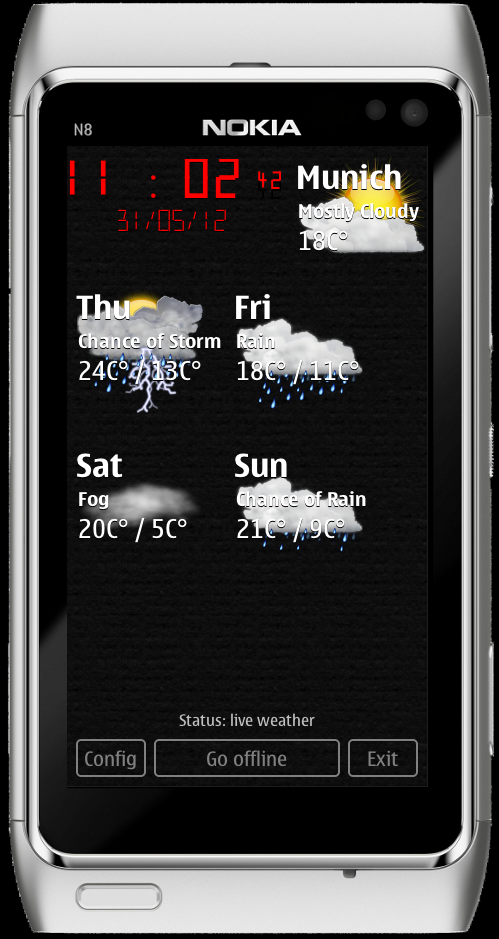
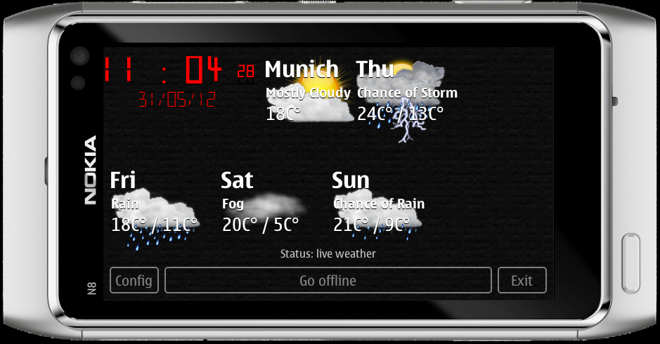

..
    ---------------------------------------------------------------------------
    Copyright (C) 2012 Digia Plc and/or its subsidiary(-ies).
    All rights reserved.
    This work, unless otherwise expressly stated, is licensed under a
    Creative Commons Attribution-ShareAlike 2.5.
    The full license document is available from
    http://creativecommons.org/licenses/by-sa/2.5/legalcode .
    ---------------------------------------------------------------------------

Doing More, Learning More
=========================

.. _porting-primer-to-qt5:

Porting to Qt5
--------------

Qt5 contains a new version Qt Quick: 2.0. Additionally, due to modularization, there are a few changes in the location pre-installed components. We need to make two changes to get our application running on Qt5:

1. Replace ``import QtQuick 1.x`` with ``import QtQuick 2.0``
2. When using ``XmlListModel`` we need to add ``import QtQuick.XmlListModel 2.0``

Porting to a mobile device
---------------------------

It is very easy to get our application running on Symbian Anna or Belle devices as well as on N9.

You can use the template application in Qt Creator while creating a new project. Go the the menu, :menuselection:`File --> New File or Project` and select *Qt Quick Application (Build-In Elements)* project type in the *Applications* project category.

.. Note:: These steps apply to the project wizard in Qt Creator 2.6. The project wizard in older versions of Qt Creator has a slightly different layout

The wizard creates a simple application showing "Hello World", similar to one we discussed at the beginning of this guide. This simple application also contains some C++ code and all other files required to compile and package the application.

You can just replace the "Hello World" QML code with the the final application code. The major steps to do this are:

    * Copy the QML files from the ``WeatherClock`` folder as well as from the ``js``, ``components``, ``content`` and ``utils`` folders (available in ``qt_quick_app_dev_intro_src.zip``; see the :ref:`get-primer-source-code` section) to the ``qml/<name_of_the_project>`` sub-folder in the project folder.

    * Delete the ``main.qml`` file created by the wizard in that folder and rename the ``WeatherClock.qml`` into ``main.qml``

    * Adapt paths to the new location of the QML component and resources:
        * remove "../" in ``imports`` in ``main.qml``
        * remove "../" in front of the value of ``backgroundImage`` in ``./js/style.js``
        * add "../ + " in the front of the ``source`` property value of the ``background`` item in ``Configure.qml`` in the ``components`` sub-folder

    * The current layout and sizes are tailored for devices with 360x640 screen resultion. For example, Nokia N8. If your device has another screen resolution, you need to change all size-related properties accordingly.

That's it! You can now compile and run the application! The is how it looks in the Simulator in portrait and landscape modes:

Enhancements and New Features
------------------------------

    *Better handling of configuration parameters**

We currently keep configuration parameters in the ``Configure`` component, which provides a UI as well. All configuration changes are lost when the user quits the application.

A much better implementation would be to split the ``Configure`` component in a UI element and a configuration item. The latter can be loaded in any other item that needs access to the configuration parameters. The user can change configuration parameters via the new UI element. Loading of default values and saving them before the application quits can be done by a dedicated setting item that uses the :qt:`Offline Storage APIs<qdeclarativeglobalobject.html>`) provided by Qt Quick. The :guides-homepage:`"Qt Quick Application Developer Guide for Desktop"<>` explains this in detail in the *4.2. Store and Load Data from a Database Using Javascript* section. When the application starts for the first time, a set of default values is stored in the database. During the next startup, the values from the database are read and assigned to the appropriate properties of the *configuration item*. All this can be done in the ``onCompleted`` handler in the main item. We can store current configuration parameters before we call ``Qt.quit()`` on click of ``exitButton``.

    *Internationalization**

A new version of the application could be available in multiple languages. We already use the ``qsTr()`` macro. Google weather data can be queried in multiple languages as well. This can save quite some effort. Unfortunately, there is a small issue in our application concerning this. Our weather icons are named after weather condition names in English. If the weather data is in another language, icons will not be found with the current implementation as the file names do not match the condition names. A possible solition would be to use file names in URLs for default icons referred in the weather data as file names for the local icons.

    *Using Mobility APIs to get the current location automatically**

Instead of a predefined location, we could use :mobility:`Mobility API<index.html>` and get the location automatically if the application is running on a mobile device.

    *Using other weather feeds**

It might be a good idea to support at least one additional weather feed. Most of them require registration and in some cases a fee payment as well if the application is used for commercial purposes. You can consider adding other feeds in your version of the application. You can find more information about other weather feeds here:

    * `5 Weather APIs – From WeatherBug to Weather Channel <http://blog.programmableweb.com/2009/04/15/5-weather-apis-from-weatherbug-to-weather-channel/>`_
    * `Add Weather To Your Website With Autobrand® : Weather Underground  <http://www.wunderground.com/autobrand/info.asp>`_
    * `A Weather API Designed for Developers <http://www.wunderground.com/weather/api>`_

.. rubric:: What's Next?

This is the end of the guide! The next chapter concludes it!
