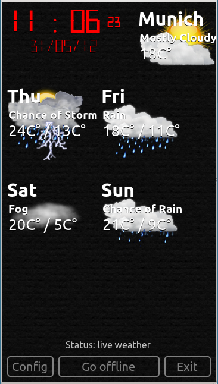

..
    ---------------------------------------------------------------------------
    Copyright (C) 2012 Digia Plc and/or its subsidiary(-ies).
    All rights reserved.
    This work, unless otherwise expressly stated, is licensed under a
    Creative Commons Attribution-ShareAlike 2.5.
    The full license document is available from
    http://creativecommons.org/licenses/by-sa/2.5/legalcode .
    ---------------------------------------------------------------------------

Lesson Learned and Further Reading
==================================

This guide has given you an introduction to application programming in Qt Quick. We've touched all major aspects of Qt Quick by extending the code of a very simple "Hello World" application to become a real application which can be used on a daily basis. This is it:

The main purpose of this guide was to help you to start and show where you can go if you need more details. The guide does not cover all details. This would go far beyond an introduction and would overlap with :qt:`Qt documentation<index.html>` and other resources on the internet.

We did not touch one very import point in detail, but at least mentioned it a few times. This is about using C++ to extend Qt Quick and provide interfaces to existing software systems. The following articles in Qt Documentation are a good start to learn more about this:

     :qt:`QML for Qt Programmers<qtprogrammers.html>`
     :qt:`Using QML Bindings in C++ Applications<qtbinding.html>`
     :qt:`Extending QML Functionality using C++<qml-extending.html>`

In addition to the Qt Quick examples provided with Qt, many other interesting examples are included in the Qt training materials:

     `"Qt Essentials - Qt Quick Edition" <http://qt.nokia.com/learning/online/training/materials/qt-essentials-qt-quick-edition>`_
     `"Qt Quick for Designers" <http://qt.nokia.com/learning/online/training/materials/qt-quick-for-designers>`_

Good luck and have fun using Qt Quick!
