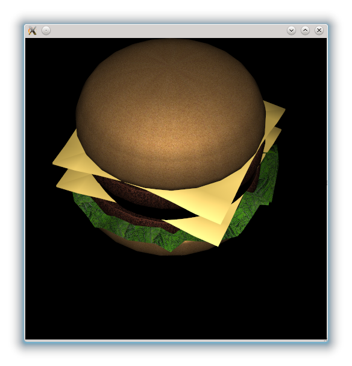

..
    ---------------------------------------------------------------------------
    Copyright (C) 2012 Digia Plc and/or its subsidiary(-ies).
    All rights reserved.
    This work, unless otherwise expressly stated, is licensed under a
    Creative Commons Attribution-ShareAlike 2.5.
    The full license document is available from
    http://creativecommons.org/licenses/by-sa/2.5/legalcode .
    ---------------------------------------------------------------------------

``Hello world`` in Qt3D
=========================

Every scene is rendered into a `Viewport` element which can be used as any Qt Quick element. It can be anchored, have a size and contain any other items:

.. code-block:: js

    // game.qml
    import QtQuick 2.0
    import Qt3D 1.0

    // A Viewport element with defined geometries
    Viewport {
        id: root
        width: 300
        height: 200
    }

When running the code above, a black rectangle is displayed on the screen. It is not that exciting yet... :-)

Loading a model
---------------

In order to fill our empty scene with some exciting stuff, a model will be loaded and placed at the origin (where the `x`,`y` and `z` coordinates are set to `0`) of the scene.

Qt3D has support for some of the most common model formats. For displaying them into a scene, we simply create a `mesh` and apply it to an `Item3D's` mesh property:

.. code-block:: js

    // game.qml
    import QtQuick 2.0
    import Qt3D 1.0

    // A Viewport element with defined geometries
    Viewport {
        id: root
        width: 300
        height: 200

        Item3D {
          id:hamburger
          scale: 0.1
          mesh: Mesh {
              source: "hamburger/models/hamburger.dae"
          }
        }
    }

In this example, we have loaded the geometry from `hamburger.dae` and scaled it to 10% of its original size. After we apply the `source` property, the model-loading process is started. Note that the loaded geometry is not only restricted to vertices and indices, it can also include materials and textures.

When you execute this code,  a hamburger should be displayed in front of the camera. You can viewed from a different perspective by dragging and scrolling the mouse. It looks like this:

Where to get 3D models?
-----------------------

Making 3D models requires quite some effort and sufficient skill. You might want to re-use general or simple 3D models from other projects. Even though there are plenty of sources on the Internet where one can get 3D models, you should proceed carefully check license conditions. Make sure that the author on download page is the real author and you may use this model for your purposes.

Here are some good sources where you search for free good-quality 3D models:

     http://archive3d.net/ : Lots of free and high-quality 3D models, but sometimes the models have too many polygons for a real time application.

     http://sketchup.google.com/3dwarehouse/ : The Google 3D warehouse is probably the best source to get free 3D models on the Internet. Users can publish their self-made models that are usually made using `Google Sketchup <http://sketchup.google.com/>`_. Most models are therefore offered in the Google Sketchup format (.skp). If you want to use them in your application, you first have to convert them to Collada (.dae). The best way to do this is by downloading Google Sketchup and exporting the files from there. There is also an import plugin for 3D Max 2010 that should work fine. The models in the 3D warehouse are of variable quality, but the license is free for commercial use.

     http://thefree3dmodels.com/ : Lots of free high-quality 3D models under the Attribution-Noncommercial-Share Alike 3.0 license.

.. rubric:: What's Next?

In the next chapter, we will see how to use the `Camera` element.
