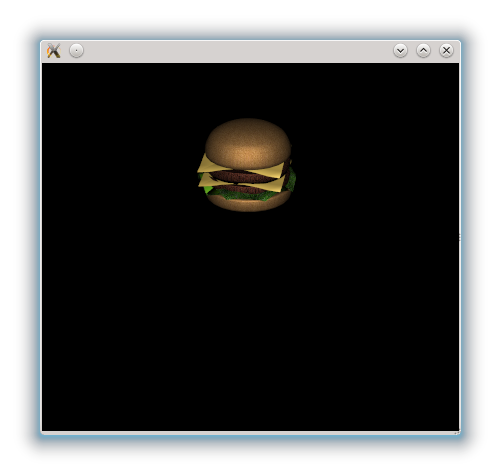

..
    ---------------------------------------------------------------------------
    Copyright (C) 2012 Digia Plc and/or its subsidiary(-ies).
    All rights reserved.
    This work, unless otherwise expressly stated, is licensed under a
    Creative Commons Attribution-ShareAlike 2.5.
    The full license document is available from
    http://creativecommons.org/licenses/by-sa/2.5/legalcode .
    ---------------------------------------------------------------------------

Using a Camera
==============

In the previous chapter we used the `Viewport` element to render a scene with a model placed at the origin. When you look at this 3D scene rendered on your monitor, you still see a 2D picture. Quite some computing is required for this. It is done by OpenGL. A mapping of a 3D scene geometry onto a 2D area on your computer monitor (this area is also called the `viewport`) requires a transformation matrix. This matrix consists of a camera position, a type of projection and a viewing vector. The OpenGL term for this matrix is `modelview-projection matrix`. Please have a look at the :guides-homepage:`OpenGL Tutorial <>` for more details.

Qt3D offers a very convenient way to deal with projections as described above, the :qt5:`Camera <qml-camera.html>` element. The `Camera` element has the properties to define position, projection type, near and far planes. These properties are used as parameters to calculate according modelview-projection matrix and and projection itself.

Animating the Camera's position
-------------------------------

In the next example, we want to use the camera to rotate around our model, which has been placed at the origin.

The only thing we have to do for this is creating a new `Camera` element and assign it to the `camera` property of the :qt5:`Viewport <qml-viewport.html>`. The `eye` property is the position of the camera and the `center` is basically the point in the 3D space at which the camera is looking. The default value is the origin so the property would be dispensable in this example:

.. code-block:: js

  //game.qml
  ...
  Viewport {
  ...
    //The game camera
    camera: Camera {
          id: cam
        property real angle:0
          center: Qt.vector3d(0,0,0)
        eye: Qt.vector3d(20    Math.sin(angle), 10, 20*Math.cos(angle))
        NumberAnimation on angle{
            to: 100
            duration: 1000000
        }
    }
  ...
  }

The rotation around the origin has been created in this example by using the sine and cosine together with a `NumberAnimation` on a custom property called `angle`. The angle is increasing from 0 to 100 over a big enough timespan.

.. rubric:: What's Next?

Next we will see how to use a `Skybox` in order to visualize stars in space.
