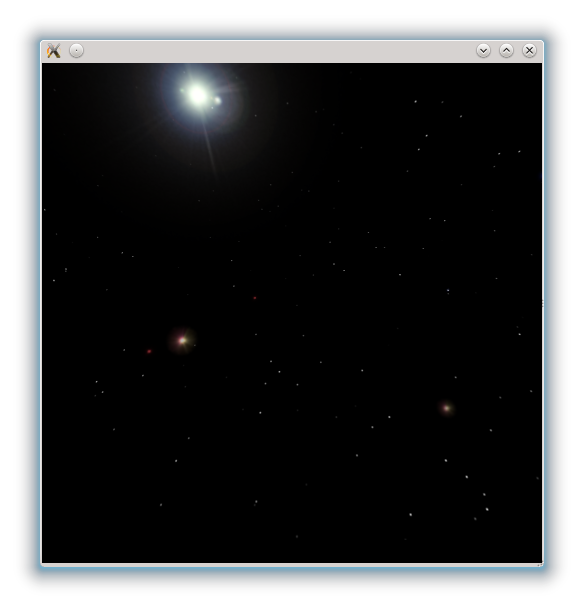

..
    ---------------------------------------------------------------------------
    Copyright (C) 2012 Digia Plc and/or its subsidiary(-ies).
    All rights reserved.
    This work, unless otherwise expressly stated, is licensed under a
    Creative Commons Attribution-ShareAlike 2.5.
    The full license document is available from
    http://creativecommons.org/licenses/by-sa/2.5/legalcode .
    ---------------------------------------------------------------------------

Skybox
======

At the current stage of the development, we have just a     hamburger* and a camera which moves around it. Lets create a feeling of being in the space and add some stars.

There are several ways of accomplishing this. One way is to use Qt Quick particles, specifically one for each star. We can use normal spheres for planets and suns. All these however, are very involved topics that can push us into the realm of topics beyond the scope of this guide. We will go another way and use a technique called     skybox* to model stars and suns.

Skybox is a cube around the camera that creates the illusion of a distant 3D surrounding. A texture is projected on every side of the cube. The skybox usually does not move with the viewer in the 3D scene so it creates the illusion of being very far away. It can be used to render very far away mountains, clouds or, in our case, stars when flying through space. Because a skybox is a 6-sided cube, 6 textures are required - one for every side of the cube.

There are several sources of skybox textures on the internet. The problem is however, that a texture is projected onto a huge area on the screen and therefore has to be in a very high resolution (e.g. 1024x1024) to be of good quality. Because of this, we recommend using applications which are specialized for creating skybox textures:

     `Terragen <http://www.planetside.co.uk/>`_: A terrain generator for photo realistic terrains. It is very easy to use and is available as a feature limited freeware application.

     `Spacecape <http://sourceforge.net/projects/spacescape/>`_: An open source project for creating space skyboxes containing several layers of nebulas, suns and stars.

Fortunately, Qt3D has a built-in element called :qt5:`Skybox <qml-skybox.html>` that does exactly what we are looking for. It takes a source folder which should contain 6 textures. The textures can have a random name but must contain the orientation in the skybox (    north*, *south*, *east*, *west*, *up* and *down*). A texture could have the name `space_west.png`.

.. code-block:: js

    // game.qml
    ...
    Viewport {
    ...
      Skybox{
        //The folder containing the skybox textures
        source: "space"
      }
    ...
    }

The following skybox was made using the `Spacescape`:

.. rubric:: What's Next?

Next we will see how to create the player object and move it in the 3D world.
