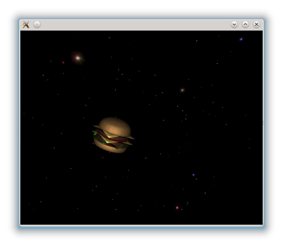

..
    ---------------------------------------------------------------------------
    Copyright (C) 2012 Digia Plc and/or its subsidiary(-ies).
    All rights reserved.
    This work, unless otherwise expressly stated, is licensed under a
    Creative Commons Attribution-ShareAlike 2.5.
    The full license document is available from
    http://creativecommons.org/licenses/by-sa/2.5/legalcode .
    ---------------------------------------------------------------------------

Player Movement
===============

In our game, we want the player to control the     hamburger* movement using the keyboard input. It should be possible to move it from left to right and up and down. Furthermore, the orientation should depend on the current acceleration.

In order to achieve realistic flight behavior, the movement is controlled using some basic movement equations. For the sake of good order, we will be implementing the logic code of our game into a new `Gamelogic.qml` file.

Update-timer
------------

Before we implement the movement equations, we do need an `update` timer that periodically updates the     hamburger*`s position and acceleration. An interval value of *50ms* should be sufficient for achieving fluent movement.

Later on, within the `onTriggereed` signal handler, the movement equations will be processed and the     hamburger* position should be updated.

.. code-block:: js

    //Gamelogic.qml

    import QtQuick 2.0

    Item {

        Timer {
           id: gameTimer
           running: true
           interval: 50
           repeat: true
           onTriggered: {
           ...
            // update position...
           }
        }
    }

Keyinput
--------

To handle the keybord input, we first need to set the value of the `focus` property of the root item to `true` to handle the key events. We also need four new variables (one for each key), which are either set to `true` or `false` depending on the press state of the keys. Within `onPressed` and `onReleased` we handle the eventual key events as shown in the code below:

 This whole construct is necessary because we want to allow the user to press and hold more then one key at a time. We also need four new variables (one for each key), which are either set to `true` or `false` depending on the press state of the keys. Movement processing is then performed in the update-timer's `onTriggered` signal:

.. code-block:: js

  Item {
    ...
    focus: true
    property bool upPressed: false
    property bool downPressed: false
    property bool leftPressed: false
    property bool rightPressed: false

    //Handling of basic key events
    Keys.onPressed: {
        if(event.key == Qt.Key_A)
            leftPressed = true
        if(event.key == Qt.Key_D)
            rightPressed = true
        if(event.key == Qt.Key_W)
            upPressed = true
        if(event.key == Qt.Key_S)
            downPressed = true
        if(event.key == Qt.Key_Space)
            fireLaser();
    }
    Keys.onReleased: {
        if(event.key == Qt.Key_A)
            leftPressed = false
        if(event.key == Qt.Key_D)
            rightPressed = false
        if(event.key == Qt.Key_W)
            upPressed = false
        if(event.key == Qt.Key_S)
            downPressed = false
    }
  }

Later we will perform the movement processing in the update-timer's `onTriggered` signal handler.

Then we have to instantiate the `Gamelogic` component in the main `game.qml` file.

.. code-block:: js

  //game.qml

  Viewport {
    ...
    Gamelogic {id: gameLogic}
    ...
  }

Basic motion equations
----------------------

In the our `SpaceBurger` game, the     hamburger* will be seen from the back (if there is any for a *hamburger*). So we set the camera's eye position to (`0, 0,-30`). The player can then move it on the `y` and `x` axes. To make sure that the *hamburger* will remain in the screen view, we define `x` and `y` boundaries that will restrict the movement. The `x` and `y` bounds could be calculated from the camera parameters, but a we can simply set `4.5` value for the x-bound and `5` value for the y-bound.

.. Note:: The `y` and `x` bound parameters will change with the aspect ratio of the viewport you are using and in general with the camera parameters!

.. code-block:: js

    //game.qml
    ...
    Viewport {
      ...
      property real x_bound: 4.5
      property real y_bound: 5
      ...
    }

To move the     hamburger* object, we will be using the `two basic motion equations for constant acceleration <http://en.wikipedia.org/wiki/Motion_equation#Constant_linear_acceleration>`_ . The motion equations are based on the acceleration, the current speed and the position values.

    //Velocity is acceleration multiplied with time plus the initial speed
    v = a    t + v0
    //Distance is velocity multiplied with time plus the initial distance
    s = v    t + s0

We create a new `Player.qml` file to define the `Hamburger` as a separate component, and calculate its speed and acceleration for the `x` and `y` axes an. Those values are then saved in the `vx`, `vy`, `ax` and `ay` properties as shown in the code below:

.. code-block:: js

    //Player.qml
    import QtQuick 2.0
    import Qt3D 1.0

    Item3D {

        property real vx: 0
        property real vy: 0

        property real ax: 0
        property real ay: 0

        mesh: Mesh { source: "hamburger/models/hamburger.dae" }

        scale: 0.1
    }

Since we can build a tree structure with an `Item3D`, we will define a root `Item3D` for the top level which contains all the visible 3D items of the scene. The `player` object will then be a child of an `Item3D` element. Furthermore, we set the `camera` to a position behind the burger:

.. code-block:: js

    //game.qml

    Viewport {
        ...
        Item3D {
            id: level

            Player {
                id: player
            }
        }

        camera: Camera {
           id: cam
           eye: Qt.vector3d(0, 0,-30)
        }
        ...
    }

We will also define a variable called `maneuverability` in the `Gamelogic.qml` in order to have better control over the flight parameters. A convenient value for the `maneuverability` will be 0.3:

.. code-block:: js

    // Gamelogic.qml
    ...
    property real maneuverability: 0.3
    //The game timer is our event loop. It processes the key events
    //and updates the position of the hamburger
    Timer {
        id: gameTimer
        running: true
        interval: 50
        repeat: true
        onTriggered: {
            //Velocity is updated
            player.vx+=player.ax    0.05
            player.vy+=player.ay    0.05
            //Acceleration is updated
            player.ax=(player.ax+maneuverability    leftPressed
          + maneuverability*rightPressed)/1.1
            player.ay=(player.ay+maneuverability    downPressed
          + maneuverability*upPressed)/1.1
            //Position is updated
            player.position.x += player.vx    0.05
            player.position.y += player.vy    0.05
            //If the player exceeds a boundary, the movement is stopped
            if (player.position.x>x_bound) {
                player.position.x = x_bound
                player.vx = 0;
                if (player.ax>0)
                    player.ax = 0
            }
            else if (player.position.x<-x_bound) {
                player.position.x = -x_bound
                player.vx = 0
                if (player.ax<0)
                    player.ax = 0
            }
            else if (player.position.y<-y_bound) {
                player.position.y = -y_bound
                player.vy = 0
                if (player.ay<0)
                    player.ay = 0
            }
            else if (player.position.y>y_bound) {
                player.position.y = y_bound
                player.vy = 0
                if (player.ay>0)
                    player.ay = 0
            }
        }
    }
    ...

Now we should be able to move the     hamburger* smoothly over the screen and the movement should stop on the viewport boundaries.

.. note:: For a realistic flight behavior, the     hamburger* should turn into the flight direction.

Transformations
---------------

There are currently four transformation types available in the `Qt3D` module: `Rotation3D`, `Scale3D`, `Translation3D` and `LookAtTransform`. The names should be fairly self-explanatory.

One or more transformations can be applied to an `Item3D`'s `transform` or `pretransform` properties. The `pretransform` property however is intended to transform the model before all other transformations, because it may be in an unconventional scale, rotation or translation after loading.

As explained above, we want the     hamburger* to rotate in the flight direction, so we need to achieve three things:

     When moving *hamburger* along the `x` axis (left or right), the *hamburger* should roll a bit into flight direction. (the rotation axis is the `z` axis)

     When moving *hamburger* along the `x` axis (left or right), it should move the nose in flight direction. (the rotation axis is the `y` axis)

     When moving *hamburger* along the `y` axis (up or down), the *hamburger* should move its front up or down. (the rotation axis is the `x` axis)

Now we can add the different transformations to the `transform` property in the  `Player.qml` and specify their axis. We are connecting the angle of each rotation directly to the acceleration, which will have a fairly good-looking result. The scalar factors have been obtained by trial and error:

.. code-block:: js

    //Player.qml
    ...
    transform: [
        Rotation3D {
            angle: -10    ay
            axis: "1, 0, 0"
        },
        Rotation3D {
            angle: 5    ax
            axis: "0, 1, 0"
        },
        Rotation3D {
            angle: -20    ax
            axis: "0, 0, 1"
        }
    ]
    ...

When moving the     hamburger*, you might notice that the rolling behavior is a bit strange. That is because the balance point of the object is not at the origin. We can however correct this very easily by applying a `Translation3D` to the `pretransform` property. In addition to this, the scaling was moved into `pretransform` as well (i.e we have to remove the scale property in the `Player`). Furthermore a rotation of `45°` on the `y` axis was added for aesthetic reasons.

.. code-block:: js

    //Player.qml
    pretransform: [
        Scale3D {
            scale: 0.1
        },
    //Moving the objects origin into the balance point
        Translation3D {
            translate: "0,-1,0"
        },
        Rotation3D {
            angle: 45
            axis: "0, 1, 0"
        }
    ]
    ...

The     *hamburger** object could now be controlled by the player:

.. rubric:: What's Next?

Next we add the `onion rings` to be hit by the player in our game. For this, we will introduce dynamic object creation, collision detection and how to use textures and predefined shapes.
