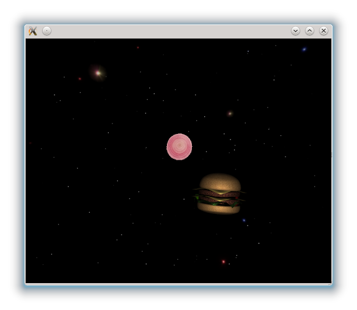

..
    ---------------------------------------------------------------------------
    Copyright (C) 2012 Digia Plc and/or its subsidiary(-ies).
    All rights reserved.
    This work, unless otherwise expressly stated, is licensed under a
    Creative Commons Attribution-ShareAlike 2.5.
    The full license document is available from
    http://creativecommons.org/licenses/by-sa/2.5/legalcode .
    ---------------------------------------------------------------------------

Moving targets
==============

In our `SpaceBurger` game, the flying     hamburger* should hit *onion rings* moving toward the player as targets to increase the player's score. In this chapter, we will see how to implement the *onion rings*.

Onion Rings
-----------

Every     onion ring* will be rendered using a `quad` with a semi transparent texture. To create the `quad`, we'll be using the `Qt3D` `Shapes` module, which comes with many predefined shapes such as `quads`, `cylinders`, `teapots` etc.

So first, we create a new `Target.qml` file to implement the     onion ring component* which consist of a `Quad` element:
.. code-block:: js

.. code-block:: js

    //Target.qml

    import QtQuick 2.0
    import Qt3D 1.0
    import Qt3D.Shapes 1.0

    Quad {
      id: root
    }

The `Quad` element is lying on the `(x,z)` plane by default. However, to face the camera, we need to apply a pretransform as follows:

.. code-block:: js

    //Target.qml
    ...
    Quad {
      id: root

      pretransform: [
         Rotation3D { axis: "1,0,0"; angle: 90}
      ]
    }

We also want to apply a semi transparent texture onto the `quad` where only the     onion ring* part of the texture is visible. That means, however, that we need an image format that supports transparency. `PNG` format is a convenient choice.

Furthermore, we want to have some transparency on the non transparent parts of the     onion ring*. For that we add a :qt5:`Material <qml-material.html>`  with a `diffuseColor` that has an `alpha` value of `0.9` so that *onion ring* is slightly transparent. We also want to have the *onion ring* glowing a bit, so we add a red `emittedLight`:

.. code-block:: js

  //Target.qml
  ...
  Quad {
      ...
    effect: Effect {
         blending: true
         material: Material {
           textureUrl: "onion.png"
           emittedLight: Qt.rgba(1,0.8,0.8,1)
           diffuseColor: Qt.rgba(1,1,1,0.9)
         }
      }
      ...
    }

Since we are using blending for the transparent objects, we have to consider few things: First of all the blending property in the `Effect` has to be set. This will also override the viewport specific setting for `alpha` blending. When using blending, items have to be painted from back to front. This means that items which are farther away from the viewer have to be painted first, which requires to sort the items. Fortunately, `Qt3D` does this for us automatically if we set the `sortChildren` property to `BackToFront` in the parent `Item3D` element.

.. code-block:: js

    //game.qml
    ...
    Item3D {
         id: level
         sortChildren: Item3D.BackToFront
         ...
    }
    ...

.. note:: `BackToFront` sorting works only for one hierarchy level. This means only direct children of an `Item3D` are sorted and not the children's children.

Once a `Target` is created, it should immediately start moving toward the player. We can achieve this by a adding a `NumberAnimation` on the `z` property of the `Quad`.

.. code-block:: js

    //Target.qml
    ...
    Quad{
      ...
      NumberAnimation on z{
           running: true
           duration: 10000
           from: 200
           to: -30
      }
      ...
  }

You can now test the `Target` component by manually adding it to the level. It should then be created in the distance and fly towards the player. However, later we should create `Target` objects dynamically.

.. code-block:: js

    //game.qml
    ...
    Item3D {
         id: level
         ...
         Target { }
         ...
    }
    ...

Collision-detection
-------------------

Collision-detection is not yet supported by `Qt3D` and it is not possible to get a bounding box of an `Item3D`. But still, we can implement a simple collision detection on our own.

A collision test is only performed between two objects (i.e. in our game, a collision only occurs between the     onion ring* and the *hamburger* and between the weapon fire and the enemy or player). But since we will also be using collision detection for other items, we will create a new component in a `BasicGameItem.qml` file, which implements the collision detection. This component will be used as a parent item for all the components that need to implement a collision detection.

To archieve the detection we will proceed as follows:

     A target is specified for which the collision test is performed.

     The target element has to define a `radius` property that specifies the size of the object.

     The `BasicGameItem` should define a `radius` that specifies the size of the item.

     Every time a `positionChanged` signal is emitted, a test for collision takes place.

     If a collision is detected, a `collisionDetected` signal is emitted and `BasicGameItem` is destroyed afterwards.

And here is how our code looks like:

.. code-block:: js

  //BasicGameItem.qml
  import QtQuick 2.0
  import Qt3D 1.0

  Item3D {
      id: gameItem

      signal collisionDetected(variant object)

      property variant collisionTarget: 0

      property real radius: 0.5

      //Test for a collision between the item and the target
      function testCollision(){
      if (Math.pow(x-collisionTarget.x,2)+Math.pow(y-collisionTarget.y,2)
          + Math.pow(z-collisionTarget.z,2)
          < Math.pow(radius+collisionTarget.radius,2)) {
          return true;
      }
      return false;
      }

      onPositionChanged: {
      if (collisionTarget!=0) {
          if (testCollision()) {
          collisionDetected(gameItem)
          gamenItem.destroy()
          }
      }
      }
  }

Now, the `Target.qml` file will look like this:

.. code-block:: js

  // Target.qml

  BasicGameItem {
      id: root
      Quad {
      pretransform: [
          Rotation3D { axis: "1,0,0"; angle: 90}
      ]

      effect: Effect {
          blending: true
          material: Material {
          textureUrl: "onion.png"
          emittedLight: Qt.rgba(1,0.8,0.8,1)
          diffuseColor: Qt.rgba(1,1,1,0.9)
          }
      }
      }
      NumberAnimation on z{
      running: true
      duration: 10000
      from: 200
      to: -30
      onRunningChanged: {
          if (running == false)
          root.destroy()
      }
      }
  }

Make sure you use the `NumberAnimation` on the `BasicGameItem` and not on the `Quad`. Otherwise the detection will fail.

The collision target of our `Target` component will be the `Player` object. So we have to define a `radius` property for in the `Player` component.

.. code-block:: js

  //Player.qml

  Item3D {
    ...
    property real radius: 1.5
    ...
  }

Dynamic Object Creation
-----------------------

As explained above, the     onion ring* targets need to be created dynamically.
For that we will use a timer in `Gamelogic.qml` to create new target every 4 seconds that flies towards the player.

To create new `Target` objects, we need first to load the `Target` component. Then, we can create an instance of our `Target` component using the `createObject` method. Since we want to reuse the component several times, we will load it when starting the application in `GameLogig.qml`.

.. Note:: If the component is loaded over the network, we first need to wait for the component to be ready before calling `createObject`

First, we define two properties in `game.qml` to store the `score` and to  count the number of targets:

.. code-block:: js

    //game.qml
    ...
    property int score: 0
    property int targetCount: 0
    ...

Then we implement the target timer in the `GameLogic.qml`.

.. code-block:: js

    //GameLogic.qml
    ...
    property variant targetComponent: Qt.createComponent("Target.qml");
    ....
    //Timer creates targets in a certain interval
    Timer {
        id: targetTimer
        interval: 4000
        repeat: true
        running: true
        onTriggered: {
        targetCount++
        var object = targetComponent.createObject(level,
             {"position.x": (Math.random()-0.5) *8,
            "position.y":  (Math.random()-0.5) *6,
            "scale": 3-0.2*targetCount, "collisionTarget": player})
        object.collisionDetected.connect(targetCollision)
        }
    }

Once the object is created, we connect the `collisionDetected` signal to a function called `targetCollision` where the `score` property defined earlier is incremented by one.

.. code-block:: js

    //GameLogic.qml
    ...
    Item{
      function targetCollision(sender) {
           score++;
      }
      ...
    }

.. rubric:: What's Next?

Next we will see how to use `States` to handle the flow of our game.
