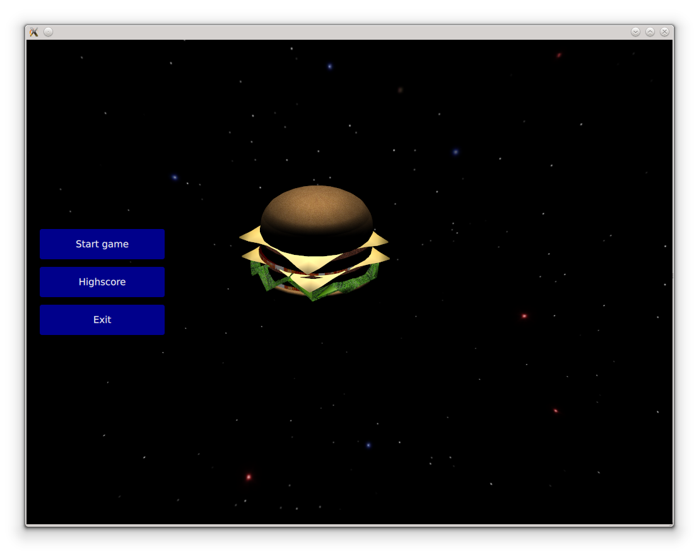

..
    ---------------------------------------------------------------------------
    Copyright (C) 2012 Digia Plc and/or its subsidiary(-ies).
    All rights reserved.
    This work, unless otherwise expressly stated, is licensed under a
    Creative Commons Attribution-ShareAlike 2.5.
    The full license document is available from
    http://creativecommons.org/licenses/by-sa/2.5/legalcode .
    ---------------------------------------------------------------------------

Game Menu
=========

In this chapter we will be implementing the game menu. With Qt Quick it's easy to mix 2D and 3D elements which enables us to add basic UI to our game.

Head-up display
---------------

A Head-up display (HUD) usually shows information to the player about the current game state and the player's conditions. There are actually three things we want to display: the level of the laser's energy, the hit points and the score.

So first we add the following properties to the player:

.. code-block:: js

    //Player.qml
    ...
    property int hitpoints
    property real maxHitPoints: 10

    property int energy
    property int maxEnergy: 2000
    ...

Then we want to display two `energy` bars. A red one in the center to show the player's hit points and a blue one to show the laser's energy left. The current score is displayed in the upper left corner of the viewport. To archieve that, we add a new `Hud.qml` file that consist of an `Item` containing two `Rectangles` that present the bars, and a `Text` element to display the score.

.. code-block:: js

    //Hud.qml
    import QtQuick 2.0

    Item {
        id: hud
          anchors.fill: parent

          Text {
              anchors.left: parent.left
              anchors.top: parent.top
              anchors.margins: 10
              text: "Score: " + score;
              style: Text.Raised
              font.pixelSize: 20
              color: "green"
          }

          Rectangle {
              anchors.top: parent.top
              anchors.topMargin: 20
              anchors.horizontalCenter: parent.horizontalCenter
              width: parent.width/2
              height: 15
              color: "transparent"
              border.color: "red"
              Rectangle{
                    anchors.left: parent.left
                    anchors.top: parent.top
                    anchors.bottom: parent.bottom
                    width: parent.width*player.hitpoints/player.maxHitPoints;
                    color: "red"
              }
          }

          Rectangle {
              anchors.right: parent.right
              anchors.rightMargin: 20
              anchors.verticalCenter: parent.verticalCenter
              height: parent.height/3
              width: 10
              color: "transparent"
              border.color: "blue"
              Rectangle{
                    anchors.right: parent.right
                    anchors.left: parent.left
                    anchors.bottom: parent.bottom
                    height: parent.height*player.energy/player.maxEnergy;
                    color: "blue"
              }
          }
  }

Then we instantiate the `HUD` in `game.qml` as follows:

.. code-block:: js

  //game.qml
  ...
  Viewport {
    ...
    //Head up display
    Hud {id: hud}
    ...
  }

Game menu
---------

Once the game is started, a menu should be displayed. This menu consists of a button group containing three buttons: `start`, `highscore` and `exit`. While the menu is displayed, the     hamburger* is rotating in the background. When clicking on the "start" button, the game starts and the camera is moved behind the *hamburger*. When clicking on the "highscore" button, a new rectangle will appear and displays the highscores in a `ListView`. To exit the game the player can simply click on the *exit* button.

Before we start implementing the menu, we first have to define two missing camera movements. One is the rotation of the     hamburger* while the game menu is displayed and the other moves the camera behind the *hamburger* when we start the game:

.. code-block:: js

    //game.qml
    ...
    //The game camera
    camera: Camera {
        id: cam
        property real angle:0;
        eye: Qt.vector3d(20    Math.sin(angle), 10, 20*Math.cos(angle))
        NumberAnimation on angle{
            id: hamburgerRotation
            to: 100
            running: false
            duration: 1000000;
        }
        PropertyAnimation on eye {
            id: moveBehindHamburger
            to: Qt.vector3d(0, 0,-30)
            duration: 2000
            running: false
        }
    }
    ...

Then we define a new button component in a new `Button.qml` file:

.. code-block:: js

    //Button.qml
    import QtQuick 2.0

    //Creates a simple button that has an attribute buttonText
    Rectangle {
          id:rootI
          width: 200;
          height: 50;
          signal buttonClicked();
          property variant buttonText;
          radius: 5
          border.color: "black"
          border.width: 2
          color: "darkblue"
          opacity: 1
          MouseArea {
              hoverEnabled: true;
              anchors.fill: parent;
              onClicked: buttonClicked();
              onEntered: border.color="white"
              onExited: border.color="black"
          }
          Text {
              anchors.centerIn: parent;
              text:  buttonText;
              color: "white"
          }
    }

Next we create our menu component in a `Menu.qml` file. The menu consists of an `Item` with a `Column` containing three buttons. When a button is clicked, the appropriate state will be set in the root element (the viewport):

.. code-block:: js

  //Menu.qml
  import QtQuick 2.0

  Item {
      visible: false
      anchors.fill: parent
      //The button group
      Column {
          id: buttonGroup
          anchors.verticalCenter: parent.verticalCenter;
          anchors.left: parent.left;
          anchors.leftMargin: 20
          spacing: 10

        Button {
            buttonText: "Start game"
            onButtonClicked: root.state="Game"
        }

        Button {
            buttonText: "Highscore"
            onButtonClicked: root.state="Highscore"
        }

        Button {
            buttonText: "Exit"
            onButtonClicked: Qt.quit()
        }

    }
  }

Then we add the menu to the `Viewport` in `game.qml`.

.. code-block:: js

  //game.qml
  ...
  Viewport {
    ...
    Menu {id: gamemenu}
    ...
  }

To save the highscore table, we will use an `SQLite` database. We will avoid discussing the detail how to `SQLite` in QML. For more detail please refer to the `Qt Quick Desktop Guide <http://qt.nokia.com/learning/guides>`_.

For that, we create a new `gameDB.js` Stateless JavaScript library. This means that only one instance will be created for all QML file including it. The library defines the database logic as shown in the code below:

.. code-block:: js

  // gameDB.js

  //making the gameDB.js a stateless library
  .pragma library

  .import QtQuick.LocalStorage 2.0 as Sql

  // declaring a global variable for storing the database instance
  var _db

  //Opens the database connection
  function openDB() {
      print("gameDB.createDB()")
      _db = Sql.openDatabaseSync("SpaceburgerDB","1.0","The Spaceburger Database"
        ,1000000);
      createHighscoreTable();
  }

  //Creates the highscore table
  function createHighscoreTable() {
      print("gameDB.createTable()")
      _db.transaction( function(tx) {
    tx.executeSql("CREATE TABLE IF NOT EXISTS "
        +"highscore (score INTEGER, name TEXT)");
              });
  }

  //Reads the first 10 elements of the highscoretable and returns them as an array
  function readHighscore() {
      print("gameDB.readHighscore()")
      var highscoreItems = {}
      _db.readTransaction( function(tx) {
              var rs = tx.executeSql("SELECT name, score FROM "
             +"highscore ORDER BY score DESC LIMIT 0,10");
              var item
              for (var i=0; i< rs.rows.length; i++) {
          item = rs.rows.item(i)
          highscoreItems[i] = item;
              }
          });

      return highscoreItems;
  }

  //Saves an element into the highscore table
  function saveHighscore(score, name) {
      print("gameDB.saveHighscore()")
      _db.transaction( function(tx){
          tx.executeSql("INSERT INTO highscore (score, name) "
         +"VALUES(?,?)",[score, name]);
              });

  }

Next we create the highscore table in `Menu.qml`:

.. code-block:: js

  //Menu.qml
  Item {
    ...
    ListModel {
        id: highscoreModel;
    }

    Component.onCompleted: {
        GameDB.openDB();
    }

    Rectangle {
        visible: root.state=="Highscore"
        anchors.left: buttonGroup.right
        anchors.right: parent.right
        anchors.bottom: parent.bottom
        anchors.top: parent.top
        anchors.margins: 50
        radius: 5
        border.color: "black"
        border.width: 2
        color: "darkblue"
        opacity: 0.7
        Text {
            id: title
            anchors.top: parent.top
            anchors.horizontalCenter: parent.horizontalCenter
            anchors.topMargin: 20
            text: "Highscore"
            font.bold: true
            font.pointSize: 15
            color: "white"
        }
        //The highscore table
        ListView {
              id: highscore
            anchors.top: title.bottom
            anchors.topMargin: 50
            anchors.verticalCenter: parent.verticalCenter
            width: parent.width-70
            height: parent.height-title.height-50
            model: highscoreModel;
            delegate: Item {
                anchors.left: parent.left; anchors.right: parent.right
                    anchors.margins: 40
                height: 30
                Text{anchors.left: parent.left;   text: name;  font.bold: true;
                    font.pointSize: 20; color: "white"}
                Text{anchors.right: parent.right; text: score; font.bold: true;
                    font.pointSize: 20; color: "white"}
            }
        }
     }
  }

As you might have noticed, we have created an empty `ListModel` and used it in the `ListView`. Next we are going to populate this model with the data we get out of the SQL table through the `readHighscore()` function.

The first thing to do is to import the library:

.. code-block:: js

  //Menu.qml
  import "gameDB.js" as GameDB

Now we can read the data from the highscore table. We will do that in the `onVisibleChanged` signal handler of the highscore item, so that an update will occur every time the highscor is displayed.

We use the `GameDB's` `readHighscore()` function to read the highscore table from the databse parse it into the `ListModel` we have already defined:

.. code-block:: js

  //Menu.qml
  ...
        onVisibleChanged: {
            if (visible == true) {
                var highscoreTable=GameDB.readHighscore();
                highscoreModel.clear();
                for (var i in highscoreTable) {
                    print(highscoreTable[i])
                    highscoreModel.append(highscoreTable[i]);
                }
            }
        }

Adding a new highscore into the SQL table is possible once the game has been finished. A dialog is displayed that asks the player to enter his name. The name and the score will then be saved. The code of the dialog is implemeted into `HighscoreDialog.qml` as follows:

.. code-block:: js

  //HighscoreDialog.qml
  import QtQuick 2.0
  import "gameDB.js" as GameDB

  Rectangle{
      anchors.verticalCenter: root.verticalCenter
      anchors.horizontalCenter: root.horizontalCenter
      height:170
      width:270
      radius: 5
      border.color: "black"
      border.width: 2
      color: "darkblue"
      opacity: 0.7
      visible: false
      Text{
          id: title
          anchors.horizontalCenter: parent.horizontalCenter
          anchors.top: parent.top
          anchors.topMargin: 15
          text: "Enter your name:"
          font.pointSize: 17
          color: "white"
      }

      Rectangle{
          id: input
          anchors.horizontalCenter:  parent.horizontalCenter
          anchors.top:  title.bottom
          anchors.topMargin: 15
          height: 40
          width: 200
          radius: 2
          color: "lightgray"
          clip: true
          TextInput{
              id: inputField
              anchors.fill: parent
              color: "black"
              text: "Name..."
              font.pointSize: 17
          }
      }

      Button {
          anchors.bottom: parent.bottom;
          anchors.bottomMargin: 15
          anchors.right: parent.right
          anchors.rightMargin: 15
          buttonText: "OK"
          onButtonClicked: {
              GameDB.saveHighscore(score, inputField.text)
              root.state="Menu"
          }
      }
  }

.. code-block:: js

  //main.qml
  ...
  HighscoreDialog {id: highscoreDialog}
  ...

We now can update our states:

.. code-block:: js

    states:[
        State{
            name: "Menu"
            PropertyChanges {target: player; ax: 0; ay: 0; vx: 0; vy:0;
                                position: Qt.vector3d(0, 0, 0);  hitpoints: 2;
                                energy:2000;  restoreEntryValues: false}
            PropertyChanges {target: root; score: 0; targetCount:0;
                                restoreEntryValues: false}
            PropertyChanges {target: cam; center: Qt.vector3d(0, 0, 0) }
            PropertyChanges {target: gamemenu; visible: true;}
            PropertyChanges {target: hamburgerRotation; running: true;}
            PropertyChanges {target: hud; visible: false;}
        },
        State{
            name: "Highscore"
            extend: "Menu"
        },
        State{
            name: "EnterHighscore"
            PropertyChanges {target: hud; visible: true;}
            PropertyChanges {target: highscoreDialog; visible: true;}
        },
        State{
            name: "Game"
            PropertyChanges {target: moveBehindHamburger; running: true;}
            PropertyChanges {target: hud; visible: true;}
        },
        State{
            name: "BossFight"
            PropertyChanges {target: hud; visible: true;}
            PropertyChanges {target: player; ay: 0; vy:0;
        position: Qt.vector3d(0, 0, 0); restoreEntryValues: false}
        },
        State{
            name: "BossRotation"
        }
    ]

.. rubric:: What's Next?

Next we implement the boss enemy that should appear at the final level.
