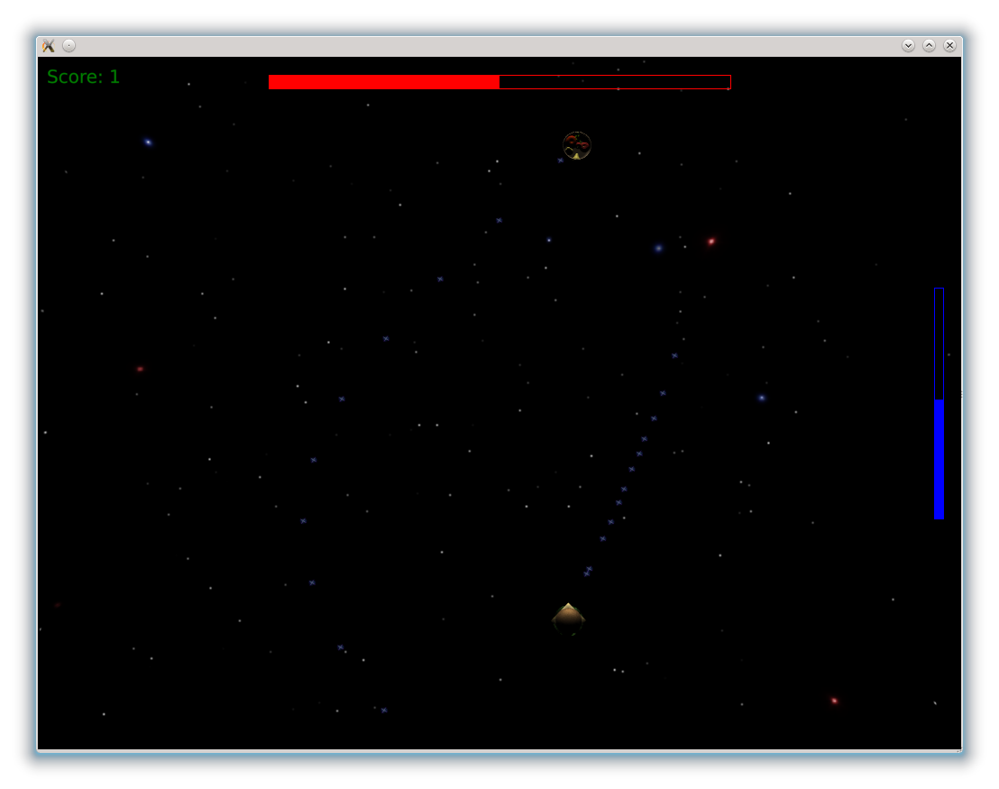

..
    ---------------------------------------------------------------------------
    Copyright (C) 2012 Digia Plc and/or its subsidiary(-ies).
    All rights reserved.
    This work, unless otherwise expressly stated, is licensed under a
    Creative Commons Attribution-ShareAlike 2.5.
    The full license document is available from
    http://creativecommons.org/licenses/by-sa/2.5/legalcode .
    ---------------------------------------------------------------------------

Boss enemy
==========

The boss enemy appears at the end of a level after a certain number of targets has been passed.

Unlike in the first part of the level, the player observes the fight not from the back of the     hamburger*, but from the top. That also means the *hamburger* (and the enemy) can only be moved on the x-axis. At the beginning of the fight, we have to set the `y` value to `0`, which we already did when we defined the states.

Camera movement
---------------

The camera will start moving when the enemy has arrived at its final position, in front of the player. To accomplish this, a `SequentialAnimation` is started which moves the camera's `center` to the enemy's position. After that, the camera pans around the enemy and at the end moves the `eye` to the top of the scene and adjusts the camera's `center` to the middle of the fighting scene.

After the animation is finished, the start of the fight is triggered by setting a new state for the root item:

.. code-block:: js

    //game.qml
    ...
    Viewport {
      ...
      SequentialAnimation {
      id: rotateAroundBoss
      running: false
      PropertyAnimation{
          target: cam
          properties: "center"
          to: enemy.position
          duration: 400
      }
      PropertyAnimation{
          target: cam
          properties: "eye"
          duration: 2000
          to: Qt.vector3d(30,5,50);
      }
      PropertyAnimation{
          target: cam
          properties: "eye"
          duration: 2000
          to: Qt.vector3d(-30,5,50);
      }
      PropertyAnimation{
          target: cam
          properties: "eye"
          duration: 1000
          to: Qt.vector3d(0,5,0);
      }
      ParallelAnimation {
          PropertyAnimation{
          target: cam
          properties: "eye"
          duration: 2000
          to: Qt.vector3d(0, 140, -1);
          }
          PropertyAnimation{
          target: cam
          properties: "center"
          running: false
          duration: 1000;
          to: Qt.vector3d(0,0,20);
          }
      }
      onRunningChanged: {
          if (running==false) {
          root.state="BossFight"
          }
      }
      }
   }

We can also add the animation to the states:

.. code-block:: js

    //game.qml
    ...
        State{
            name: "BossRotation"
        PropertyChanges {target: rotateAroundBoss; running: true }
        }
    ...

Movement
--------

For the boss enemy, we create `Enemy.qml`.

It uses the  `Fruits.3ds` model, which has to first be pretransformed in order for it to fit into our scene:

.. code-block:: js

    //Enemy.qml
    import QtQuick 2.0
    import Qt3D 1.0

    //Creates an enemy
    Item3D {
    id: enemy

    //Size of the object for the collision detection
    property real radius: 1.5

    mesh: Mesh { source: "Fruits/Fruits.3ds"; options: "ForceSmooth";}

    pretransform : [
        Rotation3D {
        angle: -180
        axis: Qt.vector3d(0, 1, 0)
        },
        Scale3D {
        scale: 0.01
        }
    ]
    }

The enemy will be created after ten targets have been passed so we have to extend the `targetTimer` code and add the boss enemy component:

.. code-block:: js

     //Gamelogic.qml
     ...
     property variant bossEnemyComponent: Qt.createComponent("Enemy.qml")
     ...
     Timer {
        id: targetTimer
    ...
    onTriggered: {
        var component;
        //After a certain amount of targets were created the boss enemy appears
        if (targetCount>10) {
            targetTimer.stop()
            enemy = bossEnemyComponent.createObject(level)
        }
        //Targets are constantly created and fly towards the player
        else {
            targetCount++
            var object = targetComponent.createObject(level,
            {"position.x": (Math.random()-0.5) * 8,
            "position.y":  (Math.random()-0.5) * 6,
            "scale": 3-0.2*targetCount,
            "collisionTarget": player})
            object.collisionDetected.connect(targetCollision)
        }
    }
    }
    ...

Furthermore, we are adding a property called     enemy* to `main.qml` to be able to easily access the object:

.. code-block:: js

    //game.qml
    ...
    Viewport {
      ...
      property variant enemy
      ...
    }

When the enemy is created, it will approach the player, stop at a distance of 40, and afterwards, set a new state for the root element which will trigger the camera movement.

.. code-block:: js

    //Enemy.qml
    ...
    //Animation which moves the the enemy towards the player
    NumberAnimation on z{
    running: true
    duration: 10000
    from: 200
    to: 40
    onRunningChanged: { if (running == false) root.state="BossRotation" }
    }
    ...

The enemy will simply move from left to right and fire in constant intervals. Both the `SequentialAnimation` and the `Timer` will only run if the root item is in the `BossFight` state.

.. code-block:: js

    //Enemy.qml
    ...
    Item3D {
      ...
      //The enemy movement
      SequentialAnimation {
      id: bossMovement
      running: root.state=="BossFight"
      loops: Animation.Infinite
      PropertyAnimation{
          target: enemy
          properties: "x"
          duration: 5000
          to: -16
          easing.type: Easing.InOutSine
      }
      PropertyAnimation{
          target: enemy
          properties: "x"
          duration: 5000
          easing.type: Easing.InOutSine
          to: 16
      }
      }

      Timer {
      id: shootTimer
      interval: 1000
      repeat: true
      running: root.state=="BossFight"
      onTriggered: {
          shootLaser()
      }
      }
    }

Because we use a `SequentialAnimation` here, more complex movements could be implemented (for example the enemy flying in circles or at altering speed).

Weaponfire
----------

We use a very popular technique called     Billboarding* for bullets that are fired from and at the enemy. It adjusts an item's orientation so that it always faces the camera. *Billboarding* is very often used for particle effects, (distant) vegetation or just to cut down polygons on far away 3D Objects. Usually a billboard consists of a rectangle that is always facing the camera, but any arbitrary 3D Object could be used for that.

In Qt3D there are two methods available that create billboard items. One of them is the `BillboardItem3D` which uses a very fast way for creating billboards that face the camera plane. This element however has some restrictions, whereas scaling and rotating of an item is not possible. Because of that we take the `LookAtTransform` for creating a billboard that faces the camera.

.. code-block:: js

    //Bullet.qml
    Quad{
        //defines the shadereffect, that should be used for the item
        effect: lasereffect
        transform: [
            Rotation3D{
                angle: 90
                axis: Qt.vector3d(1, 0, 0)
            },
            LookAt{ subject: camPos}
        ]
        //wrapper around the camera position
        Item3D { id: camPos
        position: cam.eye
    }
    }

We are using a `Quad` for our particle effect, that has to be rotated first, because it is lying in the x,z plane. Afterwards the `LookAt` transformation is applied, which takes an `Item3D` as `subject`. That is why we have to embed the camera's position into a `Item3D` before assigning it to the `LookAt` transform. The subject is the item, that should be looked at.

For now, we will just create a simple `Effect` for each bullet, i.e. a semitransparent texture is mapped on top of the quad.

.. code-block:: js

  Effect {
      id: lasereffect
      blending: true
      material: Material {
    textureUrl: "bullet.png"
      }
  }

We will reuse the collision detection, which we already built in the previous section, for the bullets. The difference between the bullet and the onion rings is that a bullet has a direction and a velocity that can both depend on the entity that shoots the bullet or power ups that the player has collected. We therefore have to implement a new animation that handles the movement of the bullet. Again, it is very important to only animate the position of the `BasicGameItem` and not the `Quad`. Otherwise collision detection will not work.

.. code-block:: js

    //Bullet.qml
    import QtQuick 2.0
    import Qt3D 1.0
    import Qt3D.Shapes 1.0

    //This item represents a laser particle
    BasicGameItem{
    id: bullet
    property variant dir: Qt.vector3d(0,0,1)
    property real speed: 100;
    Quad{
        //defines the shadereffect, that should be used for the item
        effect: lasereffect
        transform: [
        Rotation3D{
            angle: 45
            axis: Qt.vector3d(1, 0, 0)
        },
        LookAt{ subject: Item3D { position: cam.eye} }
        ]
        Effect {
        id: lasereffect
        blending: true
        material: Material {
          textureUrl: "laser2.png"
          emittedLight: Qt.rgba(1,0.8,0.8,1)
        }
        }
    }
    //The movement of the bullet
    PropertyAnimation on position {
        to: Qt.vector3d(x+speed*dir.x, y+speed*dir.y, z+speed*dir.z);
        duration: 10000
        onRunningChanged:  {
        //When the bulletanimation is finished and no target has been hit
        if (running==false) {
            bullet.destroy();
        }
        }
    }
    }

We have now got bullets with a working collision detection that move in a direction that can be specified. The feature that is still missing is the firing mechanism for the bullets. We need to make it possible for the player to shoot a bullet when pressing the space key, also the enemy should be able to shoot back. Furthermore, the player and the enemy need a property which holds the hit-points that are left and a function connected to the `collisionDetected` signal of the bullets so that the hit-points can be subtracted.

We first implement the latter for the enemy:

.. code-block:: js

    //Enemy.qml
    property int hitpoints: 10
    property real maxHitPoints: 10
    ....
    function hit() {
        hitpoints--
        if (hitpoints <= 0) {
            explode();
        }
    }

    function explode () {
        enemy.destroy()
        root.state="EnterHighscore"
    }
    ....

It is nearly the same for the player except that we do not delete the player after it explodes:

.. code-block:: js

    //Player.qml
    property int hitpoints: 10
    ....
    function hit() {
        hitpoints--
        if (hitpoints <= 0) {
            explode();
        }
    }

    function explode () {
        root.state="EnterHighscore"
    }
    ....

The firing mechanism for the enemy is very simple. We just create a new `Bullet` object with the player as the target. Then we connect the `collisionDetected` signal to the player's `hit` function:

.. code-block:: js

    //Enemy.qml
    ...
    //Shoots a bullet
    function shootLaser() {
        var component = Qt.createComponent("Bullet.qml")
        var object = component.createObject(level, {"position": enemy.position,
          "radius": 0.2, "dir": Qt.vector3d(0,0,-1),
          "collisionTarget": player});
        object.collisionDetected.connect(player.hit)
        object.collisionDetected.connect(object.destroy)
    }
    ...

We implement the firing of the player's bullet in `Gamelogic.qml`, where the `fireLaser` function is executed after the space key has been pressed. Every time a bullet is fired, a certain amount of energy is subtracted from the player, which we refill in the `gameTimer`:

.. code-block:: js

    //Gamelogic.qml
    ...
    id: gameTimer
    onTriggered: {
    if(player.energy<player.maxenergy)
        player.energy++;
    ...
    function fireLaser() {
        if (player.energy>=40) {
            print(player.y)
            player.energy -=40
            var component = Qt.createComponent("Bullet.qml")
            var laserObject = component.createObject(level,
        {"position": player.position,
        "collisionTarget": enemy})
            laserObject.collisionDetected.connect(enemy.hit)
        }
    }
    ...

The fight against the enemy should work fine now. One thing you have probably noticed is that the area in which the     hamburger* can be moved is fairly small. This is because of the new perspective. That is why we have to expand the `x_bound` value during the fight against the boss enemy.

.. code-block:: js

    //game.qml
    ...
    property real x_bound: state == "BossFight" ? 16: 4.5;
    ...
You should now be able to fight against the boss enemy.

.. rubric:: What's Next?

Next we will talk about shaders and see how to create particle effects with it.
