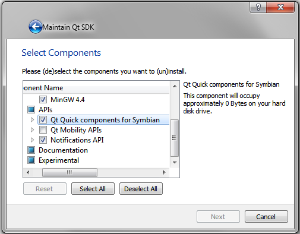
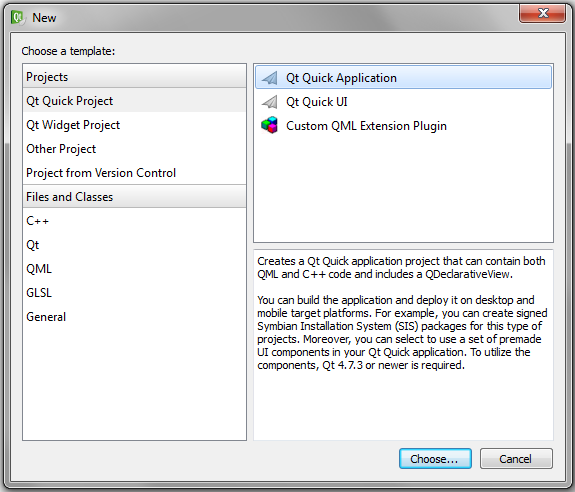
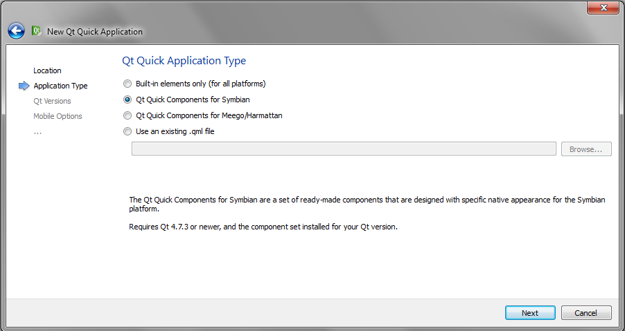
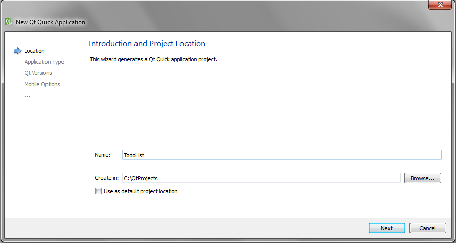
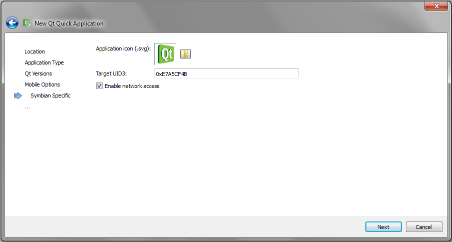
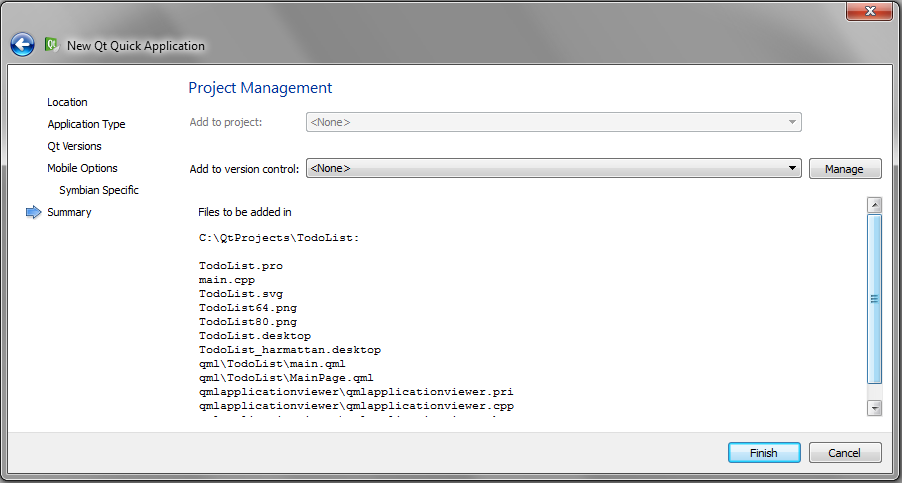
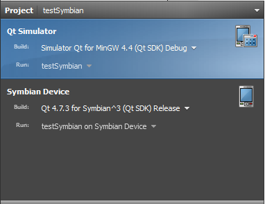
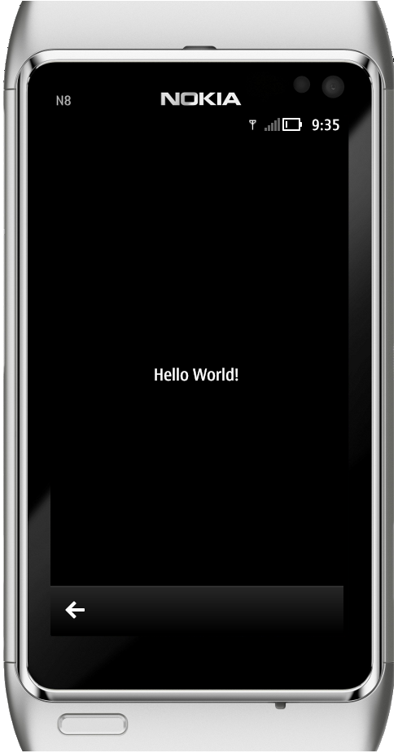

..
    ---------------------------------------------------------------------------
    Copyright (C) 2012 Digia Plc and/or its subsidiary(-ies).
    All rights reserved.
    This work, unless otherwise expressly stated, is licensed under a
    Creative Commons Attribution-ShareAlike 2.5.
    The full license document is available from
    http://creativecommons.org/licenses/by-sa/2.5/legalcode .
    ---------------------------------------------------------------------------

Using the Wizard to Create the Initial Application
==================================================

To get started developing our application, we'll first need to setup our project with Qt Creator, which comes with the Qt SDK. As our project makes use of Qt Quick and the new Qt Components for Symbian^3, we use a specialized project wizard from the Qt Creator IDE.

First you'll need to get the Qt Quick Components for Symbian^3 needed for this project if you haven't already installed them.

On the Qt Creator IDE, open the     Updater* dialog (:menuselection:`Help --> Start Updater`), select the *Package Manager* onglet, and install Qt Components for Symbian (:menuselection:`Qt SDK --> APIs -->  Qt Quick Components for Symbian`).

Now to create a new Qt Quick project using Symbian^3 components, choose :menuselection:`File --> &New File or Project` from the menu. Qt Creator will present you a selection of different code wizards. Please select the :guilabel:`Qt Quick Application` wizard.

Then you'll need to specify the application type. Select     Qt Quick Components for Symbian*.

On the next wizard page, you can enter you project location. Choose a project name and a root folder which best suites your project. Let's call this project     TodoList*.

Choose the targets for which you want to develop. Here you can choose     Symbian Device* to directly deploy on your symbian device, or *Qt Simulator* if you'd like to simulate the application on your desktop.

.. image:: img/targets.png
   :scale: 50%
   :align: center

.. Note:: If you are under     Mac* or *Linux OS*, please check `here <http://www.developer.nokia.com/Community/Wiki/Nokia_Qt_SDK_Remote_Compiler>`_ to setup the project with Qt Creator.

Qt Creator will create a set of files for you. Let's ignore them for the time being and get back to them later when we discuss generated code.

To run the simulation, check your project settings and ensure that the     Qt Simulator* target is selected.

Now you can press     Run* to execute your project so that *Qt Simulator* appears and displays the application.

.. seealso::

    :creator:`Getting Started with Qt Creator <creator-getting-started.html>`

    :creator:`Using the Remote compiler <creator-remote-compiler.html>`

    :creator:`Creating a Qt Quick Application Using Qt Quick Components <creator-qml-components-example.html>`

    :component:`Page Based Application Navigation <qt-components-pages-and-navigation-overview.html>`

    :qt:`Connecting Symbian Devices <creator-developing-symbian.html>`

.. rubric:: What's next?

In the next step, we will take a closer look at the generated source code to analyze a basic application using Qt Quick Components for Symbian^3.
