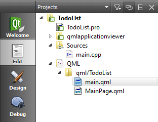
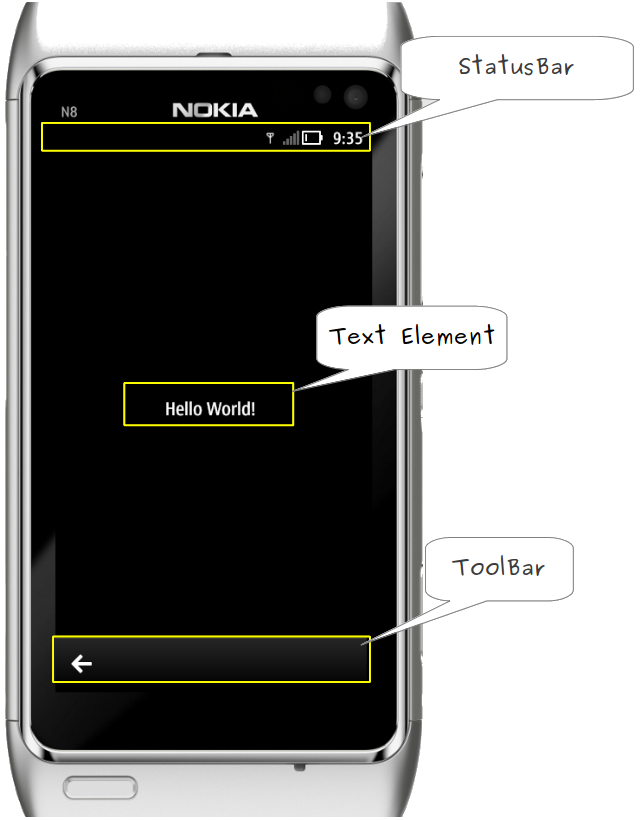

..
    ---------------------------------------------------------------------------
    Copyright (C) 2012 Digia Plc and/or its subsidiary(-ies).
    All rights reserved.
    This work, unless otherwise expressly stated, is licensed under a
    Creative Commons Attribution-ShareAlike 2.5.
    The full license document is available from
    http://creativecommons.org/licenses/by-sa/2.5/legalcode .
    ---------------------------------------------------------------------------

.. _inspecting-generated-code:

Inspecting the Generated Code
=============================

In this step, let's take a closer look at the generated files. This will help us understand how the project is built and give us an overview of the basic Qt Quick Components used in a Symbian^3 application.

If you have a look at the source code, you will see that Qt Creator has generated a basic application skeleton for us as shown in the following screenshot:

In general, Qt Quick for Symbian^3 applications consists of a declarative (QML) and a native part (C++). The native code initializes the runtime of the declarative part. The declarative part is where we will add our application user interface and the required functionality. If you're interested in knowing more about C++ and QML integration, please refer to :qt:`Using QML in C++ Applications <qtbinding.html>`.

Native Code
-----------

The native part is initialized in `main.cpp` and starts a debug-enabled QML viewer which loads our declarative part, the `main.qml` file.

.. code-block:: cpp

    // main.cpp

    #include <QtGui/QApplication>
    #include "qmlapplicationviewer.h"

    int main(int argc, char     argv[])
    {
        QApplication app(argc, argv);

        QmlApplicationViewer viewer;
        viewer.setMainQmlFile(QLatin1String("qml/TodoList/main.qml"));
        viewer.showExpanded();

        return app.exec();
    }

.. Note::     QmlApplicationViewer* is our :qt:`QML Runtime <qmlruntime.html>` and its main purpose is to load qml documents and execute them.

.. Warning:: The code in the     qmlapplicationviewer* folder is generated automatically and contains some code for a few additional features if you use the debug-enabled version. Don't modify the code because it will be automatically updated in newer SDK versions.

Declarative Code
----------------

The folder ``<projectname>/qml/<projectname>/`` contains the declarative part of our project. In our example, Qt Creator generates two qml files (`main.qml` and `MainPage.qml`) that build a small running ``Hello World!`` application.

The `main.qml` file is the root file of the application :

.. code-block:: js

    // main.qml

    import QtQuick 1.0
    import com.nokia.symbian 1.1
    // com.nokia.symbian 1.0 with older SDK versions

    Window {
        id: window

        StatusBar {
            id: statusBar
            anchors.top: window.top
        }

        PageStack {
            id: pageStack
            anchors {
                left: parent.left; right: parent.right
                top: statusBar.bottom; bottom: toolBar.top
            }
        }

        ToolBar {
            id: toolBar
            anchors.bottom: window.bottom
            tools: ToolBarLayout {
                id: toolBarLayout

                ToolButton {
                    flat: true
                    iconSource: "toolbar-back"
                    onClicked: {
                        pageStack.depth <= 1 ? Qt.quit(): pageStack.pop();
                    }
                }
            }
        }

        Component.onCompleted: {
            pageStack.push(Qt.resolvedUrl("MainPage.qml"));
        }

    }

The code above consists of a :component:`Window<qml-window.html>` component which will act as our top level window and contains currently the following elements:

     A :component:`StatusBar <qml-statusbar.html>` on the top (`anchors.top: window.top`), which shows information of the device state such as network type, signal strength and battery level.

  .. code-block:: js

     // main.qml

     StatusBar {
         id: statusBar
         anchors.top: window.top
     }

     A :component:`PageStack <qml-pagestack.html>` component from the `Qt Component <http://qt.gitorious.org/qt-components>`_ project, which defines a container of pages and provides a stack-based navigation model. We can push a page to the stack using `pageStack.push( qmlfile )` and pop the top page off the stack with `pageStack.pop()`. The pages could also be dynamically loaded to preserve memory via `Qt.resolvedUrl( qmlfile )`. We will cover the use of :component:`PageStack<qml-pagestack.html>` in the next chapter when introducing the concept of our `TodoList` application.

  .. code-block:: js

    // main.qml

    PageStack {
        id: pageStack
        anchors {
            left: parent.left; right: parent.right;
            top: statusBar.bottom; bottom: toolBar.top
        }
    }

     A :component:`Toolbar <qml-toolbar.html>` at the bottom (`anchors.bottom: window.bottom`) that contains a :component:`ToolBarLayout <qml-toolbarlayout.html>` with one :component:`ToolButton <qml-toolbutton.html>` to close the application.

  .. code-block:: js

     // main.qml

    ToolBar {
        id: toolBar
        anchors.bottom: window.bottom
        tools: ToolBarLayout {
            id: toolBarLayout

            ToolButton {
                flat: true
                iconSource: "toolbar-back"
                // if no page is left on the stack,
                // quit the application.
                // Otherwise pop the current page off the stack.
                onClicked: {
                    pageStack.depth <= 1
                        ? Qt.quit()
                        : pageStack.pop();
                }
            }
        }
    }

The `Component::onCompeleted` signal handler is called after a component has been completely loaded. It enables us to execute script code at startup. We use it to dynamically load the `MainPage` defined in `MainPage.qml` and push it to the page stack. This will make it the active page.

.. code-block:: js

    // main.qml

    Component.onCompleted: {
        pageStack.push(Qt.resolvedUrl("MainPage.qml"));
    }

The Main Page
-------------

`MainPage` is a :component:`Page<qml-page.html>` component which defines a screen for the user interface for mobile devices. The page contains a placeholder :qt:`Text <qml-text.html>` element to display a     Hello world!* text in the center of the page  (`anchors.centerIn: parent`).

.. code-block:: js

    // MainPage.qml

    import QtQuick 1.0
    import com.nokia.symbian 1.1

    Page {
        id: mainPage

        Text {
            anchors.centerIn: parent
            text: qsTr("Hello world!")
            color: platformStyle.colorNormalLight
            font.pixelSize: 20
        }
    }

The following figure shows the elements position on a mobile screen:

.. rubric:: What's next?

The next step shows you what is required to run the application on your Symbian^3 device.

