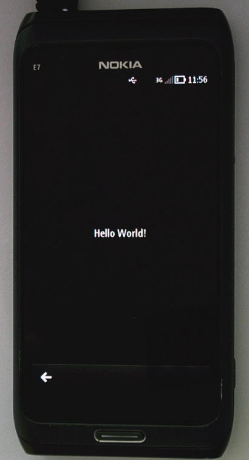

..
    ---------------------------------------------------------------------------
    Copyright (C) 2012 Digia Plc and/or its subsidiary(-ies).
    All rights reserved.
    This work, unless otherwise expressly stated, is licensed under a
    Creative Commons Attribution-ShareAlike 2.5.
    The full license document is available from
    http://creativecommons.org/licenses/by-sa/2.5/legalcode .
    ---------------------------------------------------------------------------

Testing the Application on a Nokia Device
=========================================

In this step, we will test our     Hello World* application on a Symbian^3 device. This is only applicable when you have installed the Qt SDK on Windows.

.. note:: For Mac and Linux, please refer to the next step that shows how to use the Remote Compiler

For this, you need to switch the target to     Symbian Device*:

.. image:: img/target-device.png
   :scale: 75%
   :align: center

Now connect your Nokia Device to your computer via an USB connection. `Nokia Ovi Suite <https://www.ovi.com/suite>`_  should be installed so that your device can be detected.

Once you     Run* the project, your device should display the application:

.. rubric:: What's next?

In the next step, we will show you how to deploy your application using the Remote Compiler.
