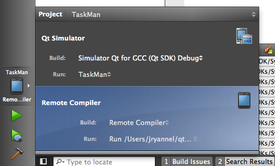
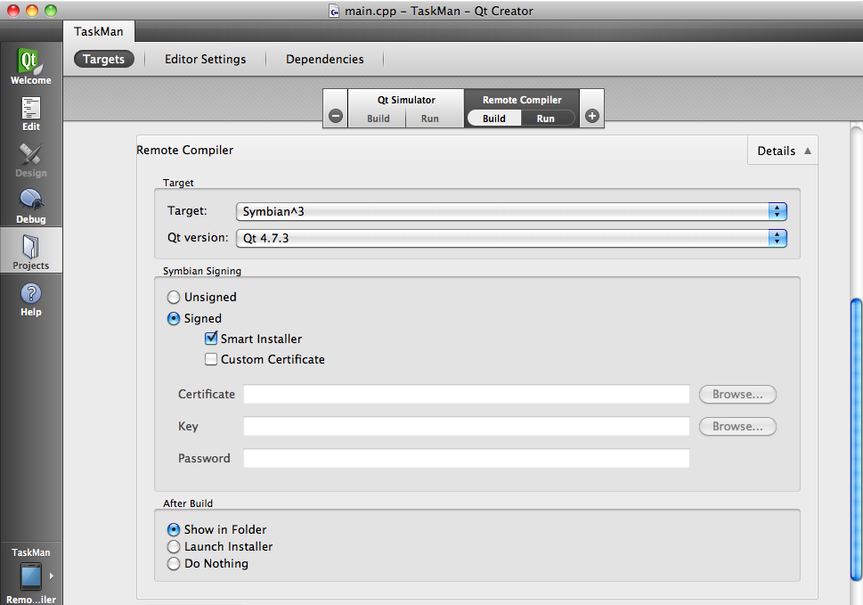

..
    ---------------------------------------------------------------------------
    Copyright (C) 2012 Digia Plc and/or its subsidiary(-ies).
    All rights reserved.
    This work, unless otherwise expressly stated, is licensed under a
    Creative Commons Attribution-ShareAlike 2.5.
    The full license document is available from
    http://creativecommons.org/licenses/by-sa/2.5/legalcode .
    ---------------------------------------------------------------------------

Testing the Application on a Nokia Device using the remote compiler
===================================================================

If you are working on a Mac or Linux, on which Symbian is not supported, you'll need to use the Remote Compiler to create a Symbian Installation Package (SIS file).

Setting up the Remote Compiler
------------------------------

First we will need to change the project target in the `Target` switcher from Qt Creator to enable the     Remote Compiler* target.

.. Topic:: Enabling the Remote Compiler

    If this is your first time using the     Remote Compiler*, you'll need to log into the Nokia Web-Service using your Nokia developer username and password. If you don't yet have a Nokia Developer account, you can register at http://developer.nokia.com

    Open the settings panel (under Mac     Preferences*, otherwise *Options*) from Qt Creator and choose the *Remote Compiler* tab under the *Projects* page. There you'll need to:

    #. Accept the Terms of Services
    #. Provide your Nokia Developer username
    #. Enter your password

    Now you should be logged in.

To be able to deploy your application on your device, you'll need to modify the     Projects* settings to enable *Symbian Signing* and *Smart Installer*. This is described in detail in the :creator:`creator manual <creator-deployment-symbian.html>`.

Please choose the following values:

     Target: `Symbian^3`
     Qt Version: `Qt 4.7.x`
     Switch on Signed with `Smart Installer`
     Switch on `Show in Folder`

Building the Project
--------------------

When you build the project (e.g. `Build -> Build Project`), Qt Creator will send your project sources over to the Nokia Developer Build server, compile it and send it back to you as an installable Symbian Package (``.sis`` file).

If everything works successfully, your system will show the folder where the SIS file will be located.

Uploading to a Device
---------------------

After uploading the file via a USB connection to a Nokia device, the system will detect an installable file and automatically launch the installation process.

During the installation, other larger libraries might be required to be downloaded to the phone. During this process, several confirmation dialogs might appear.

.. Note:: Connecting the device via WLAN before deploying the application will prevent larger online fees

.. rubric:: What's next?

Now we have our first application. Let's run it in the simulator and deploy it onto our device. The next chapter will explain the general concept of our application and create our first application prototype.

