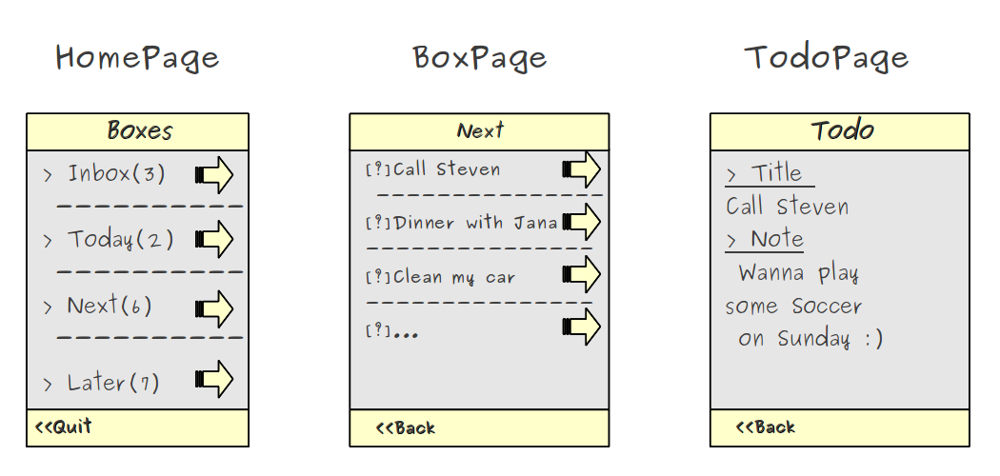

..
    ---------------------------------------------------------------------------
    Copyright (C) 2012 Digia Plc and/or its subsidiary(-ies).
    All rights reserved.
    This work, unless otherwise expressly stated, is licensed under a
    Creative Commons Attribution-ShareAlike 2.5.
    The full license document is available from
    http://creativecommons.org/licenses/by-sa/2.5/legalcode .
    ---------------------------------------------------------------------------

Discussing the Concept of Our ToDo List Application
===================================================

Let's imagine living in the Early Middle Ages. We write our notes and tasks on pieces of paper and put them into a small box and our tasks start to immediately pile up. So for the sake of good order, we decide to group them into different boxes.

Our application manages our daily tasks similar to how people did it in the Middle Ages, but with modern technologies instead of small lovely wooden boxes.

Coming back from the humorous introduction, our     TodoList* application is actually modeled after the famous `Getting Things Done <http://en.wikipedia.org/wiki/Getting_Things_Done>`_ organizational method.

A     todo* item will present a note or a task to be done. Todos are organized into boxes depending on how far you want to move them away from your mind. For managing todos, we need to be able to create, edit, delete or move them between boxes and mark them as done. Todos marked as done can be moved to an archive box where they can later be purged.

The application should feature a UI to organize the user's todo items in a simple and intuitive way. We will accomplish this by providing various boxes that will remind you of the most important todos you have to take care of.

For this purpose, we define boxes for the user to be able to sort todos by their feeling of urgency:

     ``Inbox Box`` - Everything which comes to mind
     ``Today Box`` - To be worked on today
     ``Next Box`` -  To be worked on next
     ``Later Box`` - To be worked on later

A newly created     todo* item will land in the *Inbox* by default, from which the user can later move it into another box once it's urgency has been decided.

The user can mark a todo as done. In this case, it stays in the current box and can be moved to the archive by the     Update Archive* action.

For sake of simplicity, a todo has only a title and a note field, both of which are text fields. For implementation reasons, there is also a field called `modified` which tracks the last modification date. We will sort todos belonging to the same box based on their `modified` field.

The UI flow
-----------

To make the application suitable for a screen on a mobile device, we need to decide on a possible UI flow. Let's go with the following pages:

.. list-table::
    :widths: 20 30 50
    :header-rows: 1
    :stub-columns: 0

           - Page
        - Description
        - Actions
           - *Home Page*
        - Shows all boxes
        - Add Todo to Inbox; Show Archive; Exit
           - *Box Page*
        - Shows the content of a selected box
        - Back to Home Page; Add Todo to Box, Update Archive
           - *Todo Page*
        - Show details of one todo item
        - Back to Box Page; Delete Todo

Below we have a rough UI mockup and flow of different pages. It shows what UI elements we may need and how the pages are related to each other. On the home page, we want to see all boxes displayed in a list. When one of the boxes is selected, a new page appears which shows the content of the box. An additional page will display a todo's details once one of them has been selected.

.. rubric:: What's next?

In the next step, we'll start implementing the page navigation to learn how to switch between different pages of our application.
