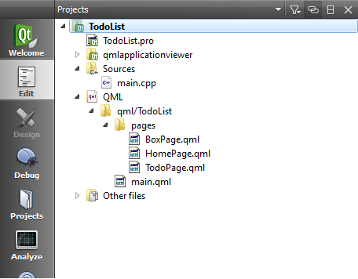

..
    ---------------------------------------------------------------------------
    Copyright (C) 2012 Digia Plc and/or its subsidiary(-ies).
    All rights reserved.
    This work, unless otherwise expressly stated, is licensed under a
    Creative Commons Attribution-ShareAlike 2.5.
    The full license document is available from
    http://creativecommons.org/licenses/by-sa/2.5/legalcode .
    ---------------------------------------------------------------------------

Providing Page Navigation Using the Page Stack
==============================================

We defined pages for the concept UI (    Home*, *Box* and *Todo*) in the previous step. Now we'll start implementing these pages to build a simple navigation structure using the page stack.

The :component:`PageStack <qml-pagestack.html>` component defines a container for pages and a :component:`stack-based navigation model <qt-components-pages-and-navigation-overview.html>`. So, in order to manage our stack of pages, `PageStack` is the most convenient component to use.

First let's open the skeleton code provided for this chapter using your Qt Creator IDE. In addition to `main.qml`, you will find a new     pages* folder that contains qml files for the pages (`HomePage.qml`, `BoxPage.qml` and `TodoPage.qml`).

Each file has a `Page` element as its root element and contains a centered button which navigates forward to the next page using the `pageStack` property from the current page. A `ToolButton` is provided to navigate back to the previous page or to quit the application when you are on the home page. The concept is quite similar to the `MainPage` code we saw in the code from the previous chapter.

The `main.qml` file defines a :component:`PageStack <qml-pagestack.html>` component to manage our pages and contains a `StatusBar` and `ToolBar`. On the application startup, we push the `HomePage` onto the `PageStack`.

.. note::
    We need to specify the `toolBar` to the `PageStack` so that the tools set for each page is shown to the user. If `toolBar` is null, then no tools are shown even if a page does have tools.

In order to preserve memory, the pages could be dynamically loaded onto the `PageStack` via `Qt.resolvedUrl( qmlfile )`, but since we only have a few pages, we can immediately preload them in `main.qml`:

.. literalinclude:: src/TodoList-Skeleton/qml/TodoList/main.qml
    :language: js
    :lines: 35-

On the `HomePage`, we provide a centered `Button` to navigate from the current page to the `BoxPage`. Additionally, we provide a `ToolButton` to quit the application:

.. code-block:: js

    // HomePage.qml

    import QtQuick 1.0
    import com.nokia.symbian 1.1

     Page {
        id : root
        // button to navigate to next page
         Button {
             anchors.centerIn: parent
            text: "Open Box Page"
            // push BoxPage on click signal
            onClicked: root.pageStack.push(window.boxPage);
        }
        tools: ToolBarLayout {
            ToolButton {
                iconSource: "toolbar-back"
                // quit the application on click signal
                onClicked: Qt.quit();
            }
        }
    }

In the `BoxPage`, we can move forward to the `TodoPage` and back to the `HomePage`. Finally in the TodoPage we can't move any further, only back to the `BoxPage`. Both implementations are almost identical and can be taken from `HomePage.qml`.

If we now run the project, we will get our basic pages which can be navigated forward and backward as shown on the following screenshots:

.. image:: img/page-nav.
    :align: center

.. rubric:: What's next?

In the next step, we will extend the `HomePage` implementation to displays a list of boxes using a `ListView`.
