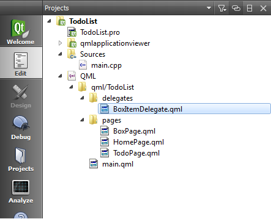

..
    ---------------------------------------------------------------------------
    Copyright (C) 2012 Digia Plc and/or its subsidiary(-ies).
    All rights reserved.
    This work, unless otherwise expressly stated, is licensed under a
    Creative Commons Attribution-ShareAlike 2.5.
    The full license document is available from
    http://creativecommons.org/licenses/by-sa/2.5/legalcode .
    ---------------------------------------------------------------------------

Using a List on the Home Page
=============================

As previously discussed, we want to see all boxes (    Inbox*, *Today*, *Next*, ...) displayed in a list on the `HomePage`. To achieve this we'll use a :qt:`ListView <qml-listview.html>` component.

To display the data, the :qt:`ListView <qml-listview.html>` component needs a model which defines the data, and a delegate which defines how the data should be displayed. Additionally we will define a header for the list view to display the page title. You can read more about this in :qt:`Presenting Data with Views <qml-views.html>`.

The Model
---------

In order to define the list of boxes, we will be using a :qt:`ListModel <qml-listview.html>` component, which provides a simple container of :qt:`ListElements <qml-listelement.html>` definitions, each containing data roles. You can read more about this in :qt:`QML Data Models <qdeclarativemodels.html>`. The contents can be defined dynamically, but since we have a fixed number of elements, we will define them explicitly in our code:

.. code-block:: js

    // HomePage.qml

    ListModel {
        id: boxModel

        ListElement { name: "Inbox"; box: 0 }
        ListElement { name: "Today"; box: 1 }
        ListElement { name: "Next";  box: 2 }
        ListElement { name: "Later"; box: 3 }
    }

The `name` property will be used as a text label, while the value of the `box` property will be the ID which identifies each of the boxes in the `boxModel`.

The Delegate
------------

The role of a delegate is to provide a template defining each item instantiated by the view. To better structure our project, we'll create a new `delegates` folder and define a delegate component in a new `BoxItemDelegate.qml` file:

`BoxItemDelegate` consists of a :component:`ListItem <qml-listitem.html>` Symbian^3 Component which provides a template for creating a `ListView` delegate using the correct platform style. Since we only need to display the name of each of the boxes, we use a :component:`ListItemText <qml-listitemtext>` component which provides styled fonts for `ListItem` elements.

In order to be able to set and update the text from outside the component, we add a property alias that links to the text property of the `ListItemText`.

.. code-block:: js

    // BoxItemDelegate.qml

    import QtQuick 1.0
    import com.nokia.symbian 1.1

    ListItem {
        id: listItem

        property alias title: boxTitle.text

        ListItemText {
            id : boxTitle
            mode: listItem.mode
            anchors.verticalCenter: parent.verticalCenter
        }
     }

The Header
----------

We want to display the current page title on top of the list view. For this, we add a QML component that called `listHeader` that contains a  :component:`ListHeading  <qml-listheading.html>` grouped with a `ListItemText` to display the title.

.. code-block:: js

    // HomePage.qml

    Component {
        id: listHeader

        ListHeading {
            id: listHeading

            ListItemText {
                id: headingText
                anchors.fill: listHeading.paddingItem
                role: "Heading"
                text: "Todo List"
            }
        }
    }

The View
--------

Now that we have defined a model, a delegate and a header, we can attach them to the list view to display our boxes.

To do this, we first need to import the `delegates` folder which contains our delegate.

.. code-block:: js

  // HomePage.qml

  import "../delegates"

Then we add a `ListView` component that uses the components mentioned above to display our list of boxes. To be able to move to the `BoxPage` we override the `onClicked` signal handler from the list item and push the `window.boxPage` onto the page stack.

.. code-block:: js

    // HomePage.qml

    ListView {
        id:  boxView
        anchors.fill: parent
        // use the listHeader component as header
        header: listHeader
        // set the modelview to boxModel
        model: boxModel
         // use BoxItemDelegate to display boxes names via the boxModel
        delegate: BoxItemDelegate {
            id: itemDelegate
            title: model.name
            onClicked: {
                // onClick we push the BoxPage to the stack
                root.pageStack.push(window.boxPage);
            }
        }
        // we set clip to true that the out of view items clipped nicely
        clip: true
    }

Finally, in the `ToolBarLayout`, we add a new `ToolButton` for creating new todos. It doesn't yet do anything useful.

.. code-block:: js

    // HomePage.qml

    tools: ToolBarLayout {
        id: pageSpecificTools

        ToolButton {
            iconSource: "toolbar-back"
            onClicked: Qt.quit();
        }

        ToolButton {
            iconSource: "toolbar-add"
            // Let's add some text for debugging purposes
            onClicked: print("add todo item to inbox");
        }
    }

Now if you run the code, you should see the list of boxes displayed on the `HomePage`.

.. image:: img/homepage-adding-boxlist.
    :scale: 40%
    :align: center

.. rubric:: What's next?

In the next step, we will use JavaScript code to generate some test data, which we will display as new dummy items on the `BoxPage`.
