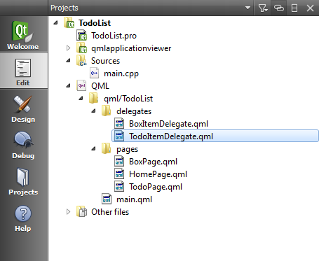
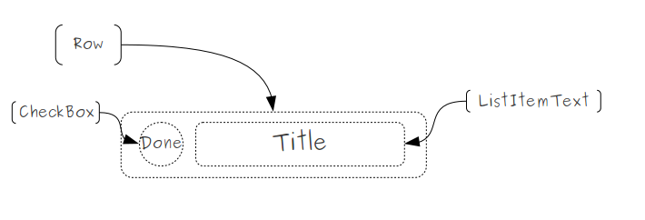

..
    ---------------------------------------------------------------------------
    Copyright (C) 2012 Digia Plc and/or its subsidiary(-ies).
    All rights reserved.
    This work, unless otherwise expressly stated, is licensed under a
    Creative Commons Attribution-ShareAlike 2.5.
    The full license document is available from
    http://creativecommons.org/licenses/by-sa/2.5/legalcode .
    ---------------------------------------------------------------------------

Using JavaScript to Generate Test Data
======================================

We now have a `HomePage` that displays the list of our boxes. In order to work on parts of the application which edit and display the todos, we need to find an easy way to create some test data set. In this step, we will generate a test data set using JavaScript and display it on the `BoxPage` as new dummy items.

First we need to create a `ListView` that displays the test data. For this, we should start by defining a model, a delegate and a header for the list as we did in the previous step.

Before we start defining the model, we add an integer `boxId` property to the `BoxPage`. The box id will be used to identify the current box to be shown.

.. code-block:: js

    // BoxPage.qml

    property int boxId: 0 // let's set the default value to 0

The Model
---------

The test data will represent new items and should be displayed as a list, for this we add a `ListModel` component. Unlike in the previous step, when we statically defined the `ListElements`, the content here should be dynamically loaded using JavaScript code.

.. code-block:: js

    // BoxPage.qml

    ListModel {
        id: itemModel
    }

The Delegate
------------

Before we dynamically populate our model we need to have a delegate to display the data. For this we create a new `TodoItemDelegate.qml` file in the `delegates` folder:

In the delegate, we want to display the todo title and provide a checkbox which marks the todo as done. The figure below represents the components that will be used to define the `TodoItemDelegate`:

The `TodoItemDelegate` implements a :component:`LisItem<qml-listitem.html>` that contains a :component:`CheckBox <qml-checkbox.html>` and a :component:`ListItemText <qml-listitemtext.html>` within a :qt:`Row <qml-row.html>` element to position them horizontally:

.. code-block:: js

    // TodoItemDelegate.qml

    import QtQuick 1.0
    import com.nokia.symbian 1.1

    ListItem {
        id: listItem;
        // we add a alias to the ListItemText
        // text to be accessible outside of the delegate
        property alias title: todoTitle.text

        Row {
            id: row
            anchors.fill: listItem.paddingItem
            spacing: 8

            CheckBox {
                id: checkBox
                anchors.verticalCenter: parent.verticalCenter
            }

            ListItemText {
                id : todoTitle
                mode: listItem.mode
                anchors.verticalCenter: parent.verticalCenter
            }
        }
    }

The Header
----------

We also define another list header to display the title of the page on top of the list view.

.. code-block:: js

    // BoxPage.qml

    Component {
        id: listHeader

        ListHeading {
            id: listHeading

            ListItemText {
                id: headingText
                anchors.fill: listHeading.paddingItem
                role: "Heading"
                text: "Item List"
            }
        }
    }

As we have already defined the same header component twice, we will show you how you can extract it into a reusable component in a later step.

The View
--------

Now let's add the main `ListView` for this box page. It uses our currently empty item model, our new delegate and the header defined above. When the user clicks on an item, the todo page should be shown with the item's related details.

.. code-block:: js

    // BoxPage.qml

    import "../delegates"
    ...

    ListView {
        id:  itemView
        anchors.fill: parent
        // set listHeader as header
        header: listHeader
        // set itemModel as model
        model: itemModel
        // set TodoItemeDelegate as delegate
        delegate: TodoItemDelegate {
            id: todoItemDelegate
            // use the delegate property alias itemTitle
            // to display the item title via the model
            title: model.title
            onClicked: {
                // on click signal we push TodoPage to the stack
                root.pageStack.push(window.todoPage);
            }
        }
        // set clip to true
        clip: true
    }

We also add a :component:`ToolBarLayout <qml-toolbarlayout.html>`, with two `ToolButtons`: the first one goes back to the `HomePage`, and the second will be used later to create a new item which will then belong to the current box.

.. code-block:: js

    // BoxPage.qml

    tools: ToolBarLayout {
        id: pageSpecificTools
        // ToolButton to move back to the HomePage
        ToolButton {
            iconSource: "toolbar-back"
            // on click signal pop the page from the stack to go back
            onClicked: root.pageStack.pop();
        }
        // ToolButton to be used to add new item
        ToolButton {
            iconSource: "toolbar-add"
            // for now, we just print some text for debugging purposes
            onClicked: print("add todo item to inbox");
        }
    }

The Test Data
-------------

Now that everything is in place, we can provide some test data. So let's define a `dummyData` JavaScript function that generates our data. We pass in a reference to our empty model and populate the model dynamically. To ensure that we don't populate the model twice, we first clear the model.

.. code-block:: js

    // BoxPage.qml

    function dummyData( model ) {
        model.clear()
        for (var i=0; i<10; i++) {
            model.append( { title: "todo "+i, done: false } );
        }
    }

At the current stage, the `dummyData` function should be called once the page is activated. Later on we will replace this function when we introduce the database storage.

The :component:`QML Page <qml-page.html>` component contains a :component:`status <qml-page.html#status-prop>` property which identifies the current status the page is in. To get notified when the page status changes, we override the `onStatusChanged` signal handler. We only want to call the function when the status is `PageStatus.Activating`.

.. code-block::js

    onStatusChanged: {
        if(status == PageStatus.Activating) {
            // do something if the page is activated...
        }
    }

To enhance the loading speed, we unset the view model, call the `dummyData` function and then set the model back to the view.

.. code-block:: js

    // BoxPage.qml

    onStatusChanged: {
        if(status == PageStatus.Activating) {
            itemView.model = 0;
            dummyData(itemModel);
            itemView.model = itemModel;
        }
    }

If we now run the project, we should see our dummy data displayed on the `BoxPage` as shown in the following screenshots:

.. image:: img/pages-dummydata.
    :align: center

.. rubric:: What's next?

To summarize this chapter, we have learned how to build a simple prototype of our application using the following techniques:

     Using `ListView` and `ListModel` to display items
     Defining a reusable component in QML
     Using JavaScript code to provide test data

At this stage, the application doesn't suit all our needs. It only displays the list of boxes on the `HomePage` and some test data on the `BoxPage` as also we can navigate back and forward between the pages.

In the next chapter, we will extend our application with more functionality and introduce you how to use the database storage in QML.
