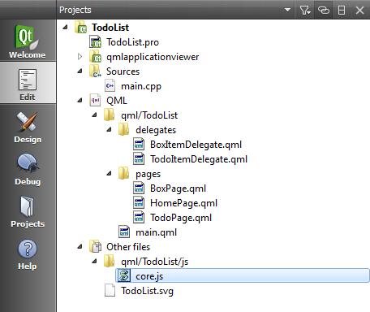

..
    ---------------------------------------------------------------------------
    Copyright (C) 2012 Digia Plc and/or its subsidiary(-ies).
    All rights reserved.
    This work, unless otherwise expressly stated, is licensed under a
    Creative Commons Attribution-ShareAlike 2.5.
    The full license document is available from
    http://creativecommons.org/licenses/by-sa/2.5/legalcode .
    ---------------------------------------------------------------------------

Storing Data Using the Offline Storage API
==========================================

In the previous chapter, we saw how to use extra JavaScript code in order to fill the `BoxPage` with test data. However, in the normal use case, the application should provide a way for users to persistently store their data.

For this purpose, QML has a suitable :qt:`Offline Storage API <qdeclarativeglobalobject.html#offline-storage-api>` that provides the ability to access local storage in a SQL database.

The API provides a couple of functions to access the database and execute SQL queries.

In our case, we define a single     todo`* SQL table. The table contains the following fields:

.. list-table::
    :widths: 20 30 50
    :header-rows: 1

           - Field
        - Type
        - Description
           - *box*
        - Integer
        - Identifies the box to which the     todo* item belongs
           - *done*
        - Boolean
        - To check whether or not the     todo* item has been taken care of
           - *title*
        - Text
        - For the     todo* item title
           - *note*
        - Text
        - Contains additional user information about the     todo* item
           - *modified*
        - Date
        - To get last modified date

We create a new `core.js` JavaScript `stateless library <http://doc.qt.nokia.com/latest/qdeclarativejavascript.html#stateless-javascript-libraries>`_ file in a `js` folder. The `core.js` file will contain all SQL statements that can be used to create, read, update and delete todos using the database:

First we define an `openDB` function which initializes the database. Inside we call the `openDatabaseSync` function from the Offline Storage API to open and access the storage.

The `openDatabaseSync` function will return an identifier to the database which will be stored in the `_db` variable for later use. The database is created if it doesn't already exist.

.. code-block:: js

    // core.js

    var _db;
    function openDB()
    {
        _db = openDatabaseSync("TodoDB", "1.0", "Todo Database", 10000);
        createTable();
    }

The `openDatabaseSync` function expects several parameters:

     an identifier to the database
     a version
     a short description
     an estimated size in bytes

At the end of the `openDB` function we create our SQL table calling the `createTable` function.

.. code-block:: js

    // core.js

    function createTable()
    {
        //create a read/write transaction ...
        _db.transaction( function(tx) {
            // execute Sql Statement to create todo table
            // if it doesn''t already exist ...
            tx.executeSql("\
              CREATE TABLE IF NOT EXISTS\
              todo (id INTEGER PRIMARY KEY AUTOINCREMENT,\
              box INTEGER,\
              done TEXT,\
              title TEXT,\
              note TEXT,\
              modified TEXT\
            )");
        });
    }

To execute an SQL Statement, we need to use the `db.transaction(callback(tx))` method. This method creates a read/write transaction which is passed to the callback. In the callback function, you can call `executeSql` on `tx` to read and modify the database. If the     callback* throws exceptions, the transaction is rolled back.

.. note:: The QML Offline Storage API uses SQLite. If you'd like to learn more about how to use SQlite to execute SQL queries, please refer to `SQLite <http://www.sqlite.org/docs.html>`_ documentation.

.. note::

    If you would like to get the path of your local database, you'll need to use the `QmlApplicationViewer::engine()->offlineStoragePath()` in the `main.cpp` file generated by Qt Creator:

    .. code-block:: js

        // main.cpp

        qDebug() << viewer.engine()->offlineStoragePath();

In order to get in touch with the API code, we suggest implementing the rest of functions to read, update and insert items into the database. At the end of this chapter, you will find the full source code of the `core.js` file so that you can compare it to your implementation. To use the JavaScript functions defined in `core.js`, you need to import the file into QML using `import` statement with a unique qualifier using the `as` keyword.

.. code-block:: js

    import "../js/core.js" as Core
    ...
    Component {
        ...
        onSignal : Core.function(...);
    }

.. rubric:: What's next?

In the next step, we'll continue developing our application by populating the  `BoxPage` using our database to display the todos corresponding to the selected box.
