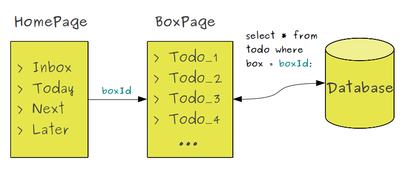
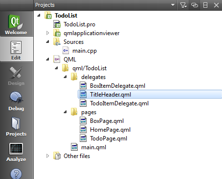
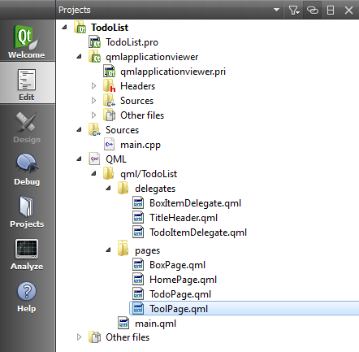
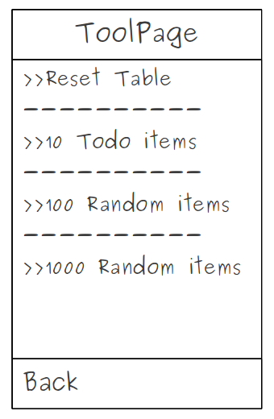
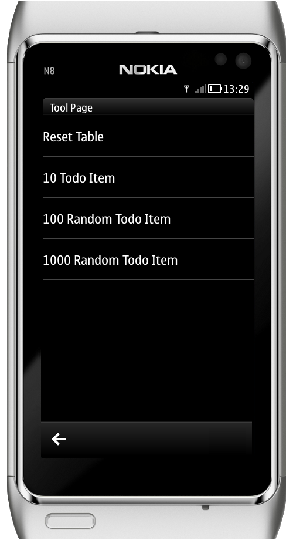

..
    ---------------------------------------------------------------------------
    Copyright (C) 2012 Digia Plc and/or its subsidiary(-ies).
    All rights reserved.
    This work, unless otherwise expressly stated, is licensed under a
    Creative Commons Attribution-ShareAlike 2.5.
    The full license document is available from
    http://creativecommons.org/licenses/by-sa/2.5/legalcode .
    ---------------------------------------------------------------------------

Populating Pages with Data from the Storage
===========================================

Now that our database is ready, we need to replace the test data used in the previous chapter with data provided from the database. In this step, we'll see how to populate the `BoxPage` with data provided by the database.

Earlier we added a `boxId` property to the `BoxPage` which identifies each of the boxes. As we have defined four boxes in the `HomePage`, let's specify an id for each box as follows:

.. table::

    =========== ===========
        Box*       *Id*
    =========== ===========
    Inbox       0
    Today       1
    Next        2
    Later       3
    Archive     4
    =========== ===========

.. Note:: The `Archive` box will be used to archive the `done` tasks.

On the `HomePage`, once a box has been selected, we should provide the corresponding `boxId` to the `BoxPage` in order to read and display all the items it contains from the database as shown in the following figure:

Let's start by updating the UI components of the `BoxPage` before we get the data from the database. For sake of clarity, we'll proceed as follows:

* Update the listView header and the `TodoItemDelegate`
* Update the BoxPage listView
* Update the HomePage listView
* Load Data from database

Headers and Delegates
---------------------

We have defined several QML components in our code. Now let's determine if we have some code duplicated or if there's a need to make it more efficient for future use. So let's create a generic component for title headers in a new `TitleHeader.qml` file in the *delegate* folder to define a reusable header that can be shared by multiple list views.

The `TitleHeader` implements a :component:`ListHeading <qml-listheading.html>` Component which contains a :component:`ListItemText <qml-listitemtext.html>` and a property alias to display the current list view's title.

.. code-block:: js

    // TitleHeader.qml

    ListHeading {
        id: listHeading
        anchors {
            top: parent.top
            left: parent.left; right: parent.right
        }

        property alias text: itemText.text

        ListItemText {
            id: itemText
            anchors.fill: parent.paddingItem
            role: "Heading"
        }
    }

In the `TodoItemDelegate`, we had defined a `ListItemText` to display the *todo's* title, and a checkbox to check whether or not the *todo* item has been take care of. In order to update the values of the `TodoItemDelegate` fields from the model, we need the following property aliases:

* A `title` to display the todo title
* A `checked` to mark the checkbox if the task has been taken care of

.. code-block:: js

    // TodoItemDelegate.qml

    ListItem {
        id: listItem
        ...
        property alias title: todoTitle.text
        property alias checked: checkBox.checked
        ...
    }

We also add a signal to be emitted when the checkbox is clicked. This will enable us later to update the item on the database:

.. code-block:: js

    // TodoItemDelegate.qml

    ListItem {
        id: listItem
        ...
        signal checkBoxClicked()
        ...
        Row {
            ...
            CheckBox {
                ...
                onClicked: listItem.checkBoxClicked();
            }
            ...
        }
    }

Updating BoxPage
----------------

In `BoxPage`, we add a new property to display the box `title` using `TitleHeader` we defined above. The title should be loaded later from the database:

.. code-block:: js

    // BoxPage.qml

    Page {
        id: root
        ...
        property string title

        TitleHeader {
            id: header
            text:  root.title
        }
    }

The content of the `ListModel` component will be dynamically defined by using the database. To insure that the *done* item's `CheckBox` component will be checked, we need to bind the value of the model's *done* field to the `checked` property of the `TodoItemDelegate` in the list view:

.. code-block:: js

    // BoxPage.qml

    Page {
        ...
        ListModel {
            id: itemModel
        }

        ListView {
            ...
            model: itemModel
            delegate: TodoItemDelegate{
                ...
                // bind the done value of the model
                // to the checked property
                checked: model.done
                ...
            }
         ...
        }
    }

Updating HomePage
-----------------

Let's use `TitleHeader` as the home page's header (which will replace the list view header):

.. code-block:: js

    // HomePage.qml

    TitleHeader {
        id: header
        text: "Todo List"
    }

As we mentioned above, the `HomePage` should provide the corresponding `boxId`, and the `title` of the selected box once we push the `BoxPage` to the stack. The `push` method of the `PageStak` component accepts arguments that allow us to specify values for properties on the page being pushed. In our case, we will use it to set the values to the `boxId` and `title` properties of the `BoxPage`.

.. code-block:: js

    // HomePage.qml

    ListView {
        ...
        model: boxModel
        delegate: BoxItemDelegate {
            ...
            onClicked: {
                // push the BoxPage with the convenient
                // boxId and title values
                root.pageStack.push(
                    window.boxPage,
                    { boxId: model.box, title: model.name }
                );
            }
        }
        ...
    }

Getting Data from the Database
------------------------------

Now that we've updated the UI components of the `HomePage` and `BoxPage`, let's add the function needed to fill the listView with data from the database.

The first thing to do is open the database in the application startup so all pages can connect to the database later.

.. code-block:: js

     // main.qml

    import "js/core.js" as Core
    ...
    Component.onCompleted:
    {
        Core.openDB();
        pageStack.push(Qt.resolvedUrl("HomePage.qml"));
    }

We have reimplimented the main window's `onCompleted` signal handler to call the `openDB` function defined in `core.js` just before pushing the `HomePage` onto the stack. The `openDB` function opens the database and creates a *todo* table, if it doesn't yet exist, by calling a `createTable` function:

.. code-block:: js

    // core.js

    function openDB() {
        _db = openDatabaseSync("TodoDB","1.0","Todo Database",1000000);
        createTable();
    }

    function createTable() {
        _db.transaction( function(tx) {
            tx.executeSql(" \
                CREATE TABLE IF NOT EXISTS \
                todo ( \
                    id INTEGER PRIMARY KEY AUTOINCREMENT, \
                    box INTEGER, \
                    done TEXT, \
                    title TEXT, \
                    note TEXT, \
                    modified TEXT \
            )");
        });
    }

We update the *done* item's `done` field when the `Checkbox` is clicked. Once a TodoItemDelegate's checkbox is clicked, we update the todo's `done` field.

.. code-block:: js

    // BoxPage.qml

    ListView{
        ...
        delegate: TodoItemDelegate {
            ...
               onCheckBoxClicked: {
                if(checked != model.done) {
                    // update the done field value of itemModel
                    itemModel.setProperty(index, 'done', checked);
                    // update Todo in the database
                    Core.updateTodo(model);
                }
            }
            ...
        }
        ...
    }

The `updateTodo` function, defined in `core.js`, updates a *todo* in the database.

.. code-block:: js

    // core.js

    function updateTodo(todoItem)
    {
        _db.transaction( function(tx) {
            tx.executeSql(" \
                UPDATE todo SET BOX = ? , done = ?, \
                title = ?, note = ?, modified = ? WHERE id = ?",
                [ todoItem.box, todoItem.done, todoItem.title,
                  todoItem.note, todoItem.modified, todoItem.id ]
            );
        });
    }

.. Note:: For sake of performance, we should use the `onCheckBoxClicked` signal instead of the `onChecked` signal. The `onChecked` signal is emitted every time the page is activated for each checked item, but we only need to update it when the user has checked the item.

To populate the `ListView` from the database, we perform the following steps:

* Add a new `updateUi` function, which resets the current model
* Read the items that belong to the box with the matching `boxId` into `itemModel` via the `readTodoBox` function
* Reset the `ListView` model to `itemModel`

.. code-block:: js

    // BoxPage.qml

    import "../js/core.js" as Core
    ...

    function updateUi()
    {
        itemView.model = 0;
        Core.readTodoBox(itemModel, boxId);
        itemView.model = itemModel;
    }

The `readTodoBox` function will read all items from the `todo` table that belong to the selected `box` and load them into an empty `model`:

.. code-block:: js

    // core.js

    function readTodoBox(model, boxId)
    {
         // first we clear the model
        model.clear();
        // create a ReadOnly Sql transaction
        _db.readTransaction( function(tx) {
            // read Items from Database where box = boxId
            var rs = tx.executeSql("SELECT * FROM todo WHERE box =? \
                ORDER BY modified DESC", boxId);

            for (var i=0; i< rs.rows.length; i++) {
                // load the result into the model
                model.append(rs.rows.item(i));
            }
        });
    }

The `updateUi` function will be called once the `BoxPage` has been activated:

.. code-block:: js

    // BoxPage.qml

    onStatusChanged: {
        if(status == PageStatus.Activating) {
            updateUi();
        }
    }

Creating Test Data
------------------

In this section, we'll provide an additional page that enables you to test the database connection by resetting the SQL table and adding random items. To do so, we need to create a new `ToolPage` in the `page` folder page that will contain a list of useful actions.

In our case, the `ToolPage` will provide a `reset` action that resets the `Todo` table from the database and actions to insert 10, 100 or 1000 new items into the database.

Here's how the UI form of `ToolPage` should look:

In the `ToolPage`, we need to declare the following components:

 * A `ListModel` to define the actions to be displayed on the `listView`:

.. code-block:: js

    // ToolPage.qml

    import QtQuick 1.0
    import com.nokia.symbian 1.1

    Page {
        id: root

            ListModel {
                id: caseModel

                ListElement { title: "Reset Table";           name : "resetTable"  }
                ListElement { title: "10 Todo Item";          name: "createTodos10" }
                ListElement { title: "100 Random Todo Item";  name: "createTodos100" }
                ListElement { title: "1000 Random Todo Item"; name: "createTodos1000" }
            }
        ...
    }

* A `TitleHeader` for the page:

.. code-block:: js

    // ToolPage.qml

    TitleHeader {
        id: header
        text: "Tool Page"
    }

* And a `ListView` that uses the `BoxItemDelegate` we have previously defined to display the list of actions :

.. code-block:: js

    // ToolPage.qml

    import "../delegates"
    ...
    ListView {
        id: view
        anchors {
            left: root.left; right:  root.right;
            top: header.bottom; bottom: parent.bottom
        }
        clip: true
        model: caseModel
        delegate: BoxItemDelegate {
            id: itemDelegate
            title: model.title
            subItemIndicator: false
            // the tunTest enables to perform the actions
            onClicked : runTest(model.name);
        }
    }

The `runTest` function will call the functions that correspond to the selected action with the convenient arguments:

.. code-block:: js

    // ToolPage.qml

    import "../js/core.js" as Core

    ...

    function runTest(testName)
    {
        print("run test " + testName)
        switch(testName){
        case "resetTable" :
            // Drop And Recreate the table
            Core.dropTable();
            Core.createTable();
            break;
        case "createTodos10" :
            // Add 10 random Todos
            createTodosRandomBox(10);
            break;
        case "createTodos100" :
            // Add 100 random Todos
            createTodosRandomBox(100);
            break;
        case "createTodos1000" :
            // Add 1000 random Todos
            createTodosRandomBox(1000);
            break;
        }
    }

The `createTodosRandomBox` simply creates random data and add it to the database via the `createBathTodos` function defined in the `core.js` file.

.. code-block:: js

    // ToolPage.qml

    function createTodosRandomBox(count)
    {
        var data = []
        for (var i=0; i< count; i++){
            data[i] = {
                box: Math.floor(Math.random()*5),
                done: i%2?true:false,
                title: "Todo"+i+1,
                note: "No Note",
                modified: new Date()
            }
        }
        Core.createBatchTodos(data);
    }

The `createBtachTodos` enables us to add an array of todos into the database as follows:

.. code-block:: js

    // core.js

    function createBatchTodos(data)
    {
        _db.transaction(
                    function(tx){
                        for(var i=0; i<data.length; i++) {
                            var item = data[i]
                            tx.executeSql("INSERT INTO todo \
                            (box, done, title, note, modified) VALUES(?,?,?,?,?)",
                            [item.box, item.done, item.title, item.note, item.modified]);
                        }
                    }
                    )
    }

Finally we add a `ToolBarLayout` that contains a `ToolButton` to go back to the `HomePage`.

.. code-block:: js

    // ToolPage.qml

    tools: ToolBarLayout {
        ToolButton {iconSource: "toolbar-back"; onClicked: root.pageStack.pop();}
    }

Now that our `ToolPage` is ready for use, we add a `ToolButton` in the `HomePage` to open it.

.. code-block:: js

    // HomePage.qml

    tools: ToolBarLayout {
        ...
        ToolButton {
            iconSource: "toolbar-settings";
            onClicked: root.pageStack.push(Qt.resolvedUrl("ToolPage.qml"))
        }
        ...
    }

If your run the code, you should now be able to add random todos into the database and display them in the ``BoxPage``.

.. rubric:: What's next?

Now that our application loads items from a database and displays them in the `BoxPage`, we'll start updating the `TodoPage` in the next step to display an item's details using QML Input/Output field components.
