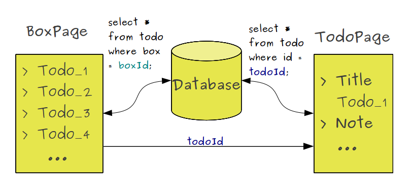
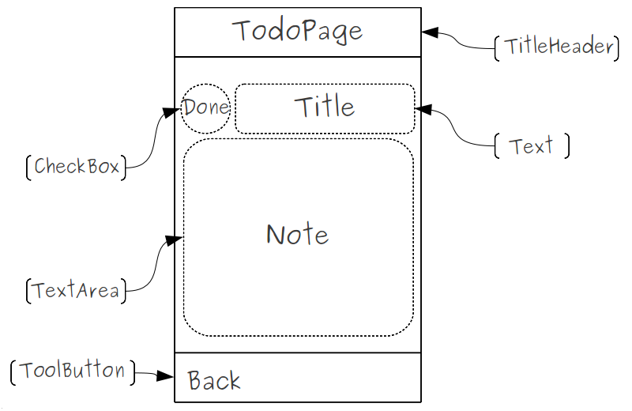
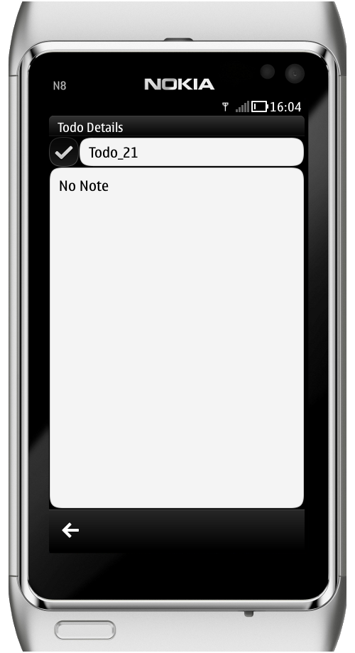

..
    ---------------------------------------------------------------------------
    Copyright (C) 2012 Digia Plc and/or its subsidiary(-ies).
    All rights reserved.
    This work, unless otherwise expressly stated, is licensed under a
    Creative Commons Attribution-ShareAlike 2.5.
    The full license document is available from
    http://creativecommons.org/licenses/by-sa/2.5/legalcode .
    ---------------------------------------------------------------------------

Creating a Form for the ToDo Item
=================================

Up till now, the `TodoPage` has only contained a simple button with no special action. However, the purpose of this page is to provide details about an item as mentioned earlier when covering the UI concept. In this chapter, we'll implement a suitable form for the `TodoPage` in order to display a selected item's details.

The `TodoPage` should be able to load a selected item's details from the database using a property id which identifies the     todo* item in the database and will be provided by the `BoxPage` as shown in the following figure:

Let's start by identifying the appropriate components to define the `TodoPage`. For the sake of simplicity, we want to only display the item's title, its state (done or not) and a small description. The following figure shows what UI elements we will need and how they can be positioned on the page:

Updating the ToDo Page
----------------------

To implement the UI form shown above, we first define a `todoId` property that identifies the     todo* item in the database:

.. code-block:: js

    // TodoPage.qml

    property int todoId

We set a `header` to the page, using the `TitleHeader` component we defined in previous steps.

.. code-block:: js

    // TodoPage.qml

    TitleHeader {
        id: header
        text: "Todo Details"
    }

Next we add a :component:`CheckBox <qml-checkbox.html>` component to check whether the selected     todo* item is done or not and enable the user to update it:

.. code-block:: js

    // TodoPage.qml

    CheckBox {
        id: doneField
        anchors {
            top: header.bottom
            left: root.left
        }
    }

We'll need a :component:`TextField <qml-textfield.html>` component to display the     todo* item's title. Both `CheckBox` and `TextField` should be placed horizontally:

.. code-block:: js

    // TodoPage.qml

    TextField {
        id: titleField
        readOnly: true
        anchors {
            top: doneField.top
            left: doneField.right
            right: root.right
        }
    }

Then we use :component:`TextArea <qml-textarea.html>` component to display the note field:

.. code-block:: js

    // TodoPage.qml

    TextArea {
        id: noteField
        anchors {
            top: titleField.bottom; bottom: root.bottom
            left: root.left; right: root.right
        }
        readOnly: true
    }

Updating BoxPage
----------------

As we explained above, the `BoxPage` should provide the id of the selected item as an argument of the `push` method when pushing the `TodoPage`.

.. code-block:: js

    // BoxPage.qml

    ListView {
        ...
        model: itemModel
        delegate: TodoItemDelegate {
            ...
            onClicked: {
                //push the TodoPage with the corresponding todoId value
                root.pageStack.push(
                    window.todoPage,
                    { todoId: model.id }
                );
            }
        }
        clip: true
    }

Interacting with the Database
-----------------------------

On the `TodoPage`, we will handle two possible statuses on the `statusChanged` signal:

     If the page is activated, we read the selected todo's details from the database using its `todoId` property and display them on the UI fields:

.. code-block:: js

    // TodoPage.qml

    onStatusChanged: {
        var item
        if(status == PageStatus.Activating) {
            // read the details of the selected item from database
            item = Core.readTodoItem(todoId);
            // fill UI component with the corresponding values
            doneField.checked = item.done;
            titleField.text = item.title;
            noteField.text = item.note;
        }
        ...
    }

The `readTodoItem` function, defined in `core.js`, reads the     todo* item with the provided `todoId`:

.. code-block:: js

    // core.js

    function readTodoItem(todoId)
    {
        // create an array to store data
        var data = {};
        // create a read-only transaction
        _db.readTransaction( function(tx) {
            // execute the sql statement to read from database
            var rs = tx.executeSql("SELECT      FROM todo WHERE id=?", [todoId]);
            // check that the id correspond to one unique row
            if(rs.rows.length === 1) {
                // store result into data variable
                data = rs.rows.item(0);
            }
        })
        return data;
    }

     Otherwise, when leaving the `TodoPage`, we update the `done` field:

.. code-block:: js

    // TodoPage.qml

    onStatusChanged: {
        var item;
        ...
        else if(status == PageStatus.Deactivating) {
            // read Todo item from Database
            item = Core.readTodoItem(todoId);
            // modify the done field
            item.done = doneField.checked;
            // update item in Database
            Core.updateTodo(item);
        }
    }

The `updateTodo` function will update the todo item in the database:

.. code-block:: js

    // core.js

    function updateTodo(todoItem)
    {
        // create a read/write transaction
        _db.transaction( function(tx) {
            // execute the sql statement to update the todoItem
            tx.executeSql(" \
                UPDATE todo SET BOX = ? , done = ?, \
                title = ?, note = ?, modified = ? WHERE id = ?",
                [ todoItem.box, todoItem.done, todoItem.title,
                todoItem.note, todoItem.modified, todoItem.id ]
            );
        });
    }

At this stage, we have a functional `TodoPage` that displays the todo's details as shown on the screenshot below:

.. rubric:: What's next?

In the next step, we'll learn how to use the :component:`Dialog <qml-dialog.html>` Symbian^3 Component in order to enable users to add new items.

